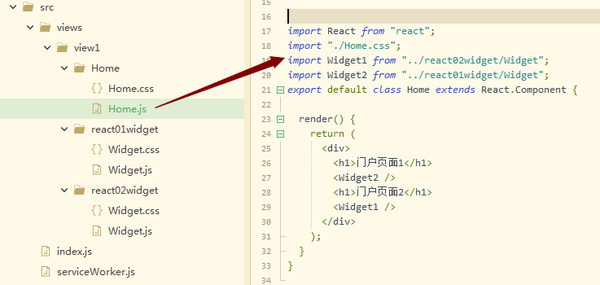

# 组件组合

## 1.简单组合

把自定的组件当成是一个标签来使用就可以了




## 2.复染项目中css的加载

样式都是全局的，所在必须搞清楚样子被加载的顺序, 我们最后让顺序为

index.html中导入的css>index.js中导入的css>index.js中导入的css

Home.js中导入的css>widget中导入的css

## 3.组件中自定义函数的使用

组件中可以任意自定义函数，使用this调用

```js
import React from "react";
export default class App extends React.Component {
  getView() {
    let isShow = 3;
    if (isShow === 3) {
      return <div>你是对的</div>;
    } else {
      return <div>错误答案</div>;
    }
  }
  render() {
    return this.getView();
  }
}
```

```js
import React from "react";
export default class App extends React.Component {
  getView() {
    let isShow = 3;
    if (isShow === 3) {
      return <div>你是对的</div>;
    } else {
      return <div>错误答案</div>;
    }
  }
  render() {
    return <div>{this.getView()}</div>;
  }
}
```

