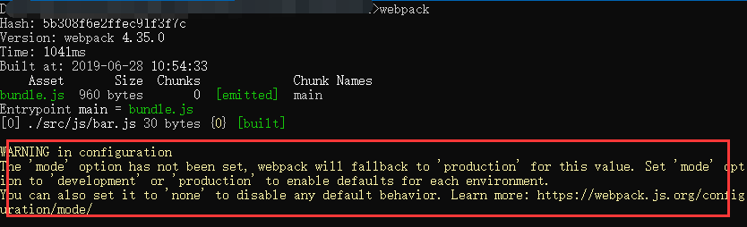

webpack/gulp  webpack/vue

框架语法代码(微信小程序MINA) \react\vue ：eg--wx:for  wx:if ,页面模块化的特点
|
|
|webpack/gulp编译过程
|
|
浏览器只识别原生的html/css/js


# 模块化开发认识

前端现在流行“模块化开发”这样一个理念，例如：我们的Nodejs 模块化，vue 组件化都是这样一个思想。

模块化开发，依赖于ES6 里面的基础语法：export  default、import…from


index.html：注意script 标签的type 属性值给定为"module"

注：在vscode 编辑器中测试时需要安装插件live server ，打开页面时选择“Open with Live Server”。

```html
<div id="">
	模块的理解
</div>
<script type="module">
	import hzh from "./my.js";
	console.log(hzh);
    
    import {x} from "./00-export-import.js";
	console.log(x)
</script>
```

my.js

```js
let student={
	username:"贺子航",
	age:18
};

export default student;//或export default "某个值"
export var x=100,y=function(){alert("hello world!")};//或export {x,y}
```

为什么要使用模块化开发：

1，	形成一个封闭的空间：里面的变量是独立的，是“局部变量”；

2，	只加载一次，再需要用到时从内存上读取；

3，	项目的工程化。


require(module.exports /exports) 和 import(export default/export) 的区别：

1，	require 是 AMD规范引入方式(node平台)；import 是es6的一个语法标准

2，	require是运行时调用，所以require理论上可以运用在代码的任何地方；import是编译时调用，所以必须放在文件开头（代码最外层）。


# Webpack概念

*webpack* 把所有的东西全部看成模块：js、css、图片、字体库等静态资源。

SPA：simple page  application,单页面应用

*webpack* 是一个现代 JavaScript 应用程序的*静态模块打包器(module bundler)*。当 webpack 处理应用程序时，它会**递归**地构建一个***依赖关系图**(dependency graph)*，其中包含应用程序需要的每个模块，然后将所有这些模块打包成一个或多个 *bundle*。  

 

*webpack* 是组件化开发的基础，只是一个打包工具，这个工具是nodejs写的。


# 安装Webpack

在安装Webpack之前，本地环境需要支持Node.js。

### （1）本地安装

- 由于npm安装速度慢，推荐使用淘宝镜像cnpm

- 使用cnpm安装Webpack

~~~shell
#创建项目目录
mkdir app 
cd app

#初始化
npm init -y

#安装webpack
cnpm install webpack webpack-cli --save-dev

#全局安装
cnpm install webpack webpack-cli -g
~~~

- 查看webpack版本

~~~c
webpack -v
webpack-cli -v
~~~


# Webpack打包第一个项目

- 在app文件夹下创建一个**src**目录，并创建一个**src/js/bar.js**，填入以下代码：

~~~javascript
console.log("webpack打包的第一个项目")
~~~

- 创建一个**app/webpack.config.js**文件，文件全名必须为"webpack.config.js"，写入配置

~~~javascript
const path=require("path");

module.exports={
	entry:"./src/js/bar.js",
	output:{
		path:path.resolve(__dirname,"dist"),
		filename:"bundle.js"
	},
	mode:"development"
}
~~~

- 在命令行输入**webpack**完成打包

  

  - 在config配置文件中添加**模式设置**，mode: 'development或mode: 'production'，解除警告

  ```javascript
  module.exports = {
    mode: 'production'
  };
  ```

  - 也可以在 [CLI](https://www.webpackjs.com/api/cli/) 参数中传递： 

  ```shell
  webpack --mode production
  webpack --mode development
  ```

  ```
  在webpack执行命令之后可以添加一些参数，这些参数都有自己的作用，下面是参数列表：
  
  $ webpack src/js/main.js -o dist/js/bundle.js --mode development //命令行配置入口出口
  $ webpack --config XXX.js //使用另一份配置文件（比如webpack.config2.js）来打包
  $ webpack --watch //监听变动并自动打包
  $ webpack --progress //显示进度条
  $ webpack --color //添加颜色
  ```

  在 [CLI](https://www.webpackjs.com/api/cli/) 参数中也可以配置入口/出口文件等，由于大型项目会填充多项配置，容易造成配置冗余，所以主流还是采用配置文件书写，下面介绍配置文件的主要配置项。


# Webpack项目配置文件解析

### （1）入口(entry)

**入口起点(entry point)**指示 webpack 应该使用哪个模块，来作为构建其内部***依赖图***的开始。进入入口起点后，webpack 会找出有哪些模块和库是入口起点（直接和间接）依赖的。

每个依赖项随即被处理，最后输出到称之为 *bundles* 的文件中。可以通过在 webpack 配置中配置 `entry` 属性，来指定一个入口起点（或多个入口起点）。默认值为 `./src`。 

~~~javascript
module.exports = {
  	entry: './path/to/my/entry/file.js'
    
    //entry:{
	//	myentry1:"./src/js/bar.js",
	//	myentry2:"./src/js/barTest.js",
	//}
};
~~~

 

### （2）输出(output)

**output** 属性告诉 webpack **在哪里输出path**它所创建的 *bundles*，以及**如何命名filename**这些文件，默认值为 `./dist`。基本上，整个应用程序结构，都会被编译到你指定的输出路径的文件夹中。你可以通过在配置中指定一个 `output` 字段，来配置这些处理过程： 

~~~javascript
const path = require('path');

module.exports = {
  entry: './path/to/my/entry/file.js',
  output: {
    path: path.resolve(__dirname, 'dist'),
    filename: 'my-first-webpack.bundle.js'//单入口对应的单出口
    //filename:"[name].js"//多入口对应的多出口
  }
};
~~~

在上面的示例中，通过 `output.filename` 和 `output.path` 属性，来告诉 webpack bundle 的名称，以及我们想要 bundle 生成(emit)到哪里。 

上面导入的path 模块是一个 **Node.js 核心模块**，用于操作文件路径。 


### （3）加载器(loader)

*loader* 让 webpack 能够去处理那些非 JavaScript 文件（webpack 自身只理解 JavaScript）。loader 可以将所有类型的文件转换为 webpack 能够处理的有效模块，然后你就可以利用 webpack 的打包能力，对它们进行处理。本质上，webpack loader **将所有类型的文件，转换为应用程序的依赖图**（和最终的 bundle）可以直接引用的模块。

loader 能够 `import` 导入任何类型的模块（例如 `.css` 文件），这是 webpack 特有的功能，其他打包程序或任务执行器的可能并不支持。我们认为这种语言扩展是有很必要的，因为这可以使开发人员创建出更准确的依赖关系图。 

~~~JavaScript
const path = require('path');

const config = {
     entry: './path/to/my/entry/file.js',
     output: {
         path： './dist',
         filename: 'my-first-webpack.bundle.js'
     },
     module: {
        rules: [
          	{test: /\.txt$/, use: 'raw-loader' },
            {test: /\.css$/, use: ['style-loader', 'css-loader']}
        ]
     }
};

module.exports = config;
~~~

以上配置表示当webpack 编译器碰到在 `require()`/`import` 语句中被解析为 '.txt' 的路径时，在对它打包之前，先**使用** `raw-loader` 转换一下。


### （4）插件(plugins)

loader 被用于转换某些类型的模块，而插件则可以用于执行范围更广的任务。插件的范围包括，从打包优化和压缩，一直到重新定义环境中的变量。插件接口功能极其强大，可以用来处理各种各样的任务。 

想要使用一个插件，你只需要 `require()` 它，然后把它添加到 `plugins` 数组中。多数插件可以通过选项(option)自定义。你也可以在一个配置文件中因为不同目的而多次使用同一个插件，这时需要通过使用 `new` 操作符来创建它的一个实例 

~~~JavaScript
const HtmlWebpackPlugin = require('html-webpack-plugin'); // 通过 npm 安装
const webpack = require('webpack'); // 用于访问内置插件

const config = {
      module: {
        rules: [
          { test: /\.txt$/, use: 'raw-loader' }
        ]
      },
      plugins: [
        new webpack.optimize.UglifyJsPlugin(),
        new HtmlWebpackPlugin({template: './src/index.html'})
      ]
};

module.exports = config;
~~~


补充：配置文件,入口和出口，多入口、多出口配置

```
//多入口配置
entry: {
 myhome: path.resolve(__dirname, "src/home/index.js"),
 myabout: path.resolve(__dirname, "src/about/index.js")
}

//多出口配置
output:{
        //输出的路径，用了Node语法
        path:path.resolve(__dirname,'dist'),
        //输出的文件名称
        filename:'[name].js'
}
```


# npm命令运行webpack 项目

考虑到用 CLI 这种方式来运行本地的 webpack 不是特别方便，我们可以**设置一个快捷方式**。在 *package.json* 添加一个 npm 脚本(npm script)：

**package.json**

```json
  {
    "name": "webpack-demo",
    "version": "1.0.0",
    "description": "",
    "main": "index.js",
    "scripts": {
      "test": "echo \"Error: no test specified\" && exit 1",
+     "build": "webpack"
    },
    "keywords": [],
    "author": "",
    "license": "ISC",
    "devDependencies": {
      "webpack": "^4.0.1",
      "webpack-cli": "^2.0.9",
      "lodash": "^4.17.5"
    }
  }
```

现在，可以使用 `npm run build` 命令，来替代我们之前使用的命令。

现在运行以下命令，然后看看你的脚本别名是否正常运行：

```
>npm run build

Hash: dabab1bac2b940c1462b
Version: webpack 4.0.1
Time: 323ms
Built at: 2018-2-26 22:50:25
    Asset      Size  Chunks             Chunk Names
bundle.js  69.6 KiB       0  [emitted]  main
Entrypoint main = bundle.js
   [1] (webpack)/buildin/module.js 519 bytes {0} [built]
   [2] (webpack)/buildin/global.js 509 bytes {0} [built]
   [3] ./src/index.js 256 bytes {0} [built]
    + 1 hidden module

WARNING in configuration(配置警告)
The 'mode' option has not been set. Set 'mode' option to 'development' or 'production' to enable defaults for this environment.('mode' 选项还未设置。将 'mode' 选项设置为 'development' 或 'production'，来启用环境默认值。)
```

例如：

1、在scripts中添加命令

~~~shell
"start": "webpack --config webpack.config.js"
~~~

2、执行 **npm run start** 就可以将项目进行打包


# 加载器管理资源

## 加载 CSS

为了从 JavaScript 模块中 `import` 一个 CSS 文件，你需要在 [`module` 配置中](https://www.webpackjs.com/configuration/module) 安装并添加 [style-loader](https://www.webpackjs.com/loaders/style-loader) 和 [css-loader](https://www.webpackjs.com/loaders/css-loader)：

```
cnpm install --save-dev style-loader css-loader mini-css-extract-plugin
```

**webpack.config.js**

```javascript
  const path = require('path');
+ const MiniCssExtractPlugin=require("mini-css-extract-plugin")

  module.exports = {
    entry: './src/index.js',
    output: {
      filename: 'bundle.js',
      path: path.resolve(__dirname, 'dist')
    },
+   module: {
+     rules: [
+       {
+         test: /\.css$/,
+         use: [
+           MiniCssExtractPlugin.loader,//以<link>标签href 属性的形式实现外联引入,手动
+          // 'style-loader',//以<style>标签的形式引入在html 页内，只能与上面方式二选一
+           'css-loader'//解析css-loader必须要有，且放在数组第二项
+         ]
+       }
+     ]
+   },
+   plugins:[
+           new MiniCssExtractPlugin({
+        		filename:'./dist/css/[hash:6].css'
+    		})
+   ]
  };
```

> webpack 根据正则表达式，来确定应该查找哪些文件，并将其提供给指定的 loader。在这种情况下，以 `.css` 结尾的全部文件，都将被提供给 `style-loader` 和 `css-loader`。

这时你可以在依赖于此样式的文件中 `import './style.css'`。现在，当该模块运行时，含有 CSS 字符串的 `<style>` 标签，将被插入到 html 文件的 `<head>` 中。

我们尝试一下，通过在项目中添加一个新的 `style.css` 文件，并将其导入到我们的 `index.js` 中：

**project**

```
  webpack-demo
  |- package.json
  |- webpack.config.js
  |- /dist
    |- bundle.js
    |- index.html
  |- /src
+   |- style.css
    |- index.js
  |- /node_modules
```

**src/style.css**

```
.hello {
  color: red;
}
```

**src/index.js**

```
+ import './style.css';

  function component() {
    var element = document.createElement('div');
    element.innerHTML="Hello webpack"
+   element.classList.add('hello');

    return element;
  }

  document.body.appendChild(component());
```

现在运行构建命令：

```
npm run build

Hash: 9a3abfc96300ef87880f
Version: webpack 2.6.1
Time: 834ms
    Asset    Size  Chunks                    Chunk Names
bundle.js  560 kB       0  [emitted]  [big]  main
   [0] ./~/lodash/lodash.js 540 kB {0} [built]
   [1] ./src/style.css 1 kB {0} [built]
   [2] ./~/css-loader!./src/style.css 191 bytes {0} [built]
   [3] ./~/css-loader/lib/css-base.js 2.26 kB {0} [built]
   [4] ./~/style-loader/lib/addStyles.js 8.7 kB {0} [built]
   [5] ./~/style-loader/lib/urls.js 3.01 kB {0} [built]
   [6] (webpack)/buildin/global.js 509 bytes {0} [built]
   [7] (webpack)/buildin/module.js 517 bytes {0} [built]
   [8] ./src/index.js 351 bytes {0} [built]
```

再次在浏览器中打开 `index.html`，你应该看到 `Hello webpack` 现在的样式是红色。要查看 webpack 做了什么，请检查页面（不要查看页面源代码，因为它不会显示结果），并查看页面的 head 标签。它应该包含我们在 `index.js` 中导入的 style 块元素。

> 请注意，在多数情况下，你也可以进行 [CSS 分离](https://www.webpackjs.com/plugins/extract-text-webpack-plugin)，以便在生产环境中节省加载时间。最重要的是，现有的 loader 可以支持任何你可以想到的 CSS 处理器风格 - [postcss](https://www.webpackjs.com/loaders/postcss-loader), [sass](https://www.webpackjs.com/loaders/sass-loader) 和 [less](https://www.webpackjs.com/loaders/less-loader) 等。


## 加载图片

假想，现在我们正在下载 CSS，但是我们的背景和图标这些图片，要如何处理呢？使用 [file-loader](https://www.webpackjs.com/loaders/file-loader)，我们可以轻松地将这些内容混合到 CSS 中：

```shell
npm install --save-dev file-loader
```

**webpack.config.js**

```javascript
  const path = require('path');

  module.exports = {
    entry: './src/index.js',
    output: {
      filename: 'bundle.js',
      path: path.resolve(__dirname, 'dist')
    },
    module: {
      rules: [
        {
          test: /\.css$/,
          use: [
            'style-loader',
            'css-loader'
          ]
        },
+       {
+         test: /\.(png|svg|jpg|gif)$/,
+         use: [
+           'file-loader'
+         ]
+       }
      ]
    }
  };
```

现在，当你 `import MyImage from './my-image.png'`，该图像将被处理并添加到 `output` 目录，_并且_ `MyImage` 变量将包含该图像在处理后的最终 url。当使用 [css-loader](https://www.webpackjs.com/loaders/css-loader) 时，如上所示，你的 CSS 中的 `url('./my-image.png')` 会使用类似的过程去处理。loader 会识别这是一个本地文件，并将 `'./my-image.png'` 路径，替换为`输出`目录中图像的最终路径。[html-loader](https://www.webpackjs.com/loaders/html-loader) 以相同的方式处理 ``。

我们向项目添加一个图像，然后看它是如何工作的，你可以使用任何你喜欢的图像：

**project**

```
  webpack-demo
  |- package.json
  |- webpack.config.js
  |- /dist
    |- bundle.js
    |- index.html
  |- /src
+   |- icon.png
    |- style.css
    |- index.js
  |- /node_modules
```

**src/index.js**

```javascript
  import './style.css';
+ import Icon from './icon.png';

  function component() {
    var element = document.createElement('div');

    element.classList.add('hello');

+   // 将图像添加到我们现有的 div。
+   var myIcon = new Image();
+   myIcon.src = Icon;
+
+   element.appendChild(myIcon);

    return element;
  }

  document.body.appendChild(component());
```

**src/style.css**

```
  .hello {
    color: red;
+   background: url('./icon.png');
  }
```

让我们重新构建，并再次打开 index.html 文件：

```
npm run build

Hash: 854865050ea3c1c7f237
Version: webpack 2.6.1
Time: 895ms
                               Asset     Size  Chunks                    Chunk Names
5c999da72346a995e7e2718865d019c8.png  11.3 kB          [emitted]
                           bundle.js   561 kB       0  [emitted]  [big]  main
   [0] ./src/icon.png 82 bytes {0} [built]
   [1] ./~/lodash/lodash.js 540 kB {0} [built]
   [2] ./src/style.css 1 kB {0} [built]
   [3] ./~/css-loader!./src/style.css 242 bytes {0} [built]
   [4] ./~/css-loader/lib/css-base.js 2.26 kB {0} [built]
   [5] ./~/style-loader/lib/addStyles.js 8.7 kB {0} [built]
   [6] ./~/style-loader/lib/urls.js 3.01 kB {0} [built]
   [7] (webpack)/buildin/global.js 509 bytes {0} [built]
   [8] (webpack)/buildin/module.js 517 bytes {0} [built]
   [9] ./src/index.js 503 bytes {0} [built]
```

如果一切顺利，和 `Hello webpack` 文本旁边的 `img` 元素一样，现在看到的图标是重复的背景图片。如果你检查此元素，你将看到实际的文件名已更改为像 `5c999da72346a995e7e2718865d019c8.png` 一样。这意味着 webpack 在 `src` 文件夹中找到我们的文件，并成功处理过它！


# 插件处理输出

到目前为止，我们在 `index.html` 文件中手动引入所有资源，然而随着应用程序增长，并且一旦开始对[文件名使用哈希(hash)](https://www.webpackjs.com/guides/caching)]并输出[多个 bundle](https://www.webpackjs.com/guides/code-splitting)，手动地对 `index.html` 文件进行管理，一切就会变得困难起来。然而，可以通过一些插件，会使这个过程更容易操控。

## 设定 HtmlWebpackPlugin

首先安装插件，并且调整 `webpack.config.js` 文件：

```shell
cnpm install --save-dev html-webpack-plugin
```

**webpack.config.js**

```javascript
  const path = require('path');
+ const HtmlWebpackPlugin = require('html-webpack-plugin');

  module.exports = {
    entry: './src/js/index.js',
+   plugins: [
+		new HtmlWebpackPlugin({
+			title:'myapp',			//为生成的html 文档添加<title>myapp</title>
+			hash:true,				//为所有包含的脚本和CSS文件附加唯一的编译哈希，这对缓存清除很有用
+			filename: 'app.html', //打包后生成的文件名  放在output.path里面
+			template: './src/my.html',    //来自哪里 模板文件
+			inject: 'head',         //引入js的位置:引入js的位置:  'head'-头部引入 'body'/true--</body>之前引入 false不引入
+			minify: {				  //压缩项配置
+			    removeComments: true, //是否清除HTML注释  
+			    collapseWhitespace: true, //是否压缩HTML  
+			    removeScriptTypeAttributes: true, //是否删除< script>的type="text/javascript"  
+			    removeStyleLinkTypeAttributes: true, //是否删除< style>和< link>的type="text/css"  
+			    minifyJS: false, //是否压缩页内JS  
+			    minifyCSS: true //是否压缩页内CSS  
+			}
+   ],
    output: {
+     filename: './js/[hash:6].js',
      path: path.resolve(__dirname, 'dist')
    }
  };
```

让我们看下在执行 `npm run build` 后会发生什么：

```
Hash: 81f82697c19b5f49aebd
Version: webpack 2.6.1
Time: 854ms
           Asset       Size  Chunks                    Chunk Names
 print.bundle.js     544 kB       0  [emitted]  [big]  print
   app.bundle.js    2.81 kB       1  [emitted]         app
      index.html  249 bytes          [emitted]
   [0] ./~/lodash/lodash.js 540 kB {0} [built]
   [1] (webpack)/buildin/global.js 509 bytes {0} [built]
   [2] (webpack)/buildin/module.js 517 bytes {0} [built]
   [3] ./src/index.js 172 bytes {1} [built]
   [4] multi lodash 28 bytes {0} [built]
Child html-webpack-plugin for "index.html":
       [0] ./~/lodash/lodash.js 540 kB {0} [built]
       [1] ./~/html-webpack-plugin/lib/loader.js!./~/html-webpack-plugin/default_index.ejs 538 bytes {0} [built]
       [2] (webpack)/buildin/global.js 509 bytes {0} [built]
       [3] (webpack)/buildin/module.js 517 bytes {0} [built]
```

如果你在代码编辑器中将 `index.html` 打开，你就会看到 `HtmlWebpackPlugin` 创建了一个全新的文件，所有的 bundle 会自动添加到 html 中。


## 清理 `/dist` 文件夹

你可能已经注意到，由于过去的指南和代码示例遗留下来，导致我们的 `/dist` 文件夹相当杂乱。webpack 会生成文件，然后将这些文件放置在 `/dist` 文件夹中，但是 webpack 无法追踪到哪些文件是实际在项目中用到的。

通常，在每次构建前清理 `/dist` 文件夹，是比较推荐的做法，因此只会生成用到的文件。让我们完成这个需求。

[`clean-webpack-plugin`](https://www.npmjs.com/package/clean-webpack-plugin) 是一个比较普及的管理插件，让我们安装和配置下。

```shell
cnpm install clean-webpack-plugin --save-dev
```

**webpack.config.js**

```javascript
+ const {CleanWebpackPlugin} = require('clean-webpack-plugin'); //添加到最前边!!
  const path = require('path');
  const HtmlWebpackPlugin = require('html-webpack-plugin');

  module.exports = {
    entry: {
      app: './src/index.js',
      print: './src/print.js'
    },
    plugins: [
+     new CleanWebpackPlugin(),
      new HtmlWebpackPlugin({
        title: 'Output Management'
      })
    ],
    output: {
      filename: '[name].bundle.js',
      path: path.resolve(__dirname, 'dist')
    }
  };
```

dist文件夹关闭，避免文件在占用状态不可被删除。

现在执行 `npm run build`，再检查 `/dist` 文件夹。如果一切顺利，你现在应该不会再看到旧的文件，只有构建后生成的文件！


# 开发

## 使用观察模式 

你可以指示 webpack "watch" 依赖图中的所有文件以进行更改。如果其中一个文件被更新，代码将被重新编译，所以你不必手动运行整个构建。

我们添加一个用于启动 webpack 的观察模式的 npm script 脚本：

**package.json**

```
  {
    "name": "development",
    "version": "1.0.0",
    "description": "",
    "main": "webpack.config.js",
    "scripts": {
      "test": "echo \"Error: no test specified\" && exit 1",
+     "watch": "webpack --watch",
      "build": "webpack"
    },
    "keywords": [],
    "author": "",
    "license": "ISC",
    "devDependencies": {
      "clean-webpack-plugin": "^0.1.16",
      "css-loader": "^0.28.4",
      "csv-loader": "^2.1.1",
      "file-loader": "^0.11.2",
      "html-webpack-plugin": "^2.29.0",
      "style-loader": "^0.18.2",
      "webpack": "^3.0.0",
      "xml-loader": "^1.2.1"
    }
  }
```

现在，你可以在命令行中运行 `npm run watch`，然后就会看到 webpack 是如何编译代码。 然而，你会发现并没有退出命令行。这是因为 script 脚本当前还在观察文件。

现在，webpack 观察文件的同时，我们先移除我们之前引入的错误：

**src/print.js**

```
  export default function printMe() {
-   cosnole.log('I get called from print.js!');
+   console.log('I get called from print.js!');
  }
```

现在,保存文件并检查终端窗口。应该可以看到 webpack 自动重新编译修改后的模块！

唯一的缺点是，为了看到修改后的实际效果，你需要刷新浏览器。如果能够自动刷新浏览器就更好了，可以尝试使用 `webpack-dev-server`，恰好可以实现我们想要的功能。


## 使用 webpack-dev-server 

`webpack-dev-server` 为你提供了一个简单的 web 服务器，并且能够**实时重新加载**(live reloading)。让我们设置以下：

```shell
cnpm install --save-dev webpack-dev-server
```

修改配置文件，告诉开发服务器(dev server)，在哪里查找文件：

**webpack.config.js**

```
  const path = require('path');
  const HtmlWebpackPlugin = require('html-webpack-plugin');
  const CleanWebpackPlugin = require('clean-webpack-plugin');

  module.exports = {
    entry: {
      app: './src/index.js',
      print: './src/print.js'
    },
    devtool: 'inline-source-map',
+   devServer: {
+     contentBase:'./dist',
+	  host: 'localhost',
+	  compress: true,
+	  // inline: true,
+	  port: 8080,
+	  open: true,
+	  hot: true
+   },
    plugins: [
      new CleanWebpackPlugin(['dist']),
      new HtmlWebpackPlugin({
        title: 'Development'
      })
    ],
    output: {
      filename: '[name].bundle.js',
      path: path.resolve(__dirname, 'dist')
    }
  };
```

以上配置告知 `webpack-dev-server`，在 `localhost:8080` 下建立服务，将 `dist` 目录下的文件，作为可访问文件。

让我们添加一个 script 脚本，可以直接运行开发服务器(dev server)：

**package.json**

```
  {
    "name": "development",
    "version": "1.0.0",
    "description": "",
    "main": "webpack.config.js",
    "scripts": {
      "test": "echo \"Error: no test specified\" && exit 1",
      "watch": "webpack --watch",
+     "dev": "webpack-dev-server --open --inline --progress --config webpack.config.js",
+     "start": "npm run dev"
      "build": "webpack"
    },
    "keywords": [],
    "author": "",
    "license": "ISC",
    "devDependencies": {
      "clean-webpack-plugin": "^0.1.16",
      "css-loader": "^0.28.4",
      "csv-loader": "^2.1.1",
      "file-loader": "^0.11.2",
      "html-webpack-plugin": "^2.29.0",
      "style-loader": "^0.18.2",
      "webpack": "^3.0.0",
      "xml-loader": "^1.2.1"
    }
  }
```

现在，我们可以在命令行中运行 `npm run start`，就会看到浏览器自动加载页面。如果现在修改和保存任意源文件，web 服务器就会自动重新加载编译后的代码。试一下！

`webpack-dev-server` 带有许多可配置的选项。转到[相关文档](https://webpack.docschina.org/configuration/dev-server)以了解更多。

> 现在，服务器正在运行，你可能需要尝试[模块热替换(Hot Module Replacement)](https://webpack.docschina.org/guides/hot-module-replacement)！


# webpack 常遇面试题

<https://www.cnblogs.com/gaoht/p/11310365.html>

## webpack 与gulp 工具的区别？

​	webpack偏向于模块化开发的思想，gulp偏向于面向过程开发模式

​	webpack适用于大型复杂的前端站点构建，gulp 轻量级


## webpack里loader与plugin的不同？

​	loader负责文件格式转换

​	plugin负责对转换后的文件进行修饰


## webpack的构建流程是什么?

​	1、读取命令行或者配置文件里的参数

​	2、初始化工具

​	3、读取entry

​	4、使用loader

​	5、plugin

​	6、输出文件


## webpack-dev-server思想？

​	当文件发生修改，通知各个模块进行更新加载，加载到计算机内存，刷新浏览器


## webpack 优化前端性能？

优化代码/优化前端性能？
html:	结构清晰
css:	文件合并，CDN分布式服务器，样式选择器预先写好
js:	dom 操作合并，尽量避免dom 操作放到for循环里，避免重绘和重排	

webpack 插件做优化：压缩，删除死代码，提取公共代码

​	1、添加配置，压缩代码

​	2、使用CDN

​	3、追加参数，删除死代码，--optimize-minimize

​	4、提取公共代码


# 课程拓展

## 使用 source map 

当 webpack 打包源代码时，可能会很难追踪到错误和警告在源代码中的原始位置。例如，如果将三个源文件（`a.js`, `b.js` 和 `c.js`）打包到一个 bundle（`bundle.js`）中，而其中一个源文件包含一个错误，那么堆栈跟踪就会简单地指向到 `bundle.js`。这并通常没有太多帮助，因为你可能需要准确地知道错误来自于哪个源文件。

为了更容易地追踪错误和警告，JavaScript 提供了 [source map](http://blog.teamtreehouse.com/introduction-source-maps) 功能，将编译后的代码映射回原始源代码。如果一个错误来自于 `b.js`，source map 就会明确的告诉你。

source map 有很多[不同的选项](https://webpack.docschina.org/configuration/devtool)可用，请务必仔细阅读它们，以便可以根据需要进行配置。

对于本指南，我们使用 `inline-source-map` 选项，这有助于解释说明我们的目的（仅解释说明，不要用于生产环境）：

**webpack.config.js**

```javascript
  const path = require('path');
  const HtmlWebpackPlugin = require('html-webpack-plugin');
  const CleanWebpackPlugin = require('clean-webpack-plugin');

  module.exports = {
    entry: {
      app: './src/index.js',
      print: './src/print.js'
    },
+   devtool: 'inline-source-map',
    plugins: [
      new CleanWebpackPlugin(['dist']),
      new HtmlWebpackPlugin({
        title: 'Development'
      })
    ],
    output: {
      filename: '[name].bundle.js',
      path: path.resolve(__dirname, 'dist')
    }
  };
```

现在，让我们来做一些调试，在 `print.js` 文件中生成一个错误：

**src/print.js**

```javascript
  export default function printMe() {
-   console.log('I get called from print.js!');
+   cosnole.error('I get called from print.js!');
  }
```

运行 `npm run build`，就会编译为如下：

```
Hash: 7bf68ca15f1f2690e2d1
Version: webpack 3.1.0
Time: 1224ms
          Asset       Size  Chunks                    Chunk Names
  app.bundle.js    1.44 MB    0, 1  [emitted]  [big]  app
print.bundle.js    6.43 kB       1  [emitted]         print
     index.html  248 bytes          [emitted]
   [0] ./src/print.js 84 bytes {0} {1} [built]
   [1] ./src/index.js 403 bytes {0} [built]
   [3] (webpack)/buildin/global.js 509 bytes {0} [built]
   [4] (webpack)/buildin/module.js 517 bytes {0} [built]
    + 1 hidden module
Child html-webpack-plugin for "index.html":
       [2] (webpack)/buildin/global.js 509 bytes {0} [built]
       [3] (webpack)/buildin/module.js 517 bytes {0} [built]
        + 2 hidden modules

```

现在在浏览器打开最终生成的 `index.html` 文件，点击按钮，并且在控制台查看显示的错误。错误应该如下：

```
 Uncaught ReferenceError: cosnole is not defined
    at HTMLButtonElement.printMe (print.js:2)

```

我们可以看到，此错误包含有发生错误的文件（`print.js`）和行号（2）的引用。这是非常有帮助的，因为现在我们知道了，所要解决的问题的确切位置。


## 使用 webpack-dev-middleware 

`webpack-dev-middleware` 是一个容器(wrapper)，它可以把 webpack 处理后的文件传递给一个服务器(server)。 `webpack-dev-server` 在内部使用了它，同时，它也可以作为一个单独的包来使用，以便进行更多自定义设置来实现更多的需求。接下来是一个 webpack-dev-middleware 配合 express server 的示例。

首先，安装 `express` 和 `webpack-dev-middleware`：

```
npm install --save-dev express webpack-dev-middleware
```

接下来我们需要对 webpack 的配置文件做一些调整，以确保中间件(middleware)功能能够正确启用：

**webpack.config.js**

```
  const path = require('path');
  const HtmlWebpackPlugin = require('html-webpack-plugin');
  const CleanWebpackPlugin = require('clean-webpack-plugin');

  module.exports = {
    entry: {
      app: './src/index.js',
      print: './src/print.js'
    },
    devtool: 'inline-source-map',
    plugins: [
      new CleanWebpackPlugin(['dist']),
      new HtmlWebpackPlugin({
        title: 'Output Management'
      })
    ],
    output: {
      filename: '[name].bundle.js',
      path: path.resolve(__dirname, 'dist'),
+     publicPath: '/'
    }
  };
```

`publicPath` 也会在服务器脚本用到，以确保文件资源能够在 `http://localhost:3000` 下正确访问，我们稍后再设置端口号。下一步就是设置我们自定义的 `express` 服务：

**project**

```
  webpack-demo
  |- package.json
  |- webpack.config.js
+ |- server.js
  |- /dist
  |- /src
    |- index.js
    |- print.js
  |- /node_modules
```

**server.js**

```
const express = require('express');
const webpack = require('webpack');
const webpackDevMiddleware = require('webpack-dev-middleware');

const app = express();
const config = require('./webpack.config.js');
const compiler = webpack(config);

// Tell express to use the webpack-dev-middleware and use the webpack.config.js
// configuration file as a base.
app.use(webpackDevMiddleware(compiler, {
  publicPath: config.output.publicPath
}));

// Serve the files on port 3000.
app.listen(3000, function () {
  console.log('Example app listening on port 3000!\n');
});
```

现在，添加一个 npm script，以使我们更方便地运行服务：

**package.json**

```
  {
    "name": "development",
    "version": "1.0.0",
    "description": "",
    "main": "webpack.config.js",
    "scripts": {
      "test": "echo \"Error: no test specified\" && exit 1",
      "watch": "webpack --watch",
      "start": "webpack-dev-server --open",
+     "server": "node server.js",
      "build": "webpack"
    },
    "keywords": [],
    "author": "",
    "license": "ISC",
    "devDependencies": {
      "clean-webpack-plugin": "^0.1.16",
      "css-loader": "^0.28.4",
      "csv-loader": "^2.1.1",
      "express": "^4.15.3",
      "file-loader": "^0.11.2",
      "html-webpack-plugin": "^2.29.0",
      "style-loader": "^0.18.2",
      "webpack": "^3.0.0",
      "webpack-dev-middleware": "^1.12.0",
      "xml-loader": "^1.2.1"
    }
  }
```

现在，在你的终端执行 `npm run server`，将会有类似如下信息输出：

```
Example app listening on port 3000!
webpack built 27b137af6d9d8668c373 in 1198ms
Hash: 27b137af6d9d8668c373
Version: webpack 3.0.0
Time: 1198ms
          Asset       Size  Chunks                    Chunk Names
  app.bundle.js    1.44 MB    0, 1  [emitted]  [big]  app
print.bundle.js    6.57 kB       1  [emitted]         print
     index.html  306 bytes          [emitted]
   [0] ./src/print.js 116 bytes {0} {1} [built]
   [1] ./src/index.js 403 bytes {0} [built]
   [2] ./node_modules/lodash/lodash.js 540 kB {0} [built]
   [3] (webpack)/buildin/global.js 509 bytes {0} [built]
   [4] (webpack)/buildin/module.js 517 bytes {0} [built]
Child html-webpack-plugin for "index.html":
         Asset    Size  Chunks  Chunk Names
    index.html  544 kB       0
       [0] ./node_modules/html-webpack-plugin/lib/loader.js!./node_modules/html-webpack-plugin/default_index.ejs 538 bytes {0} [built]
       [1] ./node_modules/lodash/lodash.js 540 kB {0} [built]
       [2] (webpack)/buildin/global.js 509 bytes {0} [built]
       [3] (webpack)/buildin/module.js 517 bytes {0} [built]
webpack: Compiled successfully.
```

现在，打开浏览器，跳转到 `http://localhost:3000`，你应该看到你的webpack 应用程序已经运行！


# 模块热替换（hot module replacement）

 模块热替换(HMR - Hot Module Replacement)功能会在应用程序运行过程中**替换、添加或删除模块**，而无需重新加载整个页面。主要是通过以下几种方式，来显著加快开发速度：

- 保留在完全重新加载页面时丢失的应用程序状态。
- 只更新变更内容，以节省宝贵的开发时间。
- 调整样式更加快速 - 几乎相当于在浏览器调试器中更改样式。


## 启用 HMR 

启用此功能实际上相当简单。而我们要做的，就是更新 [webpack-dev-server](https://github.com/webpack/webpack-dev-server) 的配置，和使用 webpack 内置的 HMR 插件。我们还要删除掉 `print.js` 的入口起点，因为它现在正被 `index.js` 模式使用。

**webpack.config.js**

```
  const path = require('path');
  const HtmlWebpackPlugin = require('html-webpack-plugin');
  const CleanWebpackPlugin = require('clean-webpack-plugin');
+ const webpack = require('webpack');

  module.exports = {
    entry: {
-      app: './src/index.js',
-      print: './src/print.js'
+      app: './src/index.js'
    },
    devtool: 'inline-source-map',
    devServer: {
      contentBase: './dist',
+     hot: true
    },
    plugins: [
      new CleanWebpackPlugin(['dist']),
      new HtmlWebpackPlugin({
        title: 'Hot Module Replacement'
      }),
+     new webpack.HotModuleReplacementPlugin()
    ],
    output: {
      filename: '[name].bundle.js',
      path: path.resolve(__dirname, 'dist')
    }
  };
```

> 你可以通过命令来修改 [webpack-dev-server](https://github.com/webpack/webpack-dev-server) 的配置：`webpack-dev-server --hotOnly`。

现在，我们来修改 `index.js` 文件，以便当 `print.js` 内部发生变更时可以告诉 webpack 接受更新的模块。

**index.js**

```
  import _ from 'lodash';
  import printMe from './print.js';

  function component() {
    var element = document.createElement('div');
    var btn = document.createElement('button');

    element.innerHTML = _.join(['Hello', 'webpack'], ' ');

    btn.innerHTML = 'Click me and check the console!';
    btn.onclick = printMe;

    element.appendChild(btn);

    return element;
  }

  document.body.appendChild(component());
+
+ if (module.hot) {
+   module.hot.accept('./print.js', function() {
+     console.log('Accepting the updated printMe module!');
+     printMe();
+   })
+ }
```

更改 `print.js` 中 `console.log` 的输出内容，你将会在浏览器中看到如下的输出。

**print.js**

```
  export default function printMe() {
-   console.log('I get called from print.js!');
+   console.log('Updating print.js...')
  }
```

**console**

```
[HMR] Waiting for update signal from WDS...
main.js:4395 [WDS] Hot Module Replacement enabled.
+ 2main.js:4395 [WDS] App updated. Recompiling...
+ main.js:4395 [WDS] App hot update...
+ main.js:4330 [HMR] Checking for updates on the server...
+ main.js:10024 Accepting the updated printMe module!
+ 0.4b8ee77….hot-update.js:10 Updating print.js...
+ main.js:4330 [HMR] Updated modules:
+ main.js:4330 [HMR]  - 20
```


## 通过 Node.js API 

当使用 webpack dev server 和 Node.js API 时，不要将 dev server 选项放在 webpack 配置对象(webpack config object)中。而是，在创建选项时，将其作为第二个参数传递。例如：

`new WebpackDevServer(compiler, options)`

想要启用 HMR，还需要修改 webpack 配置对象，使其包含 HMR 入口起点。`webpack-dev-server` package 中具有一个叫做 `addDevServerEntrypoints` 的方法，你可以通过使用这个方法来实现。这是关于如何使用的一个小例子：

**dev-server.js**

```javascript
const webpackDevServer = require('webpack-dev-server');
const webpack = require('webpack');

const config = require('./webpack.config.js');
const options = {
  contentBase: './dist',
  hot: true,
  host: 'localhost'
};

webpackDevServer.addDevServerEntrypoints(config, options);
const compiler = webpack(config);
const server = new webpackDevServer(compiler, options);

server.listen(5000, 'localhost', () => {
  console.log('dev server listening on port 5000');
});
```


## HMR 修改样式表 

借助于 `style-loader` 的帮助，CSS 的模块热替换实际上是相当简单的。当更新 CSS 依赖模块时，此 loader 在后台使用 `module.hot.accept` 来修补(patch) `<style>` 标签。

所以，可以使用以下命令安装两个 loader ：

```shell
npm install --save-dev style-loader css-loader
```

接下来我们来更新 webpack 的配置，让这两个 loader 生效。

**webpack.config.js**

```javascript
  const path = require('path');
  const HtmlWebpackPlugin = require('html-webpack-plugin');
+ const webpack = require('webpack');

  module.exports = {
    entry: {
      app: './src/index.js'
    },
    devtool: 'inline-source-map',
    devServer: {
      contentBase: './dist',
+     hot: true
    },
+   module: {
+     rules: [
+       {
+         test: /\.css$/,
+         use: ['style-loader', 'css-loader']
+       }
+     ]
+   },
    plugins: [
      new CleanWebpackPlugin(['dist'])
      new HtmlWebpackPlugin({
        title: 'Hot Module Replacement'
      }),
+     new webpack.HotModuleReplacementPlugin()
    ],
    output: {
      filename: '[name].bundle.js',
      path: path.resolve(__dirname, 'dist')
    }
  };
```

热加载样式表，与将其导入模块一样简单：

**project**

```
  webpack-demo
  | - package.json
  | - webpack.config.js
  | - /dist
    | - bundle.js
  | - /src
    | - index.js
    | - print.js
+   | - styles.css
```

**styles.css**

```css
body {
  background: blue;
}
```

**index.js**

```javascript
  import _ from 'lodash';
  import printMe from './print.js';
+ import './styles.css';

  function component() {
    var element = document.createElement('div');
    var btn = document.createElement('button');

    element.innerHTML = _.join(['Hello', 'webpack'], ' ');

    btn.innerHTML = 'Click me and check the console!';
    btn.onclick = printMe;  // onclick event is bind to the original printMe function

    element.appendChild(btn);

    return element;
  }

  let element = component();
  document.body.appendChild(element);

  if (module.hot) {
    module.hot.accept('./print.js', function() {
      console.log('Accepting the updated printMe module!');
      document.body.removeChild(element);
      element = component(); // Re-render the "component" to update the click handler
      document.body.appendChild(element);
    })
  }
```

将 `body` 上的样式修改为 `background: red;`，你应该可以立即看到页面的背景颜色随之更改，而无需完全刷新。

**styles.css**

```css
  body {
-   background: blue;
+   background: red;
  }
```


