## Vue.js是什么 尤雨溪

- Vue.js（读音 /vjuː/, 类似于 **view**）是目前最火的一个框架，React是最流行的一个框架。

- Vue.js是前端的**主流框架之一**，和Angular.js、React.js并称为前端三大主流框架。

  数据驱动

  vue.js 数据驱动和组件化开发，轻量级一些，分层渐进式框架；spa

  React.js 数据驱动和组件化开发，灵活性很高，需要什么都得自己构建逻辑自己写;app

  Angular.js 数据驱动 1.0 ，加上了组件化开发2.0，重量级框架;大型企业OA办公

- Vue.js 是一套构建用户界面的 **渐进式框架**。与其他重量级框架不同的是，Vue 采用自底向上增量开发的设计。

  

- Vue 的核心库只关注**视图层**，并且非常容易学习，非常容易与其它库或已有项目整合。另一方面，Vue 完全有能力驱动采用[单文件组件](http://doc.vue-js.com/v2/guide/single-file-components.html)和[Vue生态系统支持的库](http://github.com/vuejs/awesome-vue#libraries--plugins)开发的复杂单页应用。

- Vue.js 的目标是通过尽可能简单的 API 实现**响应的数据绑定**和**组合的视图组件**。

1、三大主流框架的区别？设计思想和使用场景

2、vue.js 渐进式框架(分层的设计模式)是什么意思？五层设计

3、vue.js 的核心是什么？数据驱动和组件化开发


## 为什么要学习流行框架

- 企业为了提高开发效率：在企业中，时间就是效率，效率就是金钱。
- 提高开发效率的发展历程：原生JS(需要兼容浏览器) -> JQuery之类的类库 ->前端模板引擎（频繁操作DOM元素） -> Angular.js / Vue.js（减少不必要的DOM操作，提高渲染效率，双向数据绑定：使用指令，这样程序员只需要关心数据的业务逻辑，不再关心DOM如何渲染）。
- 在Vue中一个核心的概念，就是让开发者不再操作DOM元素，解放了用户的双手，让程序员可以更多的时间去关注业务逻辑。
- 增强自己就业时的竞争力


## 框架和库的区别

- **框架**：是一套完整的解决方案，对项目的入侵性较大，项目如果需要更换框架，则需要重新架构整个项目
- **库（插件）**：提供某一个小功能，对项目的入侵性较小，如果某个库无法完成某些需求，可以很容易的切换到其他库来实现。

> 功能点的封装--
>
> 库：小而巧，可以任意切换
>
> 框架：大而全，有自己的语法，切换框架等于从头开始敲代码
>
> eg：框架应用实例（饿了么外卖网）--https://www.ele.me/home/，
>
> ​         vue实例（elementUI官网）--http://element-cn.eleme.io/2.0/#/zh-CN/


## MVC与MVVM之间的区别

### （1）MVC

在实际应用开发场景中，开发者常用的一种设计模式是MVC（eg：node（后端）中的MVC设计模式）：

- **M（Model）：数据模型层**。是应用程序中用于**处理应用程序数据逻辑**的部分，模型对象负责在数据库中存取数据。  
- **V（View）：视图层**。是应用程序中**处理数据显示**的部分，视图是依据模型数据创建的。 
- **C（Controller）：控制层**。是应用程序中**处理用户交互**的部分，控制器接受用户的输入并调用模型和视图去完成用户的需求，控制器本身不输出任何东西和做任何处理。它只是接收请求并决定调用哪个模型构件去处理请求，然后再确定用哪个视图来显示返回的数据。


### （2）MVVM

- **M（Model）：模型层**。就是业务逻辑相关的数据对象，通常从数据库映射而来，我们可以说是与数据库对应的model。 
- **V（View）：视图层。**就是展现出来的用户界面。 
- **VM（ViewModel）：视图模型层。**就是与界面(view)对应的Model。因为，数据库结构往往是不能直接跟界面控件一一对应上的，所以，需要再定义一个数据对象专门对应view上的控件。而ViewModel的职责就是把model对象封装成可以显示和接受输入的界面数据对象。 

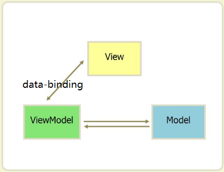

View与ViewModel之间通过双向绑定（data-binding）建立联系，这样当View（视图层）变化时，会自动更新到ViewModel（视图模型），反之亦然。

**MVC和MVVM的区别**并不是VM完全取代了C，ViewModel存在目的在于抽离Controller中展示的业务逻辑，而不是替代Controller，其它视图操作业务等还是应该放在Controller中实现。


## Vue.js有什么不同？

如果我们使用JQuery在指定的DOM中插入一个元素，并给它绑定一个点击事件：

```html
<div id="app"></div>
<script src="./js/jquery.js"></script>
<script>
	var btn = $('<button>Click Me</button>');
	btn.on('click', function() {
		console.log("hello");
	});
	$('#app').append(btn);
</script>
```

这个代码操作的内容并不复杂，不过这样写就会让我们的视图代码与业务逻辑代码紧密耦合在一起，随着功能不断增加，直接操作DOM会使得代码越来越难以维护。

而Vue.js 通过MVVM 的模式拆分为视图和数据两部分，并将其分离，我们只需要关心数据就可以，DOM 操作则由Vue 搞定。

```html
<body>
	<div id="app">
		<button v-if='showBtn' v-on:click='handleClick'>Click Me</button>
	</div>
		
	<script src="https://unpkg.com/vue/dist/vue.js"></script>		
</body>
<script type="text/javascript">
	new Vue({
		el: '#app',
		data: {
			showBtn: true
		},
		methods: {
			handleClick: function() {
				console.log("clicked");
			}
		}
	});
</script>
```


## vue.js的安装

```
$cnpm i --save-dev vue 
```

webpack.config.js:

```
module.exports = {
  // ...
  resolve: {
    alias: {
      'vue$': 'vue/dist/vue.esm.js' // 用 webpack 1 时需用 'vue/dist/vue.common.js'
    }
  }
}
```


# 一、声明式渲染

## vue.js 认识

### vm对象创建

html:

```
<div id="app" @click="changName">
			姓名：{{student.name}}
			<br>
			年龄：{{student.age}}
</div>
```

js:

```
var vm= new Vue({
	el:"#app",
	data:{
		student:{
			name:"黄庆",
			age:20
		}
	},
	methods:{
		// data里的和methods里的属性名不能同名
		// student:function(){},
		changName:function(){
			this.student.name="其他名字"
		}
	}
})
```


## vue.js 模板语法、表达式与指令

### 界面插值

结合着对如何实现界面插值该知识点的讲解，我们下边来接触一下vue 的模板语法、表达式与指令。

**模板语法**，{{}}语法属于基础模板语法，往界面上按照普通文本插入文本

**表达式**，在模板语法中可以写一些基础的计算表达式得到你想往界面上插入的值，如：加减乘除，三目运算符等

```
html：
<div id="app">
			姓名：{{student.name}}	//模板语法,{{}}语法
			<br>
			年龄：{{(new Date).getFullYear()-student.birthYear}}//表达式
</div>

js:
var vm= new Vue({
	el:"#app",
	data:{
		student:{
			name:"某同学",
			birthYear:1999
		}
	}
})
```


基础模板语法，在页面初始化时会出现{{}}闪现问题，使用特定的指令即可解决。

**指令**，使用"v-*" 开头的语法，遵循标签属性的语法，写在开始标签中。

解决双大括号闪现问题：

(1) v-cloak指令 ,及[v-cloak] {display:none};或者使用v-text=“student.name”指令

(2) v-html指令，按照html超文本格式往界面上插入文本

(3)v-text 指令，按照普通文本格式往界面上插入文本

```
html:
<div id="app">
			<div v-html="student.msg"></div>
</div>

js:
var vm= new Vue({
	el:"#app",
	data:{
		student:{
			name:"某同学",
			msg:"<p style='color:red'>上进、积极、成绩好</p>"
		}
	}
})
```

v-pre指令，将双括号语法识别为普通文本

```
<p v-pre>{{msg}}</p>解析双大括号为普通文本
```

在指令中也可以写上简单的运算表达式，。


### 数据绑定

v-bind:     简写为   :  ,多用在标签属性值的数据绑定中，实现视图模型vm 层与视图v 层的**单向数据绑定**。

```
html:
<body>
    <a :href="myUrl">点击跳转到华清远见</a>
</body>

js:
var vm= new Vue({
	el:"#app",
	data:{
		myUrl:"http://www.hqyj.com"
	}
})

```

#### 样式绑定

v-bind: 在样式绑定中的更多使用语法：

(1) 对class 属性进行绑定

```html
<!--对象语法,v-bind:class 指令也可以与普通的 class 属性共存-->
<div class="static" v-bind:class="{ active: isActive, 'text-danger': hasError }">
</div>
<div v-bind:class="classObject"></div>

对应js 中的data:
data: {
  isActive: true,
  hasError: false,
  classObject: {
    active: true,
    'text-danger': false
  }
}


<!--数组语法,这样写将始终添加 errorClass，但是只有在 isActive 是真值时才添加 activeClass-->
<div v-bind:class="[isActive ? activeClass : '', errorClass]"></div>
<div v-bind:class="[{ active: isActive }, errorClass]"></div>
```

(2)对style 进行绑定

```html
<!--对象语法-->
<div v-bind:style="{ color: activeColor, fontSize: fontSize + 'px' }"></div>
<div v-bind:style="styleObject"></div>

对应js 中的data:
data: {
  activeColor: 'red',
  fontSize: 30,
  styleObject: {
    color: 'red',
    fontSize: '13px'
  }
}

<!--数组语法,可以将多个样式对象应用到同一个元素上-->
<div v-bind:style="[baseStyles, overridingStyles]"></div>
```

**思考：数据绑定实现的原理是什么？什么是 "数据劫持-发布者-订阅者"？**


### 双向绑定

v-model，用 在表单 <input>、<textarea> 及 <select> 元素上创建双向数据绑定，必须在组件的 data 选项中声明初始值。

v-model会忽略所有表单元素的 `value`、`checked`、`selected` attribute 的初始值，只认v-model。

```html
<input v-model="message" placeholder="edit me">
<p>Message is: {{ message }}</p>
```

由于复选框既有checked 属性，又有value 属性，所以，v-model 使用时要注意！

```html
单个复选框，绑定到布尔值：
<input type="checkbox" id="checkbox" v-model="checked">
<label for="checkbox">{{ checked }}</label>

多个复选框，绑定到同一个数组：
<div id='example-3'>
  <input type="checkbox" id="jack" value="Jack" v-model="checkedNames">
  <label for="jack">Jack</label>
  <input type="checkbox" id="john" value="John" v-model="checkedNames">
  <label for="john">John</label>
  <input type="checkbox" id="mike" value="Mike" v-model="checkedNames">
  <label for="mike">Mike</label>
  <br>
  <span>Checked names: {{ checkedNames }}</span>
</div>

对应js 中的data:
new Vue({
  el: '#example-3',
  data: {
	checked:true
    checkedNames:[]
  }
})
```

**思考：双向数据绑定实现的原理是什么？事件触发。**


### 事件绑定

v-on:   简写为@

```
html:
<head>
		<meta charset="utf-8">
		<title></title>
		<style type="text/css">
			.actve {
				color: red;
			}
			
			.static {
				color: black;
			}
		</style>
</head>
<body>
    <a href="javascript:void(0)" :class="myclass" @click="changeClass">不跳转的a标签</a>
</body>

js:
var vm= new Vue({
	el:"#app",
	data:{
		myclass:"static"
	},
	methods:{
		changeClass(){
			this.myclass="actve"
		}
	}
})


```

#### 事件修饰符

- .stop 阻止冒泡，阻止从当前元素经过的所有冒泡行为
- .prevent 阻止默认事件
- .capture 添加事件侦听器时使用时间捕获模式
- .self 只当时间在该元素本身（比如是子元素）触发时触发回调，并不阻止继续冒泡到其他元素
- .once 事件只触发一次

```html
<div class="box" @click="divBoxHandler">
    <input type="button" @click.stop="btnHandler" value="戳他">
</div>

<a v-on:click.prevent.once="doThat">阻止点击跳转，但是只会阻止第一次</a>
```


###条件渲染

v-if /v-else  或者  v-show

```js
html：
<div v-if="show" @click="changShow">{{form}}</div>
<div v-else>{{reg}}</div>

js:
var vm= new Vue({
	el:"#app",
	data:{
		show:true,
		form:"登陆表单",
		reg:"注册表单"
	},
	methods:{
		changShow(){
			this.show=false
		}
	}
})


```

注：


			visibility: hidden; 不脱离文档流的
			display:none        脱离文档流
			v-if                删除节点
			v-show               ==display:none


### 循环渲染

v-for /key

```
html:
<div id="app">
			<!-- 循环渲染 v-for ,记得加key 的绑定 -->
			<ul>
				<li v-for="(item,index) in students" :key="index">姓名：{{item.name}}，年龄:{{item.age}}，性别：
				
				<span v-if="item.gender==0">男</span>
				<span v-else>女</span>
				</li>
			</ul>
</div>

js:
var vm= new Vue({
	el:"#app",
	data:{
		students:[{
			name:"同学1",
			gender:0,
			age:10
		},
		{
			name:"同学2",
			gender:1,
			age:12
		},
		{
			name:"同学3",
			gender:0,
			age:21
		},
		{
			name:"同学4",
			gender:1,
			age:14
		}]
	}
})
```

v-for 与v-if 作用到同一个元素之上时，具有优先级关系(v-for 优先级更高)：

```html
js:
{
	data:{
		arr:[{num:1},{num:2},{num:3},{num:4},{num:5},{num:6},{num:7},{num:8}]
	}
}

html:
<div v-for="(item,index) in arr" v-if="item.num>5" :key="index">
		{{item.num}}
</div>
//渲染正常
//渲染过程为：对arr每一项先做map循环判断v-if给出的条件，再做一遍for 循环渲染
//这样引起的问题是：arr 数组新增一项数据时，会对每一项再做一遍v-if 循环，然后for 循环渲染
//解决方法如下：
<div v-for="(item,index) in arr" :key="index">
		<div v-if="item.num>5">{{item.num}}</div>
</div>
//这样当arr 数组某一项数据发生变化时，只对新增的数据进行v-if 判断，节约渲染效率
//永远不要把v-for v-if 放到同一元素身上
```


## vue.js 属性

### 计算属性

```
html:
<div id="app">
			{{name}}
			<br>
			
			<!-- 计算属性会有缓存，防止页面发生大量重复计算，提升js 运行效率 -->
			年龄：{{age}}
			<!-- methods 方法没有缓存，界面任何数据发生改变，方法都会被重新调用一遍 -->
			年龄:{{showAge()}}
			
			<button type="button" @click="changeBirth">修改名字</button>
</div>

js:
var vm=new Vue({
	el:"#app",
	data:{
		student:{
			name:"同学姓名",
			// age:19,
			birth:"2000-10-01"
		}
	},
	methods:{
		changeBirth:function(){
			this.student.name="另外一个同学的名字"
		},
		// ,
		// showAge:function(){
		// 	console.log("计算一次")
		// 	return (new Date()).getFullYear()-(new Date(this.student.birth)).getFullYear()
		// }
	},
	computed:{
		name:function(){
			return this.student.name.split("").reverse().join()
		},
		
		age:{
            get:function(){
                console.log("计算一次")
                return (new Date()).getFullYear()-(new Date(this.student.birth)).getFullYear()
            },
            set:function(value){
                //根据js 要修改的年龄计算出生年份，设置给this.student.birth
            }
		}
	}
})
```

注：面试题，上述笔记里 计算属性与methods 方法之间的区别。


### 侦听器属性

```
html:
<div id="app">
			<!-- v-model 实现数据的双向绑定 -->
			<!-- v-model 只能用在表单类元素上边：input/textarera/select -->
			搜索：<input type="text" v-model="keyW" />
			
			<br>
			<p v-html="news"></p>
</div>

js:
var vm=new Vue({
	el:"#app",
	data:{
		keyW:"",
		info:"习近平主席对尼泊尔展开了一次历史性访问，最重要的成果是把10年前建立的“中尼世代友好的全面合作伙伴关系”提升为“中尼面向发展与繁荣的世代友好的战略合作伙伴关系”。10月13日，习近平在会见尼泊尔总理奥利时，讲到了这一新关系的16字原则：平等相待、和睦相处、世代友好、全面合作。“合作”成为习近平此访最重要的关键词和最大的亮点。",
		news:""
	},
	created() {
		this.news=this.info//为news 初始化数据
	},
	// 侦听器属性，比计算属性计算效率消耗大
	watch:{
		keyW:function(){
			console.log(123)
			this.news=this.info.replace(new RegExp(this.keyW,"igm"),`<span style="color:red">${this.keyW}</span>`)
		}
	}
})
```


### 过滤器属性

```
html:
<!-- 过滤器属性只能用在v-bind 和 {{}}里 -->
<!-- <td :title="item.name|myemployee">{{item.name|myemployee}}</td> -->

<td v-html="$options.filters.myemployee(item.name,keyW)"></td>

js:
var vm=new Vue({
	el:"#app",
	data:{
		employee:[],
		keyW:""
	},
	filters:{
		myemployee:function(value,keyW){
			if(keyW){
				return value.replace(new RegExp(keyW,"igm"),`<span style="color:red">${keyW}</span>`)
			}
			return value;
		}
	}
}
```


## vm对象的生命周期函数


## 模板语法综合项目&axios

结合axios，在前后端分离的项目开发模式中，使用vue 声明式渲染的相关语法实现一个列表页面的增删改查功能。

### 应用交互过程

- **Client** - 客户端，一般指浏览器，浏览器可以通过 HTTP 协议向服务器请求数据。
- **Server** - 服务端，一般指 Web 服务器(eg:node+express)，可以接收客户端请求，并向客户端发送响应数据。
- **Business** - 业务层， 通过 Web 服务器处理应用程序，如与数据库交互，逻辑运算，调用外部程序等。
- **Data** - 数据层，一般由数据库组成。


客户端：软件--浏览器/app，硬件--手机/pad/笔记本

服务器：软件--nodejs/hbuilder	，硬件--安装了服务器软件的硬件就是服务器


###axios 初步使用

前后端分离项目，前端安装axios

```
$cnpm i --save axios
```

axios数据请求方法：<http://www.axios-js.com/docs/>

import axios from "axios";

```
axios.get('/user', {
    params: {
      ID: 12345
    }
  })
  .then(function (response) {
    console.log(response);
  })
  .catch(function (error) {
    console.log(error);
  })
  
  axios.post("http://localhost:8888/userLogin",{
      username:this.username,
      password:this.passW
  }).then(data=>{
    if(data.data.status==0){
    	this.mainPage=true
    }else{
    	alert(data.data.msg)
    }
  }).catch(err=>console.log(err))

```

### axios 的更多请求方式

案例：all 请求方式

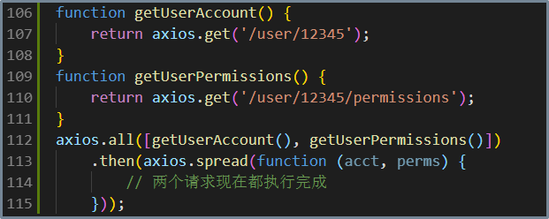

```javascript
//为方便起见，为所有支持的请求方法提供了别名
axios.request(config)
axios.get(url[, config])
axios.delete(url[, config])
axios.head(url[, config])
axios.options(url[, config])
axios.post(url[, data[, config]])
axios.put(url[, data[, config]])
axios.patch(url[, data[, config]])
```


# 二、组件系统

###组件（名称+内容+属性）

语法：

1、全局组件，名称不能跟html5 标签重名
2、注册全局组件必须得在创建vm 实例之前
3、全局组件在 vm 实例上都能使用

4、组件的模板效果template 只能是整体为一个元素

#### 组件data 与插槽

```html
html:
		<div id="app">
			<my-list>
				这是第一个列表项
				<span slot="secon">这是第二个列表项</span>
				<span slot="third">这是第三个列表项</span>
				
			</my-list>
			
			<!-- props 实现父向子传值 -->
			<my-button type="warn">点击抽奖！</my-button>
		</div>

		<div id="another">
			<!-- my-list 是一个全局组件，所以，所有vm 挂载的实例上都能使用该标签 -->
			<my-list></my-list>
		</div>

js:
import Vue from "vue";
import axios from "axios";

Vue.component("my-list",{
	template:`<div >
				<ul>
					<li><slot>列表1</slot></li>
					<li><slot name="secon">列表2</slot></li>
					<li><slot name="third">列表3<slot></li>
				</ul>
				<div>模板效果</div>
			</div>
			
			`
})

Vue.component("my-button",{
	// 插槽<slot>
	template:`
		<button type="button" :class="type">
			<slot>自定义按钮</slot>
		</button>
	`,
	props:["type","size"]
})

var vm=new Vue({
	el:"#app"
})

var newVm=new Vue({
	el:"#another"
})
```

#### 属性props

```
props: {
	propA: Number,		// 基础的类型检查 (`null` 匹配任何类型)
	propB: [String, Number],	// 多个可能的类型
	propC: {	type: String,
     		 required: true	// 必填的字符串
   	},
	propD: {	type: Number,
      		default: 100	// 带有默认值的数字
    	},
	propE: {	type: Object,	// 带有默认值的对象
		default: function () {	// 对象或数组默认值必须从一个工厂函数获取
        		return { message: 'hello' }
      		}
    	},
	propF: {
      		validator: function (value) {// 自定义验证函数
			return ['success', 'warning', 'danger'].indexOf(value) !== -1
      		}
    	}
  }
```

class 属性不会被组件模板覆盖掉，而是叠加。

#### 事件绑定

如果你需要在组件上绑定原生事件，需要使用修饰符native：

```html
 <my-tag  @click.native="clickMe"></my-tag>
```


### 全局组件与局部组件

局部组件在父实例的compents 属性里定义/注册,局部组件只能用在自己的父实例里

全局组件在构造函数Vue.compent 方法里定义/注册，全局组件可以用在任意一个vm 实例里

```
html:
		<div id="app" >
			<top-menu></top-menu>
		</div>

		<div id="myapp">
			<!-- top-menu 是在#app -->
			<top-menu></top-menu>
		</div>
js:
//定义局部组件件的语法与定义全局组件对象的语法完全一致
//组件"top-menu"对应的对象topmenu
var topmenu={
			template: `<ul>
				<li>首页</li>
				<li>新闻列表</li>
				<li >关于我们{{msg}}</li>
			</ul>`,
			data:function(){
				return {
					msg:"今天同学人数比较少"
				}
			}
}

var vm = new Vue({
	el: "#app",
	components: {
		"top-menu": topmenu
	}
})

var newVm = new Vue({
	el: "#myapp"
})
```


### 完整组件及其作用域

组件定义里除了data/props 与vm 实例之间有语法区别之外,其他的methods/computed/watch/声明周期函数/filters/components……这些语法都相同。

```html
html:	
		<div id="app" @click="changeHello">	
			<!-- words属性实现父向子传值 -->
			<my-div :words="hello"></my-div>
			<my-div></my-div>
		</div>
		
js:
	Vue.component("my-div",{
	template:`
		<div>
			<h4>{{words}}</h4>
			<p @click="changeN">{{n}}</p>
		</div>
	`,
	// 组件的data 设计成function的用义:组件可以多次使用,每使用一次,函数被调用一次则创建出不同的数据对象,实现同名组件的数据可以相互独立
	data:function(){
		return {
			// hello:"自定义组件"
			n:1
		}
	},
	props:["words"],
	methods:{
		changeN:function(){
			this.n++
		}
	},
	created() {
		console.log(this)
	}
})

var vm=new Vue({
	el:"#app",
	data:{
		hello:"自定义组件"
	},
	methods:{
		changeHello:function(){
			console.log(123)
			this.hello="父组件已经改过的数据"
		}
	}
})	
```

注：面试题，上述组件的data 设计成function的用义。


###父向子传值props

通过在子组件上定义props ，再到子组件使用时去绑定接收父组件的值：

```
html:
		<div id="app" >
			<my-list v-for="item in questions" :q="item" :key="item.id"></my-list>
		</div>

js:
Vue.component("my-list",{
	template:`
		<ol>
			<li>{{q.title}}</li>
			<li>{{q.answer}}</li>
			<li>{{q.addtime}}</li>
		</ol>
	`,
	props:["q"]
	
})

var vm=new Vue({
	el:"#app",
	data:{
		questions:[]
	},
	created(){
		axios.get('http://localhost:8000/getQuestions')
		  .then( (response)=> {
		    // handle success
		    console.log(response.data);
			this.questions=response.data
		  })
		  .catch(function (error) {
		    // handle error
		    console.log(error);
		  })
		  .then(function () {
		    // always executed
		  });
	}
})
```


###子向父传值$emit

子组件的data 数据需要交给父组件使用，通过在子组件上定义自定义事件，在子组件中通过$emit 来触发事件；子组件的事件被触发并传参，事件处理函数可以接收到子组件的数据；事件绑定的事件处理函数在父节点上，故可在事件处理函数中用到子组件的数据值来修改父节点的数据。

```
html:
		<div id="app" >
			<!-- 子向父传值，自定义事件，this.$emit()去触发 -->
			<my-search @myevent="handleEvent"></my-search>
			
			<ul>
				<li v-for="item in goods" :key="item.id">{{item.kw}}</li>
			</ul>
		</div>
		
js:
Vue.component("my-search",{
	template:`
		<div>
			<input type="text" v-model="keyW">
		</div>
	`,
	data:function(){
		return {
			keyW:""
		}
	},
	watch:{
		keyW:function(){
			this.$emit("myevent",this.keyW)
		}
	}
})


var vm=new Vue({
	el:"#app",
	data:{
		goods:[]
	},
	methods:{
		handleEvent:function(value){
			this.getGoods(value)
			
		},
		getGoods(kw){
			axios.get('http://localhost:8000/getGoods',{
				params:{
					kw:kw
				}
			})
			  .then( (response)=> {
			    this.goods=response.data
			  })
			  .catch(function (error) {
			    // handle error
			    console.log(error);
			  })
		}
	},
	created(){
		this.getGoods()
	}
})
```


### 访问父子组件的值

$parent/$root、$children/$refs

在父组件app.vue 中引入两个子组件(“child-detail”与“child-edit”)

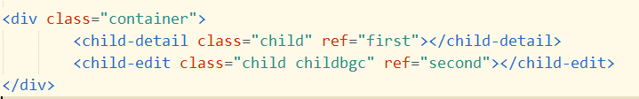

a, 在子组件中，通过this.$parent就可以访问上一级父组件了，包括访问父组件的data里面的数据，调用它的函数；this.$root 则是访问最顶层父组件的数据和方法：

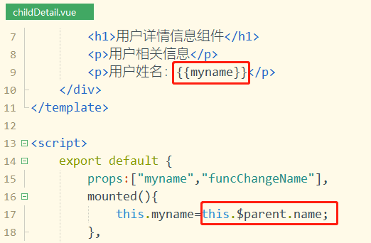

b, 在父组件app.vue 中，通过this.$refs.first就可以访问子组件了，包括访问子组件的data里面的数据，调用它的函数：

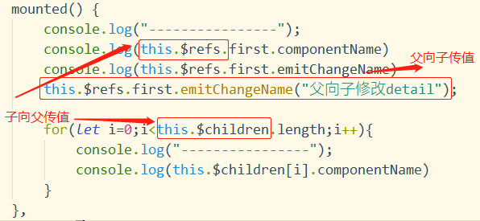

​	打印结果：

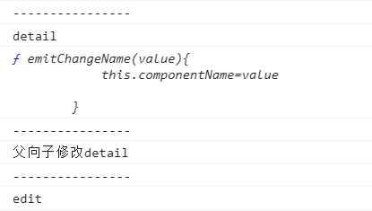


### 并列组件传值-中央控制总线bus

1、创建Bus.js

```javascript
import Vue from 'vue'
 
const Bus = new Vue();

export default Bus;
```

2、在兄弟组件中1 和3 中引入bus

```javascript
//组件1
import Bus from '@/Bus'
...
mounted () {
        Bus.$on('changedFormObject',(name,val) =>{//处理传过来的值
            this.formVal[name] = val;
        });
    }
 
//组件3
<input type="text" class="form-input" v-model="inputValue" >
　　import Bus from '@/Bus'
    export default {
        name: "InputItem",
        props: {
            label_name: String,
            input_val: String,
            input_name: String
        },
        data () {
            return {
                inputValue: this.input_val//不要直接修改父组件传过来的参数,参数是单向传递的，只能由父组件传到子组件。先将参数赋值给子组件的data，然后再做修改
            }          
        },
        watch: {
            inputValue () {
                console.log(this.inputValue);
                Bus.$emit('changedFormObject',this.input_name,this.inputValue);//提交改变后的值
            }
        }
    }
```


### 多层组件传值 $listeners/$attrs

​        在不用状态管理vuex的时候，如何让GrandFather与Son通信，我们可以用可以emit一层一层的传递会显得冗余。 vue2.4之后，提出attr、$listeners ,可以实现跨级组件通信。attributes

​        $listeners官网解说 ：事件传递
​        $attrs官网解说：属性传递

​       使用语法，案例如下：

​	第一步，在GrandFather中给Father传事件"getDate" 与属性"info"；

​	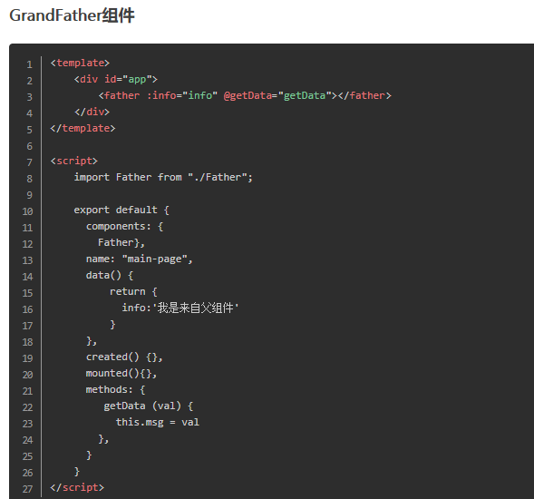

​	第二步，在Father组件中分别使用v-on="$listeners"和v-bind="listeners"，将事件"getDate" 与属性"info"继续向下传递给Son 组件；

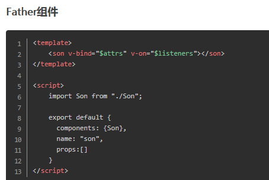

​	第三步，在Son组件中，就可以通过this.emit('事件类型')来触发从GrandFather中传入的事件，也可以使用this.$attrs.info 来访问GrandFather组件向外传递的属性info 的值了。

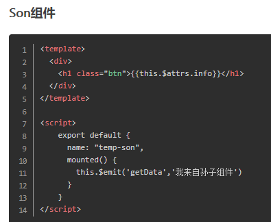


**$attrs：包含了父作用域中不作为 prop 被识别 (且获取) 的特性绑定 (class 和 style 除外)。**
**$listener：包含了父作用域中的 (不含 .native 修饰器的) v-on 事件监听器。**

GrandFather 组件

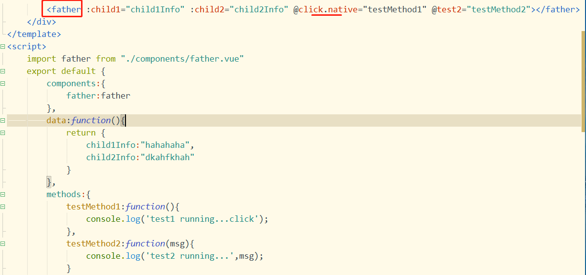

Father 组件

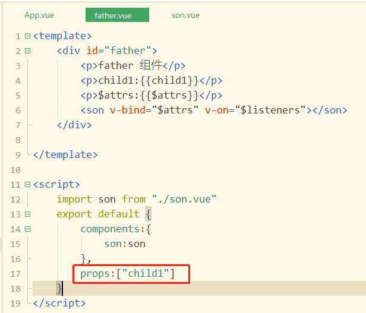

Son 组件：

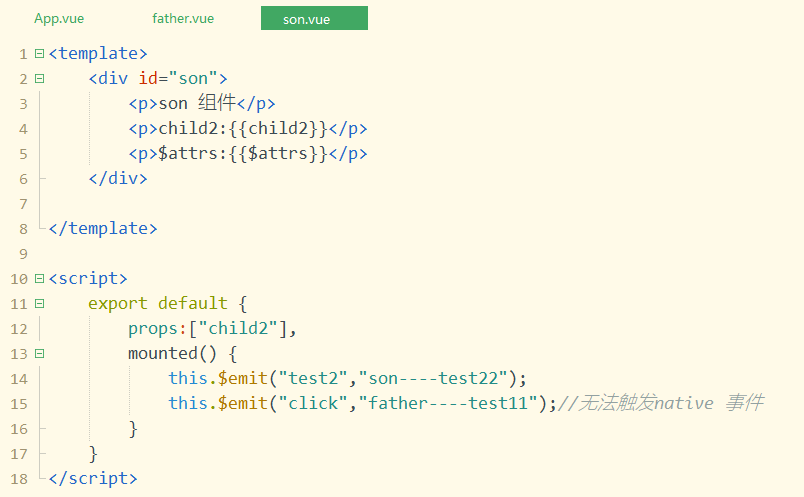

最终界面呈现结果：

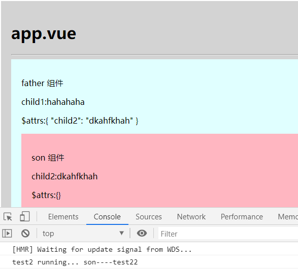


### 自定义指令

除了默认设置的核心指令( v-model 和 v-show )，Vue 也允许注册自定义指令。

在Vue里，代码复用的主要形式和抽象是组件。

然而，有的情况下，**仍然需要对纯 DOM 元素进行底层操作，这时候就会用到自定义指令 **。

以一个input元素自动获得焦点为例，当页面加载时，使用autofocuse可以让元素将获得焦点 ，但是autofocuse在移动版Safari上不工作，现在注册一个使元素自动获取焦点的指令。

指令注册类似于组件注册，包括全局指令和局部指令两种。

#### 1）全局指令

```javascript
// 注册一个全局自定义指令 v-focus
Vue.directive('focus', {
  // 当绑定元素插入到 DOM 中。
  inserted: function (el) {
    // 聚焦元素
    el.focus()
  }
})
```

#### 2）局部指令

```javascript
var vm = new Vue({
  el: '#app',
  directives:{
    focus:{
      inserted: function (el) {
        el.focus()
      }      
    }
  }
})
```

在模板中任何元素上使用新的 v-focus 属性

```html
<div id="app">
  <input v-focus>
</div>
```

#### 3）钩子函数

指令定义函数提供了几个钩子函数（可选） 。

【bind】
　　只调用一次，指令第一次绑定到元素时调用，用这个钩子函数可以定义一个在绑定时执行一次的初始化动作。

【inserted】
　　被绑定元素插入父节点时调用（父节点存在即可调用，不必存在于 document 中）。

【update】
　　所在组件的 VNode 更新时调用，但是可能发生在其孩子的 VNode 更新之前。指令的值可能发生了改变也可能没有。但是可以通过比较更新前后的值来忽略不必要的模板更新。

【componentUpdated】
　　所在组件的 VNode 及其孩子的 VNode 全部更新时调用。

【unbind】
　　只调用一次， 指令与元素解绑时调用。

**注意区别：**

bind与inserted：bind时父节点为null，inserted时父节点存在；

update与componentUpdated：update是数据更新前，componentUpdated是数据更新后。

#### 4）钩子函数参数

【el】
　　指令所绑定的元素，可以用来直接操作 DOM。

【binding】
　　一个对象，包含指令名称及该指令所绑定的表达式信息。
【vnode】
　　Vue 编译生成的虚拟节点。

【oldVnode】
　　上一个虚拟节点，仅在 update 和 componentUpdated 钩子中可用。

**注意：**除了 el 之外，其它参数都是只读的，尽量不要修改他们。如果需要在钩子之间共享数据，建议通过元素的 dataset 来进行。

#### 5）函数简写

大多数情况下，可能想在bind和update钩子上做重复动作，并且不想关心其它的钩子函数。可以这样写：

```html
<div v-demo="{ color: 'white', text: 'hello!' }"></div>

Vue.directive('demo', function (el, binding) {
  console.log(binding.value.color) // => "white"
  console.log(binding.value.text)  // => "hello!"
})
```


### 动态组件

component 组件可以根据其is 属性的值，渲染出不同的组件

```
html:
	<div id="app" @click="changeCom">

			<top-menu></top-menu>
			
			<!-- 动态组件 -->
			<component :is="TabC"></component>
	</div>

js:
//全局组件的定义和注册
Vue.component("top-menu",{
	template:`
		<ul>
			<li>首页</li>
			<li>列表页面</li>
			<li>关于我们</li>
		</ul>
	`
	
})
//局部组件的定义
var mainPage={
	template:`
		<div>这是首页内容</div>
	`
}

var listPage={
	template:`
		<div>这是列表页面内容</div>
	`
}

var aboutPage={
	template:`
		<div>这是关于我们的内容</div>
	`
}

var vm = new Vue({
	el: "#app",
	components:{//局部组件的注册
		"main-page":mainPage,
		"list-page":listPage,
		"about-page":aboutPage
	},
	data:{
		TabC:"main-page"
	},
	methods:{
		changeCom:function(e){
			console.log(e.target)
			switch(e.target.innerHTML){
				case "首页": this.TabC="main-page";break;
				case "列表页面": this.TabC="list-page";break;
				case "关于我们": this.TabC="about-page";break;
			}
		}
	}
})
```


### 缓存组件

保证组件"活着"，数据不被重新加载。

原理：在组件created 时将需要缓存的vnode 节点放到cache 中，在render 的时候根据name 再进行取出。

```html
<keep-alive>
 <component>
 	<!-- 该组件将被缓存！ -->
 </component>
</keep-alive>
```

提供有include 和exclude 属性（字符串或正则表达式）。

```html
<keep-alive exclude="a,b">
 <!-- 将缓存name为a或者b的组件，结合动态组件使用 -->
 <component :is="view"></component>
</keep-alive>
 
<!-- 使用正则表达式，需使用v-bind -->
<keep-alive :include="/a|b/">
 <component :is="view"></component>
</keep-alive>
```


### 组件化开发思想训练

使用组件写法将页面构建起来：

.png)

```
html:
		<div id="app" >
			<top-menu></top-menu>
			<left-content></left-content>
			<right-content></right-content>
		</div>
		
js:
import Vue from "vue";
import axios from "axios";

import topMenu from "./views/topMenu";
import leftContent from "./views/leftContent";
import rightContent from "./views/rightContent";
var vm = new Vue({
	el: "#app",
	components:{
		"top-menu":topMenu,
		"left-content":leftContent,
		"right-content":rightContent
	}
})
```

topMenu.js:

```
var topMenu={
	template:`
		<div class="topmenu"></div>
	`
}

export default topMenu;
```

leftContent.js:

```
var mySquare={
	template:`
		<div :style="{width:myWodth,height:myheight,backgroundColor:mycolor,marginBottom:Bottom}"></div>
	`,
	data:function(){
		return {
			myWodth:"100%",
			myheight:"50px",
			mycolor:"red",
			Bottom:"10px"
		}
	}
}

var leftContent={
	template:`
		<div class="leftcontent">
			<my-square></my-square>
			<my-square></my-square>
		</div>
	`,
	components:{
		"my-square":mySquare
	}
}

export default leftContent;
```

rightContent.js:

```
var rightContent={
	template:`
		<div class="rightcontent">
			
		</div>
	`
}

export default rightContent
```

### 单文件组件

首先，创建一个.vue 文件，支持`<template>`、`<script>` 和 `<style>`语言模式。

1、webpack 配置对.vue 文件的支持

```
cnpm i vue-loader vue-template-compiler -D
cnpm i vue-style-loader css-loader -D

//webpack 配置对.vue 单文件组件的支持
//https://segmentfault.com/a/1190000015708749?utm_source=tag-newest
```

2、设置单文件组件为局部组件与全局组件

```
import myTag from "./src/components/myTag.vue";
import myTitle from "./src/views/myTitle.vue";

Vue.component("my-tag",myTag)

{
    data:function(){	return {};	},
    components:{
        "my-title":myTitle
    }
}
```

3、scoped 样式控制与lang 属性

4、render函数：定义组件时，使用template来创建组件的html结构是常用的方法，但是有些时候代码会比较冗长，Vue提供了渲染函数render来解决这个问题。

```javascript
import app from "./src/app.vue";

new Vue({
    render:function(createElement){
        createElement(app);
    }
}).$mount("#app")
```


# 三、客户端路由

### 安装使用vue-router

```
$ cnpm i --save vue-router
```

页面使用router-link 组件和router-view 组件：

```
html:
		<div id="app" >
			<h1>Hello App!</h1>
			  <p>
			    <!-- 使用 router-link 组件来导航. -->
			    <!-- 通过传入 `to` 属性指定链接. -->
			    <!-- <router-link> 默认会被渲染成一个 `<a>` 标签 -->
			    <router-link to="/">首页</router-link>
				<br>
			    <router-link to="/list">列表页面</router-link>
				<br>
				<router-link to="/about">关于我们</router-link>
				
			  </p>
			  <!-- 路由出口 -->
			  <!-- 路由匹配到的组件将渲染在这里 -->
			  <router-view></router-view>
		</div>
js:
import Vue from "vue";
import axios from "axios";
// 安装cnpm i --save vue-router
import VueRouter from 'vue-router'

Vue.use(VueRouter)

const main = { template: '<div>首页页面内容</div>' }
const list = { template: '<div>列表页面内容</div>' }
const about = { template: '<div>关于我们页面</div>' }

const myroutes = [
  { path: '/', component: main },
  { path: '/list', component: list },
  { path: '/about', component: about }
]

const router = new VueRouter({
  routes:myroutes 
})

//创建vm 时，传递一个路由对象
const app = new Vue({
  router
}).$mount('#app')
```


### 路由传参

两种方式：

1、  在router-link 标签的to 属性路由值里添问号”?参数名=参数值“传参，在js 中使用”$route.query.参数名“接收参数值；

2、  在路由规则里定义路由规则”{path:'/路由/:参数名'}“

​	在router-link 标签的to 属性路由值里添斜杠”/参数值“传参，在js 中使用”$route.params.参数名“接收参数值；


```
html：		
		<div id="app" >
			<h1>Hello App!</h1>
			  <p>
			    <router-link to="/">首页</router-link>
				<br>
			    <router-link to="/list?id=1">新闻部</router-link>
				<br>
				<router-link to="/list?id=2">编辑部</router-link>
				<br>
				<router-link to="/list?id=3">人事部</router-link>
				<br>
				<router-link to="/about/1">关于我们</router-link>
			  </p>
			  <router-view></router-view>
		</div>
部分js:
路由规则--
const myroutes = [
  { path: '/', component: main },
  { path: '/list', component: list },
  { path: '/about/:mydata', component: about }
]
组件定义内，取参用参--
const list = { 
	template: `<div>
		列表页面内容{{$route.query.id}}
	`
}
const about = { template: '<div>关于我们页面{{$route.params.mydata}}</div>' }

```


### 编程式导航

通过js 触发路由切换：

```javascript
router.push('home')				// 字符串，路由规则中定义的name名
router.push({ path: 'home' })				// 对象
router.push({ name: 'user', params: { userId: 123 }}) 	// 命名的路由
router.push({ path: '/list', query: { plan: 'private' }})

router. replace(location)：//跟 router.push 很像，唯一的不同就是，它不会向 history 添加新记录，而是跟它的方法名一样 —— 替换掉当前的 history 记录。	

router. go(n);//参数是一个整数，意思是在 history 记录中向前或者后退多少步，类似 window.history.go(n)。
router.go(1)		// 在浏览器记录中前进一步，等同于 history.forward()
router.go(-1) 		// 后退一步记录，等同于 history.back()
```


### 导航守卫

#### 1）全局守卫

全局前置钩子router.beforeEach(fn)，导航被触发----前端鉴权
全局解析钩子router.beforeResolve(fn)，组件初始化
全局后置钩子router.afterEach(fn)，没有next，导航被确认

```
//导航守卫
router.beforeEach((to, from, next) => {
  console.log(to,from);
  next()
})

router.afterEach((to, from) => {
  console.log(to,from)
})

```


#### 2）路由独享的守卫

路由独享的守卫beforeEnter(to,from,next)，路由初始化(组件未初始化)----

a，路由鉴权

b，组件异步加载情景中(插件配置：syntax-dynamic-import)

```javascript
routes:[{
    path:"/test",
    component:()=>import("../components/Test.vue"),
    beforeEnter(to,from,next){
        if(to.path==="/test"){
          alert("请登录");
          next(false); // 禁止跳转
        }else{
          next()
        }
 	}
}]
```


#### 3）组件内部生命周期守卫

beforeRouteLeave 从该组件离开

beforeRouteEnter(to,from,next)，组件被激活，使用不了this，故构造指定该next 可以接收一个回调函数接收当前vm 实例----路由传参获取参数，得到初始化数据

beforeRouteUpdate(to,from,next)，组件重用时被调用----路由传参获取参数，避免增添watch 开销


导航守卫执行顺序：beforeRouteLeave < beforeEach < beforeRouteUpdate < beforeEnter < beforeRouteEnter < beforeResolve < afterEach

出发路由，预备从当前组件离开，判断路由变化，判断组件是否重用，判断新路由初始化，判断组件初始化，路由与组件初始化完毕，路由组件重定向完毕


### 路由模式

详细说明可参考博客：https://www.cnblogs.com/yszblog/p/10255458.html

```
const router = new VueRouter({
	//页面内使用hash ，对应的是location.hash
	mode:"hash",
	// //页面级别的缓存控制，不会立即重请求页面
	// mode: 'history',
	routes:myroutes 
})
```


### 子路由

```javascript
const router = new VueRouter({
  routes: [
    { path: '/user/:id', component: User,
      children: [
        {
          // 当 /user/:id/profile 匹配成功，
          // UserProfile 会被渲染在 User 的 <router-view> 中
          path: 'profile',
          component: UserProfile
        },
        {
          // 当 /user/:id/posts 匹配成功
          // UserPosts 会被渲染在 User 的 <router-view> 中
          path: 'posts',
          component: UserPosts
        }
      ]
    }
  ]
})
```


### 路由重定向

```javascript
const router = new VueRouter({
  routes: [
    { path: '/a', redirect: '/b' }
  ]
})
```


# 四、大规模状态管理

## vuex 简介

Vuex 是一个专为 Vue.js 应用程序开发的状态管理模式。它采用集中式存储管理应用的所有组件的状态，并以相应的规则保证状态以一种可预测的方式发生变化。

这个状态自管理应用包含以下几个部分：

state，驱动应用的数据源；
view，以声明方式将 state 映射到视图；
actions，响应在 view 上的用户输入导致的状态变化。


### 安装

```bash
npm install vuex --save
```

### 使用

```javascript
import vuex from "vuex";
import vue from "vue";

vue.use(vuex);

const store=new vuex.store({
    state:{},
    mutations:{},//同步,
	getters:{},
	actions:{}//异步
	modules:{
	}
})
```


# 五、构建工具

## 脚手架 vuecli

### 安装

```javascript
cnpm install -g @vue/cli
```

### 项目创建

```
vue create 项目名称
```

Manuslly  select

（babel。vuex。router。css。web APP）

### 项目启动命令

```
npm run build
npm run serve
注：他们有什么区别呢？
```

### 项目配置

npm  run  build执行成功后，会在项目文件下生成一个dist目录，里面是打包生成的文件，这些文件是浏览器可执行文件。生成的文件部署到生产环境，提供给用户访问。
此时打包出来的项目有个问题：你直接打开是空白的，这个是路径问题造成的，接下来我们使用vue ui解决这个问题。

```
vue ui
```

可视化创建项目及项目配置，点击你要配置的项目，进入面板后，点击配置按钮进行相关配置。

把“Base URL”改成”./”，然后保存，此时会在项目根目录(myapp)下生成 vue.config.js。

进入项目目录(myapp)，再次执行： npm  run  build。

### axios 请求全局引入

全局默认基础URL 全局引入

```
axios.defaults.baseURL = 'https://api.example.com';
axios.defaults.headers.common['Authorization'] = AUTH_TOKEN;
axios.defaults.headers.post['Content-Type'] = 'application/x-www-form-urlencoded';
```


# UI库的引入

## elementUI使用

cnpm i --save element-ui


