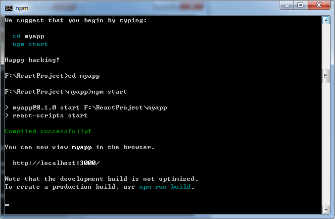

# 为什么要学习流行框架

- 企业为了提高开发效率：在企业中，时间就是效率，效率就是金钱。
- 提高开发效率的发展历程：原生JS(需要兼容浏览器) -> JQuery之类的类库 ->前端模板引擎（频繁操作DOM元素） -> React.js/Angular.js / Vue.js（减少不必要的DOM操作，提高渲染效率，双向数据绑定：使用指令，这样程序员只需要关心数据的业务逻辑，不再关心DOM如何渲染）。
- 增强自己就业时的竞争力


# 库和框架的区别

#### 1、库

- 封装了js，思想还是在js上，高度的封装了原生js。
- 提供某一个小功能，对项目的入侵性较小，如果某个库无法完成某些需求，可以很容易的切换到其他库来实现。

#### 2、框架

- 本质上修改了思想，解决了一些终端程序上的问题。
- 是一套完整的解决方案，对项目的入侵性较大，项目如果需要更换框架，则需要重新架构整个项目


# React简介

#### 1、简介

React 起源于 Facebook 的内部项目，因为该公司对市场上所有 JavaScript MVC 框架，都不满意，就决定自己写一套，用来架设Instagram 的网站。做出来以后，发现这套东西很好用，就在2013年5月开源了。

React主要用于构建UI。你可以在React里传递多种类型的参数，如声明代码，帮助你渲染出UI、也可以是静态的HTML DOM元素、也可以传递动态变量、甚至是可交互的应用组件。

React 拥有较高的性能，代码逻辑非常简单，越来越多的人已开始关注和使用它。


#### 2、与Angular和Vue比较

- ##### angular
  - 1.x 使用MVC架构，2.x使用MVVM架构
  - ajax交互是限制的，内部包含了$http

- ##### vue2
  - 使用MVVM架构
  - ajax交互没有限制，但推荐axios、vue-resource等

- ##### react
  - 更专注于View层
  - 实现大功能需要使用插件


#### 3、特点

- ##### 优势

  - **声明式设计** −React采用声明范式，可以轻松描述应用。

    ~~~react
    //命令式编程：命令“机器”如何去做事情(how)，这样不管你想要的是什么(what)，它都会按照你的命令实现。
    
    //声明式编程：告诉“机器”你想要的是什么(what)，让机器想出如何去做(how)。
    ~~~

  - **高效** −React通过对DOM的模拟，最大限度地减少与DOM的交互。虚拟DOM（Virtual  DOM）（由于是对 虚拟DOM进行操作，后面将虚拟DOM与真实DOM进行对比，若没有变化，则就不再进行渲染，若有变化，则重新进行渲染，这样一来，就减少了对真实DOM的操作，就更加高效）

  - **灵活** −React可以与已知的库或框架很好地配合。

  - **JSX** − JSX 是 JavaScript 语法的扩展。React 开发不一定使用 JSX ，但我们建议使用它。

  - **组件** − 通过 React 构建组件，使得代码更加容易得到复用，能够很好的应用在大项目的开发中。模块化

  - **单向响应的数据流** − React 实现了单向响应的数据流，从而减少了重复代码，这也是它为什么比传统数据绑定更简单。

  

- ##### 劣势

  - 学习成本很高，学习曲线很陡
  - react本身能做的事并不多，想做大东西必须得用react插件（全家桶）

  

#### 4、相关js库

  **react.js**：React的核心库
  **react-dom.js**： 提供操作DOM的扩展库，虚拟DOM
  **babel.min.js**：解析JSX语法代码转为纯JS语法代码的库


#### 5、如何学习

- 理解作者思想，接受它的世界观

- 接受它的中二设定    ---   自定义语法  jsx

  ~~~react
  //js - string
  let a = '<div>hello react!</div>'
  
  //jsx
  let a = <div>hello react!</div>
  ~~~


#### 6、书写格式

- 单个标签的书写格式

  ~~~react
  let a = <div>hello react!</div>
  ~~~

- 多个标签的书写格式：**外面必须包裹一层根标签**

  ~~~react
  let a = <div><div>sadasd</div><span>asdasd</span></div>
  ~~~

- 可以自由缩进

  ~~~react
  let a = <div>
  			<div>sadasd</div>
  			<span>asdasd</span>
  		</div>
  ~~~

- 允许加括号

  ~~~react
  let a = (<div>
  			<div>sadasd</div>
  			<span>asdasd</span>
  		</div>)
  ~~~

- **单标签规则：必须闭合**

  ~~~react
  
  <input/>
  <br/>
  <div></div>
  ~~~

- **样式类名class：写为className**

  ~~~react
  <div className='aaa'></div>
  ~~~

- **jsx里面使用js代码 - { }**

  ~~~react
  var a = 'hello react!';
  let b = <div> { a } </div>
      
  var imgSrc = "https://dss1.bdstatic.com/70cFuXSh_Q1YnxGkpoWK1HF6hhy/it/u=2717595227,1512397782&fm=26&gp=0.jpg";
  
  ~~~

  

#### 7、React开发模式

- 直接引入  -  简单（初学者喜欢的模式）

  ~~~react
  <script src="react.js"></script>
  ~~~

- 脚手架模式（基于webpack）


# React起步

#### 1、下载

- React可以直接下载使用，下载官网 http://facebook.github.io/react/

- 可以使用 **bower** 包管理器
  - js所有的框架库包管理器
  - 依赖于node.js
  - 安装bower： **npm  install  bower  -g**
  - **bower  info  react**：查看react框架的信息
  - **bower  install  react**：下载react最新版
  - **bower  install  react#版本号**：下载react指定版本


#### 2、安装

###### （a）在html文档中直接使用

React是灵活js库并能够支持多种不同的项目。可以直接使用它创建新的项目，同时支持在已有的项目下引入。

~~~react
<!DOCTYPE html>
<html>
	<head>
		<meta charset="utf-8" />
		<title></title>		
		<script src="https://cdn.staticfile.org/react/16.4.0/umd/react.development.js"></script>
		<script src="https://cdn.staticfile.org/react-dom/16.4.0/umd/react-dom.development.js"></script>
		<script src="https://cdn.staticfile.org/babel-standalone/6.26.0/babel.min.js"></script>	
	</head>
	<body>
		<div id="app"></div>
	</body>
	<script type="text/babel">

		ReactDOM.render(
			<h1>这是React</h1>,	
			document.getElementById('app')
		);
	</script>
</html>

~~~

- **babel.min.js** - Babel 可以将 ES6 代码转为 ES5 代码，这样就能在目前不支持 ES6 浏览器上执行 React 代码。Babel 内嵌了对 JSX 的支持。在script标签中需要将type类型声明为“text/babel”
- **react-dom.js**中提供了函数用来渲染页面：

```react
ReactDOM.render(
	组件（元素、内容）, 
	放到哪
);
```
- **jsx支持style** - 里面使用json

  ~~~react
  <h1 style={{'color': "red"}}>hello react!</h1>
  <h1 className={类名}>hello react!</h1>
  ~~~

  - 第一层是使用告诉jsx我要用js了
  - 第二层的是json的


###### （b）通过npm使用React

​	操作系统需要支持Node.js，建议在React中使用CommonJS模块系统，比如browserify 或 webpack，本教程使用 webpack。

​	国内使用npm速度较慢，使用淘宝定制的cnpm（gzip压缩支持）命令行工具代替默认的npm：

```shell
$ npm install -g cnpm --registry=https://registry.npm.taobao.org
$ npm config set registry https://registry.npm.taobao.org
```


###### （c）使用create-react-app快速构建开发环境

create-react-app来自于Facebook，通过该命令无需配置就能快速构建React开发环境。

create-react-app自动创建的项目是基于Webpack+ES6。

推荐在C盘以外的盘符创建一个空文件夹，比如定义：ggReact ，然后通过cmd小黑窗定位到我们新建的ggReact文件夹再开始  npm 等一系列操作,操作步骤大概如下：

```shell
$ cnpm install -g create-react-app  
$ create-react-app my-app	/*创建项目*/
$ cd my-app/	/*进入项目目录*/
$ npm start		/*启动项目*/
```





在浏览器中打开http://localhost:3000/ ,显示结果如下：


# React第一个项目

#### 1、React项目目录结构


**（1）node_modules**： 这里面包含了react项目中会用到的一些组件，install的时候下载下来的，你可以进去看看，有一些如base64之类的我们可能会用到的组件；

**（2）public**：里面包含了我们项目中的启动页面，react比较适合**单页面项目应用开发**，所以暂时只包含一个**index.html**，并且这也是react工程的**入口页面**，入口页面怎么理解，就是你启动项目后，打开的首页，第一眼呈现的那个页面；

**（3）src**：里面包含了一些我们自己使用的js文件，css文件，img文件等等，但你打开src文件夹你会发现很混乱，不要管什么app.js，你就看到**index.js**即可，系统默认**将index.html对准了index.js**，index.js也就是我们的入口js，他和index.html所对应。


#### 2、让目录结构更易懂

接下来，我们改动一下src里面的内容和结构，让首次接触react的小伙伴尽量能觉得他有点亲切的感觉，事实证明，越亲切的事物我们越希望去接近。

src文件夹内容修改如图：


src文件夹下原来的所有东西，除了index.js之外，都可以删掉，这样就可以轻装上阵了


接下来，我们做一些代码修改，展示一个含有样式的hello world示例。

- 看public下的index.html，我们还是保留最简洁，最易懂的部分，如图：


- 再来看src下的index.js，我们依然保留最简约的部分，如图：


- 接下来我们为这个demo添加样式，还是那条原则，尽量少写行内样式，写自己的css文件。这个时候我们在 src文件夹下的css文件夹下创建demo.css，写入css样式如图：


- 在index.js文件中使用import关键字引入demo.css，如图：


- 看一眼我们的成果，如图：


# React JSX

#### 1、JSX介绍

全称: **JavaScript XML**， React 使用 JSX 来替代常规的 JavaScript。

JSX 是一个看起来很像 XML 的 JavaScript 语法扩展。

我们不需要一定使用 JSX，但它有以下优点：

- JSX 执行更快，因为它在编译为 JavaScript 代码后进行了优化。
- 它是类型安全的，在编译过程中就能发现错误。
- 使用 JSX 编写模板更加简单快速。


- 作用: 用来创建react虚拟DOM(元素)对象

    * var ele = <h1>Hello JSX!</h1>;
    * 注意1: 它不是字符串, 也不是HTML/XML标签
    * 注意2: 它最终产生的就是一个JS对象
- 标签名任意: HTML标签或其它标签
- 标签属性任意: HTML标签属性或其它
- 基本语法规则

    * 遇到 **<** 开头的代码, 以标签的语法解析: html同名标签转换为html同名元素, 其它标签需要特别解析
    * 遇到以 **{** 开头的代码，以JS的语法解析: 标签中的js代码必须用{ }包含
- babel.js的作用

    * 浏览器的js引擎是不能直接解析JSX语法代码的, 需要babel转译为纯JS的代码才能运行
    * 只要用了JSX，都要加上type="text/babel", 声明需要babel来处理


#### 2、使用 JSX

JSX 看起来类似 HTML ，我们可以看以下实例:

html文件：

~~~html
  <body>
    <div id="root"></div>
  </body>
~~~

js文件：

~~~react
ReactDOM.render(
    <h1>Hello, world!</h1>,
    document.getElementById('root')
);
~~~

**注意**：代码中能够嵌套多个 HTML 标签，但需要使用一个标签元素包裹它

- 错误例子：

~~~react
ReactDOM.render(
  <h1>这是错误的例子</h1>
  <span>假设这里是标题下面的内容</span>,
  document.getElementById("example")
);
~~~

- 正确例子：

~~~react
ReactDOM.render(
  <section>
    <h1>这是正确的例子</h1>
    <span>假设这里是标题下面的内容</span>
  </section>,
  document.getElementById("example")
);
~~~


#### 3、独立文件

 如果需要使用公共样式，可以将React JSX 代码可以放在一个独立文件上，并在不同的js文件中引入即可，如下：

AppTop.js文件中：

~~~react
import React, {Component} from 'react';
import '../css/demo.css';

//类定义
class AppTop extends Component {
	render() {
		return (
            <header>
                <h1>我是公共标题栏</h1>
            </header>
        );
	}
}

export default AppTop; //将自定义的DOM元素暴露出来，供给其他的页面使用
~~~

index.js文件中：

~~~react
import React from 'react';
import ReactDOM from 'react-dom';
import AppTop from './js/AppTop.js';

ReactDOM.render(
	<AppTop />, 
	document.getElementById('root')
);
~~~


#### 4、JavaScript 表达式

我们可以在 JSX 中使用 JavaScript 表达式。表达式写在花括号 **{}** 中。实例如下：

~~~react
ReactDOM.render(
    <div>
      <h1>{1+1}</h1>
    </div>,
    document.getElementById('example')
);
~~~

在 JSX 中不能使用 **if else** 语句，但可以使用 **三元运算** 表达式来替代。

~~~react
var i = 0;
ReactDOM.render(
    <div>
      <h1>{i == 1 ? 'True!' : 'False'}</h1>
    </div>,
    document.getElementById('example')
);
~~~


#### 5、样式

React 推荐使用内联样式。React 会在指定元素数字后自动添加 **px** 。

~~~react
var myStyle = {
    fontSize: 100,  //等价于fontSize: '100px',
    color: '#00ff00'
};
ReactDOM.render(
    <h1 style = {myStyle}>我是标题</h1>,
    document.getElementById('example')
);
~~~


#### 6、注释

注释需要写在花括号中，需要注意的是：

- 在标签内部的注释需要花括号
- 在标签外的的注释不能使用花括号

~~~react
ReactDOM.render(
    /*标签外部的注释 */
    <h1>我是标题 {/*标签内部的注释*/}</h1>,
    document.getElementById('example')
);
~~~


#### 7、数组

JSX 允许在模板中插入数组，数组会自动展开所有成员

~~~react
var arr = [
  <h1>HTML</h1>,
  <h2>CSS</h2>
];
ReactDOM.render(
  <div>{arr}</div>,
  document.getElementById('example')
);
~~~


#### 8、图片

- **使用图片：src**，本地图片不推荐使用绝对路径

  - 分离引入方式 

  ~~~javascript
  import fm from '../img/fm.jpg';
  
  ~~~

  - 通过require引入 

  ~~~javascript
  
  ~~~

  - 引入线上地址，直接放链接 

  ~~~javascript
  
  ~~~

  

- **使用背景图片：background**

  - 分离引入方式 

  ~~~javascript
  import bj from '../img/bj3.jpg';
  
  var back = {
  	width: 300,
  	height: 300,
  	backgroundImage: 'url('+bj+')'
  }
  ~~~

  - 通过require引入 

  ~~~javascript
  var backtwo = {
  	width: 500,
  	height: 500,
  	backgroundImage: `url(${require("../img/bj3.jpg")})`
  }
  ~~~

  - 引入网络图片地址

  ~~~javascript
  var myback3 = {
      width: "200px",
      height: "200px",
      backgroundImage: "url('https://timgsa.baidu.com/timg?image&quality=80&size=b9999_10000&sec=1541571317085&di=2ae59e411740e4c062f693439ce99f55&imgtype=0&src=http%3A%2F%2Fupload.mnw.cn%2F2017%2F0814%2F1502698443378.jpg')"
  }
  ~~~

  


#### 9、HTML 标签 vs  React 组件

React 可以渲染 HTML 标签 (strings) 或 React 组件 (classes)。React JSX 使用大、小写的约定来区分本地组件的类和 HTML 标签。

- 要渲染 HTML 标签，只需在 JSX 里使用小写字母的标签名。

~~~react
var my = <h1>我是标题呀</h1>;
ReactDOM.render(my, document.getElementById('example'));
~~~

- 要渲染 React 组件，只需创建一个**大写字母开头**的本地变量。(大驼峰法)

~~~react
class My extends React.Component {
	render() {
		return (<h1>标题1</h1>);
	}
}

ReactDOM.render(<My />, document.getElementById('example'));

//var my = <My />;
//ReactDOM.render(my, document.getElementById('example'));
~~~


# React 组件

React.js 中一切皆组件，用 React.js 写的其实就是 React.js 组件。

我们在编写 React.js 组件的时候，一般都需要继承 React.js 的 **Component**（类定义）。一个组件类必须要实现一个 **render 方法**，这个 **render 方法必须要返回一个 JSX 元素**。但这里要注意的是，必须要用一个外层的 JSX 元素把所有内容包裹起来。返回并列多个 JSX 元素是不合法的。

#### 1、定义单个组件

##### （1）定义组件

- 方式1：通过React自定义组件（DOM元素）：**类定义**

~~~react
import React, {Component} from 'react';
class MyApp extends Component {
}

import React from 'react';
class MyApp extends React.Component {
	render() {
		return (
			<div>
				<h2>这是标题2</h2>
				<h3>这是标题2</h3>
			</div>
		);
	}
}
export default MyApp;
~~~

- 方式2：通过React自定义组件（DOM元素）：**函数定义**

~~~react
import React from 'react';
//箭头函数
const MyApp = () => <div><p>这是一个段落</p></div>;
export default MyApp;

//普通函数
function Welcome(props) {
  return <h1>Hello, {props.name}</h1>;
}
export default Welcome;
~~~

- 方式3：**React.createClass**创建组件的方式在**react 16版本中去除**，所以**不建议使用**。

~~~react
var MyApp = React.createClass({
  render: function() {
    return <h1>Hello World！</h1>;
  }
});
~~~


##### （2）使用组件

~~~react
import React from 'react';
import ReactDOM from 'react-dom';
import MyApp from './js/MyApp.js'; //导入自定义组件

ReactDOM.render(<MyApp />, document.getElementById('root'));
~~~


#### 2、定义复合组件

我们可以通过创建多个组件来合成一个组件，即把组件的不同功能点进行分离

~~~react
import React from 'react';
import ReactDOM from 'react-dom';

class WebSite extends React.Component {
	render() {
		return (
      		<div>
        		<Name name={this.props.name} />
        		<Link site={this.props.site} />
      		</div>
    	);
	}
}
class Name extends React.Component {
	render() {
		return (
      		<h1>{this.props.name}</h1>
    	);
	}
}
class Link extends React.Component {
	render() {
		return (
      		<h1>{this.props.site}</h1>
    	);
	}
}

ReactDOM.render(
	<WebSite name="百度一下，你就知道" site='http://www.baidu.com' />, 
	document.getElementById('root')
)
~~~


# React Props

React中的每一个组件，都包含有一个属性（props），**属性主要是从父组件传递给子组件的**，在组件内部，我们可以通过this.props获取属性对象。

#### 1、定义和使用props

（1）在render方法中调用组件时使用**key/value**的形式来指定属性。

（2）在自定义组件中通过**this.props.key**来获得组件属性的值，需要使用{}括起来。

~~~react
// 类定义组件时，使用属性 this.props.属性名称
class MyApp extends React.Component {
	render() {
		return (<p>{this.props.name}</p>);
	}
}

ReactDOM.render(
	<MyApp name="张三" />, 
	document.getElementById('root')
);
~~~

~~~react
// 函数定义组件时，在组件内部使用属性值：props.属性名称
function Welcome(props) { // 函数需要传递一个参数props
    return(<h2>{props.title}</h2>)
}

ReactDOM.render(
	<Welcome title="张三" />, 
	document.getElementById('root')
);
~~~


#### 2、默认Props

- 在react中可以定义默认props，使用es5时，可以使用getDefaultProps：

~~~react
var MyApp = React.createClass({
  getDefaultProps: function() {
    return {
      name: 'demo'
    };
  },
  render: function() {
    return <h1>This is my {this.props.name}</h1>;
  }
});

ReactDOM.render(
  <MyApp />,
  document.getElementById('demo')
);
~~~

- es6中使用static defaultProps

~~~react
class MyApp extends React.Component {
    //如果babel设置为es6的转码方式，会报错，因为定义静态属性不属于es6，而在es7的草案中。ES6的class中只有静态方法，没有静态属性。
	static defaultProps = {
		name: 'demo'
	}
	render() {
		return <p>this is my {this.props.name}</p>
	}	
}

ReactDOM.render(
	<MyApp />,
	document.getElementById('root')
);
~~~

- **es6定义默认props的正确方式**：

~~~react
class MyApp extends React.Component {
	render() {
		return <p>this is my {this.props.name}</p>
	}	
}
//由于是用ES6 class语法创建组件，其内部只允许定义方法，而不能定义属性，class的属性只能定义在class之外。所以defaultProps要写在组件外部。
MyApp.defaultProps = {
	name: 'xxx'
};

ReactDOM.render(
	<MyApp />,
	document.getElementById('root')
);
~~~


#### 3、使用JSX延展属性为组件指定属性

（1）定义一个this.props对象，在对象中声明多个**键值对**，用于表示组件的属性

（2）在组件中使用**{...this.props}**的方式传递属性。“...”表示JSX的延展操作符，这种方式可以很方便的为组件指定多个属性，并且为属性的值指定数据类型。

~~~react
class MyApp extends React.Component {
	render() {
		return(
			<h1>{this.props.name} : {this.props.age} : {this.props.sex}</h1>
		);
	}
}
MyApp.props = {
	name: '张三', 
	age: 18,
	sex: '男'
};

ReactDOM.render(
    //<MyApp name='张三' age='18' sex='男' />
	<MyApp {...MyApp.props}/>,
	document.getElementById('root')
);
~~~


#### 4、Props验证

Props 验证使用 **propTypes**，它可以保证我们的应用组件被正确使用，React.PropTypes 提供很多验证器 (validator) 来验证传入数据是否有效。当向 props 传入无效数据时，JavaScript 控制台会抛出警告。

~~~react
var title = 'abc';
// var title = 123;
class MyApp extends React.Component {
	propTypes: {
		title: React.PropTypes.string.isRequired
	}
	render() {
		return (<h1>{this.props.title}</h1>);
	}
}

ReactDOM.render(
	<MyApp title={title}/>, 
	document.getElementById('root')
);
~~~

 从 React v15.5 开始 ，React.PropTypes 助手函数已被弃用，我们建议使用 **prop-types库**来定义PropTypes。

~~~react
import PropTypes from 'prop-types';

class MyApp extends React.Component {
	render() {
		return (
			<h1>{this.props.name}</h1>
		);
	}
}
MyApp.propTypes = {
	name: PropTypes.string
}

ReactDOM.render(
	<MyApp name='123'/>,
	document.getElementById('root')
)
~~~

更多的验证器如下：

~~~react
MyApp.propTypes = {
	// 可以声明 prop 为指定的 JS 基本数据类型，默认情况，这些数据是可选的
    optionalArray: PropTypes.array,
    optionalBool: PropTypes.bool,
    optionalFunc: PropTypes.func,
    optionalNumber: PropTypes.number,
    optionalObject: PropTypes.object,
    optionalString: PropTypes.string,
 
    // 可以被渲染的对象 numbers, strings, elements 或 array
    optionalNode: PropTypes.node,
 
    //  React 元素
    optionalElement: PropTypes.element,
 
    // 用 JS 的 instanceof 操作符声明 prop 为类的实例。
    optionalMessage: PropTypes.instanceOf(Message),
 
    // 用 enum 来限制 prop 只接受指定的值。
    optionalEnum: PropTypes.oneOf(['News', 'Photos']),
 
    // 可以是多个对象类型中的一个
    optionalUnion: PropTypes.oneOfType([
      PropTypes.string,
      PropTypes.number,
      PropTypes.instanceOf(Message)
    ]),
 
    // 指定类型组成的数组
    optionalArrayOf: PropTypes.arrayOf(PropTypes.number),
 
    // 指定类型的属性构成的对象
    optionalObjectOf: PropTypes.objectOf(PropTypes.number),
 
    // 特定 shape 参数的对象
    optionalObjectWithShape: PropTypes.shape({
      color: PropTypes.string,
      fontSize: PropTypes.number
    }),
 
    // 任意类型加上 `isRequired` 来使 prop 不可空。
    requiredFunc: PropTypes.func.isRequired,
 
    // 不可空的任意类型
    requiredAny: PropTypes.any.isRequired,
 
    // 自定义验证器。如果验证失败需要返回一个 Error 对象。不要直接使用 `console.warn` 或抛异常，因为这样 `oneOfType` 会失效。
    customProp: function(props, propName, componentName) {
      if (!/matchme/.test(props[propName])) {
        return new Error('Validation failed!');
      }
    } 
}
~~~


# React State

React 的核心思想是组件化的思想，应用由组件搭建而成，而组件中最重要的概念是State（状态），State是一个组件的UI数据模型，是组件渲染时的数据依据。

#### 1、如何定义State

定义一个合适的State，是正确创建组件的第一步。State必须能代表一个组件UI呈现的完整状态集，即组件的任何UI改变，都可以从State的变化中反映出来；同时，State还必须是代表一个组件UI呈现的最小状态集，即State中的所有状态都是用于反映组件UI的变化，没有任何多余的状态，也不需要通过其他状态计算而来的中间状态。

组件中用到的一个变量是不是应该作为组件State，可以通过下面的4条依据进行判断：

1. 这个变量是否是通过Props从父组件中获取？如果是，那么它不是一个状态。
2. 这个变量是否在组件的整个生命周期中都保持不变？如果是，那么它不是一个状态。
3. 这个变量是否可以通过其他状态（State）或者属性(Props)计算得到？如果是，那么它不是一个状态。
4. 这个变量是否在组件的render方法中使用？如果**不是**，那么它不是一个状态。这种情况下，这个变量更适合定义为组件的一个普通属性。

**请务必牢记，并不是组件中用到的所有变量都是组件的状态！**当存在多个组件共同依赖一个状态时，一般的做法是**状态上移**，将这个状态放到这几个组件的公共父组件中

~~~react
class LikeButton extends React.Component {
    //声明一个状态liked   使用this.state.liked获取状态的值
	getInitialState() {
        return {liked: false};
    }	
	handleClick(event) {
		this.setState({liked: !this.state.liked});
	}
	render() {
		return (
			<button onClick={this.handleClick}>
				你<strong>{this.state.liked ? '喜欢' : '不喜欢'}</strong>我，点我切换
			</button>
		)
	}
}

ReactDOM.render(
	<LikeButton />,
	document.getElementById('root')
)
~~~

注意：**React在ES6的实现中去掉了getInitialState这个hook函数，规定state在constructor中实现**

***正确定义State***的方式如下：

（1）在constructor中实现state

（2）在constructor中通过bind绑定事件函数（事件函数是用来改变状态）

（3）在事件函数内部使用setState函数更改状态

（4）在组件中的render函数中使用该状态

（5）在组件上需要设置监听事件，去触发事件函数的执行

~~~react
//定义组件
class LikeButton extends React.Component {
    //constructor表示构造器，在constructor需要声明状态state，在声明state之前需要使用super(props);
	constructor(props) {
		super(props);//使用父类的属性
        
        //声明状态
		this.state = {
			liked: false
		}
		//Currently, you are calling bind. 
		//But bind returns a bound function. 
		//You need to set the function to its bound value.
		//目前，你正在调用绑定。但是绑定返回绑定函数。您需要将函数设置为其绑定值。
		this.handleClick = this.handleClick.bind(this);
	}
    
	handleClick(event) {
		this.setState({liked: !this.state.liked});
	}
    
	render() {
		return (
			<button onClick={this.handleClick}>
				你<strong>{this.state.liked ? '喜欢' : '不喜欢'}</strong>我，点我切换
			</button>
		)
	}
}

ReactDOM.render(
	<LikeButton />,
	document.getElementById('root')
)
~~~


#### 2、setState设置状态

（1）语法： **setState(object nextState[, function callback])**

（2）说明：

- setState是React事件处理函数中和回调函数中触发UI更新的主要方法。
- 不能在组件内部通过this.state修改状态，因为该状态会在调用setState()后被替换。
- setState()不一定是同步的，为了性能提升，React会批量执行state和DOM渲染。
- setState()总是会触发一次组件重绘，但可在shouldComponentUpdate()中实现一些条件渲染逻辑来解决。

~~~react
class MyApp extends React.Component {
	constructor(props) {
		super(props);
		this.state = {
			clickCount: 0
		};

		this.handleClick = this.handleClick.bind(this);
	}

	handleClick(event) {
		this.setState({clickCount: this.state.clickCount + 1});
	}

	render() {
		return (
			<h2 onClick={this.handleClick}>
				点击后次数变更： {this.state.clickCount}
			</h2>
		);
	}
}

ReactDOM.render(
	<MyApp />,
	document.getElementById('root')
);
~~~


设置多个状态时，需要在setState函数的**第二个参数传递一个function回调函数**，如下：

~~~react
class MyApp extends React.Component {
	constructor(props) {
		super(props);
		this.state = {
			clickCount: 0, 
			isRed: false,
			smallFont: true
		};

		this.handleClick = this.handleClick.bind(this);
	}

	handleClick(event) {
		this.setState(
			{clickCount: this.state.clickCount + 1},
			function() {
				this.setState(
					{isRed: !this.state.isRed}, 
					function() {
						this.setState({smallFont: !this.state.smallFont});
					}
				);
			}
			
		);
		console.log(this.state.isred);
	}

	render() {
		var redStyle = {color: 'red', fontSize: 50};
		var blueStyle = {color: 'blue', fontSize: 14};
		return (
			<h2 onClick={this.handleClick} style={this.state.isRed ? redStyle : blueStyle}>
				点击后次数变更： {this.state.clickCount}
			</h2>
		);
	}
}

ReactDOM.render(
	<MyApp />,
	document.getElementById('root')
);
~~~


#### 3、State 与 Props 区别

除了State, 组件的Props也是和组件的UI有关的。他们之间的主要区别是：

- State是可变的，通过setState()函数来改变，是组件内部维护的一组用于反映组件UI变化的状态集合；
- Props对于使用它的组件来说，是只读的，要想修改Props，只能通过该组件的父组件修改。在组件**状态上移**的场景中，父组件正是通过子组件的Props, 传递给子组件其所需要的状态。
- **通过属性将父组件的状态传递到子组件，那么父组件的状态发生变化时，子组件的属性也会改变**
- State定义在constructor内部，在super(props)代码后面；Props定义在类（组件）的外部


React官网图片：

https://reactjs.org.cn/asset/img/hero_bg.png
https://reactjs.org.cn/asset/img/home/1.svg
https://reactjs.org.cn/asset/img/home/2.svg
https://reactjs.org.cn/asset/img/home/3.svg
https://reactjs.org.cn/asset/img/logo.svg
https://reactjs.org.cn/asset/img/qq-ico.png


# React组件生命周期

#### 1、组件的生命周期的三个状态

- Mounting：已插入真实 DOM
- Updating：正在被重新渲染
- Unmounting：已移出真实 DOM


#### 2、生命周期的方法

- **componentWillMount** ：在渲染前调用,在客户端也在服务端。
- **componentDidMount** : 在**第一次渲染后**调用，只在客户端。之后组件已经生成了对应的DOM结构，可以通过this.getDOMNode()来进行访问。 如果你想和其他JavaScript框架一起使用，可以在这个方法中调用setTimeout, setInterval或者发送AJAX请求等操作(防止异部操作阻塞UI)。
- **componentWillReceiveProps** :在组件接收到一个新的 prop (更新后)时被调用。这个方法在初始化render时不会被调用。
- **shouldComponentUpdate** :返回一个布尔值。在组件接收到新的props或者state时被调用。在初始化时或者使用forceUpdate时不被调用。 可以在你确认不需要更新组件时使用。
- **componentWillUpdate**:在组件接收到新的props或者state但还没有render时被调用。在初始化时不会被调用。
- **componentDidUpdate** :在组件完成更新后立即调用。在初始化时不会被调用。
- **componentWillUnmount**: 在组件从 DOM 中移除的时候立刻被调用。

~~~react
class MyApp extends React.Component {
	constructor(props) {
		super(props);
		this.state = {
			date: new Date()
		};
	}
	//通过componentDidMount 方法设置一个定时器，每隔1秒重新设置时间，并重新渲染：
	componentDidMount() {
		var oThis=this;
		clearInterval(this.timer);

		this.timer=setInterval(function() {
			oThis.setState({
				date: new Date()
			})
		}, 1000)
	}
    
	render(){
		return (
			<h2>{this.state.date.toLocaleTimeString()}</h2>
		);
	}
}
~~~


父组件的状态传递到子组件的属性中

~~~react
class Content extends React.Component {
    //在渲染前调用,在客户端也在服务端
  	componentWillMount() {
      	console.log('Component WILL MOUNT!')
  	}
    //在第一次渲染后调用，只在客户端
  	componentDidMount() {
       console.log('Component DID MOUNT!')
  	}
    //在组件接收到一个新的 prop (更新后)时被调用
 	componentWillReceiveProps(newProps) {
        console.log('Component WILL RECEIVE PROPS!')
  	}
    //在组件接收到新的props或者state时被调用
  	shouldComponentUpdate(newProps, newState) {
        return true;
  	}
    //在组件接收到新的props或者state但还没有render时被调用
  	componentWillUpdate(nextProps, nextState) {
        console.log('Component WILL UPDATE!');
  	}
    //在组件完成更新后立即调用
  	componentDidUpdate(prevProps, prevState) {
        console.log('Component DID UPDATE!')
  	}
    //在组件从 DOM 中移除的时候立刻被调用
  	componentWillUnmount() {
         console.log('Component WILL UNMOUNT!')
 	}
  
  	render() {
  		return (
  			<div>
  				<h3>{this.props.myNumber}</h3>
  			</div>
  		);
  	}
}

class MyApp extends React.Component {
	constructor(props) {
		super(props);
        //声明状态
		this.state = {
			data: 0,
            isRender: true
		};
		
		this.setNewNumber = this.setNewNumber.bind(this);
        this.deleteDOM = this.deleteDOM.bind(this);
	}
	//改变状态值并传递到子组件
	setNewNumber() {
		this.setState({data: this.state.data + 1});
	}
    //删除子组件
    deleteDOM() {
        this.setState({isRender: false})
    }
	
	render() {
		return (
			<div>
				<button onClick={this.setNewNumber}>点我改变状态</button>
                <button onClick={this.deleteDOM}>点我删除子组件</button>
                { this.state.isRender ？ <Content myNumber={this.state.data} /> : null }
			</div>
		);
	}
}

ReactDOM.render(
	<div>
		<MyApp />
	</div>,
	document.getElementById('root')
);
~~~


# React表单与事件

#### 1、React表单组件

在HTML中，表单元素与其他元素最大的不同是它自带值或数据，而且在我们的应用中，只要是有表单出现的地方，就会有用户输入，就会有表单事件触发，就会涉及的数据处理。

在我们用React开发应用时，为了更好地管理应用中的数据，响应用户的输入，编写组件的时候呢，我们就会运用到受控组件与非受控组件这两个概念。

React推荐我们在绝大多数情况下都使用受控组件。这样可以保证表单的数据在组件的state管理之下，而不是各自独立保有各自的数据。

##### （1）React中的表单组件大致可分为两类：

- **受控组件**：一般涉及到表单元素时我们才会使用这种分类方法。受控组件的值由props或state传入，用户在元素上交互或输入内容会引起应用state的改变。在state改变之后重新渲染组件，我们才能在页面中看到元素中值的变化，**假如组件没有绑定事件处理函数改变state，用户的输入是不会起到任何效果的**，这也就是“受控”的含义所在。
- **非受控组件**：类似于传统的DOM表单控件，用户输入不会直接引起应用state的变化，我们也不会直接为非受控组件传入值。想要获取非受控组件，我们需要使用一个特殊的ref属性，同样也可以使用defaultValue属性来为其指定一次性的默认值。

**受控组件**简单来说就是它的值由React进行管理，而**非受控组件**的值则由原生DOM进行管理。示例如下：

~~~react
//受控组件(省略部分代码)
<input type='text' value={this.state.value} onChange={this.handleChange}/>

handleChange(event) {
	this.setState({value: event.target.value});
}


//非受控组件
<input type="text" defaultValue="hello!"/>
~~~


##### （2）表单组件

我们在组件中声明表单元素时，一般都要为表单元素传入应用状态中的值，可以通过state也可以通过props传递，之后需要为其绑定相关事件，例如表单提交，输入改变等。在相关事件触发的处理函数中，我们需要根据表单元素中用户的输入，对应用数据进行相应的操作和改变。

~~~react
class MyApp extends React.Component {
	constructor(props) {
		super(props);
		this.state = {
			value: 'hello'
		};
		this.handleChange = this.handleChange.bind(this);
	}

	handleChange(event) {
		this.setState({value: event.target.value});
	}

	render() {
		return (
			<div>
				<input type='text' value={this.state.value} onChange={this.handleChange}/>
				<h2>{this.state.value}</h2>
			</div>
		);
	}
}

ReactDOM.render(
	<MyApp />,
	document.getElementById('root')
);
~~~


##### （3）在子组件上使用表单：更新prop

~~~react
//子组件
class Son extends React.Component {
 render() {
	return(
		<div>
			<input type='text' value={this.props.myData} onChange={this.props.updateState}/>
			<h2>{this.props.myData}</h2>
		</div>
	);
 }
}

//父组件
class Father extends React.Component {
	constructor(props) {
		super(props);
		this.state = {
			data: 'hello'
		};
		this.handleChange = this.handleChange.bind(this);
	}

	handleChange(event) {
		this.setState({data: event.target.value});
	}

	render() {
		return (
			<div>
				<Son myData={this.state.data} updateState={this.handleChange}/>
			</div>
		);
	}
}
~~~


#### 2、React事件

React对原生的事件系统也进行了封装，在React中的事件对象实际上是一个跨浏览器的**虚拟事件对象** ，它拥有和原生事件对象相同的属性和方法。

使用React元素处理事件与处理DOM元素上的事件非常相似。不过有一些语法上的差异：

- React事件使用**小驼峰命名法**，而不是全部小写命名。
- React事件使用JSX传递一个函数作为事件处理程序，而不是一个字符串。

示例：

~~~react
//HTML
<button onClick="changeData()"> 点击改变 </button>

//React
<button onClick={this.changeData}> 点击改变 </button>
~~~

##### （1）事件处理函数

- 鼠标事件：onClick   onDoubleClick  onMouseDown
- 触摸事件：onTouchStart   onTouchMove   onTouchEnd 
- 键盘事件：onKeyDown 
- 剪切事件：onCopy   onCut     onPaste 
- 表单事件：onChange    onInput   onSubmit 
- 焦点事件：onFocus 
- UI事件：onScroll 
- 滚动事件：onWheel


##### （2）onClick事件来修改数据

~~~react
class ClickEvent extends React.Component {
	constructor(props) {
		super(props);
		this.state = {
			value: 'hello world'
		};
		this.changeData = this.changeData.bind(this);
	}

	changeData(event) {
		this.setState({value: '萨瓦迪卡'});
	}

	render() {
		return (
			<div>
				<button onClick={this.changeData}>点击改变</button>
				<h2>{this.state.value}</h2>
			</div>
		);
	}
}
~~~


##### （3）在子组件上响应事件：更新prop

~~~react
//子组件
class Site extends React.Component {
	render() {
		return (
			<div>
				<button onClick={this.props.updateState}>点击改变</button>
				<h2>{this.props.myData}</h2>
			</div>
		);
	}
}

//父组件
class Content extends React.Component {
	constructor(props) {
		super(props);
		this.state = {
			value: 'hello'
		};
		this.handleChange = this.handleChange.bind(this);
	}

	handleChange(event) {
		this.setState({value: '你好'});
	}

	render() {
		return(
			<div>
				<Site myData={this.state.value} updateState={this.handleChange}/>
			</div>
		);
	}
}
~~~


#### 3、React Refs

组件并不是真实的DOM节点，而是存在于内存之中的一种数据结构，叫做**虚拟DOM**（virtual DOM）。只有当组件插入文档之后，才会变成真实的DOM。根据React的设计，所有的DOM变动，都先在虚拟DOM上发生，然后再将实际发生变动的部分反映在真实DOM上，这种算法叫做**DOM diff**，它可以极大提高网页的性能表现。 

当需要从组件获取真实DOM的节点时，就需要用到一种非常特殊的属性**Ref**，可以用来绑定到render()输出的任何组件上。这个特殊的属性允许开发者引用render()返回的相应的支撑实例（backing instance），这样就可以确保在任何时间总是拿到正确的实例。 使用**this.refs.[refName]**来获取节点

**组件支撑实例是React在其文档的各处可引用的真实DOM节点。**

~~~react
class RefContent extends React.Component {
	constructor(props) {
		super(props);

		this.getFocus = this.getFocus.bind(this);
	}

	getFocus() {
      // 使用原生的DOM API获取焦点
		this.refs.myInput.focus();
	}

	render() {
      // 当组件插入到DOM后，ref属性添加一个组件的引用到`this.refs`
		return(
			<div>
				<input type='text' ref='myInput' />
				<button onClick={this.getFocus}>点击按钮获取焦点</button>
			</div>
		);
	}
}
~~~

注意：**ref从一定程度上增加了组件之间的耦合性，导致难以分离，所以如果可以用props来处理的事情，尽量不要用ref来处理**


# Ajax请求

React 组件的数据可以通过 componentDidMount 方法中的 Ajax 来获取，当从服务端获取数据时可以将数据存储在 state 中，再用 this.setState 方法重新渲染 UI。

当使用异步加载数据时，在组件卸载前使用 componentWillUnmount 来取消未完成的请求。

~~~javascript
$.get(url, function(result){
	result = JSON.parse(result);//将接收到的字符串转为json对象
}.bind(this));
~~~

完整实例：

~~~javascript
class UserGist extends React.Component {
  constructor(props) {
      super(props);
      this.state = {username: '', lastGistUrl: ''};
  }
 
 
  componentDidMount() {
    this.serverRequest = $.get(this.props.source, function (result) {
      var lastGist = result[0];
      this.setState({
        username: lastGist.owner.login,
        lastGistUrl: lastGist.html_url
      });
    }.bind(this));
  }
 
  componentWillUnmount() {
    this.serverRequest.abort();
  }
 
  render() {
    return (
      <div>
        {this.state.username} 用户最新的 Gist 共享地址：
        <a href={this.state.lastGistUrl}>{this.state.lastGistUrl}</a>
      </div>
    );
  }
}
 
ReactDOM.render(
  <UserGist source="https://api.github.com/users/hiditao" />,
  document.getElementById('example')
);
~~~


# 项目

#### 问题1：Module  not  found


解决方案：

1、在cmd小黑框的项目目录下执行以下指令：

**npm  install  react-clipboard  --save** 

2、在EmojiResults.js文件中导入Clipboard 模块的代码改为

**import Clipboard from "*react-clipboard*";**


#### 问题2：找不到对应的css文件


1、打开如下网址：

http://www.bootcdn.cn/github-fork-ribbon-css/

2、选择css版本，并打开相应的链接，如：

https://cdn.bootcss.com/github-fork-ribbon-css/0.2.2/gh-fork-ribbon.css 

3、在项目的src目录下创建一个名为**gh-fork-ribbon.css**的样式文件

4、将步骤2中打开的链接中的样式代码粘贴在**gh-fork-ribbon.css**文件中

5、在index.js文件中修改引入路径为： **import "./gh-fork-ribbon.css";**


值得在 2018 年尝试的 11 个 React 组件库：https://blog.csdn.net/snsHL9db69ccu1aIKl9r/article/details/79454984

React组件库：https://blog.csdn.net/mjzhang1993/article/details/56666607

React全家桶：https://blog.csdn.net/awaw00/article/category/6692955

组件库SaltUI： https://github.com/salt-ui/saltui

api: https://reacttraining.com/react-router/web/api/Router/children-node