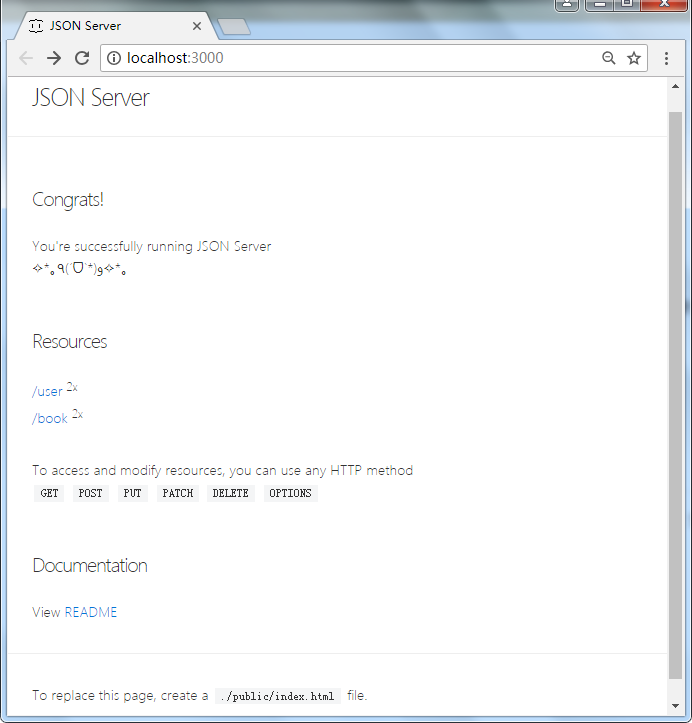

# 背景

本文将从最简单的增删改查操作开始完成一个管理系统。

- 一个管理系统不需要思考太多关于设计方面的问题
- 增删改查可以很简单，也可以很复杂，一个系统可以涵盖从入门到精通的整个过程

增删改查必然需要有数据和接口的支撑，可以使用[json-server](https://github.com/typicode/json-server)，可以帮助我们在30秒内跑起来一个带本地数据库的restapi风格的服务端程序。

# 开发准备

需要有一台安装好node环境（包括npm）的电脑，并且有一个趁手的代码编辑器（或IDE）。Sublime、WebStorm等。

***注意：请安装node 6.3及以上版本！***

使用 **node -v** 查看node版本

# 服务器搭建

我们要做一个管理系统少不了接口和数据。这里我们借助**json-server**这个工具快速搭建后台管理系统的服务端程序：

#### 1、准备相关目录及文件

- 首先执行  **npm i json-server -g ** 把json-server作为全局工具安装
- 新建一个项目目录（后面所有的路径根目录都表示该项目目录）
- 在根目录中执行  **npm init**  初始化一个npm项目（会有一些项目配置需要你输入，一直敲回车就行了）
- 新建  **/server**  目录用于放置服务端的文件
- 新建  **/server/db.json**  文件作为服务端的数据库文件
- 在  **/server/db.json**  文件中写入以下数据：

~~~json
{
  "user": [
    {
      "id": 10000,
      "name": "taohaidi",
      "age": 18,
      "gender": "female"
    },
    {
      "id": 10001,
      "name": "hiditao",
      "age": 18,
      "gender": "female"
    }
  ],
  "book": [
    {
      "id": 10000,
      "name": "JavaScript从入门到精通",
      "price": 9990,
      "owner_id": 10000
    },
    {
      "id": 10001,
      "name": "Java从入门到放弃",
      "price": 1990,
      "owner_id": 10001
    }
  ]
}
~~~

- 最后在  **/server** 目录执行 **json-server db.json -w -p 3000**

  ​

#### 2、访问服务端

- 现在打开浏览器，访问网址 **http://localhost:3000** ，可以看到如下界面：

- 点击Routes下面的user会跳转到 **http://localhost:3000/user**，可以看到我们之前在db.json中写入的user数组：

~~~json
[
  {
    "id": 10000,
    "name": "taohaidi",
    "age": 18,
    "gender": "female"
  },
  {
    "id": 10001,
    "name": "hiditao",
    "age": 18,
    "gender": "female"
  }
]
~~~

- 访问 **http://localhost:3000/book** 同上

我们在db.json文件中写入了标准的JSON格式数据，这个json里有一个user数组和一个book数组，这就告诉json-server，我们的数据库里有一个名为user的”表”和一个名为book的”表”，并且表里的数据为xxx，然后json-server就会启动服务器，并且以每个”表”为单位为我们注册一系列标准的RESTFull形式的API接口（路由） 。

# 客户端搭建

#### 1、创建相关目录及文件

- 在根目录执行  **npm i roadhog -g**  来安装[roadhog](https://github.com/sorrycc/roadhog)，这是一个快速且功能强大的react项目搭建工具
- 新建  **/src**  目录，用于存放客户端代码
- 新建  **/public**  目录，用户存放项目的静态文件（图片等）
- 新建  **/src/index.js**  和  **/public/index.htm**l  两个文件，分别作为应用的入口文件和页面的入口文件
- 执行  **npm i react react-dom react-router -S**，安装基本的react依赖
- 在  **/src/index.js**  中写入以下代码

~~~react
import React from 'react';
import ReactDOM from 'react-dom';

ReactDOM.render(
	
Hello React!
, 
	document.getElementById('app')
);
~~~

- 在  **/public/index.html**  里写入以下代码 

~~~html
<!DOCTYPE html>
<html>
	<head>
		<meta charset="UTF-8">
		<title></title>
	</head>

	<body>
		<!-- 这个div必须和index.js里的render方法里传入的第二个参数保持一致 -->
		

		<!-- roadhog背后会把你的代码从入口文件开始打包成一个index.js文件 -->
		
	</body>
</html>
~~~

#### 2、启动客户端

- 执行  **roadhog server** 来启动我们的react应用 
- 启动成功会自动打开 **http://localhost:8000** ，如果你看到页面里显示了”Hello React!” 

#### 3、简化启动

后续每次我们都需要执行：

- cd server && json-server db.json -w -p 3000
- roadhog server

来开始我们的工作流，我们可以把这两个指令写入package.json的scripts中 

~~~javascript
"scripts": {
  "server": "cd server && json-server db.json -w -p 3000",
  "dev": "roadhog server"
}
~~~

然后，就可以执行：

- **npm run server**
- **npm run dev**

来开始开发工作（两个指令要在两个终端中执行）。

添加react-router-dom库

npm install --save react-router-dom 