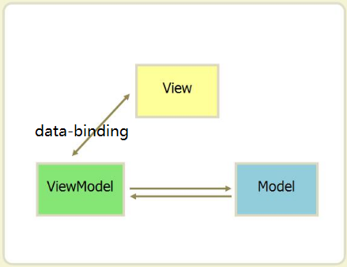
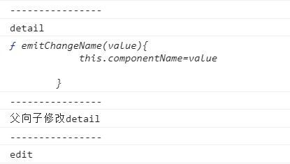
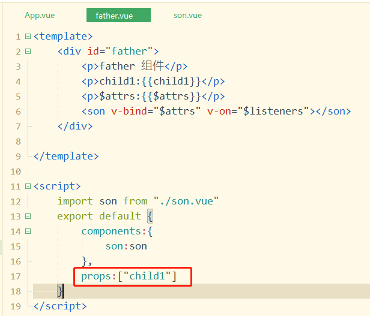
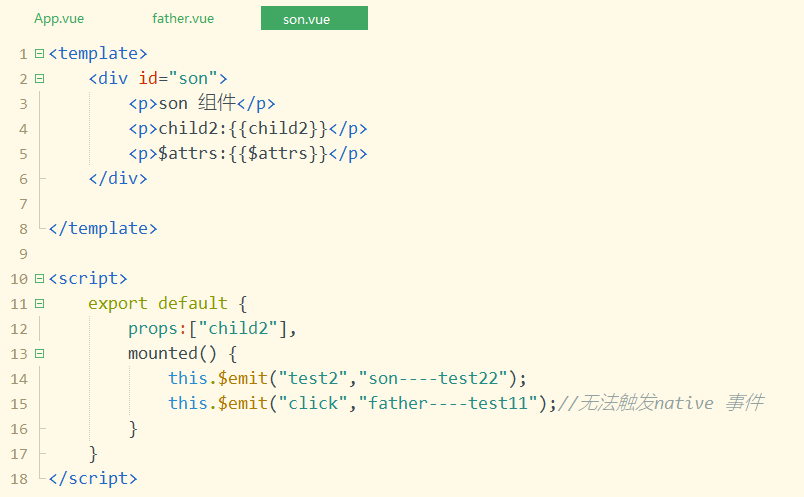

## Vue.js是什么 尤雨溪

- Vue.js（读音 /vjuː/, 类似于 **view**）是目前最火的一个框架，React是最流行的一个框架。

- Vue.js是前端的**主流框架之一**，和Angular.js、React.js并称为前端三大主流框架。

- Vue.js 是一套构建用户界面的 **渐进式框架**。与其他重量级框架不同的是，Vue 采用自底向上增量开发的设计。

  

- Vue 的核心库只关注**视图层**，并且非常容易学习，非常容易与其它库或已有项目整合。另一方面，Vue 完全有能力驱动采用[单文件组件](http://doc.vue-js.com/v2/guide/single-file-components.html)和[Vue生态系统支持的库](http://github.com/vuejs/awesome-vue#libraries--plugins)开发的复杂单页应用。

- Vue.js 的目标是通过尽可能简单的 API （应用程序接口）实现**响应的数据绑定**和**组合的视图组件**。（通俗点，可以将API理解成路由，因为程序中路由比如“/login”，就是一个接口）Vue.js通过简单的API（应用程序编程接口）提供高效的数据绑定和灵活的组件系统

- Vue.js 是属于MVVM模式的框架

面试题：

1、三大主流框架的区别？设计思想和使用场景

答：三大主流框架分别是：vue、react、Angular。

react：跨浏览器兼容；模块化；单向数据流；

vue：双向数据绑定；插件化；指令

Angular：双向数据绑定;指令(自定义指令，自定义指令后可以在项目中多次使用)

（1）vue框架的设计思想：渐进、轻量、数据驱动、组件化、自底向上；（采用的是真实dom）

（2）vue适合做小型项目的开发，react的代码耦合性很低，适合做大型项目的开发；

（3）react框架的设计思想：Virtual DOM（虚拟dom）（dom渲染在渲染中是最昂贵的，尽量减少dom操作,避免“推到重来”，项目越复杂，影响越严重，react框架的js运行效率高）（一个 DOM 元素包含的信息其实只有三个：**标签名，属性，子元素**）

（4）Angular框架的设计思想：MVC、模块化、双向数据绑定、语义化标签、依赖注入等等


2、vue.js 渐进式框架(分层的设计模式)是什么意思？五层设计，即声明式渲染、组件系统、客户端路由、大规模状态管理、构建工具这5层

3、vue.js 的核心是什么？数据驱动和组件化开发


## 前端开发的文件结构

（具体去看code7 的day6的项目1）

//main.js是整个项目的入口文件

// index.html是页面显示文档，只用写一个id为app的div组件即可，就是整个项目vm实例化对象

// store文件夹用于存放vuex文件

// components用于存放小组件

// router用于存放路由

// utils用于存放公共工具

// views用于存放主组件

// app.vue是最大主组件，用于引入views里面的主组件

// 以上几项是整个项目的前端源代码，放在一个src文件夹底下

// 整个前端分为两个部分：源代码（src） + 环境配置(package.json + webpack.config.js)

// 其中package.json用于保存前端需要使用到的所有插件。有了这个，在前端命令行黑窗口只需输入：cnpm i 即可下载所有里面的插件

// webpack.config.js就是进行环境配置（有具体的流程）

// 后端就是一个服务器文件index.js

// 服务器需要用到许多插件或者模块，因此也有一个保存这些模块的文件package.json，其作用与前端的package.json文件相同

// 项目 == 前端+后端

## 为什么要学习流行框架

- 企业为了提高开发效率：在企业中，时间就是效率，效率就是金钱。
- 提高开发效率的发展历程：原生JS(需要兼容浏览器) -> JQuery之类的类库 ->前端模板引擎（频繁操作DOM元素） -> Angular.js / Vue.js（减少不必要的DOM操作，提高渲染效率，双向数据绑定：使用指令，这样程序员只需要关心数据的业务逻辑，不再关心DOM如何渲染）。
- 在Vue中一个核心的概念，就是让用户不再操作DOM元素，解放了用户的双手，让程序员可以更多的时间去关注业务逻辑。
- 增强自己就业时的竞争力


## 框架和库的区别

- **框架**：是一套完整的解决方案，对项目的入侵性较大，项目如果需要更换框架，则需要重新架构整个项目（react对项目的入侵性比vue的大）
- **库（插件）**：提供某一个小功能，对项目的入侵性较小，如果某个库无法完成某些需求，可以很容易的切换到其他库来实现。（比如jQuery和Bootstrap，官网：<https://www.bootcdn.cn/>   有所有前端开发会用到的框架和库）
- 项目要换框架，就相当于给整个项目脱胎换骨；要换库，影响的是项目的一个部分，对整个项目的结构影响不大

> 功能点的封装--
>
> 库：小而巧，可以任意切换
>
> 框架：大而全，有自己的语法，切换框架等于从头开始敲代码
>
> eg：框架应用实例（饿了么外卖网）--https://www.ele.me/home/，
>
> ​         vue实例（elementUI官网）--http://element-cn.eleme.io/2.0/#/zh-CN/


## MVC与MVVM之间的区别

应用交互过程：

- **Client** - 客户端，一般指浏览器，浏览器可以通过 HTTP 协议向服务器请求数据。
- **Server** - 服务端，一般指 Web 服务器(eg:node+express)，可以接收客户端请求，并向客户端发送响应数据。
- **Business** - 业务层， 通过 Web 服务器处理应用程序，如与数据库交互，逻辑运算，调用外部程序等。
- **Data** - 数据层，一般由数据库组成。


客户端：软件--浏览器/app			硬件--手机/pad/笔记本

服务器：软件--nodejs/hbuilder		硬件--安装了服务器软件的硬件就是服务器

（无论是客户端还是服务器，都有软硬件之分）


### （1）MVC

在实际应用开发场景中，开发者常用的一种设计模式是MVC（eg：node（后端）中的MVC设计模式）：

- **M（Model）：数据模型层**。是应用程序中用于**处理应用程序数据逻辑**的部分，模型对象负责在数据库中存取数据。  
- **V（View）：视图层**。是应用程序中**处理数据显示**的部分，视图是依据模型数据创建的。 
- **C（Controller）：控制层**。是应用程序中**处理用户交互**的部分，控制器接受用户的输入并调用模型和视图去完成用户的需求，控制器本身不输出任何东西和做任何处理。它只是接收请求并决定调用哪个模型构件去处理请求，然后再确定用哪个视图来显示返回的数据。


### （2）MVVM

- **M（Model）：模型层**。就是业务逻辑相关的数据对象，通常从数据库映射而来，我们可以说是与数据库对应的model。 
- **V（View）：视图层。**就是展现出来的用户界面。 
- **VM（ViewModel）：视图模型层。**就是与界面(view)对应的Model。因为，数据库结构往往是不能直接跟界面控件一一对应上的，所以，需要再定义一个数据对象专门对应view上的控件。而ViewModel的职责就是把model对象封装成可以显示和接受输入的界面数据对象。 



View与ViewModel之间通过双向绑定（data-binding）建立联系，这样当View（视图层）变化时，会自动更新到ViewModel（视图模型），反之亦然。

**MVC和MVVM的区别**并不是VM完全取代了C，ViewModel存在目的在于抽离Controller中展示的业务逻辑，而不是替代Controller，其它视图操作业务等还是应该放在Controller中实现。


## **MVX框架模式：MVC+MVP+MVVM**

1.MVC：Model(模型)+View(视图)+controller(控制器)，主要是基于分层的目的，让彼此的职责分开。

View通过Controller来和Model联系，Controller是View和Model的协调者，View和Model不直接联系，基本联系都是单向的。

用户User通过控制器Controller来操作模板Model从而达到视图View的变化。

2.MVP：是从MVC模式演变而来的，都是通过Controller/Presenter负责逻辑的处理+Model提供数据+View负责显示。

在MVP中，Presenter完全把View和Model进行了分离，主要的程序逻辑在Presenter里实现。

并且，Presenter和View是没有直接关联的，是通过定义好的接口进行交互，从而使得在变更View的时候可以保持Presenter不变。

MVP模式的框架：Riot.js。

3.MVVM：MVVM是把MVC里的Controller和MVP里的Presenter改成了ViewModel。Model+View+ViewModel。

View的变化会自动更新到Model, Model的变化也会自动同步到View上显示。

这种自动同步是因为ViewModel中的属性实现了Observer，当属性变更时都能触发对应的操作。

## Vue.js有什么不同？

如果我们使用JQuery在指定的DOM中插入一个元素，并给它绑定一个点击事件：

```html
<div id="app"></div>
<script src="./js/jquery.js"></script>
<script>
	var btn = $('<button>Click Me</button>');
	btn.on('click', function() {
		console.log("hello");
	});
	$('#app').append(btn);
</script>
```

这个代码操作的内容并不复杂，不过这样写就会让我们的视图代码与业务逻辑代码紧密耦合在一起，随着功能不断增加，直接操作DOM会使得代码越来越难以维护。

而Vue.js 通过MVVM 的模式拆分为视图和数据两部分，并将其分离，我们只需要关心数据就可以，DOM 操作则由Vue 搞定。

```html
<body>
	<div id="app">
		<button v-if='showBtn' v-on:click='handleClick'>Click Me</button>
	</div>
		
	<script src="https://unpkg.com/vue/dist/vue.js"></script>		
</body>
<script type="text/javascript">
	new Vue({
		el: '#app',
		data: {
			showBtn: true
		},
		methods: {
			handleClick: function() {
				console.log("clicked");
			}
		}
	});
</script>
```


## vue.js的安装

```
$cnpm i --save-dev vue 
```

webpack.config.js:

```
module.exports = {
  // ...
  resolve: {
    alias: {
      'vue$': 'vue/dist/vue.esm.js' // 用 webpack 1 时需用 'vue/dist/vue.common.js'
    }
  }
}
```


## vue.js 认识

### vm对象创建

<https://www.cnblogs.com/Sunzz/p/10785795.html>是关于vm对象的属性解析

html:

```
<div id="app" @click="changName">
			姓名：{{student.name}}
			<br>
			年龄：{{student.age}}
</div>
```

js:

```
var vm= new Vue({
	el:"#app",
	data:{
		student:{
			name:"黄庆",
			age:20
		}
	},
	methods:{
		// data里的和methods里的属性名不能同名
		// student:function(){},
		changName:function(){
			this.student.name="其他名字"
		}
	}
})


```

事件监听属性watch（侦听器属性）

```
 watch: {
            //num发生变化的时候，要执行的代码,num必须是data中的键
            num: function (newval, oldval) {
                console.log("num已经发生变化了！", this.num)
            },
        }
        
```

### vm对象的生命周期函数


## vue.js 模板语法

### 界面插值

{{}}语法，往界面上按照普通文本插入文本：

```
html：
<div id="app">
			{{student.name}}
</div>

js:
var vm= new Vue({
	el:"#app",
	data:{
		student:{
			name:"某同学"
		}
	}
})
```

v-html指令，按照html超文本格式往界面上插入文本：

```
html:
<div id="app">
			<div v-html="student.msg"></div>
</div>

js:
var vm= new Vue({
	el:"#app",
	data:{
		student:{
			name:"某同学",
			msg:"<p style='color:red'>上进、积极、成绩好</p>"
		}
	}
})
```


### 数据绑定

v-bind:     简写为   :

```
html:
<body>
    <a :href="myUrl">点击跳转到华清远见</a>
</body>

js:
var vm= new Vue({
	el:"#app",
	data:{
		myUrl:"http://www.hqyj.com"
	}
})

```


### 事件绑定

v-on:   简写为@

```
html:
<head>
		<meta charset="utf-8">
		<title></title>
		<style type="text/css">
			.actve {
				color: red;
			}
			
			.static {
				color: black;
			}
		</style>
</head>
<body>
    <a href="javascript:void(0)" :class="myclass" @click="changeClass">不跳转的a标签</a>
</body>

js:
var vm= new Vue({
	el:"#app",
	data:{
		myclass:"static"
	},
	methods:{
		changeClass(){
			this.myclass="actve"
		}
	}
})


```


###条件渲染

v-if /v-else  或者  v-show

```
html：
<div v-if="show" @click="changShow">{{form}}</div>
<div v-else>{{reg}}</div>

js:
var vm= new Vue({
	el:"#app",
	data:{
		show:true,
		form:"登陆表单",
		reg:"注册表单"
	},
	methods:{
		changShow(){
			this.show=false
		}
	}
})


```

注：


			visibility: hidden; 不脱离文档流的
			display:none        脱离文档流
			v-if                删除节点
			v-show               ==display:none


### 循环渲染

v-for /key

```
html:
<div id="app">
			<!-- 循环渲染 v-for ,记得加key 的绑定 -->
			<ul>
				<li v-for="(item,index) in students" :key="index">姓名：{{item.name}}，年龄:{{item.age}}，性别：
				
				<span v-if="item.gender==0">男</span>
				<span v-else>女</span>
				</li>
			</ul>
</div>

js:
var vm= new Vue({
	el:"#app",
	data:{
		students:[{
			name:"同学1",
			gender:0,
			age:10
		},
		{
			name:"同学2",
			gender:1,
			age:12
		},
		{
			name:"同学3",
			gender:0,
			age:21
		},
		{
			name:"同学4",
			gender:1,
			age:14
		}]
	}
})
```


## vue.js 属性

### 计算属性

```
html:
<div id="app">
			{{name}}
			<br>
			
			<!-- 计算属性会有缓存，防止页面发生大量重复计算，提升js 运行效率 -->
			年龄：{{age}}
			<!-- methods 方法没有缓存，界面任何数据发生改变，方法都会被重新调用一遍 -->
			年龄:{{showAge()}}
			
			<button type="button" @click="changeBirth">修改名字</button>
</div>

js:
var vm=new Vue({
	el:"#app",
	data:{
		student:{
			name:"同学姓名",
			// age:19,
			birth:"2000-10-01"
		}
	},
	methods:{
		changeBirth:function(){
			this.student.name="另外一个同学的名字"
		},
		// ,
		// showAge:function(){
		// 	console.log("计算一次")
		// 	return (new Date()).getFullYear()-(new Date(this.student.birth)).getFullYear()
		// }
	},
	computed:{
		name:function(){
			return this.student.name.split("").reverse().join()
		},
		
		age:function(){
			console.log("计算一次")
			return (new Date()).getFullYear()-(new Date(this.student.birth)).getFullYear()
		}
	}
})
```

注：面试题，上述笔记里 计算属性与methods 方法之间的区别。


### 双向绑定与侦听器属性

```
html:
<div id="app">
			<!-- v-model 实现数据的双向绑定 -->
			<!-- v-model 只能用在表单类元素上边：input/textarera/select -->
			搜索：<input type="text" v-model="keyW" />
			
			<br>
			<p v-html="news"></p>
</div>

js:
var vm=new Vue({
	el:"#app",
	data:{
		keyW:"",
		info:"习近平主席对尼泊尔展开了一次历史性访问，最重要的成果是把10年前建立的“中尼世代友好的全面合作伙伴关系”提升为“中尼面向发展与繁荣的世代友好的战略合作伙伴关系”。10月13日，习近平在会见尼泊尔总理奥利时，讲到了这一新关系的16字原则：平等相待、和睦相处、世代友好、全面合作。“合作”成为习近平此访最重要的关键词和最大的亮点。",
		news:""
	},
	created() {
		this.news=this.info//为news 初始化数据
	},
	// 侦听器属性，比计算属性计算效率消耗大
	watch:{
	//keyW发生改变时，触发下面的函数
		keyW:function(){
			console.log(123)
			this.news=this.info.replace(new RegExp(this.keyW,"igm"),`<span style="color:red">${this.keyW}</span>`)
		}
	}
})
```


## 模板语法综合项目

###axios 初步使用

前后端分离项目，前端安装axios

```
$cnpm i --save axios
```

axios数据请求方法：<http://www.axios-js.com/docs/>

import axios from "axios";

```
axios.get('/user', {
    params: {
      ID: 12345
    }
  })
  .then(function (response) {
    console.log(response);
  })
  .catch(function (error) {
    console.log(error);
  })
  
  axios.post("http://localhost:8888/userLogin",{
				username:this.username,
				password:this.passW
			}).then(data=>{
				
				if(data.data.status==0){
					this.mainPage=true
				}else{
					alert(data.data.msg)
				}
				
				
			}).catch(err=>console.log(err))
```


### 过滤器属性

```
html:
<!-- 过滤器属性只能用在v-bind 和 {{}}里 -->
<!-- <td :title="item.name|myemployee">{{item.name|myemployee}}</td> -->

<td v-html="$options.filters.myemployee(item.name,keyW)"></td>

js:
var vm=new Vue({
	el:"#app",
	data:{
		employee:[],
		keyW:""
	},
	filters:{
		myemployee:function(value,keyW){
			if(keyW){
				return value.replace(new RegExp(keyW,"igm"),`<span style="color:red">${keyW}</span>`)
			}
			return value;
		}
	}
}
```


##vue.js 组件

###组件（名称+属性+内容）

注：

1、全局组件，名称不能跟html5 标签重名
2、注册全局组件必须得在创建vm 实例之前
3、全局组件在 vm 实例上都能使用

4、组件的模板效果template 只能是整体为一个元素

```html
html:
		<div id="app">
			<my-list>
				这是第一个列表项
				<span slot="secon">这是第二个列表项</span>
				<span slot="third">这是第三个列表项</span>
				
			</my-list>
			
			<!-- props 实现父向子传值 -->
			<my-button type="warn">点击抽奖！</my-button>
		</div>

		<div id="another">
			<!-- my-list 是一个全局组件，所以，所有vm 挂载的实例上都能使用该标签 -->
			<my-list></my-list>
		</div>

js:
import Vue from "vue";
import axios from "axios";

Vue.component("my-list",{
	template:`<div >
				<ul>
					<li><slot>列表1</slot></li>
					<li><slot name="secon">列表2</slot></li>
					<li><slot name="third">列表3<slot></li>
				</ul>
				<div>模板效果</div>
			</div>
			
			`
})

Vue.component("my-button",{
	// 插槽<slot>
	template:`
		<button type="button" :class="type">
			<slot>自定义按钮</slot>
		</button>
	`,
	props:["type"]
})

var vm=new Vue({
	el:"#app"
})

var newVm=new Vue({
	el:"#another"
})
```


### 全局组件与局部组件

局部组件在父实例的compents 属性里定义/注册,局部组件只能用在自己的父实例里

全局组件在构造函数Vue.compent 方法里定义/注册，全局组件可以用在任意一个vm 实例里

```
html:
		<div id="app" >
			<top-menu></top-menu>
		</div>

		<div id="myapp">
			<!-- top-menu 是在#app -->
			<top-menu></top-menu>
		</div>
js:
//定义局部组件件的语法与定义全局组件对象的语法完全一致
//组件"top-menu"对应的对象topmenu
var topmenu={
			template: `<ul>
				<li>首页</li>
				<li>新闻列表</li>
				<li >关于我们{{msg}}</li>
			</ul>`,
			data:function(){
				return {
					msg:"今天同学人数比较少"
				}
			}
}

var vm = new Vue({
	el: "#app",
	components: {
		"top-menu": topmenu
	}
})

var newVm = new Vue({
	el: "#myapp"
})
```


###完整组件及其作用域

组件定义里除了template/data/props 与vm 实例之间有语法区别之外,其他的methods/computed/watch/声明周期函数/filters……这些语法都相同。

```html
html:	
		<div id="app" @click="changeHello">	
			<!-- words属性实现父向子传值 -->
			<my-div :words="hello"></my-div>
			<my-div></my-div>
		</div>
		
js:
	Vue.component("my-div",{
	template:`
		<div>
			<h4>{{words}}</h4>
			<p @click="changeN">{{n}}</p>
		</div>
	`,
	// 组件的data 设计成function的用义:组件可以多次使用,每使用一次,函数被调用一次则创建出不同的数据对象,实现同名组件的数据可以相互独立
	data:function(){
		return {
			// hello:"自定义组件"
			n:1
		}
	},
	props:["words"],
	methods:{
		changeN:function(){
			this.n++
		}
	},
	created() {
		console.log(this)
	}
})

var vm=new Vue({
	el:"#app",
	data:{
		hello:"自定义组件"
	},
	methods:{
		changeHello:function(){
			console.log(123)
			this.hello="父组件已经改过的数据"
		}
	}
})	
```

注：面试题，上述组件的data 设计成function的用义。


###父向子传值props

通过在子组件上定义props ，再到子组件使用时去绑定接收父组件的值：

```
html:
		<div id="app" >
			<my-list v-for="item in questions" :q="item" :key="item.id"></my-list>
		</div>

js:
Vue.component("my-list",{
	template:`
		<ol>
			<li>{{q.title}}</li>
			<li>{{q.answer}}</li>
			<li>{{q.addtime}}</li>
		</ol>
	`,
	props:["q"]
	
})

var vm=new Vue({
	el:"#app",
	data:{
		questions:[]
	},
	created(){
		axios.get('http://localhost:8000/getQuestions')
		  .then( (response)=> {
		    // handle success
		    console.log(response.data);
			this.questions=response.data
		  })
		  .catch(function (error) {
		    // handle error
		    console.log(error);
		  })
		  .then(function () {
		    // always executed
		  });
	}
})
```


### 组件传值-中央控制总线bus

1、创建Bus.js

```javascript
import Vue from 'vue'
 
const Bus = new Vue();

export default Bus;
```

2、在兄弟组件中1 和3 中引入bus

```javascript
//组件1
import Bus from '@/Bus'
...
mounted () {
        Bus.$on('changedFormObject',(name,val) =>{//处理传过来的值
            this.formVal[name] = val;
        });
    }
 
//组件3
<input type="text" class="form-input" v-model="inputValue" >
　　import Bus from '@/Bus'
    export default {
        name: "InputItem",
        props: {
            label_name: String,
            input_val: String,
            input_name: String
        },
        data () {
            return {
                inputValue: this.input_val//不要直接修改父组件传过来的参数,参数是单向传递的，只能由父组件传到子组件。先将参数赋值给子组件的data，然后再做修改
            }          
        },
        watch: {
            inputValue () {
                console.log(this.inputValue);
                Bus.$emit('changedFormObject',this.input_name,this.inputValue);//提交改变后的值
            }
        }
    }
```


###子向父传值$emit

子组件的data 数据需要交给父组件使用，通过在子组件上定义自定义事件，在子组件中通过$emit 来触发事件；子组件的事件被触发并传参，事件处理函数可以接收到子组件的数据；事件绑定的事件处理函数在父节点上，故可在事件处理函数中用到子组件的数据值来修改父节点的数据。

```
html:
		<div id="app" >
			<!-- 子向父传值，自定义事件，this.$emit()去触发 -->
			<my-search @myevent="handleEvent"></my-search>
			
			<ul>
				<li v-for="item in goods" :key="item.id">{{item.kw}}</li>
			</ul>
		</div>
		
js:
Vue.component("my-search",{
	template:`
		<div>
			<input type="text" v-model="keyW">
		</div>
	`,
	data:function(){
		return {
			keyW:""
		}
	},
	watch:{
		keyW:function(){
			this.$emit("myevent",this.keyW)
		}
	}
})


var vm=new Vue({
	el:"#app",
	data:{
		goods:[]
	},
	methods:{
		handleEvent:function(value){
			this.getGoods(value)
			
		},
		getGoods(kw){
			axios.get('http://localhost:8000/getGoods',{
				params:{
					kw:kw
				}
			})
			  .then( (response)=> {
			    this.goods=response.data
			  })
			  .catch(function (error) {
			    // handle error
			    console.log(error);
			  })
		}
	},
	created(){
		this.getGoods()
	}
})
```


### 父子组件传值补充 

$parent/$root、$children/$refs

在父组件app.vue 中引入两个子组件(“child-detail”与“child-edit”)


a, 在子组件中，通过this.$parent就可以访问上一级父组件了，包括访问父组件的data里面的数据，调用它的函数；this.$root 则是访问最顶层父组件的数据和方法：


b, 在父组件app.vue 中，通过this.$refs.first就可以访问子组件了，包括访问子组件的data里面的数据，调用它的函数：


​	打印结果：




### 多层组件传值 $listeners/$attrs

​        在不用状态管理vuex的时候，如何让GrandFather与Son通信，我们可以用可以emit一层一层的传递会显得冗余。 vue2.4之后，提出attr、$listeners ,可以实现跨级组件通信。attributes

​        $listeners官网解说 ：事件传递
​        $attrs官网解说：属性传递

​        简言之，在GrandFather中给Father传事件与属性，在Father组件中使用v-bind="listeners"，在Son组件中，就可以通过this.emit('事件')来触发从GrandFather中传入的事件。


**$attrs：包含了父作用域中不作为 prop 被识别 (且获取) 的特性绑定 (class 和 style 除外)。**
**$listener：包含了父作用域中的 (不含 .native 修饰器的) v-on 事件监听器。**

GrandFather 组件


Father 组件



Son 组件：



最终界面呈现结果：


### 动态组件

component 组件可以根据其is 属性的值，渲染出不同的组件

```
html:
	<div id="app" @click="changeCom">

			<top-menu></top-menu>
			
			<!-- 动态组件 -->
			<component :is="TabC"></component>
	</div>

js:
//全局组件的定义和注册
Vue.component("top-menu",{
	template:`
		<ul>
			<li>首页</li>
			<li>列表页面</li>
			<li>关于我们</li>
		</ul>
	`
	
})
//局部组件的定义
var mainPage={
	template:`
		<div>这是首页内容</div>
	`
}

var listPage={
	template:`
		<div>这是列表页面内容</div>
	`
}

var aboutPage={
	template:`
		<div>这是关于我们的内容</div>
	`
}

var vm = new Vue({
	el: "#app",
	components:{//局部组件的注册
		"main-page":mainPage,
		"list-page":listPage,
		"about-page":aboutPage
	},
	data:{
		TabC:"main-page"
	},
	methods:{
		changeCom:function(e){
			console.log(e.target)
			switch(e.target.innerHTML){
				case "首页": this.TabC="main-page";break;
				case "列表页面": this.TabC="list-page";break;
				case "关于我们": this.TabC="about-page";break;
			}
		}
	}
})
```


### 缓存组件

保证组件"活着"，数据不被重新加载。原理：在组件created 时将需要缓存的vnode 节点放到cache 中，在render 的时候根据name 再进行取出。

```html
<keep-alive>
 <component>
 	<!-- 该组件将被缓存！ -->
 </component>
</keep-alive>
```

提供有include 和exclude 属性（字符串或正则表达式）。

```html
<keep-alive include="a,b">
 <!-- 将缓存name为a或者b的组件，结合动态组件使用 -->
 <component :is="view"></component>
</keep-alive>
 
<!-- 使用正则表达式，需使用v-bind -->
<keep-alive :include="/a|b/">
 <component :is="view"></component>
</keep-alive>
```


### 组件化开发思想训练

使用组件写法将页面构建起来：

.png)

```
html:
		<div id="app" >
			<top-menu></top-menu>
			<left-content></left-content>
			<right-content></right-content>
		</div>
		
js:
import Vue from "vue";
import axios from "axios";

import topMenu from "./topMenu.js";
import leftContent from "./leftContent.js";
import rightContent from "./rightContent.js";
var vm = new Vue({
	el: "#app",
	components:{
		"top-menu":topMenu,
		"left-content":leftContent,
		"right-content":rightContent
	}
})
```

topMenu.js:

```
var topMenu={
	template:`
		<div class="topmenu"></div>
	`
}

export default topMenu;
```

leftContent.js:

```
var mySquare={
	template:`
		<div :style="{width:myWodth,height:myheight,backgroundColor:mycolor,marginBottom:Bottom}"></div>
	`,
	data:function(){
		return {
			myWodth:"100%",
			myheight:"50px",
			mycolor:"red",
			Bottom:"10px"
		}
	}
}

var leftContent={
	template:`
		<div class="leftcontent">
			<my-square></my-square>
			<my-square></my-square>
		</div>
	`,
	components:{
		"my-square":mySquare
	}
}

export default leftContent;
```

rightContent.js:

```
var rightContent={
	template:`
		<div class="rightcontent">
			
		</div>
	`
}

export default rightContent
```


## vue-router 路由

路由总结：

（1）router-link组件，用其to属性实现页面跳转；（比如：<router-link to="/list">列表</router-link>）

（2）router-view组件实现对页面的渲染；

（3）($router和$route的区别：

$router：用于一些方法的处理，处置整个router对象的

$route：用于变量保存)

（4）路由传参：（2种方式）

1. /page -------->/page?id=1&deptid=2  --->$route.query.id（？传参方式，用$route.query去获取参数）（对应到相应的组件----->传参------->获取传参）
2. /page/:id ------>/page/1 ----->$route.params.id(对应到相应的组件----->传参------->获取传参)（第一种方式传参只用/page就可以找到相应的组件，第二种方式需要/page/:id 才能找到对应的组件，即得加上传参名，这是第二种方式的传参规则，否则会造成页面渲染不出来）

（5）导航式路由：

（比如要写个按钮，点击之后跳转到某个页面（路由），就需要用到导航式路由）

$router.push({path:"/page",query:{id:1}}) ---->第一种传参方式时

$router.push({path:"/page/1"})  -------->第二种传参方式时

（6）导航守卫：

（可以通过控制网址的路由后面的参数来控制只能访问那些网页，以此来达到控制不同用户的权限。比如同一教务系统，学生只能查到自身的成绩，老师能查到所有学生的成绩。这里边就用到了导航守卫）（全局导航守卫是对很多个路由进行操作，若只想对其中某一个路由进行操作，就用路由独享导航守卫）

1.全局导航守卫：任何一个路由发生变化，守卫都会被调用起来（全局守卫有：beforeEach(fn)、beforeResolve(fn)、afterEach(fn) 这三个。

它们共同的特点是：接收一个回调函数fn，接收有三个参数分别是 to、from、next.   其中to：点击跳转想要去的任何参数信息、路由信息；from：从哪个路由跳过来；

next：如果该路由有参数，一定要给一个next()，否则页面无法实现跳转等操作）

2.路由独享导航守卫：beforeEnter(to,from,next){}   （在路由规则routes里面写）

3.组件独享的导航守卫：beforeRouteEnter(to,from,next)、beforeRouteLeave、beforeRouteUpdate(to,from,next)（当将路由独享导航守卫放到一个组件里面的时候，就会用到组件导航守卫）（beforeRouteEnter(to,from,next)：即进去之前要触发一个守卫，取不到vm对象，不能使用this）

（7）路由模式：

1.hash模式：路由进行跳转的时候是以哈希码的形式进行跳转的，页面组件资源是存在于根路由（“/”）上面的；

2.history模式：路由是以route形式进行跳转的，路由进行跳转页面组件资源都是保存在自身独享的路由上的

### 安装使用

```
$ cnpm i --save vue-router
```

页面使用router-link 组件和router-view 组件：

```
html:
		<div id="app" >
			<h1>Hello App!</h1>
			  <p>
			    <!-- 使用 router-link 组件来导航. -->
			    <!-- 通过传入 `to` 属性指定链接. -->
			    <!-- <router-link> 默认会被渲染成一个 `<a>` 标签 -->
			    <router-link to="/">首页</router-link>
				<br>
			    <router-link to="/list">列表页面</router-link>
				<br>
				<router-link to="/about">关于我们</router-link>
				
			  </p>
			  <!-- 路由出口 -->
			  <!-- 路由匹配到的组件将渲染在这里 -->
			  <router-view></router-view>
		</div>
js:
import Vue from "vue";
import axios from "axios";
// 安装cnpm i --save vue-router
import VueRouter from 'vue-router'

Vue.use(VueRouter)

const main = { template: '<div>首页页面内容</div>' }
const list = { template: '<div>列表页面内容</div>' }
const about = { template: '<div>关于我们页面</div>' }

const myroutes = [
  { path: '/', component: main },
  { path: '/list', component: list },
  { path: '/about', component: about }
]

const router = new VueRouter({
  routes:myroutes 
})

//创建vm 时，传递一个路由对象
const app = new Vue({
  router
}).$mount('#app')
```


### 路由传参

两种方式：

1、  在router-link 标签的to 属性路由值里添问号”?参数名=参数值“传参，在js 中使用”$route.query.参数名“接收参数值；

2、  在路由规则里定义路由规则”{path:'/路由/:参数名'}“

​	在router-link 标签的to 属性路由值里添斜杠”/参数值“传参，在js 中使用”$route.params.参数名“接收参数值；


```
html：		
		<div id="app" >
			<h1>Hello App!</h1>
			  <p>
			    <router-link to="/">首页</router-link>
				<br>
			    <router-link to="/list?id=1">新闻部</router-link>
				<br>
				<router-link to="/list?id=2">编辑部</router-link>
				<br>
				<router-link to="/list?id=3">人事部</router-link>
				<br>
				<router-link to="/about/1">关于我们</router-link>
			  </p>
			  <router-view></router-view>
		</div>
部分js:
路由规则--
const myroutes = [
  { path: '/', component: main },
  { path: '/list', component: list },
  { path: '/about/:mydata', component: about }
]
组件定义内，取参用参--
const list = { 
	template: `<div>
		列表页面内容{{$route.query.id}}
	`
}
const about = { template: '<div>关于我们页面{{$route.params.mydata}}</div>' }

```


### 编程式导航

通过js 触发路由切换：

```
router.push({ path: '/list', query: { plan: 'private' }})
```


### 导航守卫

#### 1）全局守卫

全局前置钩子router.beforeEach(fn)，导航被触发----前端鉴权
全局解析钩子router.beforeResolve(fn)，组件初始化
全局后置钩子router.afterEach(fn)，没有next，导航被确认

```
//导航守卫
router.beforeEach((to, from, next) => {
  console.log(to,from);
  next()
})

router.afterEach((to, from) => {
  console.log(to,from)
})

```


#### 2）路由独享的守卫

路由独享的守卫beforeEnter(to,from,next)，路由初始化(组件未初始化)----

a，路由鉴权

b，组件异步加载情景中(插件配置：syntax-dynamic-import)

```javascript
routes:[{
    path:"/test",
    component:()=>import("../components/Test.vue"),
    beforeEnter(to,from,next){
        if(to.path==="/test"){
          alert("请登录");
          next(false); // 禁止跳转
        }else{
          next()
        }
 	}
}]
```


#### 3）组件内部生命周期守卫

beforeRouteLeave 从该组件离开

beforeRouteEnter(to,from,next)，组件被激活，使用不了this，故构造指定该next 可以接收一个回调函数接收当前vm 实例----路由传参获取参数，得到初始化数据

beforeRouteUpdate(to,from,next)，组件重用时被调用----路由传参获取参数，避免增添watch 开销


导航守卫执行顺序：beforeRouteLeave < beforeEach < beforeRouteUpdate < beforeEnter < beforeRouteEnter < beforeResolve < afterEach

出发路由，预备从当前组件离开，判断路由变化，判断组件是否重用，判断新路由初始化，判断组件初始化，路由与组件初始化完毕，路由组件重定向完毕


### 路由模式

详细说明可参考博客：https://www.cnblogs.com/yszblog/p/10255458.html

```
const router = new VueRouter({
	//页面内使用hash ，对应的是location.hash
	mode:"hash",
	// //页面级别的缓存控制，不会立即重请求页面
	// mode: 'history',
	routes:myroutes 
})
```


## vuecli 脚手架项目

代码先跟着群里的课堂录频，去理解练习。

### 脚手架安装(vuecli)

cnpm install -g @vue/cli


### 项目创建

vue create 项目名称

Manuslly  select

（babel。vuex。router。css。web APP）

### 项目启动命令

```
npm run build
npm run serve
注：他们有什么区别呢？
```

### 项目配置

```
vue ui
```

### 单文件组件

局部组件与全局组件

scoped 样式控制


### axios 请求全局引入

全局默认基础URL 全局引入


# UI库的引入

## elementUI使用

cnpm i --save element-ui


## vuex 状态管理工具使用


