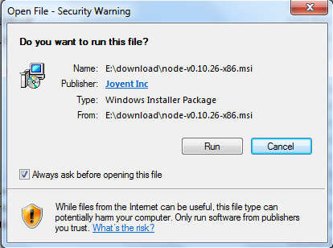
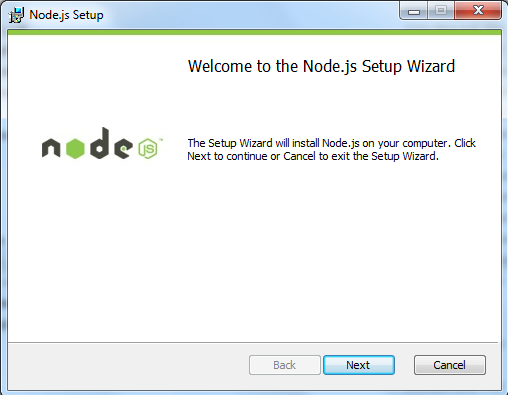

## 课前知识准备

1、单线程和多线程

2、同步和异步（阻塞和非阻塞）

3、BS与CS架构

具体解释：

单线程：一直进行到底，没有分支
多线程：有若干分支，同时进行。
一个服务器可以响应到最大数目的客户端，假如一个服务器可以响应10万个客户端，那么有10万个线程，就是多线程机制，若有20万客户，那么就由2台服务器进行响应；
同步（阻塞）、异步（非阻塞）；
CS架构:客户端服务器模式  BS架构:浏览器服务器模式 两大架构；（H5主要用BS）

重点：同步与异步：

**”同步**“就好比：你去外地上学(人生地不熟)，突然生活费不够了；此时你决定打电话回家，通知家里转生活费过来，可是当你拨出电话时，对方一直处于待接听状态(即：打不通，联系不上)，为了拿到生活费，你就不停的oncall、等待，最终可能不能及时要到生活费，导致你今天要做的事都没有完成，而白白花掉了时间。
“**异步**”就是：在你打完电话发现没人接听时，猜想：对方可能在忙，暂时无法接听电话，所以你发了一条短信(或者语音留言，亦或是其他的方式)通知对方后便忙其他要紧的事了；这时你就不需要持续不断的拨打电话，还可以做其他事情；待一定时间后，对方看到你的留言便回复响应你，当然对方可能转钱也可能不转钱。但是整个一天下来，你还做了很多事情。 或者说你找室友临时借了一笔钱，又开始happy的上学时光了。
**简而言之，言而总之**：同步就是我强依赖你(对方)，我必须等到你的回复，才能做出下一步响应。即我的操作(行程)是顺序执行的，中间少了哪一步都不可以，或者说中间哪一步出错都不可以，类似于编程中程序被解释器顺序执行一样；同时如果我没有收到你的回复，我就一直处于等待、也就是阻塞的状态。 异步则相反，我并不强依赖你，我对你响应的时间也不敏感，无论你返回还是不返回，我都能继续运行；你响应并返回了，我就继续做之前的事情，你没有响应，我就做其他的事情。也就是说我不存在等待对方的概念，我就是非阻塞的。
从上面的例子来看：同步似乎等价于阻塞，异步则等价于非阻塞。其实有些狭义，但不可否认的是，在一定情况下，确实可以这么认为；因为同步一定存在着阻塞状态，而异步一定不存在非阻塞的状态。 但是不是就是说 同步调用 == 阻塞调用呢？然并不是；**阻塞和非阻塞强调的是程序在等待调用结果（消息，返回值）时的状态**.  阻塞调用是指调用结果返回之前，当前线程会被挂起。调用线程只有在得到结果之后才会返回。非阻塞调用指在不能立刻得到结果之前，该调用不会阻塞当前线程。 对于同步调用来说，很多时候当前线程还是激活的状态，只是从逻辑上当前函数没有返回而已，即同步等待时什么都不干，白白占用着资源。**同步和异步强调的是消息通信机制** (synchronous communication/ asynchronous communication)。所谓同步，就是在发出一个"调用"时，在没有得到结果之前，该“调用”就不返回。但是一旦调用返回，就得到返回值了。换句话说，就是由“调用者”主动等待这个“调用”的结果。而异步则是相反，"调用"在发出之后，这个调用就直接返回了，所以没有返回结果。换句话说，当一个异步过程调用发出后，调用者不会立刻得到结果。而是在"调用"发出后，"被调用者"通过状态、通知来通知调用者，或通过回调函数处理这个调用。

# 1.NodeJS介绍

### 1、概述

**Node.js 是一个基于 Chrome V8 引擎的 JavaScript 运行环境**。**是js的一个运行平台。**（nodejs最主要的一个作用就是开启服务器）  发布于2009年5月，由Ryan Dahl开发。

Node.js 不是一个 JavaScript 框架，是一个**让 JavaScript 运行在 *服务端*  的开发平台**，它让 JavaScript 成为与PHP、Python、Perl、Ruby等服务端语言平起平坐的**脚本语言**。 

Node.js 使用了一个**事件驱动、非阻塞式 I/O** 的模型，使其轻量又高效。 

Node.js 使用了**单线程**模型，执行速度快，但**耗内存多**（百万级并发测试，未优化情况下1M的连接，消耗16G的内存） 。

Node.js 的包管理器 npm，是全球最大的开源库生态系统。 


### 2、NodeJS带来的对系统瓶颈的解决方案

####  （1）并发连接

举个例子，想象一个场景，我们在银行排队办理业务，我们看看下面两个模型。

**a. 系统线程模型**

这种模型的问题显而易见，服务端只有一个线程，并发请求（用户）到达只能处理一个，其余的要先等待，这就是阻塞，正在享受服务的请求阻塞后面的请求了。

（此时，谁在享受服务，当前时间片就是谁的。

时间片：时间片,简单来说就是CPU分配给各个程序的时间,使各个程序从表面上看是同时进行的,而不会造成CPU资源浪费。
时间片轮转调度中唯一有趣的一点是时间片的长度。从一个进程切换到另一个进程是需要一定时间的--保存和装入寄存器值及内存映像，更新各种表格和队列 等。
假如进程切换(process switch) - 有时称为上下文切换(context switch)，需要5毫秒，再假设时间片设为20毫秒，则在做完20毫秒有用的工作之后，CPU将花费5毫秒来进行进程切换。CPU时间的20%被浪费 在了管理开销上。）

**b. 多线程、线程池模型**

这个模型已经比上一个有所进步，它调节服务端线程的数量来提高对并发请求的接收和响应，但并发量高的时候，请求仍然需要等待，它有个更严重的问题。到代码层面上来讲，我们看看客户端请求与服务端通讯的过程：

服务端与客户端每建立一个连接，都要为这个连接分配一套配套的资源，主要体现为系统内存资源，以PHP为例，维护一个连接可能需要20M的内存。这就是为什么一般并发量一大，就需要多开服务器。

那么NodeJS是怎么解决这个问题的呢？我们来看另外一个模型，想象一下我们在快餐店点餐吃饭的场景。

**c. 异步、事件驱动模型**

我们同样是要发起请求，等待服务器端响应；但是与银行例子不同的是，这次我们点完餐后拿到了一个号码，拿到号码，我们往往会在位置上等待，而在我们后面的请求会继续得到处理，同样是拿了一个号码然后到一旁等待，接待员能一直进行处理。

等到饭菜做好了，会喊号码，我们拿到了自己的饭菜，进行后续的处理（吃饭）。这个**喊号码的动作在NodeJS中叫做回调**（Callback），能在事件（烧菜，I/O）处理完成后继续执行后面的逻辑（吃饭），这体现了NodeJS的显著特点，**异步机制、事件驱动整个过程没有阻塞新用户的连接**（点餐），也不需要维护已经点餐的用户与厨师的连接。

基于这样的机制，理论上陆续有用户请求连接，NodeJS都可以进行响应，因此NodeJS能支持比Java、PHP程序更高的并发量，虽然维护事件队列（遵循 '先进先出'）也需要成本，再由于NodeJS是单线程，事件队列越长，得到响应的时间就越长，并发量上去还是会力不从心。

**总结一下NodeJS是怎么解决并发连接这个问题的：**更改连接到服务器的方式，每个连接发射（emit）一个在NodeJS引擎进程中运行的事件（Event），放进事件队列当中，而不是为每个连接生成一个新的OS线程（并为其分配一些配套内存）。（nodejs解决并发连接问题的关键：异步机制、事件驱动。其中：异步机制：实现非阻塞i/o;  事件驱动：使用回调）


#### （2）I/O阻塞

NodeJS解决的另外一个问题是I/O阻塞，看看这样的业务场景：需要从多个数据源拉取数据，然后进行处理。

**a. 串行获取数据**，这是我们一般的解决方案，以PHP为例：

假如获取profile和timeline操作各需要1S，那么串行获取就需要2S。

**b. NodeJS非阻塞I/O**，发射/监听事件来控制执行过程：

NodeJS遇到I/O事件会创建一个线程去执行，然后主线程会继续往下执行的，因此，拿profile的动作触发一个I/O事件，马上就会执行拿timeline的动作，两个动作并行执行，假如各需要1S，那么总的时间也就是1S。它们的I/O操作执行完成后，发射一个事件，profile和timeline，事件代理接收后继续往下执行后面的逻辑，这就是NodeJS非阻塞I/O的特点。

**总结一下：Java、PHP也有办法实现并行请求（子线程），但NodeJS通过回调函数（Callback）和异步机制会做得很自然。**


### 3、NodeJS的优缺点

**（1）优点：**

- 高并发（最重要的优点）；

- 适合I/O密集型应用。

  

**（2）缺点：**

- 不适合CPU密集型应用；CPU密集型应用给Node带来的挑战主要是：由于JavaScript单线程的原因，如果有长时间运行的计算（比如大循环），将会导致CPU时间片不能释放，使得后续I/O无法发起；

​              解决方案：分解大型运算任务为多个小任务，使得运算能够适时释放，不阻塞I/O调用的发起。

- 只支持单核CPU，不能充分利用CPU；

- 可靠性低，一旦代码某个环节崩溃，整个系统都崩溃。原因：单进程，单线程。

​              解决方案：（1）Nnigx反向代理，负载均衡，开多个进程，绑定多个端口；

​                               （2）开多个进程监听同一个端口，使用cluster模块；

- 开源组件库质量参差不齐，更新快，向下不兼容；

- Debug不方便，错误没有stack trace。


### 4、NodeJS使用场景

**（1）RESTful API**

​	这是NodeJS最理想的应用场景，可以处理数万条连接，本身没有太多的逻辑，只需要请求API，组织数据进行返回即可。它本质上只是从某个数据库中查找一些值并将它们组成一个响应。由于响应是少量文本，入站请求也是少量的文本，因此流量不高，一台机器甚至也可以处理最繁忙的公司的API需求。

**（2）统一Web应用的UI层**

​        UI（User Interface）：用户界面

​	目前MVC的架构，在某种意义上来说，Web开发有两个UI层，一个是在浏览器里面我们最终看到的，另一个在server端，负责生成和拼接页面。

​	不讨论这种架构是好是坏，但是有另外一种实践，面向服务的架构，更好的做前后端的依赖分离。如果所有的关键业务逻辑都封装成REST调用，就意味着在上层只需要考虑如何用这些REST接口构建具体的应用。那些后端程序员们根本不操心具体数据是如何从一个页面传递到另一个页面的，他们也不用管用户数据更新是通过Ajax异步获取的还是通过刷新页面。

**（3）大量Ajax请求的应用**

​	例如个性化应用，每个用户看到的页面都不一样，缓存失效，需要在页面加载的时候发起Ajax请求，NodeJS能响应大量的并发请求。　　

**总而言之，NodeJS适合运用在高并发、I/O密集、少量业务逻辑的场景。**

**需知**：MVC（Model  View  Controller），即模型-视图-控制器。也是模型层、视图层、控制层（写服务器，连接M和V层，控制他们的联系）；

​          输入一个网址，实际请求的是相应的服务器，由这个服务器将数据返回，比如网页的代码与数据库中的数据，使得用户可以看到网页；（所以进一步理解我们写的网页与服务器之间的联系与操作）；

​         nodejs:高并发、异步机制、事件驱动型、单线程；

​         nodejs不完全接受es6，所以用Nodejs写服务器时，因此导入不用import，而用require来代替，导出还是用exports。


port端口号就是用于区别不同的应用程序（不是进程，是应用程序，上图写错了）


访问服务器：
本机地址（127.0.0.1）：port   ；
localhost：port     .   这两种访问的方式只限于本机进行访问（localhost=本机=127.0.0.1）
若想其他主机访问本机，则采用：具体ip地址如192.1668.7.54：port
访问百度之所以不用写ip地址和port，是因为它申请了域名，www.baidu.com直接默认进入百度网页

端口取用范围：0~65536。由于1000以下的都是一些特殊的使用端口，所以一般从1024~65536取（不同的应用程序，端口号一定不同）

写一个简单的服务器来响应我们所写的客户端，了解我们写的客户端与服务器的交互过程（上面那张图片内容就是一个简单的服务器） nodemon app.js：改动app.js之后可以自动运行文件，运行之后，需要找一个客户端来访问，就打开浏览器访问即可得到运行结果(nodemon一般用于启动服务器即有http模块,一般情况下执行目录文件用node即可)

link：连接（所以html中用link标签来引入css文件，也相当于连接相应的css文件）


### 5、Web服务器原理

Web服务器一般指网站服务器，是指驻留于因特网上某种类型计算机的程序，Web服务器的基本功能就是提供Web信息浏览服务。它只需支持HTTP协议、HTML文档格式及URL，与客户端的网络浏览器配合。 大多数 web 服务器都支持服务端的脚本语言（php、python、ruby）等，并通过脚本语言从数据库获取数据，将结果返回给客户端浏览器。


**Client - 客户端**，一般指浏览器，浏览器可以通过 HTTP 协议向服务器请求数据。

**Server - 服务端**，一般指 Web 服务器，可以接收客户端请求，并向客户端发送响应数据。

**Business - 业务层**， 通过 Web 服务器处理应用程序，如与数据库交互，逻辑运算，调用外部程序等。

**Data - 数据层**，一般由数据库组成。


# 2.NodeJS安装

### 1、下载

安装包地址 https://nodejs.org/en/download/      

中文地址：http://nodejs.cn/


### 2、安装

步骤 1 : 双击下载后的安装包，如下所示： 



步骤 2 : 点击以上的Run(运行)，将出现如下界面： 



步骤 3 : 勾选接受协议选项，点击 next（下一步） 按钮 : 


步骤 4 : Node.js默认安装目录为 "C:\Program Files\nodejs\" , 你可以修改目录，并点击 next（下一步）： 


步骤 5 : 点击树形图标来选择你需要的安装模式 , 然后点击下一步 next（下一步） :


步骤 6 :点击 Install（安装） 开始安装Node.js。你也可以点击 Back（返回）来修改先前的配置。 然后并点击 next（下一步）： 


安装过程： 


点击 Finish（完成）按钮退出安装向导。 


### 3、检测PATH环境变量是否配置了Node.js 

（1）点击开始 --> 运行 --> 输入"cmd" 打开windows终端

（2）输入命令 **path**

~~~
PATH=C:\ProgramData\Oracle\Java\javapath;C:\Windows\system32;C:\Windows;C:\Windo
ws\System32\Wbem;C:\Windows\System32\WindowsPowerShell\v1.0\;
F:\Program Files\SQL\SQLServer\bin;
F:\Program Files\nodejs\;
F:\Program Files\Git\cmd;
C:\Users\Administrator\AppData\Local\Android\sdk\platform-tools;
C:\Users\Administrator\AppData\Local\Android\sdk\tools;
C:\Users\Administrator\AppData\Roaming\npm;
C:\Program Files\Java\jdk1.8.0_121/bin;
F:\Program Files\Microsoft VS Code\bin
~~~

（3）输入命令 **node  -v**


# 3.NodeJS创建第一个应用

创建一个**hello.js**文件，并在此文件中完成以下操作。

### 1、引入require模块

我们使用 **require** 指令来载入 http 模块，并将实例化的 HTTP 赋值给变量 http 

~~~javascript
var http = require("http");
~~~


### 2、创建服务器

使用 http.createServer() 方法创建服务器，并使用 listen 方法绑定9999 端口。 函数通过 request, response 参数来接收和响应数据。 

~~~javascript
http.createServer(function (request, response) {
    // 发送 HTTP 头部 
    // HTTP 状态值: 200 : OK
    // 内容类型: text/html
    response.writeHead(200, {'Content-Type': 'text/html; charset=utf-8'});

    // 发送响应数据 "Hello world"
    response.end('Hello world\n');
}).listen(9999);

// 终端打印如下信息
console.log('Server running at http://127.0.0.1:9999/');
~~~

打开终端并进入hello.js文件所在的目录，然后输入命令： **node  hello.js**


### 3、打开浏览器访问服务器

在打开的浏览器中输入以下网址访问服务器,会看到如下网页：

http://localhost:9999

http://127.0.0.1:9999


# 4.npm使用介绍

NPM是随同NodeJS一起安装的包管理工具，能解决NodeJS代码部署上的很多问题，常见的使用场景有以下几种：

- 允许用户从NPM服务器下载别人编写的第三方包到本地使用。
- 允许用户从NPM服务器下载并安装别人编写的命令行程序到本地使用。
- 允许用户将自己编写的包或命令行程序上传到NPM服务器供别人使用。

补充：npm：用于下载模块和包的；
-g表示全局安装。全局安装的东西，安装在全局目录下，哪里都可以使用


### 1、查看版本

由于新版的nodejs已经集成了npm，所以之前npm也一并安装好了。同样可以通过输入 **"npm -v"** 来测试是否成功安装。命令如下，出现版本提示表示安装成功: 


### 2、升级npm

如果你安装的是旧版本的 npm，可以很容易得通过 npm 命令来升级，命令如下： 

~~~
npm install npm -g
~~~

使用淘宝镜像的命令： 

~~~
cnpm install npm -g
~~~


### 3、安装模块

npm 安装 Node.js 模块语法格式如下： 

~~~
npm install <Module Name>
~~~

安装好的模块就被放在了工程目录下的 **node_modules** 目录中，因此在代码中只需要通过 **require('express')** 的方式就好，无需指定第三方包路径。 

示例：

~~~javascript
npm install express   //安装express模块

var express = required("express"); //在项目中引入express模块
~~~


### 4、全局安装和本地安装

npm 的包安装分为本地安装（local）、全局安装（global）两种，从敲的命令行来看，差别只是有没有-g而已，比如 ：

~~~shell
npm install express          # 本地安装
npm install express -g   	 # 全局安装
~~~

##### （1）本地安装

- 将安装包放在 ./node_modules 下（运行 npm 命令时所在的目录），如果没有 node_modules 目录，会在当前执行 npm 命令的目录下生成 node_modules 目录。
- 可以通过 require() 来引入本地安装的包。

##### （2）全局安装

- 将安装包放在 /usr/local 下或者你 node 的安装目录。
- 可以直接在命令行里使用。
- C:\Users\Administrator\AppData\Roaming\npm\node_modules


##### （3）查看安装信息

~~~shell
npm list  		#查看本地安装信息
npm list -g		#查看全局安装信息
~~~


### 5、卸载模块

我们可以使用以下命令来卸载 Node.js 模块。 

~~~shell
npm uninstall express
~~~

卸载后，你可以到 /node_modules/ 目录下查看包是否还存在，或者使用以下命令查看： 

~~~shell
npm ls
~~~


### 6、使用淘宝npm镜像

大家都知道国内直接使用 npm 的官方镜像是非常慢的，这里推荐使用淘宝 NPM 镜像。

淘宝 NPM 镜像是一个完整 npmjs.org 镜像，你可以用此代替官方版本(只读)，同步频率目前为 10分钟 一次以保证尽量与官方服务同步。

你可以使用淘宝定制的 cnpm (gzip 压缩支持) 命令行工具代替默认的 npm:

~~~shell
npm install -g cnpm --registry=https://registry.npm.taobao.org
npm config set registry https://registry.npm.taobao.org
~~~

这样就可以使用 cnpm 命令来安装模块了： 

~~~shell
cnpm install <Module Name>
~~~


### 7、npm常用命令

使用**npm help**可查看所有命令 。

npm  install

npm  update

npm  uninstall

npm ls


# 5.JSON

json是一种轻量级的数据交换格式 

### JSON 语法规则

json有**{ }**括起来的对象，里面有**键值对**组成，键与值之间使用 **冒号** 隔开，键值对之间使用 **逗号** 隔开

键通常使用字符串类型

值使用字符串、布尔型、数值、json对象{}，json数组

~~~json
people = { 
    "id": 1, 
    "name": "小明", 
    "age": 18, 
    "address": "成都"
}
people.name


person = {
   "zhang3": {"name": "张三", "age": 20, "sex": "男"}, 
    "li4": {"name": "李四", "age": 19, "sex": "女"}
}
person.zhang3.name


stu = {
    "classone": [
        {name: xxx, id: 1},
        {name: yyy, id: 2},
        {name: zzz, id: 3}
    ],
    "classtwo": [
        {name: aaa, id: 1},
        {name: bbb, id: 2}
    ]
}
stu.classtwo[0].name
~~~


**在 JS 语言中，一切都是对象**。因此，任何支持的类型都可以通过 JSON 来表示，例如字符串、数字、对象、数组等。但是对象和数组是比较特殊且常用的两种类型：

- 对象表示为键值对
- 数据由逗号分隔
- 花括号保存对象
- 方括号保存数组


# 6.函数

### 1、本地函数

函数定义在**当前文件**中，直接使用**函数名称**调用

```javascript
var http = require('http');

http.createServer(function(request, response){
    if(request.url != "/favicon.ico") { // 清除二次访问
        response.writeHead(200, {"Content-Type": "text/html; charset=utf-8"});

        //调用本地函数，并传入response作为参数
        method1(response);

        response.end("");
    }
}).listen(9999);
console.log("Server running at http://127.0.0.1:9999");

//定义函数
function method1(res) {
    console.log("method1");
    res.write("hello, 我是方法1");
}
```


### 2、外部函数

（1）在外部的js文件中定义函数，并将该函数导出

（2）引入ruquire模块，并使用变量保存引入模块的对象

（3）使用该变量来调用函数

**a. 定义单个函数**

**/module/other.js**

```javascript
function method2(res) {
    console.log("method2");
    res.write("你好，我是method2 \n");
}
module.exports = method2; //只支持单个函数
```


**b. 定义多个函数**

**/module/othermore.js**

```javascript
// 支持多个函数
module.exports = {
    method3: function(res) {
        console.log("method3");
        res.write("你好，我是method3 \n");
    },
    method4: function(res) {
        console.log("method4");
        res.write("<h1>你好，我是方法4</h1>");
    }
}
```


**main.js**

```javascript
var http = require("http");

// 引入单个函数模块
var m2 = require("./module/other.js");

//引入多个函数模块
var more = require("./module/othermore.js");

http.createServer(function(request, response){
    if(request.url != "/favicon.ico") {
        response.writeHead(200, {'Content-Type': 'text/html; charset=utf-8'});
       	//调用外部单个函数，变量名就表示函数名称
        m2(response);
        
        //调用外部多个函数，变量名表示多个函数的对象
        more.method3(response);
        more.method4(response);
        response.end("");
    }
}).listen(9999);
console.log("Server running at http://127.0.0.1:9999");
```


### 3、函数作为参数

在JavaScript中，一个函数可以作为另一个函数的参数。我们可以先定义一个函数，然后传递，也可以在传递参数的地方直接定义函数。 

（1）有名函数

需要先定义函数，然后在参数位置传递该函数的名称作为参数。

~~~javascript
function say(something) {
    console.log(something);
}

function execute(someFunction, value) {
    someFunction(value);
}

execute(say, "hello");
~~~

在上面的代码中，say函数作为参数传递，这里传递的是**函数本身**，不是函数的返回值。


（2）匿名函数

我们可以把一个函数作为变量传递。但是我们不一定要绕这个"先定义，再传递"的圈子，我们可以直接在另一个函数的括号中定义和传递这个函数： 

~~~javascript
function show(someFunction, value) {
    someFunction(value);
}

show(function(word){
    console.log(word);
}, "萨瓦迪卡");
~~~


# 7.回调函数

Node.js 异步编程的直接体现就是回调。 

回调函数在完成任务后就会被调用，Node 使用了大量的回调函数，Node 所有 API 都支持回调函数。 

例如，我们可以一边读取文件，一边执行其他命令，在文件读取完成后，我们将文件内容作为回调函数的参数返回。这样在执行代码时就没有阻塞或等待文件 I/O 操作。这就大大提高了 Node.js 的性能，可以处理大量的并发请求。 

回调函数一般作为函数的最后一个参数出现： 

~~~javascript
function foo1(name, age, callback) { }
function foo2(value, callback1, callback2) { }
~~~


### （1）阻塞代码

a. 创建一个input.txt文件，并添加内容

b. 创建一个my.js，代码如下：

```javascript
console.log("有个顾客已点餐，正在等着师傅上菜。。。");
for (var i = 10000000000; i >= 0; i--) ; //耗时操作
var fs = require("fs");
var el = fs.readFileSync("input.txt");
console.log(el.toString());
console.log("不好意思，先生，请等下前面的顾客做好后给你点餐");
```

c. 执行代码，结果如下：

~~~shell
node my.js

执行结果：
有个顾客已点餐，正在等着师傅上菜。。。
回锅肉，土豆肉丝
shuizhuroupian
不好意思，先生，请等下前面的顾客做好后给你点餐
~~~

此时代码是从上往下顺序执行的，如果前面的代码很耗费时间，那么下面的代码要一直等待上面的执行完成才会执行；


### （2）非阻塞代码

a. 创建一个input.txt文件，并添加内容

b. 创建一个async.js文件，内容如下：

```javascript
console.log('有个顾客已点餐，正在等着师傅上菜。。。');

var fs = require('fs');
var el = fs.readFile('input.txt',function(err, el){
	console.log('容我思考一二');
	for (var i = 10000000000; i >= 0; i--) ;
	console.log(el.toString());
	console.log('好的，请到取餐处等待');
});
	
console.log('你好，先生，请问你需要点什么？'); 
```

c. 执行代码，结果如下：

```shell
node main.js

执行结果：

```

非阻塞后面的代码就不用等待上面的代码执行完成后才执行，大大提高了程序的性能；	

在执行的时候，他们之间是相互独立的，各干各的，互不影响；


# 8.事件循环

Node.js 是单进程单线程应用程序，但是因为 V8 引擎提供的异步执行回调接口，通过这些接口可以处理大量的并发，所以性能非常高。

Node.js 几乎每一个 API 都是支持回调函数的。

Node.js 基本上所有的事件机制都是用设计模式中观察者模式实现。

Node.js 单线程类似进入一个while(true)的事件循环，直到没有事件，观察者退出，每个异步事件都生成一个事件观察者，如果有事件发生就调用该回调函数.


### （1）事件驱动程序

Node.js 使用事件驱动模型，当web server接收到请求，就把它关闭然后进行处理，然后去服务下一个web请求。

当这个请求完成，它被放回处理队列，当到达队列开头，这个结果被返回给用户。

这个模型非常高效可扩展性非常强，因为webserver一直接受请求而不等待任何读写操作。（这也被称之为非阻塞式IO或者事件驱动IO）

在事件驱动模型中，会生成一个主循环来监听事件，当检测到事件时触发回调函数。


整个事件驱动的流程就是这么实现的，非常简洁。有点类似于观察者模式，事件相当于一个主题(Subject)，而所有注册到这个事件上的处理函数相当于观察者(Observer)。

Node.js 有多个内置的事件，我们可以通过引入 events 模块，并通过实例化 EventEmitter 类来绑定和监听事件

~~~javascript
// 引入 events 模块
var events = require('events');
// 创建 eventEmitter 对象
var eventEmitter = new events.EventEmitter();

// 创建事件处理程序
var connectHandler = function connected() {
   console.log('连接成功。');
  
   // 触发 data_received 事件 
   eventEmitter.emit('data_received');
}

// 绑定 connection 事件处理程序
eventEmitter.on('connection', connectHandler);
 
// 使用匿名函数绑定 data_received 事件
eventEmitter.on('data_received', function(){
   console.log('数据接收成功。');
});

// 触发 connection 事件 
eventEmitter.emit('connection');

console.log("程序执行完毕。");
~~~


### （2）EventEmitter 类

Node.js 里面的许多对象都会分发事件：一个 net.Server 对象会在每次有新连接时触发一个事件， 一个 fs.readStream 对象会在文件被打开的时候触发一个事件。 所有这些产生事件的对象都是 events.EventEmitter 的实例。 

events 模块只提供了一个对象： events.EventEmitter。EventEmitter 的核心就是事件触发与事件监听器功能的封装。

你可以通过require("events");来访问该模块。

~~~javascript
// 引入 events 模块
var events = require('events');
// 创建 eventEmitter 对象
var eventEmitter = new events.EventEmitter();
~~~

示例：

~~~javascript
//event.js 文件
var EventEmitter = require('events').EventEmitter; 
var event = new EventEmitter(); 
//绑定事件
event.on('some_event', function() { 
    console.log('some_event 事件触发'); 
}); 
setTimeout(function() { 
    event.emit('some_event'); //触发事件的执行
}, 1000); 
~~~


EventEmitter 的每个事件由一个事件名和若干个参数组成，事件名是一个字符串，通常表达一定的语义。对于每个事件，EventEmitter 支持 若干个事件监听器。

当事件触发时，注册到这个事件的事件监听器被依次调用，事件参数作为回调函数参数传递。

~~~javascript
//event.js 文件
var events = require('events'); 
var emitter = new events.EventEmitter(); 
emitter.on('someEvent', function(arg1, arg2) { 
    console.log('listener1', arg1, arg2); 
}); 
emitter.on('someEvent', function(arg1, arg2) { 
    console.log('listener2', arg1, arg2); 
}); 
emitter.emit('someEvent', 'arg1 参数', 'arg2 参数'); 
~~~

**on** 函数用于绑定事件函数，**emit** 属性用于触发一个事件 


# 9.Buffer（缓冲区）

JavaScript 语言自身只有字符串数据类型，没有二进制数据类型。

但在处理像TCP流或文件流时，必须使用到二进制数据。因此在 Node.js中，定义了一个 Buffer 类，该类用来创建一个专门存放二进制数据的缓存区。

在 Node.js 中，Buffer 类是随 Node 内核一起发布的核心库。Buffer 库为 Node.js 带来了一种存储原始数据的方法，可以让 Node.js 处理二进制数据，每当需要在 Node.js 中处理I/O操作中移动的数据时，就有可能使用 Buffer 库。原始数据存储在 Buffer 类的实例中。

`Buffer` 类的实例类似于整数数组，但 `Buffer` 的大小是固定的、且在 V8 堆外分配物理内存。 `Buffer` 的大小在被创建时确定，且无法调整。

`Buffer` 类在 Node.js 中是一个全局变量，因此无需使用 `require('buffer').Buffer`。


> 在v6.0之前创建Buffer对象直接使用new Buffer()构造函数来创建对象实例，但是Buffer对内存的权限操作相比很大，可以直接捕获一些敏感信息，所以在v6.0以后，官方文档里面建议使用 Buffer.from() 接口去创建Buffer对象。 


### （1）Buffer与字符编码

Buffer 实例一般用于表示编码字符的序列，比如 UTF-8 、 UCS2 、 Base64 、或十六进制编码的数据。 通过使用显式的字符编码，就可以在 Buffer 实例与普通的 JavaScript 字符串之间进行相互转换。 

```javascript
const buf = Buffer.from("hello", "ascii");

console.log(buf.toString('hex'));

console.log(buf.toString("base64"));
```


### （2）创建 Buffer 类

Buffer 提供了以下 API 来创建 Buffer 类：

- **Buffer.alloc(size[, fill[, encoding]])：** 返回一个指定大小的 Buffer 实例，如果没有设置 fill，则默认填满 0
- **Buffer.allocUnsafe(size)：** 返回一个指定大小的 Buffer 实例，但是它不会被初始化，所以它可能包含敏感的数据
- **Buffer.from(array)：** 返回一个被 array 的值初始化的新的 Buffer 实例（传入的 array 的元素只能是数字，不然就会自动被 0 覆盖）
- **Buffer.from(arrayBuffer[, byteOffset[, length]])：** 返回一个新建的与给定的 ArrayBuffer 共享同一内存的 Buffer。
- **Buffer.from(buffer)：** 复制传入的 Buffer 实例的数据，并返回一个新的 Buffer 实例
- **Buffer.from(string[, encoding])：** 返回一个被 string 的值初始化的新的 Buffer 实例

```javascript
// 创建一个长度为 10、且用 0 填充的 Buffer。
const buf1 = Buffer.alloc(10);
console.log(buf1);

// 创建一个长度为 10、且用 0x1 填充的 Buffer。 
const buf2 = Buffer.alloc(10, 1);
console.log(buf2);

// 创建一个长度为 10、且未初始化的 Buffer。
// 这个方法比调用 Buffer.alloc() 更快，
// 但返回的 Buffer 实例可能包含旧数据，
// 因此需要使用 fill() 或 write() 重写。
const buf3 = Buffer.allocUnsafe(10);
console.log(buf3);

// 创建一个包含 [0x1, 0x2, 0x3] 的 Buffer。
const buf4 = Buffer.from([1, 2, 3]);
console.log(buf4);

// 创建一个包含 UTF-8 字节 [0x74, 0xc3, 0xa9, 0x73, 0x74] 的 Buffer。
const buf5 = Buffer.from('tést');
console.log(buf5);

// 创建一个包含 Latin-1 字节 [0x74, 0xe9, 0x73, 0x74] 的 Buffer。
const buf6 = Buffer.from('tést', 'latin1');
console.log(buf6);
```


### （3）写入缓冲区

语法如下：

```javascript
buf.write(string[, offset[, length]][, encoding])

参数描述：
string - 写入缓冲区的字符串。
offset - 缓冲区开始写入的索引值，默认为 0 。
length - 写入的字节数，默认为 buffer.length
encoding - 使用的编码。默认为 'utf8' 。

返回值： 返回实际写入的大小。如果 buffer 空间不足， 则只会写入部分字符串

根据 encoding 的字符编码写入 string 到 buf 中的 offset 位置。 length 参数是写入的字节数。 如果 buf 没有足够的空间保存整个字符串，则只会写入 string 的一部分。 只部分解码的字符不会被写入。
```

示例：

```javascript
const buf = Buffer.alloc(128);
len = buf.write("hello world");

console.log("写入字节数：" + len);  //11
```


### （4）从缓冲区读取数据

语法：

```javascript
buf.toString([encoding[, start[, end]]])

参数说明：
encoding - 使用的编码。默认为 'utf8' 。
start - 指定开始读取的索引位置，默认为 0。
end - 结束位置，默认为缓冲区的末尾。

返回值： 读取到的字符串
```

示例：

```javascript
const buf = Buffer.alloc(26);
for(var i = 0; i < 26; i++){
	buf[i] = i + 97;
}

console.log(buf.toString("ascii")); // 输出: abcdefghijklmnopqrstuvwxyz
console.log(buf.toString("ascii", 0, 5)); // 输出: abcde
console.log(buf.toString("utf8", 5, 10)); // 输出: fghij
console.log(buf.toString(undefined, 0, 5)); // 使用 'utf8' 编码, 并输出: abcde
```


### （5）将Buffer转为json对象

语法：

```javascript
buf.toJSON()

JSON.stringify() 会隐式地调用该 toJSON()。
```

示例：

```javascript
//方式1
const buf = Buffer.from([0x1, 0x2, 0x3, 0x4, 0x5]);
const json = JSON.stringify(buf);
console.log(json); //{"type":"Buffer","data":[1,2,3,4,5]}

//方式2
var json2 = buf.toJSON(buf);
console.log(json2); //{ type: 'Buffer', data: [ 1, 2, 3, 4, 5 ] }
```


### （6）缓冲区合并

语法：

```javascript
Buffer.concat(list[, totalLength])

参数说明：
list - 用于合并的 Buffer 对象数组列表。
totalLength - 指定合并后Buffer对象的总长度。

返回值：返回一个多个成员合并的新 Buffer 对象。
```

示例：

```javascript
var buffer1 = Buffer.from('百度一下');
var buffer2 = Buffer.from('www.baidu.com');
var buffer3 = Buffer.concat([buffer1,buffer2]);
console.log("buffer3 内容: " + buffer3.toString()); //百度一下www.baidu.com
```


### （7）缓冲区比较

语法：

```javascript
buf.compare(otherBuffer);  //该方法在 Node.js v0.12.2 版本引入

参数说明：
otherBuffer - 与 buf 对象比较的另外一个 Buffer 对象。

返回值： 返回一个数字，表示 buf 在 otherBuffer 之前，之后或相同。
```

示例：

```javascript
var buffer1 = Buffer.from('ABC');
var buffer2 = Buffer.from('ABCD');
var result = buffer1.compare(buffer2);

if(result < 0) {
   console.log(buffer1 + " 在 " + buffer2 + "之前");
}else if(result == 0){
   console.log(buffer1 + " 与 " + buffer2 + "相同");
}else {
   console.log(buffer1 + " 在 " + buffer2 + "之后");
}
```


### （8）缓冲区拷贝

语法

```javascript
buf.copy(targetBuffer[, targetStart[, sourceStart[, sourceEnd]]])

参数说明：
targetBuffer - 要拷贝的 Buffer 对象。
targetStart - 数字, 可选, 默认: 0
sourceStart - 数字, 可选, 默认: 0
sourceEnd - 数字, 可选, 默认: buffer.length
```

示例：

```javascript
var buf1 = Buffer.from('abcdefghijkl');
var buf2 = Buffer.from('APPLE');

//将 buf2 插入到 buf1 指定位置上
buf2.copy(buf1, 2);

console.log(buf1.toString());
```


### （9）缓冲区剪裁

语法：

```javascript
buf.slice([start[, end]])

参数说明：
start - 数字, 可选, 默认: 0
end - 数字, 可选, 默认: buffer.length

返回值：返回一个新的缓冲区，它和旧缓冲区指向同一块内存，但是从索引 start 到 end 的位置剪切。
```

示例：

```javascript
var buffer1 = Buffer.from('hello');
// 剪切缓冲区
var buffer2 = buffer1.slice(0,2);
console.log("buffer2 content: " + buffer2.toString());
```


### （10）缓冲区长度

语法：

```javascript
buf.length;

返回值： 返回 Buffer 对象所占据的内存长度。
```

示例：

```javascript
var buffer = Buffer.from('www.baidu.com');
//缓冲区长度
console.log("buffer length: " + buffer.length);
```


# 10.Stream（流）

Stream 是一个抽象接口，Node 中有很多对象实现了这个接口。例如，对http 服务器发起请求的request 对象就是一个 Stream，还有stdout（标准输出）。

Node.js，Stream 有四种流类型：

- **Readable** - 可读操作。
- **Writable** - 可写操作。
- **Duplex** - 可读可写操作.
- **Transform** - 操作被写入数据，然后读出结果。

所有的 Stream 对象都是 EventEmitter 的实例。常用的事件有：

- **data** - 当有数据可读时触发。
- **end** - 没有更多的数据可读时触发。
- **error** - 在接收和写入过程中发生错误时触发。
- **finish** - 所有数据已被写入到底层系统时触发。


### （1）从流中读取数据

```javascript
var fs = require("fs");
var data = "";

// 创建可以从input.txt文件中读取数据的流
var reader = fs.createReadStream("input.txt");

//设置编码格式
reader.setEncoding("utf-8");

//处理流事件
reader.on("data", function(result) {//文件中有数据可读时触发
	data += result;
});

reader.on("end", function(){ //读到文件末尾时触发
	console.log(data);
});

reader.on("error", function(err) { //读取文件出错时触发
	console.log(err.stack);
})

console.log("程序执行完毕");
```


### （2）写入数据到流中

写数据的模式通常是覆盖，如果想要追加，则在createWriteStream函数中添加一个参数说明{ 'flags': 'a' }，a表示append

```javascript
var fs = require("fs");
var data = "这是我想要写入到流中的数据hahaha";

//创建一个可写入的流，写入数据到out.txt文件中
var writer = fs.createWriteStream("out.txt");

//写入数据到流中
writer.write(data, "utf-8");

//标记文件末尾
writer.end();

//处理流事件
writer.on("finish", function() {
	console.log("写入数据完成");
});

writer.on("error", function(err) {
	console.log(err.stack);
});

console.log("程序执行完毕");

```


### （3）管道流

管道提供了一个输出流到输入流的机制。通常我们用于从一个流中获取数据并将数据传递到另外一个流中。 


如上面的图片所示，我们把文件比作装水的桶，而水就是文件里的内容，我们用一根管子(pipe)连接两个桶使得水从一个桶流入另一个桶，这样就慢慢的实现了大文件的复制过程。

以下实例我们通过读取一个文件内容并将内容写入到另外一个文件中。

示例：

```javascript
var fs = require("fs");

// 创建一个可读流
var readerStream = fs.createReadStream('input.txt');

// 创建一个可写流
var writerStream = fs.createWriteStream('output.txt');

// 管道读写操作
// 读取 input.txt 文件内容，并将内容写入到 output.txt 文件中
readerStream.pipe(writerStream);

console.log("程序执行完毕");
```


### （4）链式流

链式是通过连接输出流到另外一个流并创建多个流操作链的机制。链式流一般用于管道操作。

接下来我们就是用管道和链式来压缩和解压文件。

**a. 压缩文件**

```javascript
var fs = require("fs");
var zlib = require('zlib');

// 压缩 input.txt 文件为 input.txt.gz
fs.createReadStream('input.txt')
  .pipe(zlib.createGzip())
  .pipe(fs.createWriteStream('input.txt.gz'));
  
console.log("文件压缩完成。");
```


**b. 解压文件**

```javascript
var fs = require("fs");
var zlib = require('zlib');

// 解压 input.txt.gz 文件为 input.txt
fs.createReadStream('input.txt.gz')
  .pipe(zlib.createGunzip())
  .pipe(fs.createWriteStream('myinput.txt'));
  
console.log("文件解压完成。");
```


### （5）将input流中的数据追加到output流中

```javascript
var fs = require('fs');
var read = fs.createReadStream('input.txt');
//设置第二个参数append
var write = fs.createWriteStream('out.txt', { 'flags': 'a' });
//管道流读写操作
read.pipe(write);
```


# 11.模块系统

### （1）什么是模块？

node.js通过实现CommonJS的Modules/1.0标准引入了模块(module)概念,模块是Node.js的基本组成部分.一个node.js文件就是一个模块,也就是说文件和模块是一一对应的关系.这个文件可以是JavaScript代码,JSON或者编译过的C/C++扩展（扩展名node）.

Node.js的模块分为两类，一类为原生（核心）模块，一类为文件模块。

在文件模块中，又分为3类模块。这三类文件模块以后缀来区分，Node.js会根据后缀名来决定加载方法。

- **.js**：通过fs模块同步读取js文件并编译执行。
- **.node**：通过C/C++进行编写的Addon。通过dlopen方法进行加载。
- **.json**：读取json文件，调用JSON.parse解析加载。

Node.js 提供了 **exports** 和 **require** 两个对象，其中 **exports 是模块公开的接口**，require 用于从外部获取一个模块的接口，即所获取模块的 exports 对象。 

**模块分为四类**：

1. 原生模块（内置模块或核心模块）：http、fs、path、utils 等（不需下载或加载就能使用）；
2. 第三方文件模块：需要下载才能使用（有：mysql、express等. npm i mysql即可下载mysql模块到本地）；
3. 相对路径文件模块：如 ./js/index  (并不是一定是相对路径，绝对路径也可，只是绝对路径：路径是绝对的，文件放到其他路径无法执行，所以大多使用相对路径)
4. 相对路径目录模块：如 ./js/indes/ （与上同理）


### （2）require和exports

require：导入（读取）；exports：导出（写入）

- #### require

	**a）**	require函数用于在当前模块中加载和使用别的模块，传入一个模块名，返回一个模块导出对象。require方法接受以下几种参数的传递：

> - http、fs、path等。原生模块。
> - ./mod或../mod。相对路径的文件模块。mod表示文件或模块的名称
> - f:/a/mod，绝对路径的文件模块。
> - mod，非原生模块的文件模块。

~~~javascript
var fs = require("fs");
var http = require("http");
~~~


**b）**    假设**Y是路径**，**X是文件名或目录名**，当 Nodejs 遇到 **require(Y+X)** 时，按照下面的顺序处理：

　1、如果 X 是核心模块（例如：require("http")）

　　	a. 返回该模块

　　	b. 不再继续执行

　2、如果Y是以“**./**”、“**/**”或“**../**”开头，

​		f:/modules/X.js

　　	a. 把X当成文件，从指定路径开始，依次查找下面文件：X(x.js/x.json)、X.js、X.json、X.node，只要其中一个存在，就返回该文件，不再继续执行

​		f:/module/X/

　　	b. 把X当成目录，从指定路径开始，**依次**查找下面文件：X/package.json(main字段)、X/index.js、X/index.json、X/index.node，只要其中一个存在，就返回该文件，不再继续执行  （即找到就直接返回该文件。不再继续找了）

nodejs三种文件扩展名： .js   .json  .node

　3、如果 X 不是核心模块，也没有以“./”、“/”或“../”开头，则Nodejs会从当前模块的父目录开始，尝试从它的 /node_modules 目录里加载模块，如果还是没有找到，则移动到再上一层父目录，直到文件系统的根目录

　4、抛出“not found”


- #### exports

exports对象是当前模块的导出对象，用于导出模块公有方法和属性。别的模块通过require函数使用当前模块时得到的就是当前模块的exports对象。


- #### module

通过module对象可以访问到当前模块的一些相关信息，但最多的用途是**替换当前模块的导出对象**。

​        **module.exports** ：{Object}类型，模块系统自动产生。


**示例1**：*module.exports*的使用

hello.js:

~~~javascript
function sayHello() {
    console.log('hello');
}
 
module.exports = sayHello;
~~~

main.js:

~~~javascript
var sayHello = require('./hello');
sayHello();
~~~

定义一个hello模块，模块里定义了一个sayHello方法，通过替换当前模块exports对象的方式将sayHello方法导出。

在main.js中加载这个模块，得到的是一个函数，调用该函数，控制台打印hello。

**注意：引用模块时，可以省略后缀，路径可以是绝对路径，也可以是相对路径。**


**示例2**：匿名替换

hello.js:

~~~javascript
module.exports = function () {
    console.log('world');
}
~~~

main.js:

~~~javascript
var sayWorld = require('./hello');
sayWorld();
~~~


**示例3**： 替换为字符串

str.js

~~~javascript
module.exports = 'i am a string msg!';
~~~

main.js

~~~javascript
var string = require('./str');
console.log(string);
~~~


**示例4**： exports导出多个变量

当要导出多个变量怎么办呢？这个时候替换当前模块对象的方法就不实用了，我们需要用到exports对象。 

user.js

~~~javascript
exports.a = function () {
    console.log('a exports');
}
 
exports.b = function () {
    console.log('b exports');
}
~~~

main.js：

~~~javascript
var useExports = require('./user');
useExports.a();
useExports.b();
~~~

当然，将user.js模块改成这样也是可以的:

~~~javascript
module.exports.a = function () {
    console.log('a exports');
}
 
module.exports.b = function () {
    console.log('b exports');
}
~~~


**示例5**： exports导出不同格式的变量

test.js：

~~~javascript
let a = {name: "小明", age: 18}; 	//，命名的json对象
exports.stu = a;

exports.zhang3 = {	//json对象
	id: "1",
	name: "张三",
	sex: "男",
	address: "成都"	
}

exports.number = function() {	//函数
	console.log(Math.PI);
}

exports.People = function() {	//类
	this.id;
	this.name;
	
	this.say = function() {
		console.log(this.id + ":" + this.name + "-----say hello");
	}
}

exports.User = function(id, name, age) {	//类
	this.id = id;
	this.name = name;
	this.age = age;
	
	this.see = function() {
		console.log(this.name + "was watching TV");
	}
}
~~~

app.js:

~~~javascript
var test = require("./test");	//引入test模块

console.log(test.stu);	//使用重命名的json对象

console.log(test.zhang3);	//使用json对象

console.log(test.number());	//使用函数

people = new test.People();	//使用类
people.id = 100;
people.name = "李四";
console.log(people.say());


user = new test.User(1, "王五", 20);	//使用类并初始化
console.log(user.see());
~~~


#### 模块初始化

一个模块中的JS代码仅在模块**第一次被使用时**执行一次，并在执行过程中初始化模块的导出对象。之后，缓存起来的导出对象被重复利用。 

示例：

count.js：

~~~javascript
var i = 0;
 
function count() {
    return ++i;
}
 
exports.count = count;
~~~

app.js：

~~~javascript
var c1 = require('./count');
var c2 = require('./count');
 
console.log(c1.count()); //1
console.log(c2.count()); //2
console.log(c2.count()); //3
~~~

执行结果： count.js并不会因为被require了两次而初始化两次。 (即不会再重新初始化)


#### 主模块

通过命令行参数传递给NodeJS以启动程序的模块被称为主模块。**主模块负责调度**组成整个程序的其它模块完成工作。

~~~shell
node main.js
~~~


#### 二进制模块

虽然一般我们使用JS编写模块，但NodeJS也支持使用C/C++编写二进制模块。编译好的二进制模块除了文件扩展名是**.node**外，和JS模块的使用方式相同。虽然二进制模块能使用操作系统提供的所有功能，拥有无限的潜能，但对于不熟悉C/C++的人而言编写过于困难，并且难以跨平台使用，因此不作讲解。 


### （3）exports与module.exports

exports与module.exports都能用来导出模块，但是也是最容易混淆的。

示例：

test.js:

~~~javascript
exports.hello = function () {
    console.log("hello");
}
 
module.exports = function () {
    console.log('world');
}
~~~

app.js:

~~~javascript
var one = require('./test');
 
one.hello(); //执行这句话会报错one.hello is not a function
 
one() //打印world
~~~

为什么会报错呢？原因是使用了exports与module.exports的区别。

其实，exports 是module.exports的一个引用，***exports 的地址指向module.exports***。

而我们的test.js中通过module.exports = function的方式将module.exports给替换掉了。

而require方法所返回的是module.exports这个实实在在的对象，但是它已经被替换成了function，这就导致了exports指向了空，所以，你所定义的exports.hello是无效的

**简言之：当有新的内容把module.exports对象覆盖时，那么exports就失效了。**

使用exports时：

~~~javascript
exports.hello = function () {
    console.log("hello");
}
~~~

等同于：

~~~javascript
module.exports.hello = function () {
    console.log("hello");
}
~~~


#### **总结：**

当我们想让模块导出的是一个对象时， 使用exports 和 module.exports 都可以（但 exports 也不能重新覆盖为一个新的对象），而当我们想导出非对象接口时，就必须也只能覆盖 module.exports 。 


### （4）模块的加载优先级

由于Node.js中存在4类模块（原生模块和3种文件模块），尽管require方法极其简单，但是内部的加载却是十分复杂的，其加载优先级也各自不同，下面是require加载的逻辑图： 


原生模块在Node.js源代码编译的时候编译进了二进制执行文件，加载的速度最快。另一类文件模块是动态加载的，加载速度比原生模块慢。但是Node.js对原生模块和文件模块都进行了缓存，于是在第二次require时，是不会有重复开销的。 


# 12.常用工具

util 是一个Node.js 核心模块，提供常用函数的集合，用于弥补核心JavaScript 的功能 过于精简的不足。 

### util.isArray(object)

如果给定的参数 "object" 是一个数组返回true，否则返回false。

```javascript
var util = require('util');

console.log(util.isArray([])); // true
console.log(util.isArray(new Array)); // true
console.log(util.isArray({})); // false
```


### util.isRegExp(object)

如果给定的参数 "object" 是一个正则表达式返回true，否则返回false。

```javascript
var util = require('util');

console.log(util.isRegExp(/some regexp/)); // true
console.log(util.isRegExp(new RegExp('another regexp'))); // true
console.log(util.isRegExp({})); // false
```

 

### util.isDate(object)

如果给定的参数 "object" 是一个日期返回true，否则返回false。

```javascript
var util = require('util');

console.log(util.isDate(new Date())); // true
console.log(util.isDate(Date())); // false (without 'new' returns a String)
console.log(util.isDate({})); // false
```


# 13.路由

路由指的就是我们要**针对不同的URL有不同的处理方式**，例如处理/login的业务逻辑和处理/register的业务逻辑是完全不一样的。

我们要为路由提供请求的 URL 和其他需要的 GET 及 POST 参数，随后路由需要根据这些数据来执行相应的代码。 如：http://localhost:9999/login


**pathname**： 表示要请求的页面信息

**query**：表示携带的参数信息，如用户名和密码等。


### （1）从url获取路由信息

我们需要的所有数据都会包含在请求对象 **request** 中 ，该对象作为createServer函数的回调函数中的第一个参数传递。为了解析这些数据，我们需要提供 **url**  和  **querystring**  核心模块。

示例server.js：请求地址为http://localhost:9999/login?name=abc&pwd=123

~~~javascript
var http = require("http");
var url = require("url");	//引入url模块
var querystring = require("querystring"); //引入querystring模块

http.createServer(function(req, resp) {
	if(req.url != "/favicon.ico") {
		resp.writeHead(200, {"Content-Type": "text/html; charset=utf-8"});
		var pathname = url.parse(req.url).pathname; //读取url中的页面信息
         console.log(pathname);	//login
        
         var address = url.parse(request.url).query; //读取url中的参数
         //根据键名取出数据
         var name = querystring.parse(address)["name"]; //abc
         var pwd = querystring.parse(address)["pwd"]; //123
         
        resp.end();
	}
}).listen(9999);
console.log("Server Running at 127.0.0.1:9999");
~~~


### （2）通过路由字符串调用对应函数

- 定义路由导航文件router.js，代码如下:

~~~javascript
module.exports = {
	login: function(req, resp) {	//登录函数
		resp.write("login");
	},
	zhuce: function(req, resp) {	//注册函数
		resp.write("register");
	},
	home: function(req, resp) {		//主页
		resp.write("home");
	}
}
~~~

- 在server.js中添加如下代码：**根据参数执行对应的函数**

~~~javascript
var router = require("./router");

try{
	router[pathname](req, resp);
}catch(e){
	router['home'](req, resp);
}
~~~


### （3）读取文件内容

- 新建html/login.html文件，并写入代码

~~~html
<!DOCTYPE html>
<html>
	<head>
		<meta charset="UTF-8">
		<title></title>
	</head>
	<body>
		<h1>登录页面</h1>
	</body>
</html>

~~~

- 新建一个optfile.js文件，用于读取HTML文件的数据，代码如下：

~~~javascript
var fs = require("fs");

module.exports = {
	read: function(path) { //path表示文件路径，如./html/login.html
		var data = fs.readFileSync(path, "utf-8"); // 阻塞模式
		console.log(data);
		return data;
	}
}
~~~

- 在router.js文件的login函数中调用读取文件的函数：

~~~javascript
var optfile = require("./optfile");	//引入optfile.js文件

var data = optfile.read("./html/login.html");
resp.write(data);
~~~


# 14.全局对象

JavaScript 中有一个特殊的对象，称为全局对象（Global Object），它及其所有属性都可以在程序的任何地方访问，即全局变量。

在浏览器 JavaScript 中，通常 window 是全局对象， 而 Node.js 中的全局对象是 global，所有全局变量（除了 global 本身以外）都是 global 对象的属性。

在 Node.js 我们可以直接访问到 global 的属性，而不需要在应用中包含它。

### 全局对象与全局变量

global 最根本的作用是作为全局变量的宿主。按照 ECMAScript 的定义，满足以下条 件的变量是全局变量：

- 在最外层定义的变量；
- 全局对象的属性；
- 隐式定义的变量（未定义直接赋值的变量）。

当你定义一个全局变量时，这个变量同时也会成为全局对象的属性，反之亦然。需要注 意的是，在 Node.js 中你不可能在最外层定义变量，因为所有用户代码都是属于当前模块的， 而模块本身不是最外层上下文。

- **module.js**

~~~javascript
module.exports = {};
global.a = "abc";//声明一个全局变量
~~~

- **app.js**

~~~javascript
require("./module");
console.log(global.a);
~~~

**注意：** 永远使用 **var 定义变量**以避免引入全局变量，因为全局变量会污染 命名空间，提高代码的耦合风险。 


重点：

’404‘：Not Found；  

'500'：Internal Server Error；

'200'：Ok;

值500以上基本都是属于服务器的问题


对于对象：  是一个很好用的数据类型（当想要同时传数组、（多个）函数、数值时可以考虑用一个对象来对他们进行封装以节省代码）


### （1）__filename

**__filename** 表示**当前正在执行的脚本的文件名**。它将输出文件所在位置的绝对路径，且和命令行参数所指定的文件名不一定相同。 如果在模块中，返回的值是模块文件的路径。 

~~~javascript
// 输出全局变量 __filename 的值
console.log(__filename);
~~~


### （2）__dirname

**__dirname** 表示当前执行脚本所在的目录。 

~~~javascript
// 输出全局变量 __dirname 的值
console.log( __dirname );
~~~


### （3）setTimeout(cb, ms)

**setTimeout(cb, ms)** 全局函数在指定的毫秒(ms)数后执行指定函数(cb)。setTimeout() **只执行一次**指定函数。

返回一个代表定时器的句柄值（对象）。

~~~javascript
function printHello(){
   console.log( "Hello, World!");
}
// 两秒后执行以上函数
setTimeout(printHello, 2000);
~~~


### （4）clearTimeout(t)

**clearTimeout( t )** 全局函数用于停止一个之前通过 setTimeout() 创建的定时器。 参数 **t** 是通过 setTimeout() 函数创建的定时器。 

~~~javascript
function printHello(){
   console.log( "Hello, World!");
}
// 两秒后执行以上函数
var t = setTimeout(printHello, 2000);

// 清除定时器
clearTimeout(t);
~~~


### （5）setInterval(cb, ms)

**setInterval(cb, ms)** 全局函数在指定的毫秒(ms)数后执行指定函数(cb)。

返回一个代表定时器的句柄值。可以使用 **clearInterval(t)** 函数来清除定时器。

setInterval() 方法会不停地调用函数，直到 clearInterval() 被调用或窗口被关闭。

~~~javascript
function printHello(){
   console.log( "Hello, World!");
}
// 两秒后执行以上函数
setInterval(printHello, 2000);
~~~


### （6）console

console 用于提供控制台标准输出，它是由 Internet Explorer 的 JScript 引擎提供的调试工具，后来逐渐成为浏览器的实施标准。

Node.js 沿用了这个标准，提供与习惯行为一致的 console 对象，用于向标准输出流（stdout）或标准错误流（stderr）输出字符。


# 15.文件系统

Node.js 提供一组类似 UNIX（POSIX）标准的文件操作API。 Node 导入文件系统模块(fs)语法如下所示

~~~javascript
var fs = require("fs");
~~~


### 1、同步和异步 

Node.js 文件系统（**fs 模块**）模块中的方法均有异步和同步版本，例如读取文件内容的函数有异步的 fs.readFile() 和同步的 fs.readFileSync()。

异步的方法函数最后一个参数为回调函数，回调函数的第一个参数包含了错误信息(error)。

建议大家使用异步方法，比起同步，异步方法性能更高，速度更快，而且没有阻塞。

示例：

- 创建**input.txt**文件

- 创建**file.js**文件，在该文件中使用同步和异步来读取input.txt文件

~~~javascript
var fs = require("fs");

// 异步读取
fs.readFile('input.txt', function (err, data) {
   if (err) {
       return console.error(err);
   }
   console.log("异步读取: " + data.toString());
});

// 同步读取
var data = fs.readFileSync('input.txt');
console.log("同步读取: " + data.toString());

console.log("程序执行完毕。");
~~~


### 2、文件操作

##### （1）打开文件

- **语法**：

~~~javascript
fs.open(path, flags[, mode], callback)
~~~

- **参数**：

  - **path** - 文件的路径。
  - **flags** - 文件打开的行为。具体值详见下文。
  - **mode** - 设置文件模式(权限)，文件创建默认权限为 0666(可读，可写)。
  - **callback** - 回调函数，带有两个参数如：callback(err, fd)。参数默认第一个err,第二个**fd为一个整数**，表示打开文件返回的**文件描述符**，window中又称文件句柄 。

  flags 参数可以是以下值 ：

  | Flag | 描述                                                   |
  | ---- | ------------------------------------------------------ |
  | r    | 以读取模式打开文件。如果文件不存在抛出异常。           |
  | r+   | 以读写模式打开文件。如果文件不存在抛出异常。           |
  | rs   | 以同步的方式读取文件。                                 |
  | rs+  | 以同步的方式读取和写入文件。                           |
  | w    | 以写入模式打开文件，如果文件不存在则创建。             |
  | wx   | 类似 'w'，但是如果文件路径存在，则文件写入失败。       |
  | w+   | 以读写模式打开文件，如果文件不存在则创建。             |
  | wx+  | 类似 'w+'， 但是如果文件路径存在，则文件读写失败。     |
  | a    | 以追加模式打开文件，如果文件不存在则创建。             |
  | ax   | 类似 'a'， 但是如果文件路径存在，则文件追加失败。      |
  | a+   | 以读取追加模式打开文件，如果文件不存在则创建。         |
  | ax+  | 类似 'a+'， 但是如果文件路径存在，则文件读取追加失败。 |

  

- **示例**：创建file.js文件，并打开input.txt文件进行读写。

~~~javascript
var fs = require("fs");

// 异步打开文件
console.log("准备打开文件！");
fs.open('input.txt', 'r+', function(err, fd) {
   if (err) {
       return console.error(err);
   }
  console.log("文件打开成功！");     
});
~~~


##### （2）获取文件信息

- **语法**：

~~~javascript
fs.stat(path, callback)
~~~

- **参数**：
  - **path** - 文件路径。
  - **callback** - 回调函数，带有两个参数如：(err, stats), **stats** 是 fs.Stats 对象。

fs.stat(path)执行后，会将stats类的实例返回给其回调函数。可以通过Stats类中的提供方法判断文件的相关属性。例如判断是否为文件 

stats类中的方法有：

| 方法                      | 描述                                                         |
| ------------------------- | ------------------------------------------------------------ |
| stats.isFile()            | 如果是文件返回 true，否则返回 false。                        |
| stats.isDirectory()       | 如果是目录返回 true，否则返回 false。                        |
| stats.isBlockDevice()     | 如果是块设备返回 true，否则返回 false。                      |
| stats.isCharacterDevice() | 如果是字符设备返回 true，否则返回 false。                    |
| stats.isSymbolicLink()    | 如果是软链接返回 true，否则返回 false。                      |
| stats.isFIFO()            | 如果是FIFO，返回true，否则返回 false。FIFO是UNIX中的一种特殊类型的命令管道。 |
| stats.isSocket()          | 如果是 Socket 返回 true，否则返回 false。                    |

- **示例**：

~~~javascript
var fs = require("fs");

console.log("准备打开文件！");
fs.stat('input.txt', function (err, stats) {
   if (err) {
       return console.error(err);
   }
   console.log(stats);
   console.log("读取文件信息成功！");
   
   // 检测文件类型
   console.log("是否为文件(isFile) ? " + stats.isFile());
   console.log("是否为目录(isDirectory) ? " + stats.isDirectory());    
});
~~~


##### （3）写入文件

- **语法**：

~~~
fs.writeFile(file, data[, options], callback)
~~~

writeFile 直接打开文件默认是 w 模式，所以如果文件存在，该方法写入的内容会覆盖旧的文件内容。 

- **参数**：
  - **file** - 文件名或文件描述符。
  - **data** - 要写入文件的数据，可以是 String(字符串) 或 Buffer(缓冲) 对象。
  - **options** - 该参数是一个对象，包含 {encoding, mode, flag}。默认编码为 utf8, 模式为 0666 ， flag 为 'w'。{encoding: 'utf-8', mode: 0666, flag: 'a'}
  - **callback** - 回调函数，回调函数只包含错误信息参数(err)，在写入失败时返回。

- **示例**：

~~~javascript
var fs = require("fs");

console.log("准备写入文件");
fs.writeFile('input.txt', '我是通 过fs.writeFile 写入文件的内容',  function(err) {
   if (err) {
       return console.error(err);
   }
   console.log("数据写入成功！");
   console.log("--------我是分割线-------------")
   console.log("读取写入的数据！");
   fs.readFile('input.txt', function (err, data) {
      if (err) {
         return console.error(err);
      }
      console.log("异步读取文件数据: " + data.toString());
   });
});
~~~


##### （4）读取文件

- **语法**：

```
fs.read(fd, buffer, offset, length, position, callback)
```

该方法使用了文件描述符来读取文件。 

- **参数**：
  - **fd** - 通过 fs.open() 方法返回的**文件描述符**。
  - **buffer** - 数据写入的缓冲区。
  - **offset** - 缓冲区写入的写入偏移量。
  - **length** - 要从文件中读取的字节数。
  - **position** - 文件读取的起始位置，如果 position 的值为 null，则会从当前文件指针的位置读取。
  - **callback** - 回调函数，有三个参数err, bytesRead, buffer，err 为错误信息， bytesRead 表示读取的字节数，buffer 为缓冲区对象。

- **示例**：

```javascript
var fs = require("fs");
var buf = Buffer.alloc(1024);

console.log("准备打开已存在的文件！");
fs.open('input.txt', 'r+', function(err, fd) {
   if (err) {
       return console.error(err);
   }
   console.log("文件打开成功！");
   console.log("准备读取文件：");
   fs.read(fd, buf, 0, buf.length, 0, function(err, bytes){
      if (err){
         console.log(err);
      }
      console.log(bytes + "  字节被读取");
      
      // 仅输出读取的字节
      if(bytes > 0){
         console.log(buf.slice(0, bytes).toString());
      }
   });
});
```


##### （5）关闭文件

- **语法**：

```
fs.close(fd, callback)
```

- **参数**：
  - **fd** - 通过 fs.open() 方法返回的文件描述符。
  - **callback** - 回调函数，没有参数。

- **示例**：

```javascript
var fs = require("fs");
var buf = new Buffer.alloc(1024);

console.log("准备打开文件！");
fs.open('input.txt', 'r+', function(err, fd) {
   if (err) {
       return console.error(err);
   }
   console.log("文件打开成功！");
   console.log("准备读取文件！");
   fs.read(fd, buf, 0, buf.length, 0, function(err, bytes){
      if (err){
         console.log(err);
      }

      // 仅输出读取的字节
      if(bytes > 0){
         console.log(buf.slice(0, bytes).toString());
      }

      // 关闭文件
      fs.close(fd, function(err){
         if (err){
            console.log(err);
         } 
         console.log("文件关闭成功");
      });
   });
});
```


##### （6）删除文件

- **语法**：

```
fs.unlink(path, callback)
```

- **参数**：
  - **path** - 文件路径。
  - **callback** - 回调函数。

- **示例**：

```javascript
var fs = require("fs");

console.log("准备删除文件！");
fs.unlink('input.txt', function(err) {
   if (err) {
       return console.error(err);
   }
   console.log("文件删除成功！");
});
```


### 3、目录操作

##### （1）创建目录

- **语法**：

```
fs.mkdir(path[, mode], callback)
```

- **参数**：
  - **path** - 文件路径。
  - **mode** - 设置目录权限，默认为 0777。
  - **callback** - 回调函数。

- **示例**：

```javascript
var fs = require("fs");

console.log("创建目录 /tmp/test/");
fs.mkdir("./tmp",function(err){
   if (err) {
       return console.error(err);
   }
   console.log("目录创建成功。");
});
```


##### （2）读取目录

- **语法**：

```
fs.readdir(path, callback)
```

- **参数**：
  - **path** - 文件路径。
  - **callback** - 回调函数，回调函数带有两个参数(err, files)，err 为错误信息，files 为 目录下的文件数组列表。

- **示例**：

```javascript
var fs = require("fs");

console.log("查看 /tmp 目录");
fs.readdir("/tmp/",function(err, files){
   if (err) {
       return console.error(err);
   }
   files.forEach( function (file){
       console.log( file );
   });
});
```


##### （3）删除目录

- **语法**：

```
fs.rmdir(path, callback)
```

- **参数**：
  - **path** - 文件路径。
  - **callback** - 回调函数。

- **示例**：

```javascript
var fs = require("fs");
// 执行前创建一个空的 /tmp/test 目录
console.log("准备删除目录 /tmp/test");
fs.rmdir("/tmp/test",function(err){
   if (err) {
       return console.error(err);
   }
   console.log("读取 /tmp 目录");
   fs.readdir("/tmp/",function(err, files){
      if (err) {
          return console.error(err);
      }
      files.forEach( function (file){
          console.log( file );
      });
   });
});
```


更多文件操作请查阅官方文档：http://nodejs.cn/api/fs.html


