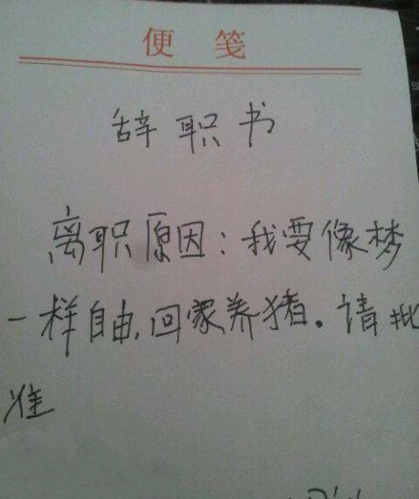
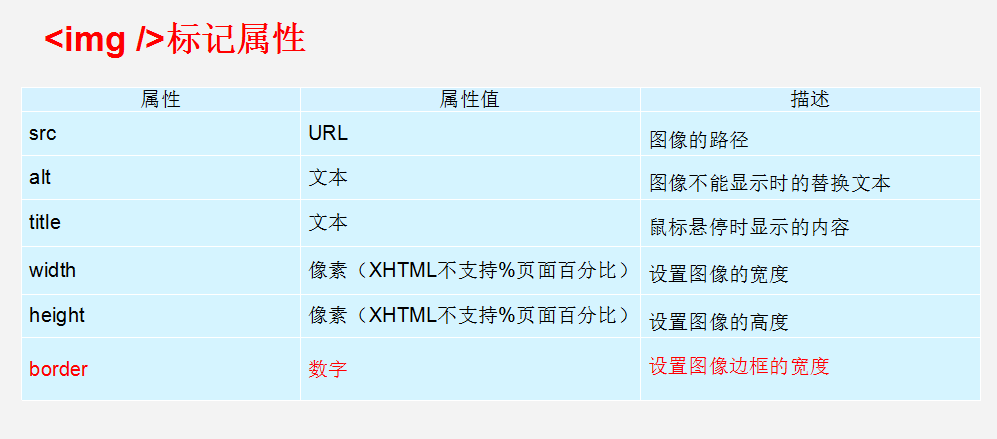
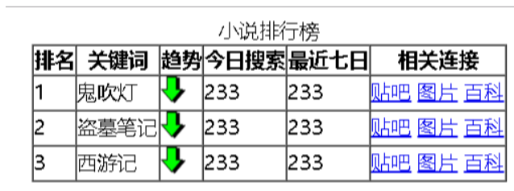

## 1、前言

（1） HTML是什么？

​	HTML 是用来描述网页的一种语言。

​		HTML 指的是超文本标记语言 (Hyper Text Markup Language)

​		HTML 不是一种编程语言，而是一种标记语言 (markup language)

​		标记语言是一套标记标签 (markup tag)

​		HTML 使用标记标签来描述网页

（2） 学习HTML可以做什么？

​	Web前端开发工程师、HTML5移动开发工程师、HTML5游戏开发工程师......

（3） HTML的发展历程

​	从初期的网络诞生后，已经出现了许多HTML版本：


（4） 学习内容

​	HTML   CSS

（5） 学习方法

​	纸质、有道云、typora


## 2、认识网页


前端开发有三层：

​	1） 结构层：HTML                 从语义的角度描绘文档； 图片 文字

​	2） 样式层：CSS                   从审美的角度装饰页面； 

​	3） 行为层：JavaScript         从交互的角度提升用户体验；


思考：网页是如何形成的？


## 3、常见浏览器

> 浏览器是网页运行的平台，常用的浏览器有IE、火狐（Firefox）、谷歌（Chrome）、Safari和Opera等。称为5大浏览器。


#### 3.1 浏览器市场占有份额（了解）

查看网站地址：http://tongji.baidu.com/data/browser


#### 3.2  浏览器内核

> ```
> 浏览器内核又可以分成两部分：渲染引擎(layout engineer 或者 Rendering Engine)和 JS 引擎。
> 渲染引擎 它负责取得网页的内容（HTML、XML、图像等等）、整理讯息（例如加入 CSS 等），以及计算网页的显示方式，然后会输出至显示器或打印机。浏览器的内核的不同对于网页的语法解释会有不同，所以渲染的效果也不相同。
> JS 引擎 则是解析 Javascript 语言，执行 javascript语言来实现网页的动态效果。
> 
> 最开始渲染引擎和 JS 引擎并没有区分的很明确，后来 JS 引擎越来越独立，内核就倾向于只指渲染引擎。有一个网页标准计划小组制作了一个 ACID 来测试引擎的兼容性和性能。内核的种类很多，如加上没什么人使用的非商业的免费内核，可能会有10多种，但是常见的浏览器内核可以分这四种：Trident、Gecko、Blink、Webkit。
> ```
>
> （1）Trident(IE内核) 
>
> 国内很多的双核浏览器的其中一核便是 Trident，美其名曰 "兼容模式"。
>
> 代表： IE、傲游、世界之窗浏览器、Avant、腾讯TT、猎豹安全浏览器、360极速浏览器、百度浏览器等。
>
> Window10 发布后，IE 将其内置浏览器命名为 Edge，Edge 最显著的特点就是新内核 EdgeHTML。
>
> （2）Gecko(firefox) 
>
> Gecko(Firefox 内核)： Mozilla FireFox(火狐浏览器) 采用该内核，Gecko 的特点是代码完全公开，因此，其可开发程度很高，全世界的程序员都可以为其编写代码，增加功能。 可惜这几年已经没落了， 比如 打开速度慢、升级频繁、猪一样的队友flash、神一样的对手chrome。
>
> （3） webkit(Safari)  
>
>  Safari 是苹果公司开发的浏览器，所用浏览器内核的名称是大名鼎鼎的 WebKit。
>
>  现在很多人错误地把 webkit 叫做 chrome内核（即使 chrome内核已经是 blink 了），苹果感觉像被别人抢了媳妇，都哭晕再厕所里面了。
>
>  代表浏览器：傲游浏览器3、 Apple Safari (Win/Mac/iPhone/iPad)、Symbian手机浏览器、Android 默认浏览器，
>
> （4） Chromium/Blink(chrome) 
>
>    在 Chromium 项目中研发 Blink 渲染引擎（即浏览器核心），内置于 Chrome 浏览器之中。Blink 其实是 WebKit 的分支。 
>
> ​     大部分国产浏览器最新版都采用Blink内核。二次开发
>
> （5） Presto(Opera) 
>
>   Presto（已经废弃） 是挪威产浏览器 opera 的 "前任" 内核，为何说是 "前任"，因为最新的 opera 浏览器早已将之抛弃从而投入到了谷歌怀抱了 Blink。

#### 3.3 IE低版本浏览器兼容HTML5

最新版的Safari、Chrome、Firefox以及Opera都支持HTML5，Internet Explorer 9将支持HTML5的特性。IE9以下版本浏览器不兼容HTML5，需要使用静态资源的html5shiv包：

```html
<!--[if lt IE 9]>
    <script src="http://cdn.static.runoob.com/libs/html5shiv/3.7/html5shiv.min.js"></script>
<![endif]-->
```


## 4、Web标准

浏览器的内核不统一，那么其工作原理、解析肯定不同，显示就会有差别。


http://www.baike.com/wiki/WEB%E6%A0%87%E5%87%86

#### 4.1 Web标准的好处

1. 让Web的发展前景更广阔

2. 内容能被更广泛的设备访问

3. 更容易被搜索引擎搜索

4. 降低网站流量费用

5. 使网站更易于维护

6. 提高页面浏览速度

   

#### 4.2 Web标准构成

Web标准不是某一个标准，是由W3C（Word Wild Web Consortium，万维网联盟）和其他标准化组织指定的一系列标准的集合，主要包括结构（Structure）、表现（Presentation）和行为（Behavior）三个方面。

**结构标准**：结构用于对网页元素进行整理和分类，主要包括XML和XHTML两个部分。

**样式标准**：表现用于设置网页元素的版式、颜色、大小等外观样式，主要指的是CSS。

**行为标准**：行为是指网页模型的定义及交互的编写，主要包括DOM和ECMAScript。

理想状态我们的源码：**.html  .css  .js**

直观感受：


总结WEB标准：

结构标准：     决定你是否有个好天然身体 


表现标准：     决定你是否打扮的美丽外观


行为标准：     决定你是否有吸引人的行为

《总结》

第一点：我们的代码是放到浏览器上做渲染的，浏览器的内核要重视

第二点：学习的标准，分三个方面--结构html、样式css、行为JS

#### 4.3课堂一练：

**1.关于WEB标准下列说法正确的是: **

A html决定页面的行为，css决定页面的样式，js决定页面的结构

B html决定页面的样式，css决定页面的结构，js决定页面的行为

C html决定页面的结构，css决定页面的样式，js决定页面的行为

D 以上都不正确

2 **web 标准里边规定三层分离不包括哪部分**

A．HTML

B．CSS

C．JavaScript

D．PHP

3.**关于WEB标准下列说法正确的是**

A．html相当于人的动作行为，CSS相当于人的穿着打扮，javascript相当于人的骨架结构；

B．html相当于人的骨架结构，CSS相当于人的穿着打扮，javascript相当于人的动作行为；

C．html相当于人的穿着打扮，CSS相当于人的骨架结构，javascript相当于人的动作行为；

D．html相当于人的骨架结构，CSS相当于人的动作行为，javascript相当于人的穿着打扮；

## 5、HTML初识

​	一般先学习html，后学css

​	**HTML（英文Hyper Text Markup Language的缩写）**中文译为“超文本标签语言”。是用来描述网页的一种语言。

​	所谓超文本，因为它可以加入图片、声音、动画、多媒体等内容，不仅如此，它还可以从一个文件跳转到另一个文件，与世界各地主机的文件连接。

```html
	<h1> 我是一个大标题 </h1>
```

   注意：   体会 文本    标签    语言   几个词语

- HTML 指的是超文本标记语言 (**H**yper **T**ext **M**arkup **L**anguage)
- HTML 不是一种编程语言，而是一种标记语言 (markup language)
- 标记语言是一套标记标签 (markup tag)

总结： HTML 作用就是用标记标签来描述网页，把网页内容在浏览器中展示出来。 

用文字来描述网页标签

#### 5.1 HTML骨架格式

日常生活的书信，我们要遵循共同的约定。 



同理：HTML 有自己的语言语法骨架格式：

```html
<HTML>   
    <head>     
        <title>我是标题</title>
    </head>
    <body>
        我是内容
    </body>
</HTML>
```

课堂练习1：    书写我们的第一个HTML 页面！

1. 新建一个demo 的 TXT 文件。
2. 里面写入刚才的HTML 骨架。月薪过万 你我之间  华清洗练  一飞冲天
3. 把后缀名改为 .HTML。
4. 右击--谷歌浏览器打开。

```
1 HTML标签：

作用所有HTML中标签的一个根节点。 最大的标签   根标签

2 head标签： 文档的头部

文档的头部描述了文档的各种属性和信息，包括文档的标题、在 Web 中的位置以及和其他文档的关系等。绝大多数文档头部包含的数据都不会真正作为内容显示给读者。比如说用于存放title、meta、base、style、script、link

注意：在head标签中我们必须要设置的标签是title

3.title标签： 文档的标题

作用：让页面拥有一个属于自己的标题。

4.body标签：文档的主体  以后我们的页面内容 基本都是放到body里面的

body 元素包含文档的所有内容（比如文本、超链接、图像、表格和列表等等。），页面的主体部分，用于存放所有的html标签：a、p、h、div、span、img...
```


为了便于记忆，我们请出刚才要辞职回家养猪的二师兄来帮忙， 我称之为  猪八戒记忆法


#### 5.2 HTML标签分类


1. **开始标签**（Opening tag）：包含元素的名称（本例为 p），被大于号、小于号所包围。表示元素从这里开始或者开始起作用 —— 在本例中即段落由此开始。
2. **结束标签**（Closing tag）：与开始标签相似，只是其在元素名之前包含了一个斜杠。这表示着元素的结尾 —— 在本例中即段落在此结束。初学者常常会犯忘记包含结束标签的错误，这可能会产生一些奇怪的结果。
3. **内容**（Content）：元素的内容，本例中就是所输入的文本本身。
4. **元素**（Element）：开始标签、结束标签与内容相结合，便是一个完整的元素。

  在HTML页面中，带有“< >”符号的元素被称为HTML标签，如上面提到的 &lt;HTML&gt;、&lt;head&gt;、&lt;body&gt;都是HTML骨架结构标签。所谓标签就是放在“< >” 标签符中表示某个功能的编码命令，也称为HTML标签或 HTML元素

1. 双标签

   语法：**<标签名>内容</标签名>**

   该语法中**<标签名>**表示该标签的作用开始，一般称为**开始标签（start tag）**，**</标签名>** 表示该标签的作用结束，一般称为**结束标签（end tag）**。和开始标签相比，结束标签只是在前面加了一个关闭符“/”。如下：

   ```html
   <div>我是div</div>
   ```

   

2. 单标签

   语法：<标签名 />

   单标签也称为空标签，是指用一个标签符号即可完整的描述某个功能的标签。如下：

   ```html
   <br />--> <br>
   <hr />
   
   ```

   

#### 5.3 HTML标签关系

标签的相互关系就分为两种：

1. 嵌套关系：父子关系

   ```html
   <head> 
     <meta />
     <title> </title> 
   </head>
   ```

   

2. 并列关系：兄弟关系

   ```html
   	<head></head>
   	<body></body>
   
   ```

   

   倡议： 如果两个标签之间的关系是嵌套关系，子元素最好缩进一个tab键的身位。如果是并列关系，最好上下对齐。

3. 后代关系

   ```html
   <html>
       <head>
           <title></title>
       </head>
       <body></body>
   </html>
   <!--html标签和title标签之间就属于后代关系，title也是head的后代；
   	后代关系：包含父子关系，包含儿子的儿子-->
   
   ```

#### **课堂一练**

```
请问下列哪个标签是错误的？
A <head></head><body></body>
B <strong><div></div></strong>
C <head><title></head></title>
D <body><div></div></body>
```


## 6、开发工具

开发工具很多，你认识几个？

常见的开发工具有：Dreamweaver、SublimeText、WebStorm、Hbuilder....


vscode需要安装打开浏览器的插件：（<https://www.cnblogs.com/echolun/p/9527319.html> ）

```
open in browser  这个不行就安装 view in browser插件
```

vscode设置中文开发环境：<https://jingyan.baidu.com/article/7e44095377c9d12fc1e2ef5b.html> 

```
安装Chinese插件，然后按快捷键 ctrl+shift+p 设置成zh-ch，重启即可
```

常用的快捷键

```
- 输入html:5或者！，按Tab或Ctrl+E键，用于补全文档结构
- 输入a，按Tab或Ctrl+E键，用于补全a标签，其他标签类似
- 多个重复对象，用*，如li*3 按Tab ，ul>li*3
- Shift+右键+向下滑动，同时选中多行元素中的某个位置
- Ctrl+L 选中当前行
- Ctrl+shift+D 在行内向下复制行，选中单词表示复制单词
- Ctrl+X 删除当前行
- Ctrl+/ 注释
- Ctrl+E 补全
```

休息一下，马上回来

## 7、文档类型

```
<!DOCTYPE html> 这句话就是告诉我们使用哪一个html版本。
```

同学你用啥手机？你咋回答？  

这句话就是告诉我们使用哪个html版本？  我们使用的是 html 5 的版本。  html有很多版本，那我们应该告诉用户和浏览器我们使用的版本号。

<!DOCTYPE> 标签位于文档的最前面，用于向浏览器说明当前文档使用哪种 HTML 或 XHTML 标准规范，必需在开头处使用<!DOCTYPE>标签为所有的XHTML文档指定XHTML版本和类型，只有这样浏览器才能按指定的文档类型进行解析。

注意：  一些老网站可能用的还是老版本的文档类型比如 XHTML之类的，但是我们学的是HTML5,而且HTML5的文档类型兼容很好(向下兼容的原则)，所以大家放心的使用HTML5的文档类型就好了。

doctype 声明是不区分大小写的，以下方式均可：

```
<!DOCTYPE html> 

<!DOCTYPE HTML> 

<!doctype html> 

<!Doctype Html>

```

**通用声明**

**HTML5**

```
<!DOCTYPE html>

```

**HTML 4.01**

```
<!DOCTYPE HTML PUBLIC "-//W3C//DTD HTML 4.01 Transitional//EN"
"http://www.w3.org/TR/html4/loose.dtd">

```

**XHTML 1.0**

```
<!DOCTYPE html PUBLIC "-//W3C//DTD XHTML 1.0 Transitional//EN"
"http://www.w3.org/TR/xhtml1/DTD/xhtml1-transitional.dtd">

```

## 8、字符集

```html
<meta charset="UTF-8">
```

UTF-8：是目前最常用的字符集编码方式，包含了全世界所有国家需要用到的字符

GB2312：简单中文，包括6763个汉字

BIG5：繁体中文，港澳台等用

GBK：包含全部中文字符，是GB2312的扩展，加入了对繁体字的支持，兼容GB2312

**注意：**以后我们统统使用UTF-8 字符集, 这样就避免出现字符集不统一而引起乱码的情况了。

## 9、HTML常用标签

首先 HTML和CSS是两种完全不同的语言，我们学的是结构，就只写HTML标签，认识标签就可以了。 不会再给结构标签指定样式了。

 HTML标签有很多，这里我们学习最为常用的，后面有些较少用的，我们可以查下手册就可以了。

#### 9.1 标题标签

单词缩写：head 头部，标题

为了使网页更具有语义化，我们经常会在页面中用到标题标签，HTML提供了6个等级的标签，即：h1、h2、h3、h4、h5、h6

标题标签语义：作为标题使用，并且依据重要性递减，基本语法格式如下：

```html
<h1></h1>
<h2></h2>
<h3></h3>
<h4></h4>
<h5></h5>
<h6></h6>

<!--需要注意的是：h1标签因为重要，尽量少用。一般h1都是给logo使用，或者页面中最重要标题信息-->
```

快捷键：h${标题$}*6


#### 9.2 段落标签

单词缩写：paragraph 段落

在网页中要把文字有条理的显示出来，离不开段落标签，可以将整个网页的内容分为若干个段落标签。基本语法格式如下：

```html
<p>我是一个段落</p>

<!-- 是HTML文档中最常见的标签，默认情况下，一个段落中的文本会依据浏览器的大小自动换行 -->
```


#### 9.3 水平线标签

单词缩写： horizontal  横线，水平线

在网页中会经常看到一些水平线将段落与段落之间隔开，使得文档结构清晰，层次分明。这些水平线可以通过插入图片实现，也可以简单的通过标记来完成。hr 就是创建横跨网页水平线的标记。基本语法格式如下：

```html
<hr />
在网页中显示默认样式的水平线。
```

#### 课堂练习：    新闻页面 


（40.6摄氏度：上海创出140年气象史上高温新纪录

2020年07月27日 10:58:26来1源：新华网

新华网上海７月２６日电（记者李荣）２６日１３时３６分至４７分这一时间段，上海徐家汇气象观测站测得当日最高温达４０．６摄氏度。这是上海有气象记录以来１４０年的高温新纪录，打破了此前１９３４年创下的４０．２摄氏度的历史极值。

上海已经连续２天发出了最高等级的红色高温警报。上海中心气象台首席服务官满莉萍说，今年副热带高压强度特别强，对上海及江南地区的控制“实在太稳定了”，整个７月份基本上都处在它的势力范围之内。２５日上海已出现了气象史上７月份“第四高”的高温值，这使得２６日的“基础”气温就很高，超过了３０摄氏度，然后不断地升温。此外，２６日白天风小，又吹的是西南风，特别是在中午之后这一个最易出现高温的时段，光照又比较强，所以气温“直线飙升”，一举冲破历史极值，出现了“创纪录”的极端酷暑天。

在上海历史上，出现４０摄氏度以上极端高温的几率并不大。根据相关资料，中心城区徐家汇观测站 １４０年来仅出现了５次记录，除了这一次的新纪录，还有就是１９３４年７月１２日的４０．２摄氏度；１９３４年８月２５日、２００９年７月２０日、２０１０年８月１３日的４０摄氏度。

由于气温实在太高，上海２６日下午不少地区出现了热对流天气。气象台说，首先是浦东地区，下起了热雷雨。到１５时０５分，全市大部分地区出现了分散性的雷电活动和热雷雨，中心城区徐家汇等地都响起了隆隆的雷声。）

休息一下，马上回来

#### 9.4 换行标签

单词缩写：break 打断，换行

在HTML中，一个段落中的文字会从左到右依次排列，直到浏览器窗口的右端才会自动换行。如果希望某段文本强制换行显示，就需要使用换行标签。语法格式如下：

```html
<br />
```

#### 课堂一练

1、关于标签下列说法正确的是 

(A) p1是段落标签 （没有p1   只有p标签）

(B) h1 是标题标签

(C) hr是换行标签（水平线）

(D) br 是一条直线（换行）

 2、 关于标签下列说法不正确的是

(A) H标签有6个等级分别是<h1> <h2> <h3> <h4> <h5>和<h6>

(B) h1到h6 文字从小到大 

(C) p标签一行只能放一个

(D) P是段落标签会给文字加上段落的语义

#### 9.5 div span标签（重点）

div  span是没有语义的，是网页布局中主要的2个盒子。

div是division的缩写，表示分割、分区的意思

span表示跨度、跨距、范围

语法格式如下：

```html
<div>这是div</div>
<span>这是span</span>

```

#### 9.6 文本格式化标签（熟记）

在网页中，有时需要为文字设置粗体、斜体或下划线效果，这时就需要用到HTML中的文本格式化标签，使文字以特殊的方式显示。


b   i   s   u没有强调的意思，strong、em、del、ins语义更强烈，有强调的意思

补充：bold 简写 b，italic 简写 i，emphasize 简写 em，strike 简写 s，underline 简写 u，inserted 简写 ins

#### 9.7 标签属性


属性就是特性 比如 手机的颜色 手机的尺寸 ，总结就是手机的属性

手机的颜色是黑色   手机的尺寸是 8寸

水平线的长度是 200  

图片的宽度 是  300    	键   值对


使用HTML制作网页时，如果想让HTMl标签提供更多的信息，可以使用HTML标签的属性加以设置。

基本语法格式如下：

```html
<标签名 属性1="属性值1" 属性2="属性值2" ...> 内容 </标签名>
```

1. 标签可以拥有多个属性，必须写在开始标签中，位于标签名之后。
2. 属性之间不分先后顺序，标签名与属性1、属性2与属性3之间均以空格分开。
3. 任何标签的属性都有默认值，省略该属性则取默认值。

采取  键值对 的格式   key="value"  的格式 

比如:  

```html
<div id="idValue"></div>
```

属性  是 id   	值  是  idValue

常用全局属性：

```
1. id 属性：用于指定元素的识别名称，相当于一个人的身份证，是唯一的，同一个文档中不能有重复 id，一般配合 css 和 js 来选择元素；
2. class 属性：用于指定元素的类别名称，可以使用 class 元素给同一个文档中的多个元素进行归类，css 可以通过 class 给同一个类的元素设置样式；
3. stlye 属性：用于给元素设定样式（内联样式或内部样式）；
4. title 属性：用于显示省略的内容（或补充、提示说明内容），当光标移动到元素内容上时显示title里面的内容；
5. dir 属性：用于设定元素标签内容的文字方向，比如 div 元素的属性、p 元素的属性，可选值 ltr 和 rtl。

```

#### 9.8 图像标签

单词缩写：image 图像

HTML网页中任何元素的实现都要依靠HTML标签，要想在网页中显示图像就需要使用图像标签。语法格式如下：

```html

<!--img--image  src--source属性用于指定图像文件的路径和文件名，是必须的属性，可插入图片格式 JPG、Gif、PNG8、PNG24、webp、bmp -->
```



#### 课堂练习

**当网页显示图片时,鼠标滑上图片显示文字描述是以下哪个属性****

(A) 设置alt属性

(B) 设置title属性

(C) 设置href 属性

(D) 设置src 属性

 

**2  在HTML中，使用标签插入图像，下列选项关于的src属性说法正确的是 **

(A) 用来设置图片的格式

(B) 用来设置图片的所在位置

(C) 用来设置鼠标指向图片时显示的文字

(D) 用来设置图片是否能正确显示 


练习（并找一张关于这首诗的图片显示在页面上）：


#### 9.9 html元素

元素：从标签的开始位置到结束位置所有的东西

```
元素 =  标签  + 属性 + 内容；
```

如：<div class="classValue">内容</div>

知道html元素是什么了吧

#### 9.10 a链接标签（重点）

单词缩写： anchor  锚，铁锚

在HTML中创建超链接非常简单，只需要用标签将链接对象环绕即可。基本语法格式如下：

```html
<a href="跳转目标" target="目标窗口的弹出方式">链接的文本或图像</a>
```

href：用于指定链接目标的url地址，是Hypertext  Reference的缩写，意思是超文本引用。只有使用这个属性，标签才具有链接功能。

target：用于指定链接页面的打开方式，其取值有self和blank两种，self表示在本窗口中打开链接页面，blank表示在新窗口中打开。

注意：

1.外部链接 需要添加**http://**的域名，如http://www.baidu.com

2.内部链接 直接链接内部页面名称即可，如href="index.html"

3.如果当时没有确定链接目标时，通常将链接标签的href属性值定义为“#”（即href=“#”），表示该链接暂时为一个空链接。

4.不仅可以创建文本超链接，在网页中各种元素都可以添加超链接，如图像、表格、音频、视频等。


#### 9.11 锚点定位（难点）

通过创建描点链接，用户能够快速定位到目标内容。

创建描点链接分为两步：

```html
1.使用 <a href="#id名">“链接文本"</a> 创建链接文本（被点击的）
  <a href="#two">   

2.使用相应的id名标注跳转目标的位置。
  <h3 id="two">第2集</h3>
```

[应用场景传送门](https://baike.baidu.com/item/赵丽颖/10075976?fr=aladdin)

示例：

```html
<body>
	<a href="#case1">test1</a>
	<a href="#case2">test2</a>
	<a href="#case3">test3</a>
	<a href="#case4">test4</a>
		
	<div id="case1">一行白鹭上青天</div><br /><br /><br /><br /><br /><br /><br /><br />
	<div id="case2">两个黄鹂鸣翠柳</div><br /><br /><br /><br /><br /><br /><br /><br />
	<div id="case3">朝辞白帝彩云间</div><br /><br /><br /><br /><br /><br /><br /><br />
	<div id="case4">千里江陵一日还</div>
</body>
```


#### 9.12  base标签

base href，由base制定了一个URL地址，接下来你所要调用的文件或图片等就无须再填写完整的地址，只需写上该文件名或图片名即可。通过下方代码来简单的认识一下base标签的用法，链接到HTML标签的博客，完整地址为：http://blog.sina.com.cn/htmlcss3

```
<!DOCTYPE html>
<html>
	<head>
		<meta charset="UTF-8">
		<title></title>
		
		<base href="http://blog.sina.com.cn" target="_blank"/>
		
	</head>
	<body>
		<a href="htmlcss3">链接到HTML标签的博客</a>
	</body>
</html>
```

base target，可以设置整体链接打开的状态是以新窗口打开还是在当前窗口中打开。如：

```html
<!DOCTYPE html>
<html>
	<head>
		<meta charset="UTF-8">
		<title></title>
		<base target="_blank" />
	</head>
	<body>
		<a href="http://www.baidu.com">百度</a>
		<a href="http://www.sina.com">新浪</a>
		<a href="http://www.sohu.com">搜狐</a>
		<a href="http://www.163.com">网易</a>
	</body>
</html>
```

target属性是网页窗口的打开方式，在base标签中设置该属性，那么页面中所有的链接都将遵循这个方式来打开网页，分别有如下几种选择：

```
1、 _blank：在新窗口打开链接页面。
2、 _parent:在上一级窗口中打开链接。
3、 _self： 在当前窗口打开链接,此为默认值，可以省略。
4、 _top： 在浏览器的整个窗口打开链接，忽略任何框架。

```

#### 课堂一练

 1在HTML中，关于a标签说法不正确的是（）

(A) a标签可以通过href属性跳转到另外一个页面

(B) a标签可以通过targer属性设置在是否在新窗口中打开

(C) a标签只能在当前页面设置锚点链接，让用户能够快速定位到目标内

(D) a标签可以通过href="#"设置一个空链接

2如果想跳转到当前页面里名为show的锚点，下列写法是正确的

A  < a href=".show">跳转</a>

B < a href="#show">跳转</a>

C < a href=" show">跳转</a>

D < a src=" #show">跳转</a>

 

3如果想跳转到同目录下的名为success.html文件里名为show的锚点，下列写法是正确的

(A) < a href="success.html#show">跳转</a>

(B)  < a href="#show">跳转</a> 

(C)  < a href="success#show">跳转</a>
(D) < a src="success.html#show">跳转</a>

#### 9.13 特殊字符（理解）

实体字符：


#### 9.14 注释标签

​	在HTML中还有一种特殊标签——注释标签。如果需要在HTML文档中添加一些便于阅读和理解但又不需要显示在页面中的注释文字，就需要使用注释标签。其基本语法格式如下：

```html
<!-- 注释语句 --> 		ctrl + /       或者 ctrl +shift + /

```

​	注释内容不会显示在浏览器窗口中，但是作为HTML文档内容的一部分，也会被下载到用户的计算机上，查看源代码时可以看到。

注释重要性：


## 10、 路径（重、难点）


实际工作中，通常新建一个文件夹专门用于存放图像文件，这时再插入图像，就需要采用“路径”的方式来指定图像文件的位置。

路径可以分为： 相对路径和绝对路径

#### 10.1 相对路径

以引用文件之网页所在位置为参考基础，而建立出的目录路径。因此，当保存于不同目录的网页引用同一个文件时，所使用的路径将不相同，故称之为相对路径。

a.图像文件和HTML文件位于同一文件夹：只需要输入图像名称即可，在前面加上“**./**”表示当前目录。如：或 

b.图像文件位于HTML的下一级文件夹：输入文件夹名和文件名，之间用“/”隔开，如：

c.图像文件位于HTML文件的上一级文件夹：在文件名之前加入“**../**”，如果是上两级，则使用“**../../**”，以此类推。如：


#### 10.2 绝对路径

绝对路径以Web站点根目录为参考基础的目录路径。之所以称为绝对，意指当所有网页引用同一个文件时，所使用的路径都是一样的

a.复制图片在电脑中的路径。如：“E:/工作/资料/图片资源/boy.png”

b.使用完整的网络地址。如：“http://image.so.com/zv?ch=pet#groupid=e872c9418a46c9adb508ab604ff35367&dataindex=2&cid=%E7%83%AD%E9%97%A8”

#### 课堂一练

1.**在下面结构中，哪种写法可以在index页面中有输出img.gif**


(A)  		

(B)  

(C) 	

(D) 

 

**2在下面结构中，哪种写法可以在index页面中有输出1.jpg**


(A) 		

(B) 

(C) 	

(D) 

 

3在下面结构中哪种写法可以在index页面中有输出img.gif


(A)  	

(B)  

(C) 	

(D) 

 

## 11、列表标签

什么是列表？


把一系列的文字及数据制成表，以表显示。容器里面装载着文字或图表的一种形式，叫列表。列表最大的特点是整齐、整洁、有序。

#### 11.1 无序列表ul

​	无序列表的各个列表项之间没有顺序级别之分，是并列的。其基本语法格式如下：

```html
<ul>
  <li>列表项1</li>
  <li>列表项2</li>
  <li>列表项3</li>
  ……
</ul>
```

[新浪新闻网](https://news.sina.com.cn/)

比如下面这些，新闻是没有顺序的，不用排队，先到先得，后发布先显示。


在\<ul>标签中只能使用\<li>标签,不要使用\<p>标签之类的。但在\<li>标签内可以嵌套其他标签使用。

脚下留心：

```html
1、<ul></ul>中只能嵌套<li></li>，直接在<ul></ul>标签中输入其他标签或者文字的做法是不被允许的。
2、<li></li>相当于一个容器，可以容纳所有元素。
3、无序列表有序号类型-属性type，默认值disc，可选值为circle、square。
```


#### 11.2 有序列表ol


有序列表即为排列顺序的列表，其各个列表项按照一定的顺序排列定义，有序列表的基本语法如下：

```html
<ol>
  <li>列表项1</li>
  <li>列表项2</li>
  <li>列表项3</li>
  ……
</ol>
```

所有特性与 ul 基本一致

但实际开发中，较少使用 ol。

```
1、有序列表也有自己的序号类型-属性type，默认是1，可选值有a、A、i、I。
```

#### 练习题


#### 11.3 自定义列表（理解）

自定义列表常用于对术语或名词进行解释和描述，定义列表的列表项没有任何项目符号。其基本语法如下：

```html
<dl>
	<dt>名词1</dt>
	<dd>名词1解释1</dd>
	...
			
	<dt>名词2</dt>
	<dd>名词2解释1</dd>
	<dd>名词2解释2</dd> 
	...
</dl>

<!-- 
	<dd>是对<dt>进行描述或解释的，一个<dt>可以使用多个<dd>来进行描述
-->
```


用的还可以：


## 12、表格table（会使用）


表格是较为常用的一种标签，但不是用来布局，而是处理、显示表格式数据。


#### 12.1 创建表格

在HTML页面中，创建表格的基本语法格式如下：

```html
<table>	
	<tr>
		<td>单元格内的文字</td>
        ...
	</tr>
    ...
</table>

<!--
在上面的语法中包含三对HTML标签，分别为 <table></table> 、<tr></tr> 、<td></td>，他们是创建表格的基本标签，缺一不可，下面对他们进行具体地解释
1、table 用于定义一个表格
2、tr 用于定义表格中的一行，必须嵌套在table标签中，在table标签内有几对tr，就有几行表格。
3、td 用于定义表格中单元格，必须嵌套在<tr></tr>标签中，在tr标签内有几对td，就有几个单元格（列）。
-->
```

注意：

```
<tr></tr>中只能嵌套<td></td>
<td></td>标签就像一个容器，可以容纳所有的元素
```


#### 12.2 表格属性


补充：背景色属性 bgcolor


#### 12.3 表头标签

表头一般位于表格的第一行或第一列，其文本加粗居中，如下图所示。设置表头很简单，只需要用\<th>\</th>替代相应单元格标签的\<td>\</td>即可。


**表格结构(了解)**

```
在使用表格进行布局时，可以将表格划分为头部、主体和页脚（页脚因为有兼容性问题，我们不在赘述），具体 如下所示：

<thead></thead>：用于定义表格的头部。

必须位于<table></table> 标签中，一般包含网页的logo和导航等头部信息。


<tbody></tbody>：用于定义表格的主体。

位于<table></table>标签中，一般包含网页中除头部和底部之外的其他内容。
```


#### 12.4 表格标题

表格的标题使用**\<caption>** 标签来定义，必须直接定义在\<table>标签之后，并且每个表格只能定义一个标题。通常这个标题会被居中于表格之上。

用法：

```html
<table>
    <caption>我是表格的标题</caption>
</table>
```

#### 练习题



#### 12.5 合并单元格（难点）

跨行合并：**rowspan**（row span）

跨列合并：**colspan** （column span）


合并单元格：

​	将多个内容合并时，多余的单元格需要删除。例如：将3个td合并成1个，那么需要将多余的2个删除。

​	公式：删除的个数 = 合并的个数 - 1

案例1：个人简历


案例2：产品表


补充：背景色设置：bgcolor

浅灰色：lightgray，浅蓝色lightblue

#### 12.6 总结表格

1. 表格提供了HTML 中定义表格式数据的方法。

2. 表格中由行中的单元格组成。

3. 表格中没有列元素，列的个数取决于行的单元格个数。

4. 表格不要纠结于外观，那是CSS 的作用。

   

   **表格的学习要求：  能手写表格结构，并且能合并单元格。**

   ### 练习题

   

## 13、表单标签（掌握）

现实中的表单，类似我们去银行办理相关业务时需要填写的申请表，如下图：


目的是为了收集用户信息。

在网页中，我们也需要与用户进行交互，收集用户资料，此时也需要表单。

HTML中，一个完整的表单由表单控件（也称表单元素）、提示信息和表单域三个部分组成。


表单控件：

​	包含了具体的表单功能项，如单行文本输入框、密码输入框、复选框、提交按钮、重置按钮等。

提示信息：

​	一个表单中通常还需要包含一些说明性的文字，提示用户进行填写和操作。

表单域：

​	相当于一个容器，用来容纳所有的表单控件和提示信息，可以通过它定义处理表单数据所用程序的url地址，以及数据提交到服务器的方法。如果不定义表单域，表单中的数据就无法传送到后台服务器。


#### 13.1 input控件（重点）

input 输入的意思 

\<input />标签为单标签，type属性是其最基本的属性，取值有很多种，用于指定不同的控件类型。除了type属性之外，\<input />标签还可以定义其他的属性，如下表所示：

type  说明了属于那种表单

radio  如果是一组，我们必须给他们命名相同的名字 name   这样就可以多个选其中的一个啦


**(1)文本域**

文本域通过\<input type="text"> 标签来设定，当用户要在表单中键入字母、数字等内容时，就会用到文本域。

```html
<form>
	First name: <input type="text" name="firstname"><br>
	Last name: <input type="text" name="lastname">
</form>

```

**（2）密码字段**

密码字段通过标签\<input type="password"> 来定义:

```html
<form>
	Password: <input type="password" name="pwd">
</form>

```

**注意**：密码字段字符不会明文显示，而是以星号或圆点替代。

**（3）单选按钮**

\<input type="radio"> 标签定义了表单单选框选项，通过同一个name值定义同一个组

```html
<form>
	<input type="radio" name="sex" value="male">Male<br>
	<input type="radio" name="sex" value="female">Female
</form>

```

**(4)复选框**

\<input type="checkbox"> 定义了复选框. 用户需要从若干给定的选择中选取一个或若干选项。

```html
<form>
	<input type="checkbox" name="vehicle" value="Bike">I have a bike<br>
	<input type="checkbox" name="vehicle" value="Car">I have a car 
</form>

```

**(5)普通按钮**

通过\<input type="button">来定义

```html
<form>
	<input type="button" value="点我">
</form>

```

**(6)提交按钮**

\<input type="submit"> 定义了提交按钮.

当用户单击确认按钮时，表单的内容会被传送到另一个文件。表单的动作属性定义了目的文件的文件名。由动作属性定义的这个文件通常会对接收到的输入数据进行相关的处理。:

```html
<form>
	Username: <input type="text" name="user"><br />
			 <input type="submit" value="提交">
</form>

```

**(7)重置按钮**

\<input type="reset"> 定义了重置按钮.

```html
<br>
<form>
    Username: <input type="text" name="user"><br />
    		 <input type="reset" value="重置">
</form>

```

**(8)图像按钮**

\<input type="image"> 定义了图像按钮，表示按钮可以用图片来显示，用src指定图片的路径，用height/width定义宽高

```html
<form>
    <input type="image" src="logo.png" height="10px" width="10px">
</form>

```

**(9)文件域**

\<input type="file"> 定义了文件域，点击按钮可以选择上传的文件

```html
<form>
    <input type="file">
</form>

```

#### 13.2 label标签

\<label> 标签为 input 元素定义标注（标记）。

作用：用于绑定一个表单元素，当点击label标签时，被绑定的表单元素就会获得输入焦点。

如何绑定？ \<label> 标签的 **for 属性**用于绑定表单元素，只需要指定for属性的值与被绑定表单元素的id值相同即可。

```html
<label for="name">名 字：</label>
<input type="text" id="name"><br>

<!-- 
1.用label直接包裹input，就可以实现
2.如果label里面有多个表单元素，想定位到某个元素，可以通过for  id的格式来操作
-->

```

案例：百度账号注册页面


#### 13.3 textarea控件（文本域）

text  文本框  只能写一行文本呢

如果需要输入大量的文本信息，就需要使用\<textarea>\</textarea>标签。通过textarea控件可以轻松的创建多行文本输入框，其基本语法格式如下：

```html
<textarea cols="每行中的字符数" rows="显示的行数"></textarea>
<!-- 
cols:文本域可容纳文本列数，可限定文本框长度
rows:文本域可容纳文本行数，可限定文本框宽度 -->

```

案例：评论区


#### 13.4 下拉菜单

使用select控件定义下拉菜单，基本语法格式如下：

```html
<select>
	<option>选项1</option>
	<option>选项2</option>
	<option>选项3</option>
	...		
</select>

<!-- 
	1、select标签中至少应包含一对option标签
	2、在option标签中加入selected="selected"属性时，表示当前项为默认选中项
    3、select的 size 属性可指定显示范围
-->

```

案例：淘宝个人信息设置


#### 13.5 表单域

在HTML中，form标签被用于定义表单域，即创建一个表单，以实现用户信息的收集和传递，form中所有内容都会被提交给服务器。基本语法格式如下：

```html
<form action="url地址" method="提交方式" name="表单名称">
    各种表单控件
</form>

```

常用属性：

1.action

​	在表单收集到信息后，需要将信息传递给服务器进行处理，action属性用于指定接收并处理表单数据的服务器程序的url地址。

2.method

​	用于设置表单数据的提交方式，取值为get与post。

​        get：数据大小受限，不安全

​       post：数据大小不受限制，相对比较安全

3.name

​	用于指定表单的名称，以区分同一个页面上的多个表单。

注意：每个表单都应该有自己的表单域。


用表单域实现页面跳转啊。

## 14、行内标签和块级标签

#### 14.1 行内标签

行内标签：没有自己的宽度和高度，不会独自占用一行。

常见的行内标签有：a、span、b、u、del等等。

类比生活：袋子、气球。


#### 14.2 块级标签

块级标签：有自己的宽度和高度，会独自占用一行。

常见的块级标签：div、p、li、h1-h6等等。

生活：箱子、盒子、柜子等。


#### 14.3 行内块级标签

img标签是行内块级标签。

# 总结

  每一天都有一个主题 我们HTML第一天的主题就是 <认识标签>

学HTML 之前 觉得 很神秘  


等你学完之后忽然发现


# 查文档

经常查阅文档是一个非常好的学习习惯。

W3C :  http://www.w3school.com.cn/

MDN: https://developer.mozilla.org/zh-CN/

