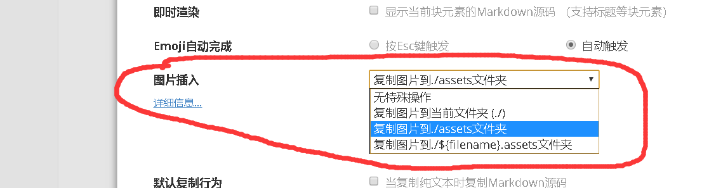
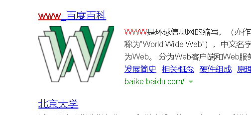

# 一级标题

## 二级标题

```
# 一级标题
## 二级标题
##### 五级标题
插入代码块 ：右键-》插入-》代码块
插入引用 ： >或者右键，左双引号
插入超链接： 直接复制链接
```

```

```

> 这是引用

> 右键，左双引号

https://www.baidu.com/s?ie=UTF-8&wd=www


图片需要设置 文件-》偏好设置-》图片插入-》复制图片到./assets文件夹



