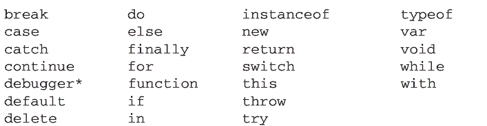
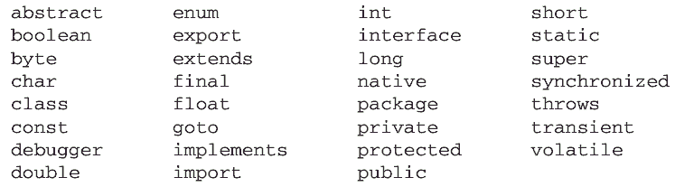
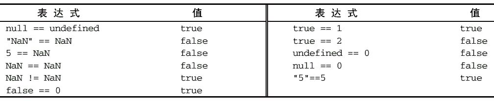
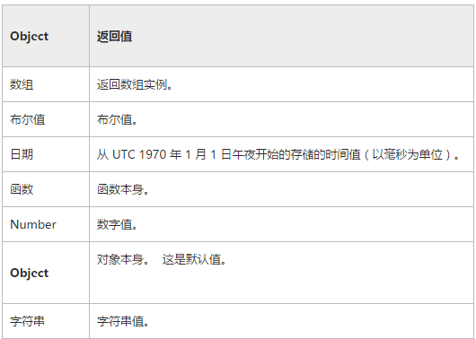

## 1、JavaScript 简介

（一）前言
​			html/css/js：分别的作用
​			好看的皮囊千篇一律，有趣的灵魂万里挑一：内容、样式、动作
​			搞事情，简单认识js 事件，事件三要素：事件源、事件类型、事件处理

（二）历史
​			没有js 的功能实现，例：表单验证，用户体验不佳
​			网景公司实现了javaScript，微软在IE实现了Jscript

	在 Web 日益流行的同时，人们对客户端脚本语言的需求也越来越强烈。那个时候，绝大多数因特网用户都使用速度仅为 28.8kbit/s 的“猫”（调制解调器）上网，但网页的大小和复杂性却不断增加。为完成简单的表单验证而频繁地与服务器交换数据只会加重用户的负担。想象一下：用户填写完一个表单，单击“提交”按钮，然后等待 30 秒钟，最终服务器返回消息说有一个必填字段没有填好……当时走在技术革新最前沿的 Netscape 公司，决定着手开发一种客户端语言，用来处理这种简单的验证。
	
	当时就职于 Netscape 公司的布兰登·艾奇（Brendan Eich），开始着手为计划于 1995 年 2 月发布的Netscape Navigator 2 开发一种名为 LiveScript 的脚本语言——该语言将同时在浏览器和服务器中使用（它在服务器上的名字叫 LiveWire）。为了赶在发布日期前完成 LiveScript 的开发， Netscape 与 Sun 公司建立了一个开发联盟。在 Netscape Navigator 2 正式发布前夕，Netscape 为了搭上媒体热炒 Java 的顺风车，临时把 LiveScript 改名为 JavaScript。
	
	由于 JavaScript 1.0 获得了巨大成功，Netscape 随即在 Netscape Navigator 3 中又发布了 JavaScript 1.1。Web 虽然羽翼未丰，但用户关注度却屡创新高。在这样的背景下， Netscape 把自己定位为市场领袖型公司。与此同时，微软决定向与 Navigator 竞争的自家产品 Internet Explorer 浏览器投入更多资源。 NetscapeNavigator 3 发布后不久，微软就在其 Internet Explorer 3 中加入了名为 JScript 的 JavaScript 实现（命名为JScript 是为了避开与 Netscape 有关的授权问题）。以现在的眼光来看，微软 1996 年 8 月为进入 Web 浏览器领域而实施的这个重大举措，是导致 Netscape 日后蒙羞的一个标志性事件。然而，这个重大举措同时也标志着 JavaScript 作为一门语言，其开发向前迈进了一大步。
	
	微软推出其 JavaScript 实现意味着有了两个不同的 JavaScript 版本： Netscape Navigator 中的JavaScript、 Internet Explorer 中的 JScript。与 C 及其他编程语言不同，当时还没有标准规定 JavaScript 的语法和特性，两个不同版本并存的局面已经完全暴露了这个问题。随着业界担心的日益加剧， JavaScript的标准化问题被提上了议事日程。
	
	1997 年，以 JavaScript 1.1 为蓝本的建议被提交给了欧洲计算机制造商协会（ECMA， EuropeanComputer Manufacturers Association） 。该协会指定 39 号技术委员会（TC39， Technical Committee #39）负 责 “ 标 准 化 一 种 通 用 、 跨 平 台 、 供 应 商 中 立 的 脚 本 语 言 的 语 法 和 语 义 ” （http://www.ecmainternational.org/memento/TC39.htm）。 TC39 由来自 Netscape、 Sun、微软、 Borland 及其他关注脚本语言发展的公司的程序员组成，他们经过数月的努力完成了 ECMA-262——定义一种名为 ECMAScript（发音为“ ek-ma-script”）的新脚本语言的标准。
	
	第二年， ISO/IEC（International Organization for Standardization and International Electrotechnical Commission，国标标准化组织和国际电工委员会）也采用了 ECMAScript 作为标准（即 ISO/IEC-16262）。自此以后，浏览器开发商就开始致力于将 ECMAScript 作为各自 JavaScript 实现的基础，也在不同程度上取得了成功。


#### 1.1 JavaScript 构成

	虽然 JavaScript 和 ECMAScript 通常都被人们用来表达相同的含义，但 JavaScript 的含义却比 ECMA-262 中规定的要多得多。没错，一个完整的 JavaScript 实现应该由下列三个不同的部分组成（如图1-1）。

- 核心（ECMAScript）
- 文档对象模型（DOM）
- 浏览器对象模型（BOM）


##### 1.1.1 ECMAScript 

	由 ECMA-262 定义的 ECMAScript 与 Web 浏览器没有依赖关系。实际上，这门语言本身并不包含输入和输出定义。 ECMA-262 定义的只是这门语言的基础，而在此基础之上可以构建更完善的脚本语言。（脚本语言即汇编语言，如C Java Javascript等，html是超文本标记语言，不是脚本语言）
	
	我们常见的 Web 浏览器只是 ECMAScript 实现可能的宿主环境之一。宿主环境不仅提供基本的ECMAScript 实现，同时也会提供该语言的扩展，以便语言与环境之间对接交互。而这些扩展——如DOM，则利用 ECMAScript 的核心类型和语法提供更多更具体的功能，以便实现针对环境的操作。其他宿主环境包括 Node（一种服务端 JavaScript 平台）和 Adobe Flash。既然 ECMA-262 标准没有参照 Web 浏览器，那它都规定了些什么内容呢？大致说来，它规定了这门语言的下列组成部分:

- 语法
- 类型
- 语句
- 关键字
- 保留字
- 操作符
- 对象

**(1) ECMAScript 的版本**

	ECMAScript 的不同版本又称为版次，以第 x 版表示（意即描述特定实现的 ECMA-262 规范的第 x个版本）。 ECMA-262 的最近一版是第 5 版，发布于 2009 年。而 ECMA-262 的第 1 版本质上与 Netscape的 JavaScript 1.1 相同——只不过删除了所有针对浏览器的代码并作了一些较小的改动： ECMA-262 要求支持 Unicode 标准（从而支持多语言开发），而且对象也变成了平台无关的（Netscape JavaScript 1.1 的对象在不同平台中的实现不一样，例如 Date 对象） 。这也是 JavaScript 1.1 和 1.2 与 ECMA-262 第 1 版不一致的主要原因。
	
	ECMA-262 第 2 版主要是编辑加工的结果。这一版中内容的更新是为了与 ISO/IEC-16262 保持严格一致，没有作任何新增、修改或删节处理。因此，一般不使用第 2 版来衡量 ECMAScript 实现的兼容性。ECMA-262 第 3 版才是对该标准第一次真正的修改。修改的内容涉及字符串处理、错误定义和数值输出。这一版还新增了对正则表达式、新控制语句、 try-catch 异常处理的支持，并围绕标准的国际化做出了一些小的修改。从各方面综合来看，第 3 版标志着 ECMAScript 成为了一门真正的编程语言。
	
	ECMA-262 第 4 版对这门语言进行了一次全面的检核修订。由于 JavaScript 在 Web 上日益流行，开发人员纷纷建议修订 ECMAScript，以使其能够满足不断增长的 Web 开发需求。作为回应， ECMA TC39重新召集相关人员共同谋划这门语言的未来。结果，出台后的标准几乎在第 3 版基础上完全定义了一门新语言。第 4 版不仅包含了强类型变量、新语句和新数据结构、真正的类和经典继承，还定义了与数据交互的新方式。
	
	与此同时， TC39 下属的一个小组也提出了一个名为 ECMAScript 3.1 的替代性建议，该建议只对这门语言进行了较少的改进。这个小组认为第 4 版给这门语言带来的跨越太大了。因此，该小组建议对这门语言进行小幅修订，能够在现有 JavaScript 引擎基础上实现。最终， ES3.1 附属委员会获得的支持超过了 TC39，ECMA-262 第 4 版在正式发布前被放弃。
	
	ECMAScript 3.1 成为 ECMA-262 第 5 版，并于 2009 年 12 月 3 日正式发布。第 5 版力求澄清第 3版中已知的歧义并增添了新的功能。新功能包括原生 JSON 对象（用于解析和序列化 JSON 数据）、继承的方法和高级属性定义，另外还包含一种严格模式，对 ECMAScript 引擎解释和执行代码进行了补充说明。

**(2) 什么是 ECMAScript 兼容**

	ECMA-262 给出了 ECMAScript 兼容的定义。要想成为 ECMAScript 的实现，则该实现必须做到：

- 支持 ECMA-262 描述的所有“类型、值、对象、属性、函数以及程序句法和语义”（ECMA-262第 1 页）;
- 支持 Unicode 字符标准。

  此外，兼容的实现还可以进行下列扩展：

- 添加 ECMA-262 没有描述的“更多类型、值、对象、属性和函数”。 ECMA-262 所说的这些新增特性，主要是指该标准中没有规定的新对象和对象的新属性。
- 支持 ECMA-262 没有定义的“程序和正则表达式语法”。（也就是说，可以修改和扩展内置的正则表达式语法。）

  上述要求为兼容实现的开发人员基于 ECMAScript 开发一门新语言提供了广阔的空间和极大的灵活性，这也从另一个侧面说明了 ECMAScript 受开发人员欢迎的原因。

**(3)  Web 浏览器对 ECMAScript 的支持**

	1996 年， Netscape Navigator 3 捆绑发布了 JavaScript 1.1。而相同的 JavaScript 1.1 设计规范随后作为对新标准（ECMA-262）的建议被提交给 Ecma。伴随着 JavaScript 的迅速走红， Netscape 豪情满怀地着手开发 JavaScript 1.2。然而，问题是 Ecma 当时还没有接受 Netscape 的建议。
	
	Netscape Navigator 3 发布后不久，微软也推出了 Internet Explorer 3。微软在 IE 的这一版中捆绑了JScript 1.0，很多人都认为 JScript 1.0 与 JavaScript 1.1 应该是一样的。但是，由于没有文档依据，加之不适当的特性模仿， JScript 1.0 还是很难与 JavaScript 1.1 相提并论。
	
	1997 年，内置 JavaScript 1.2 的 Netscape Navigator 4 发布;而到这一年年底， ECMA-262 第 1 版也被接受并实现了标准化。结果，虽然 ECMAScript 被认为是基于 JavaScript 1.1 制定的，但 JavaScript 1.2与 ECMAScript 的第 1 版并不兼容。
	
	JScript 的升级版是 Internet Explorer 4 中内置的 JScript 3.0（随同微软 IIS 3.0 发布的 JScript 2.0 从来也没有移植到浏览器中）。微软通过媒体大肆宣传 JScript 3.0 是世界上第一个 ECMA 兼容的脚本语言，但当时的 ECMA-262 尚未定稿。于是， JScript 3.0 与 JavaScript 1.2 都遭遇了相同的尴尬局面——谁都没有按照最终的 ECMAScript 标准来实现。
	
	Netscape 决定更新其 JavaScript 实现，即在 Netscape Navigator 4.06 中发布 JavaScript 1.3，从而做到了与 ECMA-262 的第一个版本完全兼容。在 JavaScript 1.3 中， Netscape 增加了对 Unicode 标准的支持，并在保留 JavaScript 1.2 新增特性的同时实现了所有对象的平台中立化。
	
	在 Netscape 以 Mozilla 项目的名义开放其源代码时，预期 JavaScript 1.4 将随同 Netscape Navigator 5一道发布。然而，一个激进的决定，彻底重新设计 Netscape 代码，打乱了原有计划。后来， JavaScript 1.4只发布了针对 Netscape Enterprise Server 的服务器版，而没有内置于 Web 浏览器中。
	
	到了 2008 年，五大主流 Web 浏览器（IE、Firefox、Safari、Chrome 和 Opera）全部做到了与 ECMA-262兼容。 IE8 是第一个着手实现 ECMA-262 第 5 版的浏览器，并在 IE9 中提供了完整的支持。 Firefox 4 也紧随其后做到兼容。下表列出了 ECMAScript 受主流 Web 浏览器支持的情况。


##### 1.1.2 文档对象模型 DOM

	文档对象模型（DOM， Document Object Model）是针对 XML 但经过扩展用于 HTML 的应用程序编程接口（API， Application Programming Interface）。 DOM 把整个页面映射为一个多层节点结构。 HTML或 XML 页面中的每个组成部分都是某种类型的节点，这些节点又包含着不同类型的数据。看下面这个HTML 页面：

```html
<html>
	<head>
		<title>Sample Page</title>
	</head>
  
	<body>
 		<p>Hello World!</p>
	</body>
</html>
```


	在 DOM 中，这个页面可以通过下一小节1.1.3 的分层节点图表示。
	通过 DOM 创建的这个表示文档的树形图，开发人员获得了控制页面内容和结构的主动权。借助DOM 提供的 API，开发人员可以轻松自如地删除、添加、替换或修改任何节点。

**(1) 为什么要使用 DOM**

	在 Internet Explorer 4 和 Netscape Navigator 4 分别支持的不同形式的 DHTML（Dynamic HTML）基础上，开发人员首次无需重新加载网页，就可以修改其外观和内容了。然而， DHTML 在给 Web 技术发展带来巨大进步的同时，也带来了巨大的问题。由于 Netscape 和微软在开发 DHTML 方面各持己见，过去那个只编写一个 HTML 页面就能够在任何浏览器中运行的时代结束了。
	
	对开发人员而言，如果想继续保持 Web 跨平台的天性，就必须额外多做一些工作。而人们真正担心的是，如果不对 Netscape 和微软加以控制， Web 开发领域就会出现技术上两强割据，浏览器互不兼容的局面。此时，负责制定 Web 通信标准的 W3C（World Wide Web Consortium，万维网联盟）开始着手规划 DOM。


**(2) DOM 级别**

	DOM1 级（DOM Level 1）于 1998 年 10 月成为 W3C 的推荐标准。 DOM1 级由两个模块组成： DOM核心（DOM Core）和 DOM HTML。其中， DOM 核心规定的是如何映射基于 XML 的文档结构，以便简化对文档中任意部分的访问和操作。 DOM HTML 模块则在 DOM 核心的基础上加以扩展，添加了针对 HTML 的对象和方法。

```
DOM 并不只是针对 JavaScript 的，很多别的语言也都实现了 DOM。不过，在 Web 浏览器中，基于 ECMAScript 实现的 DOM 的确已经成为 JavaScript 这门语言的一个重要组成部分。
```

	如果说 DOM1 级的目标主要是映射文档的结构，那么 DOM2 级的目标就要宽泛多了。 DOM2 级在原来 DOM 的基础上又扩充了（DHTML 一直都支持的）鼠标和用户界面事件、范围、遍历（迭代 DOM文档的方法）等细分模块，而且通过对象接口增加了对 CSS（Cascading Style Sheets，层叠样式表）的支持。 DOM1 级中的 DOM 核心模块也经过扩展开始支持 XML 命名空间。
	
	DOM2 级引入了下列新模块，也给出了众多新类型和新接口的定义。

- DOM 视图（DOM Views）：定义了跟踪不同文档（例如，应用 CSS 之前和之后的文档）视图的接口;
- DOM 事件（DOM Events）：定义了事件和事件处理的接口;
- DOM 样式（DOM Style）：定义了基于 CSS 为元素应用样式的接口;
- DOM 遍历和范围（DOM Traversal and Range）：定义了遍历和操作文档树的接口。

  DOM3 级则进一步扩展了 DOM，引入了以统一方式加载和保存文档的方法——在 DOM 加载和保存（DOM Load and Save）模块中定义;新增了验证文档的方法——在 DOM 验证（DOM Validation）模块中定义。 DOM3 级也对 DOM 核心进行了扩展，开始支持 XML 1.0 规范，涉及 XML Infoset、 XPath和 XML Base。

```
在阅读 DOM 标准的时候，读者可能会看到 DOM0 级（DOM Level 0）的字眼。实际上， DOM0 级标准是不存在的;所谓 DOM0 级只是 DOM 历史坐标中的一个参照点而已。具体说来， DOM0 级指的是 Internet Explorer 4.0 和 Netscape Navigator 4.0 最初支持的 DHTML。
```

**(3) 其他 DOM 标准**

	除了 DOM 核心和 DOM HTML 接口之外，另外几种语言还发布了只针对自己的 DOM 标准。下面列出的语言都是基于 XML 的，每种语言的 DOM 标准都添加了与特定语言相关的新方法和新接口：

- SVG（Scalable Vector Graphic，可伸缩矢量图） 1.0;
- MathML（Mathematical Markup Language，数学标记语言） 1.0;
- SMIL（Synchronized Multimedia Integration Language，同步多媒体集成语言）。

  还有一些语言也开发了自己的 DOM 实现，例如 Mozilla 的 XUL （XML User Interface Language，XML用户界面语言）。但是，只有上面列出的几种语言是 W3C 的推荐标准。

**(4) Web 浏览器对 DOM 的支持**

	在 DOM 标准出现了一段时间之后， Web 浏览器才开始实现它。微软在 IE5 中首次尝试实现 DOM，但直到 IE5.5 才算是真正支持 DOM1 级。在随后的 IE6 和 IE7 中，微软都没有引入新的 DOM 功能，而到了 IE8 才对以前 DOM 实现中的 bug 进行了修复。
	
	Netscape 直到 Netscape 6（Mozilla 0.6.0）才开始支持 DOM。在 Netscape 7 之后， Mozilla 把开发重心转向了 Firefox 浏览器。 Firefox 3 完全支持 DOM1 级，几乎完全支持 DOM2 级，甚至还支持 DOM3 级的一部分。（Mozilla 开发团队的目标是构建与标准 100%兼容的浏览器，而他们的努力也得到了回报。）
	
	目前，支持 DOM 已经成为浏览器开发商的首要目标，主流浏览器每次发布新版本都会改进对 DOM的支持。下表列出了主流浏览器对 DOM 标准的支持情况。


##### 1.2.3 浏览器对象模型 BOM

	Internet Explorer 3 和 Netscape Navigator 3 有一个共同的特色，那就是支持可以访问和操作浏览器窗口的浏览器对象模型（BOM， Browser Object Model）。开发人员使用 BOM 可以控制浏览器显示的页面以外的部分。而 BOM 真正与众不同的地方（也是经常会导致问题的地方），还是它作为 JavaScript 实现的一部分但却没有相关的标准。这个问题在 HTML5 中得到了解决， HTML5 致力于把很多 BOM 功能写入正式规范。 HTML5 发布后，很多关于 BOM 的困惑烟消云散。从根本上讲， BOM 只处理浏览器窗口和框架;但人们习惯上也把所有针对浏览器的 JavaScript 扩展算作 BOM 的一部分。下面就是一些这样的扩展：

- 弹出新浏览器窗口的功能;
- 移动、缩放和关闭浏览器窗口的功能;
- 提供浏览器详细信息的 navigator 对象;
- 提供浏览器所加载页面的详细信息的 location 对象;
- 提供用户显示器分辨率详细信息的 screen 对象;
- 对 cookies 的支持;
- 像 XMLHttpRequest 和 IE 的 ActiveXObject 这样的自定义对象。

  由于没有 BOM 标准可以遵循，因此每个浏览器都有自己的实现。虽然也存在一些事实标准，例如要有 window 对象和 navigator 对象等，但每个浏览器都会为这两个对象乃至其他对象定义自己的属性和方法。现在有了 HTML5， BOM 实现的细节有望朝着兼容性越来越高的方向发展。


#### 1.2 JavaScript 特点

JS 运行在客户端--浏览器

​	JS 解释器，负责js 的执行;
​	V8 引擎负责js 的执行，把js 代码编译成机器码;
​	JS 定位成弱类型，脚本语言：在运行的时候，不需要编译

	JavaScript的出现，使得信息和用户之间不再是单一的显示或浏览，它在二者之间提供了一种实时的、动态的、可交互的表达能力。这样使得基于CGI静态的HTML页面将被可提供动态实时信息并对客户操作进行反应的Web页面所取代。JavaScript一经出现，就深受广大用户的喜爱和欢迎，它是众多脚本语言中较为优秀的一种，因此，尽快掌握 JavaScript 脚本语言编程方法将使我们获得一项重要的技能。

**1 . JavaScript语言的特点**

	JavaScript是一种脚本语言并且是一种基于对象和事件驱动的脚本语言。之所以要使用JavaScript不仅仅是因为JavaScript很安全，而且是因为它能与HTML、Java的Applet一起实现在一个web页面中连接多个对象，并与web客户交互作用，开发各种客户端的应用程序，满足人们的各种需求。JavaScript是通过嵌入或调入到标准的HTML语言中实现的，它的出现很好地填补了HTML的缺陷，是Java与HTML语言的桥梁。JavaScript有以下几个基本特点：
	
	(1) JavaScript是一种脚本编程语言
	
	这里要解释一下什么是脚本语言，也许很多读者之前已经接触过脚本语言，其实脚本语言是一种简单的程序，它是由一些ASCII字符构成，可以直接用记事本等文本编辑器编写，事先也不用编译，只需要利用解释器就可以解释执行。
	
	前面已经介绍过JavaScript是一种脚本语言，是采用小程序段的方式实现编程。正如其它脚本语言一样，JavaScript也是一种解释性语言，它提供了一个容易的开发过程。JavaScript的基本结构形式与其它高级语言类似（如C、C++、VB、Delphi等），但它与这些高级语言不同的是，其它高级语言需要先进行编译然后才能被执行，JavaScript则是在程序运行过程中一条一条被解释执行。JavaScript与HTML结合在一起，极大地方便了用户的使用操作。
	
	(2) JavaScript是面向对象的语言
	
	JavaScript是一种面向对象的语言，那就是说，它本身也可以创建对象，以及调用对象的操作。因此，JavaScript的诸多功能可以来自于脚本环境中各种对象的调用。
	
	(3) JavaScript的简单性
	
	之所以说JavaScript是简单的，首先是因为它是一种基于Java的基本语句和控制流之上的简单而紧凑的设计，这对于更进一步学习Java是一个非常好的过渡，其次是因为它的所有变量都是弱类型，并且都没有像其它需要编译的高级语言那样使用严格的数据类型。
	
	(4) JavaScrip的安全性
	
	JavaScrip就像Java一样是一种非常安全的语言，它不允许访问本地的硬盘，并且不允许把数据存入到服务器上，还不允许对网络文档进行修改和删除，只允许通过浏览器实现信息浏览和动态交互，这样确保了对数据的安全化操作。
	
	(5) JavaScript的动态性
	
	之所以说JavaScript是动态的，是因为它可以直接对用户或客户的输入操作做出响应，而不必经过web服务器或web服务器程序。
	
	JavaScript对用户的响应是采用事件驱动的方式进行的。简单地说，事件驱动是指在页面中执行了某种操作后产生相应的动作，例如，按下鼠标、选择菜单以及移动窗口等都可以被视为事件，当事件发生后，就会有相应的事件响应该事件。
	
	(6) JavaScript的跨平台性
	
	JavaScript同Java一样是与操作环境无关的，它只依赖于浏览器，只要客户的计算机浏览器支持JavaScrip，它就可以被正确解释执行。从而实现一次编写，到处运行。
	
	综合以上特点，JavaScrip是一种全新的描述性语言，它可以完全被嵌入到HTML文档中运行。JavaScrip可以在不用任何的网络来回传输控制命令的前提下做到响应使用者的需求事件（如form的输入等）。因此当一个用户输入某一项资料时，它并不用经常传给服务端处理，再传回客户端的过程，而是可以直接被客户端的应用程序自己处理，节省了服务器处理时间。

**2．JavaScript可以做什么**

	JavaScript虽然是一种简单的语言，但它的功能却很强大，具体如下：
	
	(1) 制作网页特效
	
	这几乎是所有JavaScript的初学者都想学习JavaScript的第一个动机，例如：光标动画、信息提示、动态广告面板、检测鼠标行为等。
	
	(2) 提升使用性能
	
	越是复杂的代码，越要耗费系统资源来执行它，因为大部分的JavaScript程序代码都在客户端执行，操作时完全不用服务器操心，这样，网页服务器就可以将资源用在提供客户端更多更好的服务上。现今，越来越多的网站包含表单的结构，例如：申请会员要填写入会的基本表单，JavaScript的任务，就是在CGI程序将客户端所填写的数据送到服务器之前，先作必要的数据有效性测试，例如：该输入数字的地方是否有数字等等，这样的验证无疑提升了性能。
	
	(3) 窗口动态操作
	
	利用JavaScript，可以很自由地设计网页窗口的大小、窗口的打开与关闭等，甚至也可以在不同窗口文件中互相传递参数。

**3．JavaScript 语言和java 语言的比较**

	JavaScript虽然是一种简单的语言，但它的功能却很强大，具体如下：
	
	Java诞生于网络时代，它是由Sun公司开发的一种与平台无关的面向对象编程语言，非常适合于互联网应用程序开发。JavaScript是面向对象的脚本编程语言，它是由Netscpae公司开发，其最初目的是为了扩展Netscape浏览器的功能，因此它是一种可以嵌入Web页面中的面向对象和事件驱动的解释性语言，它不仅可以用来设计独立的应用程序，也可以用来创建Applet小应用程序。Applet程序经过编译成与平台无关的字节码后就可以在任何装有Java虚拟机的平台上运行。这样，开发人员就可以摆脱对某一特定平台编译代码的束缚。为了说明它们之间的区别，下面对它们进行比较。
	
	(1) 解释和编译
	
	Java和JavaScript在浏览器中所执行的方式是不相同的。Java的源代码从服务器端到客户端之前，必须要经过编译，客户端上必须安装有相应平台上的仿真器或解释器或虚拟机，它可以通过编译器或解释器或虚拟机实现独立于某个特定的的平台编译执行代码。JavaScript是一种解释性编程语言，其源代码可以直接发往客户端，而不必像Java那样先进行编译，其代码可以直接在客户端的浏览器中解释执行。
	
	(2) 强变量和弱变量
	
	Java和JavaScript所使用的变量类型不同，Java采用的是强类型变量，强类型变量在编译前必须作声明，例如：

```
int a;
string b;

a = 33;
b = "44";
```

	其中 a = 33表示变量a是一个整数，它的值为33;b = 44表示变量b是一个字符串，它的值是字符串44。
	
	JavaScript采用的是弱类型变量，弱类型变量在解释前不必先声明，而是在解释时检查其数据类型，例如：

```
a = 33;

b = “44”; 
```

	其中a = 33表示a是数值型变量;b =“44”表示b是字符型变量。
	
	(3) 代码格式不同
	
	Java的代码经过编译后是以字节码的形式保存在独立的文档中，它与HTML完全无关，通过向HTML中引用外媒体那样进行装载。JavaScript的代码是一种文本字符格式，可以直接嵌入到HTML文档中，并且可以动态装载，编写JavaScript代码就像编写HTML文档一样方便。
	
	(4) 嵌入方式不同
	
	在HTML中，JavaScript的嵌入标识是<script>和</script>，Java的嵌入标识是<applet>和</applet>。
	
	(5) 静态联编和动态联编
	
	Java是采用静态联编的，也就是说Java的对象引用必须在编译的时候进行，让编译器实现强类型检查。JavaScript采用动态联编，也就是说JavaScript的对象引用是在解释运行时进行检查的，没有经过解释的对象则无法实现该对象的引用。

**4．JavaScript的执行平台**

	JavaScript既然是Netscape公司发展出来的脚本语言，当然可以在Netscape公司自家的浏览器软件Navigator中执行，因此从早期的版本（Navigator 2.0）到推出不久的（Navigator 6.0）都全力支持JavaScript。
	
	微软从IE 3.0以后的版本开始陆续地支持不同版本的JavaScript，有了微软作为坚强后盾，JavaScript马上走红，迅速席卷网页脚本语言的市场。 
	
	时至今日，几乎所有的浏览器都已经支持JavaScript。因为不支持的几乎都已经被Internet市场所淘汰。

**5．编写JavaScript程序**

	(1) 扩展名的命名
	
	一般而言JavaScript代码会直接嵌入HTML文档中，因此文件的扩展名是html或htm;而如果将程序代码独立成一个文件，应该使用js 的扩展名。
	
	(2) 执行的顺序
	
	JavaScript代码是通过浏览器的解释器逐行地编译并执行的，因此是由上而下地执行。
	
	(3) 语句的末端可以加上分号
	
	对于习惯C或C++的程序员而言，可能已经很习惯在程序语句的最后加上分号“;”，在JavaScript程序中，可以保留这一习惯，当然，如果懒得写或忘记写，也不至于发生什么错误。


#### 1.3 JavaScript 使用

	在Web应用程序中，JavaScript是HTML文档的一部分，它是依托 HTML 而存在的。也就是说，必须把脚本的代码放在HTML文档中，否则它无法运行。JavaScript 程序可以用任何文本编辑器来编写。

**1. 行级**

给标签设置对应的属性，属性值是要执行的JavaScript代码。

```html
<a href="javaScript:alert('你已经领取过了')">领取奖品</a>

<input type="button" value="点击有惊喜" onclick="javascript:alert('哈哈哈哈')">
```

**2. 嵌入** 

使用script标签，标签需要闭合，标签内容是要执行的JavaScript代码，格式如下：

```
<script>
JavaScript 语言代码;
</script>
```

注：① 可以将JavaScript代码嵌入到head中或body中的任何地方。

​	② 含在<script>元素内部的JavaScript代码将被从上至下依次解释。

​	③ 在使用<script><font style="color:red;">嵌入JavaScript代码时，记住不要在代码中的任何地方出现</font></script>字符串。因为按照解析嵌入式代码的规则，当浏览器遇到字符串"</script>"时，就会认为那是结束的</script>标签。通过字符串拼接可以解决这个问题。

**3. 引入** 

使用script标签，标签需要闭合，设置属性src，src的值是js文件路径，如：./js/my.js。

```
<script src="./js/my.js"></script>
```

注：① 嵌入和导入的数量不受限制;

​	② 使用script 标签引入外部js文件时（标明src属性，不管有没有赋值），标签内容部分再填写js语句是不能执行的;

​	③ js代码直接写在一个独立的文件里面，该文件就是js文件，后缀是.js 


**script 标签**由Netscape 创造并在Netscape Navigator 2中首先实现：

js 外部引入方式且不带属性：加载到script 立即下载并执行，阻塞后续渲染的执行，容易出现空白页状况。

- async：可选。表示脚本立即下载，下载完就执行，不妨碍页面中的其他操作，比如下载其他资源或等待加载其他脚本，故不保证按照文档先后顺序执行。只对外部脚本文件有效。 async="async"
- defer：可选。表示脚本立即下载，但延迟到文档完全被解析和显示之后再执行（与async不同之处）。只对外部脚本文件有效。IE7及更早版本对嵌入脚本也支持这个属性。defer="defer"
- src：可选。表示包含要执行代码的外部文件。
- type：可选。可以看成是language的替代属性;表示编写代码使用的脚本语言的内容类型（也称为MIME类型）。虽然text/javascript和text/ecmascript都已经不被推荐使用，但人们一直以来使用的都还是text/javascript。

标签位置：传统的做法，所有<script>元素都应该放在页面的<head>元素中;但在文档的<head>元素中包含所有JavaScript文件，意味着必须等到全部JavaScript代码都被下载、解析和执行完成以后，才能开始呈现页面的内容（浏览器在遇到<body>标签时才开始呈现内容）。对于那些需要很多JavaScript代码的页面来说，这无疑会导致浏览器在呈现页面时出现明显的延迟，而延迟期间的浏览器窗口中将是一片空白。为了避免这个问题，<u>现代Web应用程序一般都把全部JavaScript引用放在<body>元素中页面内容的后面</u>。


#### 1.4 JavaScript 输出

JavaScript 可以通过不同的方式来输出数据：

- 使用 window.alert() 弹出警告框。
- 使用 document.write() 方法将内容写到 HTML 文档中。
- 使用 innerHTML 写入到 HTML 元素。
- 使用 confirm('你确定执行该操作？')  弹出选择框。
- 使用 window.prompt()弹框获取用户输入。
- 使用 console.log() 写入到浏览器的控制台。

**1. 使用 window.alert()** 

弹出一个有确定按钮的信息框，多用于信息警告。

```
<body>
 	<h1>我的第一个页面</h1>
 	<p>我的第一个段落。</p>
 	<script>
 		window.alert(5 + 6);
 	</script>
</body>
```

可简写作 alert()。

**2. 使用 document.write()** 

```
 <body>
 	<h1>我的第一个 Web 页面</h1>
 	<p>我的第一个段落。</p>
 	<script>
 		document.write(Date());
 	</script>
 </body>
```

注：将内容输出到HTML文档中，如果文档加载完成后执行，则会覆盖掉 所有原文档信息。

```
<script>
 	window.onload = function () {
      	document.write("你的文档被覆盖咯！");
 	}
 </script>
```

**3.  操作 HTML 元素** 

如需从 JavaScript 访问某个 HTML 元素，您可以使用 document.querySelector() 方法。
使用  innerHTML 来获取或插入元素内容：

```html
<script>
	document.getElementById("demo").innerHTML = "段落已修改。";
</script>
```

**4. 使用 confirm()** 

```
<script>
	var result = confirm("确定执行该操作？");
	alert(result);
</script>
```

点击“确定”按钮返回TRUE;点击“取消”返回 FALSE。

**5. 使用window.prompt()**

```js
//使用window.prompt()可以获取到用户输入
var shuru=window.prompt();
console.log(shuru)
```

**6. 写到控制台**

- 使用 console.log() 打印日志信息到浏览器的控制台;

```
<h1>我的第一个 Web 页面</h1>
<p>
	浏览器中(Chrome, IE, Firefox) 使用 F12 来启用调试模式， 在调试窗口中点击 "Console" 菜单。
</p>
<script>
	a = 5;
	b = 6;
	c = a + b;
	console.log(c);
</script>
```

- 使用 console.error("打印'错误'信息到控制台");


- 使用 console.warn("打印'警告'到控制台");


- 使用 console.table({name:'华清远见' , age:14});注：index部分不需要引号，value部分的字符串须加上引号;


- 清空浏览器控制台消息：console.clear();需取消勾选浏览器控制台右上角"设置"项中的"Preserve log"。


#### 1.5 JavaScript 调试 

没有调试工具是很难去编写 JavaScript 程序的。

你的代码可能包含语法错误，逻辑错误，如果没有调试工具，这些错误比较难于发现。

通常，如果 JavaScript 出现错误，是不会有提示信息，这样你就无法找到代码错误的位置。

**1. JavaScript 调试工具** 

在程序代码中寻找错误叫做代码调试。

调试很难，但幸运的是，很多浏览器都内置了调试工具。

内置的调试工具可以开始或关闭，严重的错误信息会发送给用户。

有了调试工具，我们就可以设置断点 (代码停止执行的位置), 且可以在代码执行时检测变量。

浏览器启用调试工具一般是按下 F12 键，并在调试菜单中选择 "Console" 。

**2. console.log() 方法**

如果浏览器支持调试，你可以使用 console.log() 方法在调试窗口上打印 JavaScript 值。

**3. 设置断点**

在代码中，你可以使用debugger 关键字设置 JavaScript 代码的断点（打开浏览器调试器工具的Sources栏，刷新页面可以看到）。

```
<body>
	<p id="demo"></p> 
	<p>开启调试工具，在代码执行到第三行前会停止执行。</p>
	<script>
		var x = 15 * 5;
		debugger;
		document.getElementById("demo").innerHTML = x;
	</script>
</body>
```

在每个断点上，都会停止执行 JavaScript 代码，以便于我们检查 JavaScript 变量的值。

在检查完毕后，可以重新执行代码。

#### 1.6 JS获取和修改页面元素

**1.  获取页面元素**

- document.querySelector(‘选择器’)：

   这里的选择器和CSS样式定义的选择器是同一个概念;

   如果该选择器对应多个元素，则只返回第一个。

```
document.querySelector('选择器').innerHTML;
//获取指定选择的内容;

document.querySelector(‘选择器’).innerHTML = ‘新内容’;   
//修改指定选择器对应的元素内容为新内容;
```

- document.querySelectorAll('选择器') ：

   获取选择器对应的全部元素;
   返回值是类数组，知道是类数组即可，后面会深入讲解;

   注：即便选择器只对应一个元素，返回值也是类数组;暂时先掌握所学的获取元素方式即可，后面会学习更多获取元素的方式。

   ```js
   var allP1=document.querySelectorAll("p");
   allP1[0].remove();
   ```

**2. 改变元素样式** 

- 语法是:document.querySelector('选择器').style.属性 = '值';

  – 属性是CSS样式中的属性，如display、color、width、height等;

  – 如果属性有横线(-)，如background-color、font-size、border-radius、font-weight，则把横线去掉，同时横线后面的第一个字母大写，
  如：backgroundColor、fontSize、borderRadius、fontWeight;

```js
隐藏元素：document.querySelector('选择器').style.display = 'none';
改变字体颜色：document.querySelector('选择器').style.color = '#FF0000';
改变背景颜色：document.querySelector('选择器').style.backgroundColor = '#000000';
字体加粗：document.querySelector('选择器').style.fontWeight = 'bolder'
```

```js
var div2 = document.querySelector("div");
var laststyle=window.getComputedStyle(div2);
console.log(laststyle.display)
				
if(laststyle.display=="none"){
	div2.style.display="block"
}
else if(laststyle.display=="block"){
	div2.style.display="none"
}
```


#### 1.7 JavaScript 加号运算符

加号运算符可用于连接字符串：

```
var name     	= '邓丽军';
var school   	= '成都中心';
var major    	= 'H5';
var s           = name + '同学是' + school + major + '班的学生;';
```


#### 1.8 JavaScript 事件

- 事件的概念

事件是指可以被JS监测到的网页行为;如：鼠标点击、鼠标移动、鼠标移入/离开、键盘按键、页面加载等;

- JavaScript事件的三要素：事件源、事件、事件处理

  结合现实事件——小王，把灯打开一下：

  –事件源：操作对象，名词，对应：开关;

  –事件：做什么动作，动词，对应：摁一下;

  –事件处理：背后要做哪些工作，具体要干什么，这里就是我们要写代码具体实现的功能了，对应：接通火线，把灯点亮;


- 我们学习JS就是找到“事件源”并给他绑定“事件”，在事件发生时启动“事件处理”程序;


H5特定事件列表：

| 属性               | 值     | 描述                                               |
| ------------------ | ------ | -------------------------------------------------- |
| offline            | script | 文档进入离线状态时触发。                           |
| onabort            | script | 事件中断时触发。                                   |
| onafterprint       | script | 文档被打印后触发。                                 |
| onbeforeonload     | script | 文档载入前触发。                                   |
| onbeforeprint      | script | 文档被打印前触发。                                 |
| onblur             | script | 窗口失去焦点时触发。                               |
| oncanplay          | script | 媒体停止缓冲，可以开始播放时触发。                 |
| oncanplaythrough   | script | 媒体可以播放到结束时触发，无需停止缓冲。           |
| onchange           | script | 元素发生变化时触发。                               |
| onclick（常用）    | script | 鼠标点击触发。                                     |
| oncontextmenu      | script | 上下文菜单被触发时触发。                           |
| ondblclick         | script | 双击鼠标时触发。                                   |
| ondrag             | script | 元素被拖动时触发。                                 |
| ondragend          | script | 拖拽操作结束时触发。                               |
| ondragenter        | script | 元素被拖拽到有效放置目标时触发。                   |
| ondragleave        | script | 元素离开有效放置目标时触发。                       |
| ondragover         | script | 元素被拖放到有效目标上时触发。                     |
| ondragstart        | script | 拖拽操作开始时触发。                               |
| ondrop             | script | 拖动的元素被放置时触发。                           |
| ondurationchange   | script | 媒体时长改变时触发。                               |
| onemptied          | script | 媒体资源元素突然清空时触发。                       |
| onended            | script | 媒体到达终点时触发。                               |
| onerror            | script | 发生错误时触发。                                   |
| onfocus            | script | 窗口获得焦点时触发。                               |
| onformchange       | script | 表单变化时触发。                                   |
| onforminput        | script | 表单获得用户输入时触发。                           |
| onhaschange        | script | 文档变化时触发。                                   |
| oninput            | script | 元素获得用户输入时触发。                           |
| oninvalid          | script | 元素失效时触发。                                   |
| onkeydown          | script | 键盘按下时触发。                                   |
| onkeypress         | script | 键盘按下并释放时触发。                             |
| onkeyup            | script | 按键释放时触发。                                   |
| onload             | script | 载入文档时触发。                                   |
| onloadeddata       | script | 载入媒体数据时触发。                               |
| onloadedmetadata   | script | 媒体元素的媒体数据载入时触发。                     |
| onloadstart        | script | 浏览器开始载入媒体数据时触发。                     |
| onmessage          | script | 消息被触发时触发。                                 |
| onmousedown        | script | 鼠标按键被按下时触发。                             |
| onmousemove        | script | 鼠标指针移动时触发。                               |
| onmouseout         | script | 鼠标指针移出元素时触发。                           |
| onmouseover        | script | 鼠标指针移入元素时触发。                           |
| onmouseup          | script | 鼠标按键释放时触发。                               |
| onmousewheel       | script | 鼠标滚轮转动时触发。                               |
| onoffline          | script | 文档进入离线状态时触发。                           |
| onoine             | script | 文档上线时触发。                                   |
| ononline           | script | 文档上线时触发。                                   |
| onpagehide         | script | 窗口隐藏时触发。                                   |
| onpageshow         | script | 窗口变得可见时触发。                               |
| onpause            | script | 媒体数据暂停时触发。                               |
| onplay             | script | 媒体数据开始播放时触发。                           |
| onplaying          | script | 媒体数据播放时触发。                               |
| onpopstate         | script | 窗口历史信息改变时触发。                           |
| onprogress         | script | 浏览器获取媒体数据时触发。                         |
| onratechange       | script | 媒体数据的播放比率改变时触发。                     |
| onreadystatechange | script | ready-state 改变时触发。                           |
| onredo             | script | 文档执行 redo 操作时触发。                         |
| onresize           | script | 调整窗口尺寸时触发。                               |
| onscroll           | script | 元素的滚动条滚动时触发。                           |
| onseeked           | script | 媒体元素的 seeking 属性不在为真并结束时触发。      |
| onseeking          | script | 媒体元素的 seeking 属性为真，seeking 开始时触发。  |
| onselect           | script | 元素被选中时触发。                                 |
| onstalled          | script | 获取媒体数据发生错误时触发。                       |
| onstorage          | script | 载入文档时触发。                                   |
| onsubmit           | script | 表单提交时触发。                                   |
| onsuspend          | script | 浏览器获取媒体数据，但获取整个媒体文件中止时触发。 |
| ontimeupdate       | script | 媒体播放位置改变时触发。                           |
| onundo             | script | 文档执行 undo 操作时触发。                         |
| onunload           | script | 用户离开文档时触发。                               |
| onvolumechange     | script | 媒体音量发生变化，包括设置为“静音”时触发。         |
| onwaiting          | script | 媒体停止播放，等待恢复时触发。                     |


## 2、JavaScript 基础语法

#### 2.1 语法规范

	ECMAScript 的语法大量借鉴了 C 及其他类 C 语言（如 Java 和 Perl）的语法。因此，熟悉这些语言的开发人员在接受 ECMAScript 更加宽松的语法时，一定会有一种轻松自在的感觉。

**1. 区分大小写** 

• JavaScript是严格区分大小写的;

	–JavaScript区分大小写，包括关键字、变量、函数名、所有标识符;
	
	–querySelector的S是大写，你写成小写就会报错;
	
	–alert()全部是小写，你写一个大写字母就会提示你该函数不存在;
	
	–myname、myName、mynamE、MyName他们真不是一个东西;

• 大小写问题是新手常犯的一个错误，需要注意。

**2. 空格** 

•JavaScript会忽略标识符前后的空格;

	–空格是为了让代码有整齐一致的缩进，形成统一的编码风格，让代码更具可读性;
	
	–你可以 document . querySelector('选择器')这样;
	
	–你还可以document. querySelector ('选择器')这样;
	
	–但是你不可以document.query Selector('选择器')这样;
	
	–所以，你要搞清楚JavaScript是忽略标识符前后的空格;
	
	–在标识里面加空格，是把一个标识符分割成了两个或多个标识符;

•一般加空格是为了代码排版，不要乱加空格。

**3. 注释** 

•JavaScript支持两种注释方式;

	–单行注释：//这里是注释内容 ;

```
// 单行注释
```

	–块级注释以一个斜杠和一个星号（/\*）开头，以一个星号和一个斜杠（*/）结尾，如下所示：

```
/*
* 这是一个多行
* （块级）注释
*/
```

虽然上面注释中的第二和第三行都以一个星号开头，但这不是必需的。之所以添加那两个星号，纯粹是为了提高注释的可读性（这种格式在企业级应用中用得比较多）。

•注释部分不会执行，合理的注释能显著提高代码的可读性;

•可以通过浏览器源文件看到注释内容，所以什么该注释什么不该注释要注意;

**4.语句** 

ECMAScript 中的语句以一个分号结尾;如果省略分号，则由解析器确定语句的结尾，如下例所示：

```
var sum = a + b // 即使没有分号也是有效的语句——不推荐
var diff = a - b; // 有效的语句——推荐
```

虽然语句结尾的分号不是必需的，换行也可以表示一个语句结束，但我们建议任何时候都不要省略它。因为加上这个分号可以避免很多错误（例如不完整的输入），开发人员也可以放心地通过删除多余的空格来压缩 ECMAScript 代码 （代码行结尾处没有分号会导致压缩错误）。另外，加上分号也会在某些情况下增进代码的性能，因为这样解析器就不必再花时间推测应该在哪里插入分号了。

可以使用 C 风格的语法把多条语句组合到一个代码块中，即代码块以左花括号（{）开头，以右花括号（}）结尾：

```
if (test) {
 test = false;
 alert(test);
}
```

虽然条件控制语句（如 if 语句）只在执行多条语句的情况下才要求使用代码块，但最佳实践是始终在控制语句中使用代码块——即使代码块中只有一条语句，例如：

```
if (test) 
 alert(test); // 有效但容易出错，不要使用
if (test) { // 推荐使用
 alert(test);
}
```

在控制语句中使用代码块可以让编码意图更加清晰，而且也能降低修改代码时出错的几率。

**5. 直接量** 

•JavaScript中直接使用的数据值叫做直接量;

	–12306;//数值
	
	–'我要学习JavaScript';//字符串类型
	
	–true;//布尔类型
	
	–null;//null类型
	
	–[1,2,3,4,5];//数组

**6. 标识符** 

所谓标识符，就是指变量、函数、属性、参数的名字，或者用做某些循环语句中的跳转位置的标记。标识符可以是按照下列格式规则组合起来的一或多个字符：

- 第一个字符必须是一个字母、下划线（_）或一个美元符号（$）,即第一个字符不可以是数字;
- 其他字符可以是字母、下划线、美元符号或数字。

```
//也就是说，起名字的时候有字母、下划线、$、数字
//变量
var Identifier = 123;
//属性
(new Object).Identifier = 'test';
//函数及参数
function IdentifierName(Identifier1){};
//跳转标记
Identifier:
for(var i = 0; i < 5; i++){
    if(i == 3){
        break Identifier;
    }
}

var是声明，不是定义，切记区分；

```

按照惯例， ECMAScript 标识符采用驼峰大小写格式，也就是第一个字母小写，剩下的每个单词的首字母大写，例如：

```
firstSecond
myCar
doSomethingImportant
```

虽然没有谁强制要求必须采用这种格式，但为了与 ECMAScript 内置的函数和对象命名格式保持一致，可以将其当作一种最佳实践。

- 数字不允许作为首字符出现，以便可以轻易区分开变量和数字，如：12345就是个数字，不用考虑是个变量的情况;


- 合法的标识符：myname、_age、$classname、abc、hqyj_h5;


- 不合法的标识符：5myname;


- 也可以使用非英语来定义标识符：var π = 3.14;α;


- 标识符最好见名知意;

```
不能把关键字、保留字、 true、 false 和 null 用作标识符。
```


#### 2.2 关键字和保留字

ECMA-262 描述了一组具有特定用途的关键字，这些关键字可用于表示控制语句的开始或结束，或者用于执行特定操作等。按照规则，关键字也是语言保留的，不能用作标识符。以下就是 ECMAScript的全部关键字（带*号上标的是第 5 版新增的关键字）：




ECMA-262 还描述了另外一组不能用作标识符的保留字。尽管保留字在这门语言中还没有任何特定的用途，但它们有可能在将来被用作关键字。以下是 ECMA-262 第 3 版定义的全部保留字：



第 5 版把在非严格模式下运行时的保留字缩减为下列这些：

|       |        |         |       |
| ----- | ------ | ------- | ----- |
| class | enum   | extends | super |
| const | export | import  |       |

在严格模式下，第 5 版还对以下保留字施加了限制：

|            |           |        |
| ---------- | --------- | ------ |
| implements | package   | public |
| interface  | private   | static |
| let        | protected | yield  |

注意， let 和 yield 是第 5 版新增的保留字;其他保留字都是第 3 版定义的。为了最大程度地保证兼容性，建议读者将第 3 版定义的保留字外加 let 和 yield 作为编程时的参考。

在实现 ECMAScript 3 的 JavaScript 引擎中使用关键字作标识符，会导致“ Identifier Expected”错误。而使用保留字作标识符可能会也可能不会导致相同的错误，具体取决于特定的引擎。

第 5 版对使用关键字和保留字的规则进行了少许修改。关键字和保留字虽然仍然不能作为标识符使用，但现在可以用作对象的属性名。一般来说，最好都不要使用关键字和保留字作为标识符和属性名，以便与将来的 ECMAScript 版本兼容。

除了上面列出的保留字和关键字， ECMA-262 第 5 版对 eval 和 arguments 还施加了限制。在严格模式下（strict模式），这两个名字也不能作为标识符或属性名，否则会抛出错误。


#### 2.3 变量

在日常生活中，有些东西是固定不变的，有些东西则会发生变化。例如，人的姓名和生日是固定不变的，但心情和年龄却会随着时间变化而变化。人们把那些会发生变化的东西称为变量。

变量的概念基本上和初中代数的方程变量是一致的，只是在计算机程序中，变量不仅可以是数字，还可以是任意数据类型。

当程序需要将值保存起来以备将来使用时，便将其赋值给一个变量。变量(variable)是一个用于保存值的占位符，可以通过变量名称来获得对值的引用。

变量在JavaScript中就是用一个变量名表示，变量名是大小写英文、数字、$和_的组合，且不能用数字开头。变量名也不能是JavaScript的关键字，如if、while等。申明一个变量用var语句，比如：

```
var a; // 申明了变量a，此时a的值为undefined
var $b = 1; // 申明了变量$b，同时给$b赋值，此时$b的值为1
var s_007 = '007'; // s_007是一个字符串
var Answer = true; // Answer是一个布尔值true
var t = null; // t的值是null 
```

变量名也可以用中文，但是，请不要给自己找麻烦。（浏览器解析中文时可能出现乱码）

在JavaScript中，使用等号=对变量进行赋值。可以把任意数据类型赋值给变量，同一个变量可以反复赋值，而且可以是不同类型的变量，但是要注意只能用var申明一次，例如：

```
var a = 123; // a的值是整数123
a = 'ABC'; // a变为字符串 
```

这种变量本身类型不固定的语言称之为动态语言（也称松散类型），与之对应的是静态语言。静态语言在定义变量时必须指定变量类型，如果赋值的时候类型不匹配，就会报错。例如Java是静态语言，赋值语句如下：

```
int a = 123; // a是整数类型变量，类型用int申明
a = "ABC"; // 错误：不能把字符串赋给整型变量 
```

和静态语言相比，动态语言更灵活，就是这个原因。

请不要把赋值语句的等号等同于数学的等号。比如下面的代码：

```
var x = 10;
x = x + 2; 
```

如果从数学上理解x = x + 2那无论如何是不成立的，在程序中，赋值语句先计算右侧的表达式x + 2，得到结果12，再赋给变量x。由于x之前的值是10，重新赋值后，x的值变成12。

**strict模式** 

JavaScript在设计之初，为了方便初学者学习，并不强制要求用var申明变量。这个设计错误带来了严重的后果：如果一个变量没有通过var申明就被使用，那么该变量就自动被申明为全局变量：

```
i = 10; // i现在是全局变量 

```

在同一个页面的不同的JavaScript文件中，如果都不用var申明，恰好都使用了变量i，将造成变量i互相影响，产生难以调试的错误结果。


使用var申明的变量则不是全局变量，它的范围被限制在该变量被申明的函数体内（函数的概念将稍后讲解），同名变量在不同的函数体内互不冲突。

为了修补JavaScript这一严重设计缺陷，ECMA在后续规范中推出了strict模式，在strict模式下运行的JavaScript代码，强制通过var申明变量，未使用var申明变量就使用的，将导致运行错误。

启用strict模式的方法是在JavaScript代码的第一行写上：

```
'use strict'; 

```

这是一个字符串，不支持strict模式的浏览器会把它当做一个字符串语句执行，支持strict模式的浏览器将开启strict模式运行JavaScript。

来测试一下你的浏览器是否能支持strict模式：

```
'use strict';
// 如果浏览器支持strict模式，
// 下面的代码将报ReferenceError错误:
----
abc = 'Hello, world';
alert(abc);

```

运行代码，如果浏览器报错，请修复后再运行。如果浏览器不报错，说明你的浏览器太古老了，需要尽快升级。

不用var申明的变量会被视为全局变量，为了避免这一缺陷，所有的JavaScript代码都应该使用strict模式。

**变量提升** 

– 变量的提升是指会把变量的声明提升到前面，但是不提升变量赋值;

```
alert(a);	//Uncaught ReferenceError: a is not defined
a = 100;

```

```
alert(b);//undefined
var b = 200;

```

第二段代码，var声明的全局变量b 在js中会进行代码提升,也就是说var b = 200; 会被分解为 var b;b=200; 代码解析的第时候会将var b; 提升到最前面，并且在内存中开辟一个空间，由于b没有被赋值，默认为undefined。

第一段代码中当js 执行alert() 函数时候由于没有进行var声明，变量没有被提升，不存在内存开辟，所以在alert时候直接报错。

– 解释器在执行js代码的时候，会把所有的声明，包括变量和函数的声明，提到最前面;

– 变量的提升本质上是声明的提升。


#### 2.4 var声明

初次给变量赋值时，有var 和无var 的**区别：** 

```
var abc = 'Hello, world';
    abcd = "abcd";

```

1. 有var，系统就会在当前作用域的第一行代码隐式的声明一个变量（变量提升）;

   无var，系统帮你创建一个(全局)变量(运行到这里的时候）。

```js
var aa = 0;
bb=1;
console.log(delete aa)
console.log(delete bb)
//console.log(Object.getOwnPropertyDescriptor(window, 'aa'));
//console.log(Object.getOwnPropertyDescriptor(window, 'bb'));
```

2. 有var，不可以使用delete，console.log(delete abc)输出false;

   无var，可以使用delete，console.log(delete abcd)输出false。

   ps：delete 是js 用于删除对象属性和数组元素的，但有var声明的无论是全局变量还是局部变量都不能使用delete（这种属性的configurable=false）。

3. 严格模式下，使用没有var声明的变量会报错。


## 3、JavaScript 数据类型

计算机顾名思义就是可以做数学计算的机器，因此，计算机程序理所当然地可以处理各种数值。但是，计算机能处理的远不止数值，还可以处理文本、图形、音频、视频、网页等各种各样的数据，不同的数据，需要定义不同的数据类型。

- 一些基本概念
  1. 在编程语言中，能够表示并操作的值(value)的类型，称为数据类型(type);
  2. 变量(variable)是一个值的符号名称，可以通过变量引用值;
  3. 可以把一个值赋值给一个变量， 这样程序在任何需要使用该值的地方，就可以直接引用该变量。


- JavaScript的数据类型分类：
  1. 原始类型：数字、字符串、布尔值、null(空)、undefined(未定义);存储于栈内存。
  2. 引用类型（也称对象类型）：原始类型之外的类型，如数组、对象、函数等;存储于堆内存。


本章主要介绍typeof 操作符和基本数据类型undefined、null、boolean、string、number和object。


#### 3.1 typeof 操作符

鉴于 ECMAScript 是松散类型的，因此需要有一种手段来检测给定变量的数据类型——typeof 就是负责提供这方面信息的操作符。对一个值使用 typeof 操作符可能返回下列某个字符串：

- "undefined"——如果这个值未定义;
- "boolean"——如果这个值是布尔值;
- "string"——如果这个值是字符串;
- "number"——如果这个值是数值;
- "object"——如果这个值是对象或 null;
- "function"——如果这个值是函数。

下面是几个使用 typeof 操作符的例子：

```html
<!DOCTYPE html>
<html>
 	<head>
 		<title>typeof Example</title>
 		<script type="text/javascript">
 			var message = "some string";
 			alert(typeof message); //"string"
 			alert(typeof(message)); 
 			alert(typeof 95); //"number"
 		</script>
 	</head>
 	
 	<body>
 	</body>
</html> 
```

例子说明， typeof操作符的操作数可以是变量（message），也可以是数值字面量。注意，typeof是一个操作符而不是函数，因此例子中typeof之后的圆括号尽管可以使用，但不是必需的。

有些时候， typeof操作符会返回一些令人迷惑但技术上却正确的值。比如，调用 typeof null会返回"object"，因为特殊值 null被认为是一个空的对象引用。 Safari 5 及之前版本、 Chrome 7 及之前版本在对正则表达式调用 typeof操作符时会返回"function"，而其他浏览器在这种情况下会返回"object"。

```
从技术角度讲，函数在 ECMAScript 中是对象，不是一种数据类型。然而，函数也确实有一些特殊的属性，因此通过 typeof 操作符来区分函数和其他对象是有必要的。
```

注：面试题--typeof 返回值

```js
//返回值类型
console.log(typeof typeof 95);			  //string
```


#### 3.2 Undefined类型

Undefined 类型只有一个值，即特殊的 undefined。

在使用 var 声明变量但未对其加以初始化时，这个变量的值就是 undefined，例如：

```
var message;
alert(message == undefined); //true
```

这个例子只声明了变量 message，但未对其进行初始化。比较这个变量与 undefined 字面量，结果表明它们是相等的。

这个例子与下面的例子是等价的：

```
var message = undefined;
alert(message == undefined); //true
```

上面这个例子使用 undefined 值显式初始化了变量 message。但我们没有必要这么做，因为未经初始化的值默认就会取得 undefined 值。

```
一般而言，不存在需要显式地把一个变量设置为 undefined 值的情况。字面值undefined 的主要目的是用于比较，而 ECMA-262 第 3 版之前的版本中并没有规定这个值。第 3 版引入这个值是为了正式区分空对象指针与未经初始化的变量。
```

不过，包含 undefined 值的变量与尚未定义的变量还是不一样的。看看下面这个例子：

```js
var message; //这个变量声明后默认取得了undefined值

alert(message);//undefined

alert(age);   //产生错误，因为没有声明
```

对于尚未声明过的变量，只能执行一项操作，即使用 typeof 操作符检测其数据类型（补充：对未经声明的变量调用 delete 不会导致错误，但这样做没什么实际意义，而在严格模式下会导致错误）。

```js
console.log(typeof age);     //undefined
```

取变量(不管是取空间还是空间里的值) ,先看这个空间有没有,再看有没有值：声明了一个空间，但是没有值的空间，再取值就会取到undefined;取一个不存在的空间的数据时，程序则报错。


#### 3.3 Null类型

重点：

null不是object的一个实例化对象，因为null不是由object创建的，null是本来就存在的，只是类型是object而已。（object的实例化对象：由object创建的对象）

null类型是第二个只有一个值的数据类型，这个特殊的值是 null。从逻辑角度来看， null 值表示一个空对象指针，而这也正是使用 typeof 操作符检测 null 值时会返回"object"的原因，如下面的例子所示：

```
var car = null;
alert(typeof car)
```

如果定义的变量准备在将来用于保存对象，那么最好将该变量初始化为 null 而不是其他值。这样一来，只要直接检查 null 值就可以知道相应的变量是否已经保存了一个对象的引用，如下面的例子所示：

```
if (car != null){

 // 对 car 对象执行某些操作

}
```

实际上， undefined 值是派生自 null 值的，因此 ECMA-262 规定对它们的相等性测试要返回 true：

```
alert(null == undefined); //true，仅做判断不做字符串连接时
```

这里，位于 null 和 undefined 之间的相等操作符（==）总是返回 true，不过要注意的是，这个操作符出于比较的目的会转换其操作数（本章后面将详细介绍相关内容）。

尽管 null 和 undefined 有这样的关系，但它们的用途完全不同。如前所述，无论在什么情况下都没有必要把一个变量的值显式地设置为 undefined，可是同样的规则对 null 却不适用。换句话说，只要意在保存对象的变量还没有真正保存对象，就应该明确地让该变量保存 null 值。这样做不仅可以体现 null 作为空对象指针的惯例，而且也有助于进一步区分 null 和 undefined。


#####注--**null和undefined**区别

**区别：** 

•null

	– 用来描述空值;
	
	– typeof null：返回的是字符串object，也就是说可以把null看成一个特殊的对象;
	
	– 通常来讲我们把null看成他自有类型的唯一成员;

•undefined

	– undefined表明变量没有初始化;
	
	– 如果函数没有返回值，则返回undefined;
	
	– typeof undefined：返回的是字符串undefined;
	
	– ==认为NULL和undefined是相等的;===则返回false;


#### 3.4 Boolean类型

Boolean 类型是 ECMAScript 中使用得最多的一种类型，该类型只有两个字面值： true 和 false。以下是为变量赋Boolean 类型值的例子：

```
var found = true;

var lost = false;
```

需要注意的是，Boolean 类型的字面值 true 和 false 是区分大小写的。也就是说，True 和 False（以及其他的混合大小写形式）都不是 Boolean 值，只是标识符。

虽然 Boolean 类型的字面值只有两个，但 ECMAScript 中所有类型的值都有与这两个 Boolean 值等价的值。要将一个值转换为其对应的 Boolean 值，可以调用转型函数 Boolean()，如下例所示：

```
var message = "Hello world!";
var messageAsBoolean = Boolean(message);
```

在这个例子中，字符串 message 被转换成了一个 Boolean 值， 该值被保存在 messageAsBoolean变量中。可以对任何数据类型的值调用 Boolean()函数，而且总会返回一个 Boolean 值。至于返回的这个值是 true 还是 false，取决于要转换值的数据类型及其实际值。下表给出了各种数据类型及其对应的转换规则。

（下面这个表非常重要）

| 数据类型      | 转换为true的值      | 转换为false的值             |
| --------- | -------------- | ---------------------- |
| Boolean   | true           | false                  |
| String    | 任何非空字符串        | ""（空字符串）               |
| Number    | 任何非零数字值（包括无穷大） | ±0和NaN（参见后面章节有关NaN的内容） |
| Object    | 任何对象           | null                   |
| Undefined | \              | undefined              |

这些转换规则对理解流控制语句（如 if 语句）自动执行相应的 Boolean 转换非常重要，请看下面的代码：

```javascript
var message = "Hello world!";

if (message){

 alert("Value is true")

}
```

运行这个示例，字符串 message 被自动转换成了对应的 Boolean 值（true）,故会显示一个警告框。由于存在这种自动执行的 Boolean 转换，因此确切地知道在流控制语句中使用的是什么变量至关重要。错误地使用一个对象而不是一个 Boolean 值，就有可能彻底改变应用程序的流程。


#### 3.5 Number类型

Number 类型应该是 ECMAScript 中最令人关注的数据类型了，这种类型用来表示整数和浮点数值（浮点数值在某些语言中也被称为双精度数值）。为支持各种数值类型， ECMA-262 定义了不同的数值字面量格式。

**1. 整数数值** 

最基本的数值字面量格式是十进制整数，十进制整数可以像下面这样直接在代码中输入：

```
var intNum = 55; // 整数

```

除了以十进制表示外，整数还可以通过八进制（以 8 为基数）或十六进制（以 16 为基数）的字面值来表示。其中，八进制字面值的第一位必须是零（0） ，然后是八进制数字序列（0～7） 。如果字面值中的数值超出了范围，那么前导零将被忽略，后面的数值将被当作十进制数值解析。请看下面的例子：

```
var octalNum1 = 070; // 八进制的 56
var octalNum2 = 079; // 无效的八进制数值——解析为 79
var octalNum3 = 08; // 无效的八进制数值——解析为 8
```

八进制字面量在严格模式下是无效的，会导致支持的 JavaScript 引擎抛出错误。

十六进制字面值的前两位必须是 0x，后跟任何十六进制数字（0～9 及 A～F）。其中，字母 A～F可以大写，也可以小写。如下面的例子所示（严格模式下也可以使用）：

```
var hexNum2 = 0x1f; // 十六进制的 31
```

在进行算术计算时，所有以八进制和十六进制表示的数值最终都将被转换成十进制数值。

**2. 浮点数值** 

所谓浮点数值，就是该数值中必须包含一个小数点，并且小数点后面必须至少有一位数字。虽然小数点前面可以没有整数，但我们不推荐这种写法。以下是浮点数值的几个例子：

```
var floatNum1 = 1.1;
var floatNum2 = 0.1;
var floatNum3 = .1; // 有效，但不推荐
```

由于保存浮点数值需要的内存空间是保存整数值的两倍，因此 ECMAScript 会不失时机地将浮点数值转换为整数值。显然，如果小数点后面没有跟任何数字，那么这个数值就可以作为整数值来保存。同样地，如果浮点数值本身表示的就是一个整数（如 1.0） ，那么该值也会被转换为整数，如下面的例子所示：

```js
var floatNum1 = 1.; // 小数点后面没有数字——解析为 1
var floatNum2 = 10.0; // 整数——解析为 10
```

对于那些极大或极小的数值，可以用 e 表示法（即科学计数法）表示的浮点数值表示。用 e 表示法表示的数值等于 e 前面的数值乘以 10 的指数次幂。 ECMAScript 中 e 表示法的格式也是如此，即前面是一个数值（可以是整数也可以是浮点数），中间是一个大写或小写的字母 E，后面是 10 的幂中的指数，该幂值将用来与前面的数相乘。下面是一个使用 e 表示法表示数值的例子：

```js
var floatNum = 3.125e7; // 等于 31250000 （即3.125*10^7）
```

也可以使用 e 表示法表示极小的数值，如 0.00000000000000003，这个数值可以使用更简洁的 3e-17表示。

在默认情况下， ECMASctipt 会将那些小数点后面带有 6 个零以上的浮点数值转换为以 e 表示法表示的数值（例如， 0.0000003 会被转换成 3e-7(即3*10^(-7))）。

- 浮点数值的最高精度是 17 位小数，但在进行算术计算时其精确度远远不如整数。

```js
var testNum1 = 0.1234567890123456789+0.1234567890123456789;
var testNum2 = 0.0000000000000000011+0.0000000000000000011;
//17位小数显示与科学计数法

var a = 0.1;
var b = 0.2;
if (a + b == 0.3){  
 alert("You got 0.3.");
}
//console.log(a+b);//这个误差告诉我们，无法测试特定的浮点数值，不要做这样的测试！(即浮点计算的绝对误差(偶然性)会造成0.1+0.2不等于0.3，这是不定的，但也有解决方法)
```

解决方法：

```js
//1、转化成整数进行计算（最好用这个）
var a = 0.1;
var b = 0.2;
if (（a*10 + b*10）/10 == 0.3){ 
 alert("You got 0.3.");
}

//2、设定保留的小数位，实际开发过程中保留2~3位小数位足够了
(0.1 + 0.2).toFixed(3)

//3、转化成整数Math.floor(a)、Math.ceil(a);
//Math：ceil、floor、round、max、min、random、PI
var a = 0.1456*100;
console.log(a);

//4、频繁需要精确计算，利用第1种方法的思想自定义运算函数
```

- 整数能表示的最大精确整数是Math.pow(2,53），即9007199254740992这个16位的整数。

```js
9007199254740992 + 1 // 丢失精度
9007199254740992 + 2 // 未丢失精度
9007199254740992 + 3 // 丢失精度
9007199254740992 + 4 // 未丢失精度
//大整数比较
console.log(9999999999999999 == 10000000000000001)
//true
```

解决办法：

a. 存储比较-->例如，转化为字符串进行存储;

b. 计算情形-->对于整数，前端出现问题的几率比较低，毕竟很少有业务需要需要用到超大整数，只要运算结果不超过 Math.pow(2, 53) （即2^53）就不会丢失精度。

**3. 数值范围**

由于内存的限制， ECMAScript 并不能保存世界上所有的数值。 ECMAScript 能够表示的最小数值（绝对值）保存在 Number.MIN_VALUE 中——在大多数浏览器中，这个值是 5e-324;能够表示的最大数值（绝对值）保存在Number.MAX_VALUE 中——在大多数浏览器中，这个值是 1.7976931348623157e+308。

如果某次计算的结果得到了一个超出 JavaScript 数值范围的值，那么这个数值将被自动转换成特殊的 Infinity 值。具体来说，如果这个数值是负数，则会被转换成-Infinity（负无穷），如果这个数值是正数，则会被转换成 Infinity（正无穷）。

如上所述，如果某次计算返回了正或负的 Infinity 值，那么该值将无法继续参与下一次的计算，因为 Infinity 不是能够参与计算的数值。要想确定一个数值是不是有穷的（换句话说，是不是位于最小和最大的数值之间），可以使用 isFinite() 有限函数。这个函数在参数位于最小与最大数值之间时会返回 true，如下面的例子所示：

```js
var result = Number.MAX_VALUE + Number.MAX_VALUE;
alert(isFinite(result)); //false
alert(isFinite(1/0));//false,1/0值为Infinity
```

**4.NAN** 

NaN，即非数值（Not a Number）是一个特殊的数值，这个数值用于表示一个本来要返回数值的操作数未返回数值的情况（这样就不会抛出错误了）。例如，在其他编程语言中，任何数值除以 0 都会导致错误，从而停止代码执行。但在 ECMAScript 中，任何数值除以 0 会返回 NaN①，因此不会影响其他代码的执行。（NaN与任何数字比较，返回都是false）

```
①实际上只有 0 除以 0 才会返回 NaN，正数除以 0 返回 Infinity，负数除以 0 返回-Infinity。

typeof 笔试题补充--特殊记忆
console.log(typeof 1/0)					 //NaN,typeof操作符的优先级高于除法
console.log(typeof typeof 5/0)			 //NaN
console.log(typeof(7/0))	    		//number
console.log(typeof(typeof 9/0))			//number
console.log(typeof typeof(typeof 4/0))	//string
```

NaN 本身有两个非同寻常的特点。首先，任何涉及 NaN 的操作（例如 NaN/10）都会返回 NaN，这个特点在多步计算中有可能导致问题。其次， NaN 与任何值都不相等，包括 NaN 本身（即NaN不等于NaN）。例如，下面的代码会返回 false：

```
alert(NaN == NaN); //false
```

针对 NaN 的这两个特点， ECMAScript 定义了 isNaN()函数。这个函数接受一个参数，该参数可以是任何类型，而函数会帮我们确定这个参数是否“不是数值”。 isNaN()在接收到一个值之后，会尝试将这个值转换为数值。某些不是数值的值会直接转换为数值，例如字符串"10"或 Boolean 值。而任何不能被转换为数值的值都会导致这个函数返回 true。请看下面的例子：

```js
alert(isNaN(NaN)); 		//true
alert(isNaN(10)); 		//false（ 10 是一个数值）
//alert(isNaN("10")); 	//false（可以被转换成数值 10）
alert(isNaN("blue")); 	//true（不能转换成数值）
//alert(isNaN("100abc"));	//true(不能转换成数值)
//alert(isNaN(true)); 	//false（true可以被转换成数值 1）
//alert(isNaN(false)); 	//false（false可以被转换成数值 0）

```

PS：尽管有点儿不可思议，但 isNaN()确实也适用于对象。在基于对象调用 isNaN()函数时，会首先调用对象的 valueOf()方法，然后确定该方法返回的值是否可以转换为数值。如果不能，则基于这个返回值再调用 toString()方法，再测试返回值。

**5. 转换成数字类型** 

 +(加)、-(减)、*(乘)、/(除)，会把类型转换成数字。

另有 3 个函数可以把非数值转换为数值： Number()、 parseInt()和 parseFloat()。第一个函数，即转型函数 Number()可以用于任何数据类型，而另两个函数则专门用于把字符串转换成数值。这 3 个函数对于同样的输入会有返回不同的结果。

undefined==none; （成立）           undefined===none（不成立）

**Number()函数**的转换规则如下。

- 如果是数字值，只是简单的传入和返回。
- 如果是 Boolean 值， true 和 false 将分别被转换为 1 和 0。
- 如果是 null 值，返回 0。
- 如果是 undefined，返回 NaN。
- 如果是字符串，遵循下列规则：
  - 如果字符串中只包含数字（包括前面带正号或负号的情况），则将其转换为十进制数值，即"1"会变成 1， "123"会变成 123，而"011"会变成 11（注意：前导的零被忽略了）;
  - 如果字符串中包含有效的浮点格式，如"1.1"，则将其转换为对应的浮点数值（同样，也会忽略前导零）;
  - 如果字符串中包含有效的十六进制格式，例如"0xf"，则将其转换为相同大小的十进制整数值;
  - 如果字符串是空的（不包含任何字符），则将其转换为 0;
  - 如果字符串中包含除上述格式之外的字符，则将其转换为 NaN。
- 如果是对象，则调用对象的 valueOf()方法，然后依照前面的规则转换返回的值。如果转换的结果是 NaN，则调用对象的 toString()方法，然后再次依照前面的规则转换返回的字符串值。

根据这么多的规则使用 Number()把各种数据类型转换为数值确实有点复杂。下面还是给出几个具体的例子吧。

```js
var num1 = Number("Hello world!"); //NaN
var num2 = Number(""); //0
var num3 = Number("000011"); //11
var num4 = Number("100abc"); //NaN
var num5 = Number(true); //1
var num6 = Number([]);  //0,Number(["100"])值为100
var num7 = Number([100,100])  //NaN
```

<p style="line-height: 2;">由于 Number()函数在转换字符串时比较复杂而且不够合理，因此在处理整数的时候更常用的是**parseInt()** 函数。 parseInt()函数在转换字符串时，更多的是看其是否符合数值模式。它会忽略字符串前面的空格，直至找到第一个非空格字符。如果第一个字符不是数字字符或者负号， parseInt()就会返回 NaN;也就是说，用 parseInt()转换空字符串会返回 NaN（Number()对空字符返回 0） 。如果第一个字符是数字字符， parseInt()会继续解析第二个字符，直到解析完所有后续字符或者遇到了一个非数字字符。例如， "1234blue"会被转换为 1234，因为"blue"会被完全忽略。类似地， "22.5"会被转换为 22，因为小数点并不是有效的数字字符。</p>
如果字符串中的第一个字符是数字字符， parseInt() 也能够识别出各种整数格式（即前面讨论的十进制、八进制和十六进制数）。也就是说，如果字符串以"0x"开头且后跟数字字符，就会将其当作一个十六进制整数;如果字符串以"0"开头且后跟数字字符，则会将其当作一个八进制数来解析。

为了更好地理解 parseInt()函数的转换规则，下面给出一些例子：

```
var num1 = parseInt("1234blue"); // 1234(解析到b时，不再是数字，因此解析到1234就不再解析)
var num2 = parseInt(""); // NaN，与parseInt与Number的处理结果不一样
var num3 = parseInt("0xA"); // 10（十六进制数转换成十进制数）
var num4 = parseInt(22.5); // 22
var num5 = parseInt("070"); // 56（八进制数转换成十进制数-es3），70(es5)
var num6 = parseInt("70"); // 70（十进制数）
var num7 = parseInt("0xfh"); // 15（十六进制数转换成十进制数）

```

在使用 parseInt()解析像八进制字面量的字符串时， ECMAScript 3 和 5 存在分歧。例如：

```
//ECMAScript 3 认为是 56（八进制）， ECMAScript 5 认为是 70（十进制）
var num = parseInt("070");
```

为了消除在使用 parseInt()函数时可能导致的上述困惑，可以为这个函数提供第二个参数：转换时使用的基数（即多少进制，可选值2/8/10/16）。如果知道要解析的值是十六进制格式的字符串，那么指定基数 16 作为第二个参数，可以保证得到正确的结果，例如：

```
var num = parseInt("0xAF", 16); //175
var num1=parseInt("123",16)

```

实际上，如果指定了 16 作为第二个参数，字符串可以不带前面的"0x"，如下所示：

```
var num1 = parseInt("AF", 16); //175
var num2 = parseInt("AF"); //NaN

```

不指定基数意味着让 parseInt()决定如何解析输入的字符串，因此为了避免错误的解析，我们建议无论在什么情况下都明确指定基数。第二个参数不传或为假值时，默认按10进制处理


看一个小题：

```
请问以下表达式的结果是什么？D
parseInt(3,8)//3(表示8进制的3，是存在的，因此结果是3)
parseInt(3,2)//NaN（不存在2进制的3，所以为NaN）
parseInt(3,0)//3(0进制不存在，即假值，当做10进制，即10进制的3，是存在的)

A：3，3，3
B：3，3，NaN
C：3，NaN，NaN
D：other
```

与 parseInt()函数类似， **parseFloat()** 也是从第一个字符（位置 0）开始解析每个字符。而且也是一直解析到字符串末尾，或者解析到遇见一个无效的浮点数字字符为止（第二个小数点或其他字符）。也就是说，字符串中的第一个小数点是有效的，而第二个小数点就是无效的了，因此它后面的字符串将被忽略。举例来说，

```
"22.34.5"将会被转换为 22.34。

```

除了第一个小数点有效之外， parseFloat()与 parseInt()的第二个区别在于它始终都会忽略前导的零。

 parseFloat()可以识别前面讨论过的所有浮点数值格式，也包括十进制整数格式。但十六进制格式的字符串则始终会被转换成 0。由于 parseFloat()只解析十进制值，因此它没有用第二个参数指定基数的用法。最后还要注意一点：如果字符串包含的是一个可解析为整数的数（没有小数点，或者小数点后都是零） ， parseFloat()会返回整数。以下是使用 parseFloat()转换数值的几个典型示例。

```
var num1 = parseFloat("1234blue"); //1234 （整数）
var num2 = parseFloat("0xA"); //0
var num3 = parseFloat("22.5"); //22.5
var num4 = parseFloat("22.34.5"); //22.34
var num5 = parseFloat("0908.5"); //908.5
var num6 = parseFloat("3.125e7"); //31250000

```


#### 3.6 String类型

字符串可以由双引号（"）或单引号（'）表示，因此下面两种字符串的写法都是有效的：

```js
var firstName = "Nicholas";
var lastName = 'Zakas';
```

ECMAScript 中的这两种语法形式没有什么区别。用双引号表示的字符串和用单引号表示的字符串完全相同。不过，以双引号开头的字符串也必须以双引号结尾，而以单引号开头的字符串必须以单引号结尾。例如，下面这种字符串表示法会导致语法错误：

```js
var firstName = 'Nicholas"; // 语法错误（左右引号必须匹配）

```

**1. 字符字面量字符串** 

String 数据类型包含一些特殊的字符字面量，也叫转义序列，用于表示非打印字符，或者具有其他用途的字符。这些字符字面量如下表所示：

| 字 面 量  | 含 义                                      |
| ------ | ---------------------------------------- |
| \n     | 换行                                       |
| \t     | 制表                                       |
| \b     | 空格                                       |
| \r     | 回车                                       |
| \f     | 进纸                                       |
| \\     | 斜杠                                       |
| \'     | 单引号（'），在用单引号表示的字符串中使用。例如： 'He said, \'hey.\'' |
| \"     | 双引号（"），在用双引号表示的字符串中使用。例如： "He said, \"hey.\"" |
| \xnn   | 以十六进制代码nn表示的一个字符（其中n为0～F）。例如， \x41表示"A"（ASCII码为65） |
| \unnnn | 以十六进制代码nnnn表示的一个Unicode字符（其中n为0～F）。例如， \u03a3表示希腊字符Σ |

这些字符字面量可以出现在字符串中的任意位置，而且也将被作为一个字符来解析，如下面的例子所示：

```
var text = "This is the letter sigma: \u03a3.";
```

这个例子中的变量 text 有 28 个字符，其中 6 个字符长的转义序列表示 1 个字符。任何字符串的长度都可以通过访问其 length 属性取得，例如：

```
alert(text.length); // 输出 28 （空格数+\u03a3算一个+字母与符号=5+1+22=28）
```

这个属性返回的字符数包括 16 位字符的数目。如果字符串中包含双字节字符，那么 length 属性可能不会精确地返回字符串中的字符数目。

**2. 字符串的特点** 

ECMAScript 中的字符串是不可变的，也就是说，字符串一旦创建，它们的值就不能改变。要改变某个变量保存的字符串，首先要销毁原来的字符串，然后再用另一个包含新值的字符串填充该变量，例如：

```
var lang = "Java";
lang = lang + "Script";
//加号:+，只要有一个是字符串，则全部作为字符串
```

以上示例中的变量 lang 开始时包含字符串"Java"。而第二行代码把 lang 的值重新定义为"Java"与"Script"的组合，即"JavaScript"。

实现这个操作的过程如下：首先创建一个能容纳 10 个字符的新字符串，然后在这个字符串中填充"Java" 和 "Script" ,最后一步是销毁原来的字符串"Java"和字符串"Script"，因为这两个字符串已经没用了。这个过程是在后台发生的，而这也是在某些旧版本的浏览器（例如版本低于 1.0 的 Firefox、 IE6 等）中拼接字符串时速度很慢的原因所在。但这些浏览器后来的版本已经解决了这个低效率问题。

**3. 转换为字符串** 

要把一个值转换为一个字符串有两种方式。第一种是使用几乎每个值变量都有的 toString()方法。这个方法唯一要做的就是返回相应值的字符串表现。来看下面的例子：

```js
var age = 11;
var ageAsString = age.toString(); // 字符串"11"
var found = true;
var foundAsString = found.toString(); // 字符串"true"
```

数值、布尔值、对象和字符串值变量都有 toString()方法。但 null 和 undefined 值没有这个方法。

多数情况下，调用 toString()方法不必传递参数。但是，在调用数值的 toString()方法时，可以传递一个参数：输出数值的基数。默认情况下， toString()方法以十进制格式返回数值的字符串表示。而通过传递基数， toString()可以输出以二进制、八进制、十六进制，乃至其他任意有效进制格式表示的字符串值。下面给出几个例子：

```js
alert(num.toString(8));
alert(num.toString(16));
```

在不知道要转换的值是不是 null 或 undefined 的情况下，还可以使用转型函数 String()，这个函数能够将任何类型的值转换为字符串。 String()函数遵循下列转换规则：

- 如果值有 toString()方法，则调用该方法（没有参数）并返回相应的结果;
- 如果值是 null，则返回"null";
- 如果值是 undefined，则返回"undefined"。

下面再看几个例子：

```
var value1 = 10;
var value2 = true;
var value3 = null;
var value4;
alert(String(value1)); // "10"
alert(String(value2)); // "true"
alert(String(value3)); // "null"
alert(String(value4)); // "undefined"
```

**es6 语法转换--多行字符串**

由于多行字符串用\n写起来比较费事，所以最新的ES6标准新增了一种多行字符串的表示方法，用反引号 *`* ... *`* 表示：

```
console.log(`多行
字符串
测试`);
```

**es6 语法转换--模板字符串** 

要把多个字符串连接起来，可以用+号连接：

```js
var name = '小明'; var age = 20;
var message = '你好, ' + name + ', 你今年' + age + '岁了!';
alert(message);
```

如果有很多变量需要连接，用+号就比较麻烦。ES6新增了一种模板字符串，表示方法和上面的多行字符串一样，但是它会自动替换字符串中的变量：

```js
var name = '小明'; var age = 20;
var message = `你好, ${name}, 你今年${age}岁了!`;
alert(message);
```

**4.length**

字符串变量获取字符串长度：str.length;

**5.indexOf** 

字符串的索引从0开始，第一个字符的位置是0，第二个是1，以此类推。str[2]表示字符串str的第三个字符。

indexOf() 方法可返回某个指定的字符串值在字符串中首次出现的位置，语法：

```
stringObject.indexOf(searchValue,fromIndex)
```

| 参数          | 描述                                       |
| ----------- | ---------------------------------------- |
| searchvalue | 必需。规定需检索的字符串值。                           |
| fromindex   | 可选的整数参数。规定在字符串中开始检索的位置。它的合法取值是 0 到 stringObject.length - 1。如省略该参数，则将从字符串的首字符开始检索。 |

如果要检索的字符串值没有出现，则该方法返回 -1。

**6. substring** 

substring() 方法用于提取字符串中介于两个指定下标之间的字符，语法：

```
stringObject.substring(start,stop)
```

| 参数    | 描述                                       |
| ----- | ---------------------------------------- |
| start | 必需。一个非负的整数，规定要提取的子串的第一个字符在 stringObject 中的位置。 |
| stop  | 可选。一个非负的整数，比要提取的子串的最后一个字符在 stringObject 中的位置多 1。如果省略该参数，那么返回的子串会一直到字符串的结尾。 |

返回一个新的字符串（原字符串不变），该字符串值包含 stringObject 的一个子字符串，其内容是从 start 处到 stop-1 处的所有字符，其长度为 stop减 start。

如果参数 start 与 stop 相等，那么该方法返回的就是一个空串（即长度为 0 的字符串）。如果 start 比 stop 大，那么该方法在提取子串之前会先交换这两个参数。

stringObject.substring() 不接受负的参数。**stringObject.slice(start,end)**接受负数（从字符串尾部-1开始算起，start与end的位置不能自动交换，字符串只能从左往右进行截取）。

函数从尾部索引时是从-1开始，倒数第二个位置是-2，以此类推。

**stringObject.substr(start,length)***也接受负数，指定的是截取的开始位置和长度。ECMAscript 没有对该方法进行标准化，因此反对使用它。在 IE 4 中，参数 start 的值无效，IE 4默认start值为0，在后续IE版本中该bug已被修复。

**7. trim** 

从字符串中移除前导空格、尾随空格和行终止符，语法：

```js
stringObj.trim();
```

移除的字符包括空格、制表符、换页符、回车符和换行符。

下面的示例演示 **trim** 方法的用法：

```js
var message = "    abc def     \r\n  ";

document.write("[" + message.trim() + "]");
document.write("<br/>");
document.write("length: " + message.trim().length);

// 对应输出：
//  [abc def]
//  length: 7
```

**8. charAt** 

charAt() 方法可返回指定位置的字符。

第一个字符位置为 0, 第二个字符位置为 1,以此类推.

语法：

```js
string.charAt(index)
```

返回字符串中的最后一个字符：

```js
var str = "HELLO WORLD";
var n = str.charAt(str.length-1);
```


#### 3.7 Object类型

ECMAScript 中的对象其实就是一组数据和功能的集合。对象可以通过执行 new 操作符后跟要创建的对象类型的名称来创建。而创建 Object 类型的实例并为其添加属性和（或）方法，就可以创建自定义对象，如下所示：

```
var o = new Object();
//为实例添加属性并赋值
o.name = "张三";
o.age = 24;
```

也可使用大括号定义对象：

```
var person = { 
		name:'yourname', 
		say:function(){ 
			console.log('我要讲两句了');
		 }
 } 

```

• 通过点(.)访问对象的属性：person.name;

• 通过点(.)访问对象的方法：person.say();


##### 3.7.1 包装对象

- 一段你常用但却未必明白其真正底层原理的代码：

```js
var s = "hello world!";
var word = s.substring(s.indexOf(" ")+1,s.length);
```

　　 如前面所说，这里变量s只是一个字符串原始类型，它怎么会有属性（s.length）和方法（s.indexOf()、s.substring()）呢？没错，这正跟我们正要介绍的包装对象有关。

　　 原因是：只要引用了字符串s的属性，JavaScript就会将字符串值通过调用new String(s)的方式转换成对象，这个对象继承了字符串（String）对象的方法，并被用来处理属性的引用。**一旦属性引用结束，这个新创建的对象就会被销毁**。

　　 同字符串一样，数字和布尔值也有各自的方法：通过Number()和Boolean()构造函数创建一个临时对象。存取字符串、数字或布尔值的属性时创建的临时对象就是包装对象。5种原始类型中的剩余两种null和undefined没有包装对象：访问它们的属性会造成一个类型错误（Uncaught TypeError）。明白了上面的代码，那么再看如下代码：

```
var s = "test";
s.len = 4;//给它设置一个属性
var t = s.len;
```

　　 不认真的同学这里就会认为最后t就是等于4了。难道最后t不等于4吗？是的，最后t的值是undefined 。想知道为什么请看继续看解析：这里第二行代码只是创建了一个临时字符串对象，并给len属性赋值为4，随即销毁这个对象。而第三行又是通过原始字符串s创建一个新字符串对象（这个不是第二行代码创建的对象，第二行代码创建的对象已经被销毁了）并尝试读取其len属相，这个属性自然不存在，因此表达式的结果为undefined。这段代码说明了在读取字符串、数字和布尔值的属性值或方法（实际上是它们对应包装对象的属性值或方法）表现的像对象一样。但如果你试图给属性赋值，则会忽略这个操作：修改只是发生在临时对象身上，而这个临时对象并不会继续保留下来。

给个练习，看一下：

```js
var str="abc";
str=str+1;//"abc1"
var test = typeof(str);//"string"
if(test.length == 6){
	test.sign="typeof的返回结果可能为String"
}
console.log(test.sign);//undefied
//最后打印出什么？（undefied，因为临时对象赋值之后，会被随即销毁，因此回到原始，为undefied）
```

- 可通过String(),Number(),Boolean()构造函数来显示创建包装对象

```js
var s = "test",
    n = 1,
    b = true;			//一个字符串、数字和布尔值
var S = new String(s);	//一个字符串对象
var N = new Number(n);	//一个数值对象
var B = new Boolean(b);	//一个布尔对象

S.len = 4;
var t = S.len;
console.log(t)			//打印4，S字符串对象（即原始对象）不会被销毁
```

　　 JavaScript会在必要时将包装对象转换成原始值，因此上段代码中的对象S、N和B常常但不总是表现的和值s、n和b一样。"=="等于运算符将原始值和其包装对象视为相等，但“===”全等运算将它们视为不等。通过typeof运算符也可以看到原始值和其包装对象的不同：

```js
typeof(s);　　->"string"
typeof(S);　　->"object"

typeof(n);　　->"number"
typeof(N);　　->"object"

typeof(b);　　->"boolean"
typeof(B);　　->"object"　
```


小练习，数据隐式转换玩一玩：

```js
var str=false+1;
document.write(str);
var demo = false ==1;
document.write(demo);
if(typeof(a)&&-true + (+undefined)+""){//"NaN"
	document.write("基础扎实");
}
if(11+"11"*2==33){
	document.write("基础扎实")
}
!!" "+!!""-!!false||document.write("你觉得能打印，你就是zhu");
```


#### 3.8 原始与引用类型

- 不可变的原始值

  – 任何方法都无法更改一个原始类型的值:数字、字符串、布尔值、null、undefined;

  – 对字符串类型的修改操作，只会返回一个新的字符串，原始字符串不会被修改;

  – 原始值在做比较时，只要值相等，他们就是相等的。

- 可变的对象引用：数组、对象、函数等

  – 对象（引用）类型的值是可以修改的，看代码：

```js
  var obj = {name:'yourname',age:20};
      obj.age = 30;
      console.log(obj.age);

```

注：可变不可变，指的是栈数据里存储的值的变化。原始变量名也在栈地址里，原始值存在栈数据里;引用变量名在栈地址里，引用值存在堆数据里，而栈数据里再存储堆地址。

- 包含相同属性及相同值的两个对象类型的值是不相等的：

  – 我们通常将对象称为引用类型(reference type);

  – 依照术语叫法，对象值都是引用，对象的比较均是引用比较;

  – 所以，当且仅当他们引用同一个基对象时，才相等; 

```js
  var a = [1,2,3]; 
  var b = a;		//变量b也引用这个数组 
  b[2] = 9;			//通过变量b来修改引用的数组，变量a也会被修改   console.log(a === b); 
  console.log(a);	//这个时候控制台会打印出来：[1,2,9]

```

	– 将对象或者数组赋值给一个变量时，是对值的引用，本身并没有复制一份;
	
	– 如果想复制一个副本出来，则需要显式的复制对象的每个属性或者数组的每个元素;

- 如果我们想比较两个对象或者数组的值是否相等，则需要比较他们的属性或元素;数组可以循环比较每一个元素;


#### 3.9 变量作用域

重点：不管之前对于这部分有什么笔记，都以此为准：全局只有一个，其他都是局部；只是最里面的局部的上一级的变量属性值是最里面的第二选择，第一选择是自身的变量属性值。当所有函数走完，函数外的最后一个代码打印的是全局的变量属性。

变量的作用域(scope) 是程序源代码中定义这个变量的区域。

作用域分为全局作用域和函数作用域(又叫局部作用域)两种。

全局作用域是最外围的一个执行环境，在web浏览器中，全局执行环境被认为是window对象。所有全局变量和函数都是作为window对象的属性和方法创建的。全局变量拥有全局作用域，在javascript代码中的任何地方都是有定义的。全局作用域直到应用程序退出例如关闭网页或浏览器时才会被销毁。

– JS中声明的全局变量是全局对象的属性;

– 函数体内不使用var声明而直接赋值的变量当做全局变量;

```js
var a = 8 ; 
window.alert(this.a);			
//JS中声明的全局变量是全局对象的属性，用关键词this来引用全局对象

function testGlobal() {
  	globalVariable = "test";	//函数体内不使用var声明而直接赋值的变量当做全局变量
}
testGlobal();
alert(globalVariable);

/*	JS解释器启动时，它将创建一个新的全局对象;在代码最顶级，可以用关键词this来引用全局对象，
* 也可以用window自身属性来引用。常见全局对象： 
*
*	1. 全局属性：如undefined、Infinity、NaN等; 
*	2. 全局函数：如parseInt()、eval()、isNaN()、toFixed()等; 
*	3. 构造函数：如Array()、String()、Date()等;
*	4. 全局对象：如Math，补充：Math.ceil(x)与Math.floor(x)，向上向下取整等; 
*	我们在写程序时最好把这些全局对象当做保留字，避免出现意外错误。
*/

```

在函数内(var声明)的变量只在函数体内有定义。它们是局部变量，作用域是局部性的。函数参数也是局部变量，它们只在函数体内有定义。函数作用域中的所有代码执行完毕后，该作用域被销毁，保存在其中的所有变量和函数定义也随之销毁。

```js
function test(){
    var message  = 'hi';
}
test();
alert(message);//错误

```

在函数体内，局部变量的优先级高于同名的全局变量，如果在函数内声明的一个局部变量或者函数参数中带有的变量和全局变量重名，那么全局变量就被局部变量遮盖。

```js
var scope = 'global';
function checkscope(){
    var scope = 'local';
    return scope;
};
checkscope();

```

再引申测试一下，小练习：

```js
var a=123;

function test() {
	var b=123;
	function demo() {
		var c=234;
		document.write(b);//123
		document.write(a);//123
	}
	demo();

	document.write(c);//报错
}

test();
//函数里边的能访问外边的，优先访问自己函数里边的
//函数外边的不能访问函数里边的
```

执行document.write(y);若y没有声明，则自动上升到全局变量里面去取y的值（前提有值）。结合前面两条规则使用做题


## 4、表达式

#### 4.1 原始表达式

1. 原始表达式不可再分割，是最小单位的表达式;简单的概念性东西，知道即可;
2. 原始表达式包含直接量、关键字(保留字)和变量名;
3. 常见原始表达式举例：

```
//直接量
1;
1.02;
'hello world!';
//保留字
true;
false;
this;
//变量名
name;
hqyj;
age;
```


#### 4.2 数组初始化表达式

1. 可以简单理解为：数组直接量;

2. 数组初始化表达式：由中括号([])和其内用逗号(英文状态 ,)分隔开的列表构成;

3. 初始化的结果是创建一个新的数组;数组的元素是逗号分隔开的表达式的值;

4. “数组初始化表达式”中的“元素”也可以是“数组初始化表达式”，即多维数组;

5. 常见数组初始化表达式举例：

   ```
   //数组初始化表达式
   [];
   [1,2,3,4,'a','b','c'];
   [['a','b','c'],['d','e','f'],['g','h']];
   //中间省略的元素会怎样？最后省略的元素又会怎样？
   [1,,,,6,,,] 
                   
   ```

   数组直接量的语法允许有可选的结尾的逗号，故[,,]、[1,,]、[,1,]这三种情况JS引擎会认为最后一个逗号是结尾的逗号，所以就认为只有两个元素;而[,,1]长度为三，这种情况人为的给最后一个逗号后面又添加了一个元素，所以最后一个逗号就不是结尾了，所以我们就能想到[,,1,]的长度仍然为3。

   小练习：

   ```
   var a1 = [];
   var a2 = [,];
   var a3 = [,,];
   var a4 = [1,,];
   var a5 = [,1,];
   var a6 = [,,1];
   var a7 = [1,,3];
   //以上数组各有几个元素？
   ```


#### 4.3 对象初始化表达式

1. 可以简单理解为：对象直接量;

2. 对象初始化表达式：由花括号({})和其内用逗号(英文状态 ,)分隔开的列表构成;

3. 初始化的结果是创建一个新的对象; 对象的属性是逗号分隔开的表达式的值; 属性包括属性名和属性值，属性名和属性值之间用冒号隔开;

4. “对象初始化表达式”中的“元素”也可以是“对象初始化表达式”，可以任意层级嵌套;

5. 常见对象初始化表达式举例：

   ```
   //对象初始化表达式
   {name:'yourname', age:22};
   
   {
       p1:{name:'华子', age:22},
       p2:{name:'华耀', age:25},
       p3:{name:'华赓', age:24}
   };
                   
   ```

   

#### 4.4 函数定义表达式

函数定义表达式定义一个JavaScript函数

1. 可以简单理解为：函数直接量;

2. 表达式的值是这个新定义的函数;

3. 函数表达式举例：

   ```js
   var fn = function(a, b) {
     return a+b;
   }
   fn()
   
   //函数声明
   //function fn(a, b) {
   //  return a+b;
   //} 
   //fn();                
   ```


#### 4.5 属性访问表达式

属性访问表达式得到一个对象的属性或者一个数组的元素值

1. 有两种访问方式：点(.)、中括号([]);

2. 点的访问方式更方便，中括号的访问方式适用所有情况;

3. 说那么多干嘛，还是来个栗子吧：

   ```js
   var a = {name:'yourname', age:22};
   var b = {
         p1:{name:'华子', age:22},
         p2:{name:'华耀', age:25},
         p3:{name:'华赓', age:24}
   };
   var c = [1,2,3,4,'a','b','c'];
   var d = [['a','b','c'],['d','e','f'],['g','h']];
   console.log(a.age);
   console.log(b.p2['name']); 		//对象用中括号访问时，注意加引号!
   console.log(c[4]); 
   console.log(d[2][1]); 

   ```


#### 4.6 调用表达式

调用表达式fn()  是执行函数或方法的语法表示;

1. 如果调用的函数或方法有返回值，则表达式的值就是该返回值;

2. 如果调用的函数或方法没有返回值，则表达式的值是undefined;

3. 简单理解就是函数或方法名称后面跟上小括号代表执行;

4. 不看个例子感觉不踏实：

   ```js
   fn(1, 2);
   Math.max(1,2,3);
   a.sort();
   ```


#### 4.7 对象创建表达式

由函数调用表达式延伸而来，前面加个new即可;

1. 如果不需要传递参数，函数后面的小括号可以省略;

2. 如果调用的函数或方法没有返回值，则表达式的值是undefined;

3. 简单理解就是函数或方法名称后面跟上小括号代表执行;

   不看个例子感觉不踏实：

   ```
   new Array(1,2,3);	//数组长度为3,元素为[1,2,3]
   new Array(3)		//数组长度为3,元素为空[,,,]
   new String('hello world!');
   ```


#### 4.8 算术表达式

大声说出来你知道的算术运算符：加减乘除取余，+-*/%;

1. +：数字相加 或 字符串连接;

   加法操作的行为表现：

   一、如果其中一个操作数是对象，则JavaScript会自动把他转成原始类型的值;

   二、如果其中一个操作数是字符串的话，则另一个也会转成字符串，然后你懂的;

   三、如果两个操作数都是数字，则进行加法运算;（操作数是看+号两边的操作数）

   可怜巴巴的样子，还是给你弄几个例子吧：

   ```js
   console.log(1 + 5);//6					
   console.log('1' + 5);//"15"				
   console.log(new Date() + '--ok');	""
   console.log(12 + NaN);	//NaN			
   console.log(true + true);	//2		
   console.log(201 + null);	//201		
   console.log(203 + undefined);	//NaN	
   console.log(3 + 5 + '猜猜看');	//"8猜猜看"(第一个+号的两边都是数字，因此进行加法运算)	 
   //加法运算的结果要么是数字要么是字符串
   ```

2. 其他的算术运算符还用讲吗？

减乘除取余----运算结果全都是number类型


## 5、操作符

#### 5.1 一元操作符

只能操作一个值的操作符叫做一元操作符。一元操作符是 ECMAScript 中最简单的操作符。

**1. 递增和递减操作符**

递增和递减操作符直接借鉴自 C，而且各有两个版本：前置型和后置型。顾名思义，前置型应该位于要操作的变量之前，而后置型则应该位于要操作的变量之后。

因此，在使用前置递增操作符给一个数值加 1 时，要把两个加号（++）放在这个数值变量前面，如下所示：

```
var age = 29;
++age;
```

在这个例子中，前置递增操作符把 age 的值变成了 30（为 29 加上了 1）。实际上，执行这个前置递增操作与执行以下操作的效果相同：

```
var age = 29;
age = age + 1;
```

执行前置递减操作的方法也类似，结果会从一个数值中减去 1。使用前置递减操作符时，要把两个减号（--）放在相应变量的前面，如下所示：

```
var age = 29;
--age;
```

这样， age 变量的值就减少为 28（从 29 中减去了 1）。

执行前置递增和递减操作时，变量的值都是在语句被求值以前改变的。（在计算机科学领域，这种情况通常被称作副效应。）请看下面这个例子。

```
var age = 29;
var anotherAge = --age + 2;
alert(age); // 输出 28
alert(anotherAge); // 输出 30
```

这个例子中变量 anotherAge 的初始值等于变量 age 的值前置递减之后加 2。由于先执行了减法操作， age 的值变成了 28，所以再加上 2 的结果就是 30。

由于前置递增和递减操作与执行语句的优先级相等，因此整个语句会从左至右被求值。再看一个例子：

```js
var num1 = 2;
var num2 = 20;
var num3 = --num1 + num2; // 等于 21
var num4 = num1 + num2; // 等于 21
```

在这里， num3 之所以等于 21 是因为 num1 先减去了 1 才与 num2 相加。而变量 num4 也等于 21 是因为相应的加法操作使用了 num1 减去 1 之后的值。


后置型递增和递减操作符的语法不变（仍然分别是++和--），只不过要放在变量的后面而不是前面。

后置递增和递减与前置递增和递减有一个非常重要的区别，即递增和递减操作是在包含它们的语句被求值之后才执行的。这个区别在某些情况下不是什么问题，例如：

```
var age = 29;
age++;
```

把递增操作符放在变量后面并不会改变语句的结果，因为递增是这条语句的唯一操作。

但是，当语句中还包含其他操作时，上述区别就会非常明显了。请看下面的例子：

```
var num1 = 2;
var num2 = 20;
var num3 = num1-- + num2; // 等于 22
var num4 = num1 + num2; // 等于 21
```

这里仅仅将前置递减改成了后置递减，就立即可以看到差别。在前面使用前置递减的例子中， num3和 num4 最后都等于 21。而在这个例子中， num3 等于 22， num4 等于 21。差别的根源在于，这里在计算 num3 时使用了 num1 的原始值（2）完成了加法计算，而 num4 则使用了递减后的值（1）。

小练习：

```js
var a = 2;
var b = 3;
var c = (++a) + (b++) + b + (a++) - a;//3 + 3 + 4 + 3 - 4 =9
//c的值为多少？为什么？()
```

所有这 4 个操作符对任何值都适用，也就是它们不仅适用于整数型变量，还可以用于字符串、布尔值、浮点数值和对象类型的变量。在应用于不同的值时，递增和递减操作符遵循下列规则。

- 在应用于一个包含有效数字字符的字符串时，先将其转换为数字值，再执行加减 1 的操作。字符串变量变成数值变量。
- 在应用于一个不包含有效数字字符的字符串时，将变量的值设置为 NaN。字符串变量变成数值变量。
- 在应用于布尔值 false 时，先将其转换为 0 再执行加减 1 的操作。布尔值变量变成数值变量。
- 在应用于布尔值 true 时，先将其转换为 1 再执行加减 1 的操作。布尔值变量变成数值变量。
- 在应用于浮点数值时，执行加减 1 的操作。
- 在应用于对象时，先调用对象的 valueOf()方法（后面章节将详细讨论）以取得一个可供操作的值。然后对该值应用前述规则。如果结果是 NaN，则在调用 toString()方法后再应用前述规则。对象变量变成数值变量。

以下示例展示了上面的一些规则：

```js
var s1 = "2";
var s2 = "z";
var b = false;
var f = 1.1;
var o = {
    valueOf: function() {
        return -1;
    }
};
s1++; //3
s2++; //NaN
b++; //1
f--; //0.1
o--; //-2
```

**2.一元加和减操作符** 

一元加操作符以一个加号（+）表示，放在数值前面，对数值不会产生任何影响，如下面的例子所示：

```
var num = 25;
num = +num; // 仍然是 25
```

不过，在对非数值应用一元加操作符时，该操作符会像 Number()转型函数一样对这个值执行转换。

换句话说，布尔值 false 和 true 将被转换为 0 和 1，字符串值会被按照一组特殊的规则进行解析，而对象是先调用它们的 valueOf()和（或） toString()方法，再转换得到的值。下面的例子展示了对不同数据类型应用一元加操作符的结果：Number()

```js
var s1 = "01";
var s2 = "1.1";
var s3 = "z";
var b = false;
var f = 1.1;
var o = {
valueOf: function() {
 return -1;
}
};
s1 = +s1; //1
s2 = +s2; //1.1
s3 = +s3; //NaN
b = +b; //0
f = +f; //1.1
o = +o; //-1
```

一元减操作符主要用于表示负数，例如将 1 转换成-1。下面的例子演示了这个简单的转换过程：

```
var num = 25;
num = -num; 

```

在将一元减操作符应用于数值时，该值会变成负数（如上面的例子所示）。而当应用于非数值时，一元减操作符遵循与一元加操作符相同的规则，最后再将得到的数值转换为负数，如下面的例子所示：

```js
var s1 = "01";
var s2 = "1.1";
var s3 = "z";
var b = false;
var f = 1.1;
var o = {
valueOf: function() {
 return -1;
}
};
//s1=+s1--->Number(s1)

s1 = -s1; //-1
s2 = -s2; //-1.1
s3 = -s3; //NaN
b = -b; //-0(计算机中要区分+0和-0)
f = -f; //-1.1
o = -o; //1
```

一元加和减操作符主要用于基本的算术运算，也可以像前面示例所展示的一样用于转换数据类型。


#### 5.2 位操作符

位操作符用于在最基本的层次上，即按内存中表示数值的位来操作数值（32位的二进制数）。

**1. 按位非（NOT）** 

按位非操作符由一个波浪线（~）表示，执行按位非的结果就是返回数值的反码。下面看一个例子：

```
var num1 = 10; 		// 二进制 0000 0000 0000 0000 0000 0000 0000 1010
var num2 = ~num1; 	// 二进制 1111 1111 1111 1111 1111 1111 1111 0101
alert(num2); 		// -11

// 负数以补码存储，换算十进制过程如下
// 第一步，减一
// 1111 1111 1111 1111 1111 1111 1111 0100
// 第二步，取反(最高位为符号位,将除符号位以外的其他位取反)
// 1000 0000 0000 0000 0000 0000 0000 1011
// 第三步，十进制换算
// -11

```

这也验证了按位非操作的本质：操作数的负值减 1。但按位非是在数值表示的最底层执行操作，因此比取负值再减一（即var num2 = -num1 - 1;）速度更快。（比如：~5 = -6）

**2.按位与（AND）** 

按位与操作符由一个和号字符（&）表示，它有两个操作符数。从本质上讲，按位与操作就是将两个数值的每一位对齐，然后根据下表中的规则，对相同位置上的两个数执行 AND 操作：


简而言之，按位与操作只在两个数值的对应位都是 1 时才返回 1，任何一位是 0，结果都是 0。下面看一个对 25 和 3 执行按位与操作的例子：

```
var result = 25 & 3;
alert(result); //1
```

可见，对 25 和 3 执行按位与操作的结果是 1。为什么呢？请看其底层操作：

```
25  = 0000 0000 0000 0000 0000 0000 0001 1001
3   = 0000 0000 0000 0000 0000 0000 0000 0011
---------------------------------------------
AND = 0000 0000 0000 0000 0000 0000 0000 0001

```

原来， 25 和 3 的二进制码对应位上只有一位同时是 1，而其他位的结果自然都是 0，因此最终结果等于 1。

**3. 按位或（OR）** 

按位或操作符由一个竖线符号（|）表示，同样也有两个操作数。按位或操作遵循下面这个真值表。


由此可见，按位或操作在有一个位是 1 的情况下就返回 1， 而只有在两个位都是 0 的情况下才返回 0。

如果在前面按位与的例子中对 25 和 3 执行按位或操作，则代码如下所示：

```
var result = 25 | 3;
alert(result); //27
```

25 与 3 按位或的结果是 27（十进制）：

```
25 = 0000 0000 0000 0000 0000 0000 0001 1001
3  = 0000 0000 0000 0000 0000 0000 0000 0011
--------------------------------------------
OR = 0000 0000 0000 0000 0000 0000 0001 1011

```

二进制码 11011 等于十进制值 27。

**4. 按位异或** 

按位异或操作符由一个插入符号（^）表示，也有两个操作数。以下是按位异或的真值表。


按位异或与按位或的不同之处在于，这个操作在两个数值对应位上只有一个 1 时才返回 1，如果对应的两位都是 1 或都是 0，则返回 0。

对 25 和 3 执行按位异或操作的代码如下所示：

```js
var result = 25 ^ 3;
alert(result); //26
```

25 与 3 按位异或的结果是 26，其底层操作如下所示：

```js
25  = 0000 0000 0000 0000 0000 0000 0001 1001
3   = 0000 0000 0000 0000 0000 0000 0000 0011
---------------------------------------------
XOR = 0000 0000 0000 0000 0000 0000 0001 1010


```

二进制码 11010 等于十进制值 26（注意这个结果比执行按位或时小 1）。

练习负数，例子：

```js
  		var result = -25 ^ 3;
		alert(result); //-28
		// -25内存存储，转化补码过程如下：
		// 第一步，正数25
		// 0000 0000 0000 0000 0000 0000 0001 1001
		// 第二步，取反
		// 1111 1111 1111 1111 1111 1111 1110 0110
		// 第三步，加一
		// 1111 1111 1111 1111 1111 1111 1110 0111

		// 数字3，内存存储：
		// 0000 0000 0000 0000 0000 0000 0000 0011

		// 异或结果
		// 1111 1111 1111 1111 1111 1111 1110 0100

		// 负数转化十进制数：
		// 第一步，-1
		// 1111 1111 1111 1111 1111 1111 1110 0011
		// 第二步，取反
		// 1000 0000 0000 0000 0000 0000 0001 1100
		// 第三步，十进制换算
		// -28
```

**5. 左移** 

左移操作符由两个小于号（<<）表示，这个操作符会将数值的所有位向左移动指定的位数。例如，如果将数值 2（二进制码为 10）向左移动 5 位，结果就是 64（二进制码为 1000000），代码如下所示：

```js
var oldValue = 2; // 等于二进制的 10

var newValue = oldValue << 5; // 等于二进制的 1000000，十进制的 64
```

注意：

a.  在向左移位后，原数值的右侧多出了 5 个空位。左移操作会以 0 来填充这些空位，以便得到的结果是一个完整的 32 位二进制数。

b.  左移不会影响操作数的符号位。换句话说，如果将-2 向左移动 5 位，结果将是-64，而非 64。

**6. 有符号右移** 

有符号的右移操作符由两个大于号（>>）表示，这个操作符会将数值向右移动，但保留符号位（即正负号标记）。有符号的右移操作与左移操作恰好相反，即如果将 64 向右移动 5 位，结果将变回 2：

```js
var oldValue = 64; // 等于二进制的 1000000

var newValue = oldValue >> 5; // 等于二进制的 10 ，即十进制的 2
```

同样，在移位过程中，原数值中也会出现空位。只不过这次的空位出现在原数值的左侧、符号位的右侧。而此时 ECMAScript 会<u>用符号位的值</u>来填充所有空位，以便得到一个完整的值。

**7. 无符号右移**

无符号右移操作符由 3 个大于号（\>>>）表示，这个操作符会将数值的<u>所有 32 位</u>都向右移动。

首先，无符号右移是以 0 来填充空位，而不是像有符号右移那样以符号位的值来填充空位。

所以，对正数来说，无符号右移的结果与有符号右移相同。仍以前面有符号右移的代码为例，如果将 64 无符号右移 5 位，结果仍然还是 2：

```js
var oldValue = 64; // 等于二进制的 1000000
var newValue = oldValue >>> 5; // 等于二进制的 10 ，即十进制的 2
```

但对负数的结果就不一样了，由于负数以其绝对值的二进制补码形式表示，因此就会导致无符号右移后的结果非常之大，如下面的例子所示：

```js
var oldValue = -64; // 等于二进制的 11111111111111111111111111000000
var newValue = oldValue >>> 5; //  00000111111111111111111111111110 等于十进制的 134217726
```


#### 5.3 逻辑操作符

在一门编程语言中，逻辑操作符的重要性堪比相等操作符。如果没有测试两个值关系的能力，那么诸如 if...else 和循环之类的语句就不会有用武之地了。


**1. 逻辑非** 

逻辑非操作符由一个叹号（！）表示，可以应用于 ECMAScript 中的任何值。无论这个值是什么数据类型，这个操作符都会返回一个布尔值。逻辑非操作符首先会将它的操作数转换为一个布尔值，然后再对其求反。也就是说，逻辑非操作符遵循下列规则：

- 如果操作数是一个非空(null)对象，返回 false;
- 如果操作数是一个空字符串，返回 true;
- 如果操作数是一个非空字符串，返回 false;
- 如果操作数是数值 0，返回 true;
- 如果操作数是任意非 0 数值（包括 Infinity），返回 false;
- 如果操作数是 null，返回 true;
- 如果操作数是 NaN，返回 true;
- 如果操作数是 undefined，返回 true。

下面几个例子展示了应用上述规则的结果：

```js
alert(!false); //true
alert(!"blue"); //faluse
alert(!0); //true
alert(!NaN); //true
alert(!""); //true
alert(!12345); //faluse
```

同时使用两个逻辑非操作符，也可以用于将一个值转换为与其对应的布尔值，，如下面的例子所示：

```js
alert(!!"blue"); 
alert(!!0); 
alert(!!NaN); 
alert(!!""); 
alert(!!12345); 
```

**2. 逻辑与** 

逻辑与操作符由两个和号（&&）表示，有两个操作数，如下面的例子所示：

```js
var result = true && false;
console.log(""&&(3-3));//""(空串的布尔返回值为false,因此直接返回自身的结果即""空串)
```

逻辑与的真值表如下：


逻辑与操作符由两个和号（&&）表示，有两个操作数，如下面的例子所示：

```js
var result = true && false;
```

逻辑与操作可以应用于任何类型的操作数，而不仅仅是布尔值。在有一个操作数不是布尔值的情况下，逻辑与操作就不一定返回布尔值;此时，它遵循下列规则：

- 如果第一个操作数是对象，则返回第二个操作数;
- 如果第二个操作数是对象，则只有在第一个操作数的求值结果为 true 的情况下才会返回该对象;
- 如果两个操作数都是对象（或非0数），则返回第二个操作数;
- 如果有一个操作数是 null，则返回 null;
- 如果有一个操作数是 NaN，则返回 NaN;
- 如果有一个操作数是 undefined，则返回 undefined;
- 如果有一个操作数是 0 ，则返回0;
- (即只要第一个操作数为真true时，就直接返回第二个操作数，null,NaN,undefined,0这四个的返回值本身就是false；若第一个操作数为假，则直接返回自身的结果)

逻辑与操作属于短路操作，即如果第一个操作数能够决定结果，那么就不会再对第二个操作数求值。
对于逻辑与操作而言，如果第一个操作数是 false，则无论第二个操作数是什么值，结果都不再可能是true 了。

来看下面的例子：

```js
var found = true;
var result = (found && someUndefinedVariable); 
alert(result); 
```

在上面的代码中，当执行逻辑与操作时会发生错误，因为变量 someUndefinedVariable 没有声明。由于变量 found 的值是 true，所以逻辑与操作符会继续对变量 someUndefinedVariable 求值。但 someUndefinedVariable 尚未定义，因此就会导致错误。这说明不能在逻辑与操作中使用未定义的值。如果像下面这个例中一样，将 found 的值设置为 false，就不会发生错误了：

```js
var found = false;
var result = (found && someUndefinedVariable); 
alert(result); 
```

在这个例子中，警告框会显示出来。无论变量 someUndefinedVariable 有没有定义，也永远不会对它求值，因为第一个操作数的值是 false。而这也就意味着逻辑与操作的结果必定是 false，根本用不着再对&&右侧的操作数求值了。在使用逻辑与操作符时要始终铭记它是一个短路操作符。

**3. 逻辑或** 

逻辑或操作符由两个竖线符号（||）表示，有两个操作数，如下面的例子所示：

```
var result = true || false;
```

逻辑或的真值表如下：


与逻辑与操作相似，如果有一个操作数不是布尔值，逻辑或也不一定返回布尔值;此时，它遵循下列规则：

- 如果第一个操作数是对象，则返回第一个操作数;
- 如果第一个操作数的求值结果为 false，则返回第二个操作数;
- 如果两个操作数都是对象（或非0数），则返回第一个操作数;
- 如果两个操作数都是 null，则返回 null;
- 如果两个操作数都是 NaN，则返回 NaN;
- 如果两个操作数都是 undefined，则返回 undefined。
- （若第一个操作数为真，则直接返回第一个操作数的结果 ，若第一个操作数为假，则返回第二个操作数的结果）

与逻辑与操作符相似，逻辑或操作符也是短路操作符。也就是说，如果第一个操作数的求值结果为true，就不会对第二个操作数求值了。下面看一个例子：

```js
var found = true;
var result = (found || someUndefinedVariable); 
alert(result); 
```

这个例子跟前面的例子一样，变量 someUndefinedVariable 也没有定义。但是，由于变量 found的值是 true，而变量 someUndefinedVariable 永远不会被求值，因此结果就会输出"true"。如果像下面这个例子一样，把 found 的值改为 false，就会导致错误：

```js
var found = false;
var result = (found || someUndefinedVariable); 
alert(result); 
```

小练习：

```js
var c = (a = 3) || (b = 4);
console.log(a);//值为多少？//3
console.log(b);//值为多少？//报错（因为a=3即第一个操作数为true，所以b=4根本没执行）
console.log(c);//值为多少？//3
```

小技巧：我们可以利用逻辑或的这一行为来避免为变量赋 null 或 undefined 值。例如：

```js
var myObject = preferredObject || backupObject;

```

在这个例子中，变量 myObject 将被赋予等号后面两个值中的一个。变量 preferredObject 中包含优先赋给变量 myObject 的值，变量 backupObject 负责在 preferredObject 中不包含有效值的情况下提供后备值。如果 preferredObject 的值不是 null，那么它的值将被赋给 myObject;如果是 null，则将 backupObject 的值赋给 myObject。


#### 5.4 乘性操作符

ECMAScript 定义了 3 个乘性操作符：乘法、除法和求模。这些操作符与 Java、 C 或者 Perl 中的相应操作符用途类似，只不过在操作数为非数值的情况下会执行自动的类型转换。如果参与乘性计算的某个操作数不是数值，后台会先使用 Number()转型函数将其转换为数值。也就是说，空字符串将被当作0，布尔值 true 将被当作 1。

**1. 乘法** 

乘法操作符由一个星号（*）表示，用于计算两个数值的乘积。其语法类似于 C，如下面的例子

所示：

```js
var result = 34 * 56;

```

在处理特殊值的情况下，乘法操作符遵循下列特殊的规则：

- 如果操作数都是数值，执行常规的乘法计算，即两个正数或两个负数相乘的结果还是正数，而如果只有一个操作数有符号，那么结果就是负数。如果乘积超过了 ECMAScript 数值的表示范围，则返回 Infinity 或-Infinity;
- 如果有一个操作数是 NaN，则结果是 NaN;
- 如果是 Infinity 与 0 相乘，则结果是 NaN;// Infinity*0=NaN
- 如果是 Infinity 与非 0 数值相乘，则结果是 Infinity 或-Infinity，取决于有符号操作数的符号; 
- 如果是 Infinity 与 Infinity 相乘，则结果是 Infinity; 
- 如果有一个操作数不是数值，则在后台调用 Number()将其转换为数值，然后再应用上面的规则。

**2. 除法** 

除法操作符由一个斜线符号（/）表示，执行第二个操作数除第一个操作数的计算，如下面的例子所示：

```js
var result = 66 / 11;

```

与乘法操作符类似，除法操作符对特殊的值也有特殊的处理规则。这些规则如下：

- 如果操作数都是数值，执行常规的除法计算，即两个正数或两个负数相除的结果还是正数，而如果只有一个操作数有符号，那么结果就是负数。如果商超过了 ECMAScript 数值的表示范围，则返回 Infinity 或-Infinity;

- 如果有一个操作数是 NaN，则结果是 NaN;

- 如果是 Infinity 被 Infinity 除，则结果是 NaN;   // Infinity / Infinity = NaN

- 如果是零被零除，则结果是 NaN;                       

- 如果是非零数被零除，则结果是 Infinity 或-Infinity，取决于有符号操作数的符号; 

- 如果是 Infinity被任何数值除,则结果是Infinity 或-Infinity，取决于有符号操作数的符号;

  // Infinity/0=Infinity

- 如果有一个操作数不是数值，则在后台调用 Number()将其转换为数值，然后再应用上面的规则。

**3. 求模** 

求模（余数）操作符由一个百分号（%）表示，用法如下：

```js
var result = 26 % 5; // 等于 1

```

与另外两个乘性操作符类似，求模操作符会遵循下列特殊规则来处理特殊的值：

- 如果操作数都是数值，执行常规的除法计算，返回除得的余数;
- 如果被除数是无穷大值Infinity 而除数是有限大的数值，则结果是 NaN;// Infinity%？=NaN
- 如果被除数是有限大的数值而除数是零，则结果是 NaN;//5%0=NaN
- 如果是 Infinity 被 Infinity 除，则结果是 NaN;   // Infinity % Infinity = NaN
- 如果被除数是有限大的数值而除数是无穷大的数值，则结果是被除数; // 5%Infinity = 5
- 如果被除数是零，则结果是零;//0%？=0
- 如果有一个操作数不是数值，则在后台调用 Number()将其转换为数值，然后再应用上面的规则


#### 5.5 加性操作符

与乘性操作符类似，加性操作符也会在后台转换不同的数据类型。然而，对于加性操作符而言，相应的转换规则还稍微有点复杂。

**1. 加法** 

加法操作符（+）的用法如下所示：

```js
var result = 1 + 2;
（例：1 + undefined = NaN;）(因为undefined转换为NaN)

```

如果两个操作符都是数值，执行常规的加法计算，然后根据下列规则返回结果：

- 如果有一个操作数是 NaN，则结果是 NaN;
- 如果是 Infinity 加 Infinity，则结果是 Infinity;
- 如果是-Infinity 加-Infinity，则结果是-Infinity;
- 如果是 Infinity 加-Infinity，则结果是 NaN;// Infinity +（- Infinity ）=NaN
- 如果是+0 加+0，则结果是+0;
- 如果是-0 加-0，则结果是-0;
- 如果是+0 加-0，则结果是+0。//+0-0=+0

不过，如果有一个操作数是字符串，那么就要应用如下规则：

- 如果两个操作数都是字符串，则将第二个操作数与第一个操作数拼接起来;
- 如果只有一个操作数是字符串，则将另一个操作数转换为字符串，然后再将两个字符串拼接起来;如果有一个操作数是对象、数值或布尔值，则调用它们的 toString()方法取得相应的字符串值，然后再应用前面关于字符串的规则。对于 undefined 和 null，则分别调用 String()函数并取得字符串"undefined"和"null"。

下面来举几个例子：

```js
var result1 = 5 + 5; 
alert(result1); 
var result2 = 5 + "5"; 
alert(result2); 
```

**2. 减法** 

减法操作符（-）是另一个极为常用的操作符，其用法如下所示：

```
var result = 2 - 1;
```

与加法操作符类似， ECMAScript 中的减法操作符在处理各种数据类型转换时，同样需要遵循一些

特殊规则，如下所示：

- 如果两个操作符都是数值，则执行常规的算术减法操作并返回结果;
- 如果有一个操作数是 NaN，则结果是 NaN;
- 如果是 Infinity 减 Infinity，则结果是 NaN;//infinity-infinity=NaN
- 如果是-Infinity 减-Infinity，则结果是 NaN;
- 如果是 Infinity 减-Infinity，则结果是 Infinity;
- 如果是-Infinity 减 Infinity，则结果是-Infinity;
- 如果是+0 减+0，则结果是+0;
- 如果是+0 减-0，则结果是+0;//+0-（-0）=（+0）
- 如果是-0 减-0，则结果是+0;
- 如果有一个操作数是字符串、布尔值、 null 或 undefined，则先在后台调用 Number()函数将其转换为数值，然后再根据前面的规则执行减法计算。如果转换的结果是 NaN，则减法的结果就是 NaN;
- 如果有一个操作数是对象，则调用对象的 valueOf()方法以取得表示该对象的数值。如果得到的值是 NaN，则减法的结果就是 NaN。如果对象没有 valueOf()方法，则调用其 toString()方法并将得到的字符串转换为数值。

下面几个例子展示了上面的规则：

```js
var result1 = 5 - true; //4   (5-1)
var result2 = NaN - 1; //NaN   
var result3 = 5 - 3; //2
var result4 = 5 - ""; //5   (5-0)
var result5 = 5 - "2"; //3  (5-2)
var result6 = 5 - null; //5  (5-0)
```


#### 5.6 关系操作符

关系运算符用于检测两个值之间的关系，总是返回一个布尔值true或false。

##### 5.6.1 比较运算符

小于（<） 、大于（>） 、小于等于（<=）和大于等于（>=）这几个关系操作符用于对两个值进行比较，比较的规则与我们在数学课上所学的一样。这几个操作符都返回一个布尔值，如下面的例子所示：

```js
var result1 = 5 > 3; //true
var result2 = 5 < 3; //false
```

与 ECMAScript 中的其他操作符一样，当关系操作符的操作数使用了非数值时，也要进行数据转换或完成某些奇怪的操作。以下就是相应的规则。

- 如果两个操作数都是数值，则执行数值比较。
- 如果两个操作数都是字符串，则比较两个字符串对应的字符编码值（即ASCII）。
- 如果一个操作数是数值，则将另一个操作数转换为一个数值，然后执行数值比较。
- 如果一个操作数是对象，则调用这个对象的 valueOf()方法，用得到的结果按照前面的规则执行比较。如果对象没有 valueOf()方法，则调用 toString()方法，并用得到的结果根据前面的规则执行比较。
- 如果一个操作数是布尔值，则先将其转换为数值，然后再执行比较。

在使用关系操作符比较两个字符串时，会执行一种奇怪的操作。很多人都会认为，在比较字符串值时，小于的意思是“在字母表中的位置靠前”，而大于则意味着“在字母表中的位置靠后”，但实际上完全不是那么回事。在比较字符串时，实际比较的是两个字符串中对应位置的每个字符的字符编码值。经过这么一番比较之后，再返回一个布尔值。由于大写字母的字符编码全部小于小写字母的字符编码，因此我们就会看到如下所示的奇怪现象：

```js
var result = "Brick" < "alphabet"; //true（因为：B的字符编码值 < a的字符编码值；若字符串的第一个字母相同，则就比较第二个字母，依次同理）

```

在这个例子中，字符串"Brick"被认为小于字符串"alphabet"。原因是字母 B 的字符编码为 66，而字母 a 的字符编码是 97。如果要真正按字母表顺序比较字符串，就必须把两个操作数转换为相同的大小写形式（全部大写或全部小写），然后再执行比较，如下所示：

```js
var result = "Brick".toLowerCase() < "alphabet".toLowerCase(); //false
```

任何操作数与 NaN 进行关系比较，结果都是 false。

```js
var result = "a" < 3; // false，因为"a"被转换成了 NaN
```


##### 5.6.2 相等运算符

确定两个变量是否相等，ECMAScript 提供两组操作符： 相等和不相等——先转换成相似类型再比较， 全等和不全等——仅比较而不转换。

**1. 相等和不相等** （只比较数值是否相等/不等，若两者类型不同，会发生类型转换）

ECMAScript 中的相等操作符由两个等于号（==）表示，如果两个操作数相等，则返回 true。而不相等操作符由叹号后跟等于号（!=）表示，如果两个操作数不相等，则返回 true。这两个操作符都会先转换操作数（通常称为强制转型），然后再比较它们的相等性。

在转换不同的数据类型时，相等和不相等操作符遵循下列基本规则：

- 如果有一个操作数是布尔值，则在比较相等性之前先将其转换为数值——false 转换为 0，而true 转换为 1;
- 如果一个操作数是字符串，另一个操作数是数值，在比较相等性之前先将字符串转换为数值;
- 如果一个操作数是对象，另一个操作数不是，则调用对象的 valueOf()方法，用得到的基本类型值按照前面的规则进行比较;

这两个操作符在进行比较时则要遵循下列规则。

- 规定null 和 undefined 是相等的。
- 要比较相等性之前，不能将 null 和 undefined 转换成其他任何值（null == 0为false）。
- 如果有一个操作数是 NaN，则相等操作符返回 false，而不相等操作符返回 true。重要提示：即使两个操作数都是 NaN，相等操作符也返回 false;因为按照规则， NaN 不等于 NaN。NaN!=任何(包含自己)-->
- 如果两个操作数都是对象，则比较它们是不是同一个对象。如果两个操作数都指向同一个对象，则相等操作符返回 true;否则，返回 false。

下表列出了一些特殊情况及比较结果：



（1，2...均可以转换为true，但是true只能转换为1，因此true==2是错的；

 undefined和null面对比较符==时，不会转换为0，只会转换为NaN）

**2.全等和不全等** （比较数值和数据类型是否相等相同/不等不同）

除了在比较之前不转换操作数之外，全等和不全等操作符与相等和不相等操作符没有什么区别。全等操作符由 3 个等于号（===）表示，它只在两个操作数未经转换就相等的情况下返回 true，如下面的例子所示：

```js
var result1 = ("55" == 55); //true，因为转换后相等
var result2 = ("55" === 55); //false，因为不同的数据类型不相等
```

不全等操作符由一个叹号后跟两个等于号（!==）表示，它在两个操作数未经转换就不相等的情况下返回 true。例如：

```js
var result1 = ("55" != 55); //false，因为转换后相等
var result2 = ("55" !== 55); //true，因为不同的数据类型不相等
```

记住： null == undefined 会返回 true，因为它们是类似的值;但 null === undefined 会返回 false，因为它们是不同类型的值。

> 由于相等和不相等操作符存在类型转换问题，而为了保持代码中数据类型的完整性，推荐使用全等和不全等操作符。


##### 5.6.3 in运算符 

in运算符：检查右侧对象里面是否拥有左侧属性名，如果有返回true;反之，返回false。

实例代码一看就什么都懂了 ：

```js
var a = {x:1, y:2, z:''};
console.log(a);
console.log('x' in a);//true
console.log('z1' in a);//false
console.log('toString' in a);// true
console.log('isPrototypeOf' in a);// true
字符串类型转换为数值类型的重点：
```

(NaN 不是string类型，也不是数字，是属于数值类型；非全数字组成的字符串都不能转换为数值类型，即使用isNaN函数判断是否为NaN时都是转换为NaN，全数字组成的字符串可以转换为数字类型，因此使用isNaN函数判断时得到的是不是NaN.然而字符串又有两种：带数字和不带数字的字符串，比如“我是李旭”用number函数时转换为NaN；"0313.12n123"用parsefloat函数转换时得到313.12.忽略前面的0以及去掉字母后面的数字，因为无法转换，”123“可以直接转换为数字123)

##### 5.6.4 instanceof运算符

检查instanceof左侧的对象是否是右侧类的实例，如果是返回true;

如果一个对象是一个“父类”的子类的实例，则一样返回true;

还有记住一点所有的对象都是Object的子类(后面原型链会讲到)。

所以，还是看代码：

```js
var d = new Date();
console.log(d instanceof Date);//true
console.log(d instanceof Array);//false
console.log(d instanceof String);//false
console.log(d instanceof Object);//true
```


#### 5.8 条件操作符(三目运算)

条件操作符应该算是 ECMAScript 中最灵活的一种操作符了，而且它遵循与 Java 中的条件操作符相同的语法形式，如下面的例子所示：

```js
variable = boolean_expression ? true_value : false_value;
```

本质上，这行代码的含义就是基于对 boolean_expression 求值的结果，决定给变量 variable赋什么值。如果求值结果为 true，则给变量 variable 赋 true_value 值;如果求值结果为 false，则给变量 variable 赋 false_value 值。再看一个例子：

```js
var max = (num1 > num2) ? num1 : num2;

var myVar=("abc")?1:true;
```

在这个例子中， max 中将会保存一个最大的值。这个表达式的意思是：如果 num1 大于 num2（关系表达式返回 true），则将 num1 的值赋给 max;如果 num1 小于或等于 num2 （关系表达式返回 false），则将 num2 的值赋给 max。


#### 5.9 赋值操作符

简单的赋值操作符由等于号（=）表示，其作用就是把右侧的值赋给左侧的变量，如下面的例子所示：（赋值号左边不能出现数值，只能是变量，因为数值不能被赋值）

```js
var num = 10;

```

如果在等于号（=）前面再添加乘性操作符、加性操作符或位操作符，就可以完成复合赋值操作。

这种复合赋值操作相当于是对下面常规表达式的简写形式：

```js
var num = 10;
num = num + 10;

```

其中的第二行代码可以用一个复合赋值来代替：

```js
var num = 10;
num += 10;//num=num+10

```

每个主要算术操作符（以及个别的其他操作符）都有对应的复合赋值操作符。这些操作符如下所示：

- 乘/赋值（*=）;
- 除/赋值（/=）;
- 模/赋值（%=）;
- 加/赋值（+=）;
- 减/赋值（-=）;
- 左移/赋值（<<=）;var a=10;a<<=3;//1010000,80
- 有符号右移/赋值（>>=）;
- 无符号右移/赋值（>>>=）。

设计这些操作符的主要目的就是简化赋值操作。使用它们不会带来任何性能的提升。


#### 5.10 逗号操作符

使用逗号操作符可以在一条语句中执行多个操作，如下面的例子所示：

```js
var num1=1, num2=2, num3=3;

```

逗号操作符多用于声明多个变量;但除此之外，逗号操作符还可以用于赋值。在用于赋值时，<u>逗号操作符总会返回表达式中的最后一项</u>，如下面的例子所示：

```js
var num = (5, 1, 4, 8, 0); // num 的值为 0

```

由于 0 是表达式中的最后一项，因此 num 的值就是 0。虽然逗号的这种使用方式并不常见，但这个例子可以帮我们理解逗号的这种行为。


#### 5.11 表达式计算 

eval()可以解释运行由JavaScript源代码组成的字符串，并产生一个值;如果你使用了eval()，你要确定你确实需要使用它。

```js
eval("1+2");  // 3
```

eval()只有一个参数。如果传入的参数不是字符串，它直接返回这个参数。如果参数是字符串，它会把字符串当成JavaScript代码进行编译，如果编译失败者抛出一个语法错误异常。如果编译成功，则开始执行这一段代码，并返回字符串中的最后一个表达式会或语句的值，如果最后一个表达式或语句没有值，则最终返回undefined。如果字符串抛出一个异常，这个异常将把该调用传递给eval()。

```js
console.log(  eval(function f(){var x=10; return x+1;})   );       //非字符串
console.log(  eval("function f(){var x=10; return x+1;}f();")   );     //传入字符串
```

关于eval最重要的是，它使用了调用它的变量作用域环境。也就是说，它查找变量的值和定义新变量和函数的操作和局部作用域中的代码完全一样。如果一个函数定义了一个局部变量x，然后调用eval(“x”)，它会返回局部变量的值。如果它调用eval(“x=1”)，它会改变局部变量的值。如果函数调用了eval(“var y=2;”),它声明了一个新的局部变量y，同样地，一个函数可以通过如下代码声明一个全局变量：

```js
eval(   "function f(){x=100;console.log(x);return x;};f();");
console.log(x);
```

小练习：

```js
var geval=eval;                				//使用别名geval调用eval将是全局eval
var x="global",y="global";    
function f(){                
		var x="local";            
			eval("x += ' changed';");
			alert(x);//local changed
		return x;                
}		
function g(){                
	var y="local";
		geval("y += ' changed';"); 			
		alert(y);//local
		return y;//local
}
console.log(f(),x);      //local changed     global
console.log(g(),y);      //local         global changed
```

## 6、语句

#### 6.1 if语句

条件语句用于基于不同的条件来执行不同的动作。

通常在写代码时，总是需要为不同的决定来执行不同的动作。我们可以在代码中使用条件语句来完成该任务。

在 JavaScript 中，我们可使用以下条件语句：

- **if 语句** - 只有当指定条件为 true 时，使用该语句来执行代码
- **if...else 语句** - 当条件为 true 时执行代码，当条件为 false 时执行其他代码
- **if...else if....else 语句**- 使用该语句来选择多个代码块之一来执行
- **switch 语句** - 使用该语句来选择多个代码块之一来执行

**1. if 语句** 

只有当指定条件为 true 时，该语句才会执行代码。

语法如下：

```js
if (condition)
{
	*当条件为 true 时执行的代码*
}
```

请使用小写的 if 。使用大写字母（IF）会生成 JavaScript 错误！

```html
<!DOCTYPE html>
<html>
<head>
<meta charset="utf-8">
<title>if语句</title>
</head>
<body>
  
	<p>如果时间早于 20:00，会获得问候 "Good day"。</p>
	<button onclick="myFunction()">点击这里</button>
	<p id="demo"></p>
  
	<script>
		function myFunction(){
			var x="";
			var time=new Date().getHours();		//获取小时
            //getFullYear()、getMonth()+1、getDate()、getDay()、getHours()、getMinutes()、getSeconds()、getTime()
			if (time<20){
				x="Good day";
    		}
		document.getElementById("demo").innerHTML=x;
		}
	</script>

</body>
</html>
```

在这个语法中，没有 ..else..。告诉浏览器只有在指定条件为 true 时才执行代码。

**2. if...else 语句**

使用 if....else 语句在条件为 true 时执行代码，在条件为 false 时执行其他代码。

语法如下：

```js
if (condition)
{
    当条件为 true 时执行的代码
}
else
{
    当条件不为 true 时执行的代码
}
```

```html
<!DOCTYPE html>
<html>
<head>
<meta charset="utf-8">
<title>if...else</title>
</head>
<body>

<p>点击这个按钮，获得基于时间的问候。</p>
<button onclick="myFunction()">点击这里</button>
<p id="demo"></p>
<script>
function myFunction(){
	var x="";
	var time=new Date().getHours();
	if (time<20){
	 	x="Good day";
     }
	else{
 		x="Good evening";
 	}
	document.getElementById("demo").innerHTML=x;
}
</script>

</body>
</html>
```

**3.if...else if....else 语句** 

使用 if....else if...else 语句来选择多个代码块之一来执行。（访问顺序是：先判断条件1，若满足条件1，则执行条件1的语句块，走向结束，不管也不访问其他的条件。若第一条件不满足，即第一条件的布尔表达式为false，就跳过条件1再判断条件2，同理，依次这样。最后的else可以写可以不写）（因此：无论有多少条条件分支，最终都只会执行一条分支，且是true即满足条件的那条分支）

语法如下：

```js
if (condition1)
{
    当条件 1 为 true 时执行的代码
}
else if (condition2)
{
    当条件1为false，且条件 2 为 true 时执行的代码
}
else
{
    当条件 1 和 条件 2 都不为 true 时执行的代码
}
```

```html
<html>
    <head>
        <meta charset="utf-8">
        <title></title>
    </head>
    <body>

        <script type="text/javascript">
            var d = new Date();
            var time = d.getHours();
            if (time<12)
            {
                document.write("<b>早上好</b>");
            }
            else if (time>=12 && time<18)
            {
                document.write("<b>今天好</b>");
            }
            else
            {
                document.write("<b>晚上好!</b>");
            }
        </script>
        <p>
            这个例子演示了 if..else if...else 语句。
        </p>

    </body>
</html>
```


#### 6.2 switch语句

switch 语句用于基于不同的条件来执行不同的动作。

使用 switch 语句来选择要执行的多个代码块之一。

语法如下：

```js
switch(n) {
    case 1: 执行代码块 1
        break; 
    case 2: 执行代码块 2
        break; 
    default: 与 case 1 和 case 2 不同时执行的代码 
} （n必须得有值，若为1.则执行第一条分支的语句（因为这时候case后面的值满足n的值，即匹配成功），default为默认的意思）
（break：结束当前switch语句，若没有break，则出现穿透效果，即会跳过case语句判断直接执行语句直到遇见break才会中断）
（若case后面为一个布尔表达式，则值为true或false，这时n的值就得是true）
```

工作原理：首先设置表达式 *n*（通常是一个变量）。随后表达式的值会与结构中的每个 case 的值做比较。如果存在匹配，则与该 case 关联的代码块会被执行。请使用 **break **来阻止代码自动地向下一个 case 运行。

```html
<!DOCTYPE html>
<html>
    <head>
        <meta charset="utf-8">
        <title>switch语法</title>
    </head>
    <body>

        <p>点击下面的按钮来显示今天是周几：</p>
        <button onclick="myFunction()">点击这里</button>
        <p id="demo"></p>
        <script>
            function myFunction(){
                var x;
                var d=new Date().getDay();
                switch (d){
                    case 0:
                        x="今天是星期日";
                        break;
                    case 1:
                        x="今天是星期一";
                        break;
                    case 2:
                        x="今天是星期二";
                        break;
                    case 3:
                        x="今天是星期三";
                        break;
                    case 4:
                        x="今天是星期四";
                        break;
                    case 5:
                        x="今天是星期五";
                        break;
                    case 6:
                        x="今天是星期六";
                        break;
                }
                document.getElementById("demo").innerHTML=x;
            }
        </script>

    </body>
</html>
```

**default 关键词**

使用 default 关键词来规定匹配不存在时做的事情：

```html
<html>
    <head>
        <meta charset="utf-8">
        <title>switch的default</title>
    </head>
    <body>

        <p>点击下面的按钮，会显示出基于今日日期的消息：</p>
        <button onclick="myFunction()">点击这里</button>
        <p id="demo"></p>
        <script>
            function myFunction()
            {
                var x;
                var d=new Date().getDay();
                switch (d)
                {
                    case 6:x="今天是星期六";
                        break;
                    case 0:x="今天是星期日";
                        break;
                    default:
                        x="期待周末";
                }
                document.getElementById("demo").innerHTML=x;
            }
        </script>

    </body>
```


#### 6.3 for语句

循环可以将代码块执行指定的次数。（死循环：没有break，一直无限循环，直到电脑崩溃，死循环时不会打印出任何东西）

如果希望一遍又一遍地运行相同的代码，并且每次的值都不同，那么使用循环是很方便的。

我们可以这样输出数组的值：

```html
<!DOCTYPE html>
<html>
    <head>
        <meta charset="utf-8">
        <title>for循环</title>
    </head>		
    <body>

        <script>
            cars=["BMW","Volvo","Saab","Ford"];
            for (var i=0;i<cars.length;i++){
                document.write(cars[i] + "<br>");
            }
        </script>
    </body>
</html>
```

**不同类型的循环** 

JavaScript 支持不同类型的循环：

- **for** - 循环代码块一定的次数
- **for/in** - 循环遍历对象的属性
- **while** - 当指定的条件为 true 时循环指定的代码块
- **do/while** - 同样当指定的条件为 true 时循环指定的代码块

**for循环** 

for 循环是在希望创建循环时常会用到的工具。

语法如下：

```js
for (语句 1; 语句 2; 语句 3)
{
    被执行的代码块
}

for (语句 1; 语句 2;)
{
    被执行的代码块;
    语句 3;
}
```

- 语句 1 （代码块）循环开始前执行 starts.


- 语句 2 定义运行循环（代码块）的条件


- 语句 3 在每次循环（代码块）已被执行之后执行

```html
<!DOCTYPE html>
<html>
<head>
<meta charset="utf-8">
<title>循环语法</title>
</head>
<body>

<p>点击按钮循环代码5次。</p>
<button onclick="myFunction()">点击这里</button>
<p id="demo"></p>
<script>
function myFunction(){
	var x="";
	for (var i=0;i<5;i++){
		x=x + "该数字为 " + i + "<br>";
	}
	document.getElementById("demo").innerHTML=x;
}
</script>

</body>
</html>
```

- 语句 1

  通常我们会使用语句 1 初始化循环中所用的变量 (var i=0)。

  语句 1 是可选的，也就是说不使用语句 1 也可以。

  您可以在语句 1 中初始化任意（或者多个）值：

  ```html
  <!DOCTYPE html>
  <html>
      <head>
          <meta charset="utf-8">
          <title>for循环-语句1可选</title>
      </head>
      <body>
        <script>
              cars=["BMW","Volvo","Saab","Ford"];
              var i=2,len=cars.length;
              for (; i<len; i++){
                  document.write(cars[i] + "<br>");
              }
          </script>
      </body>
</html>
  ```


- 语句 2 

  通常语句 2 用于评估初始变量的条件。

  语句 2 同样是可选的。

  如果语句 2 返回 true，则循环再次开始，如果返回 false，则循环将结束。

  ```
  如果省略了语句 2，那么必须在循环内提供 break。否则循环就无法停下来。这样有可能令浏览器崩溃。
  ```


- 语句 3 在每次循环（代码块）已被执行之后执行。

  通常语句 3 会增加初始变量的值。

  语句 3 也是可选的。

  语句 3 有多种用法。增量可以是负数 (i--)，或者更大 (i=i+15)。

  语句 3 也可以省略（比如当循环内部有相应的代码时）：

  ```html
  <!DOCTYPE html>
  <html>
  <head>
  <meta charset="utf-8">
  <title>for循环-语句3可选</title>
  </head>
  <body>

  <script>
  cars=["BMW","Volvo","Saab","Ford"];
  var i=0,len=cars.length;
  for (; i<len; ){
  	document.write(cars[i] + "<br>");
  	i++;
  }
  </script>

  </body>
  </html>
  ```

- 被执行的代码块


  被执行的代码块可以是用大括号将多条语句括起来的复合语句;

  也可以是空语句，举例如下：

  ```js
  var h = new Array(5);
  console.log(h.length);
  for (var i = 0; i < h.length; h[i++]=i);
  console.log(h);//[0,1,2,3,4]
  ```

  小练习：   （index：下标、索引 ）

  ```
  1、循环个数组var size=[1,2,3,4,5,6,7]，输出数组的每个元素到页面上;（数组内的元素可以是数字、数组、对象、字符串）（数组的输入和输出）
  2、写个乘法口诀表;（九九乘法表）
  3、百钱百鸡
     公鸡5文钱一只，
     母鸡3文钱一只，
     小鸡1文钱三只，
     用100文钱买100只鸡， （说明要满足的条件是：共花100文钱&&共买100只鸡）
     问，公鸡，母鸡，小鸡各几只？
  ```

  写代码才是关键，再出个题，练习一下：

```js
写一个方法，求一个字符串的字节长度。（提示：字符串有一个方法charCodeAt();一个中文占两个字节，一个英文占一个字节）。（数字和英文的字符都占1个字节，中文的字符占2个字节）

定义和用法
charCodeAt()方法可以返回指定位置的字符的Unicode编码。这个返回值是0~65535之间的证书。（当返回值是<=255时为英文字符，当返回值是>255时为中文）
语法
stringObject.charCodeAt(index)

eg:
<script type="javascript/text">
	var str="Hello world!!"
	document.write(str.charCodeAt(1));//输出101，字母e对应的Unicode编码为101
</script>
```


#### 6.4 while语句

while 循环会在指定条件为真时循环执行代码块。

语法如下：

```js
while (条件)
{
    需要执行的代码
}

var i=0
for(;i<len;){
    //需要执行的代码
    i++;
}
```

下例中的循环将继续运行，只要变量 i 小于 5：

```html
<!DOCTYPE html>
<html>
<head>
<meta charset="utf-8">
<title></title>
</head>
<body>

<p>点击下面的按钮，只要 i 小于 5 就一直循环代码块。</p>
<button onclick="myFunction()">点击这里</button>
<p id="demo"></p>
<script>
function myFunction(){
	var x="",i=0;
	while (i<5){
		x=x + "该数字为 " + i + "<br>";
		i++;
	}
	document.getElementById("demo").innerHTML=x;
}
</script>

</body>
</html>
```

小练习：

```
假设某人有100,000现金。
每经过一次路口需要进行一次交费。交费规则为：
当他现金大于50,000时每次需要交5%;
如果现金小于等于50,000时每次交5,000。
请写一程序计算此人可以经过多少次这个路口。
```


#### 6.5 for...in语句

JavaScript for/in 语句循环遍历对象的属性：

```html
<!DOCTYPE html>
<html>
    <head>
        <meta charset="utf-8">
        <title></title>
    </head>
    <body>

        <p>点击下面的按钮，循环遍历对象 "person" 的属性及其值值。</p>
        <button onclick="myFunction()">点击这里</button>
        <p id="demo"></p>
        <script>
            function myFunction(){
                var x;
                var txt="";
                var person=
                    {
                        fname:"Bill",
                        lname:"Gates",
                        age:56
                    }; 
                for (x in person){
                    txt=txt + x+ "："+person[x]+"<br>";
                }
                document.getElementById("demo").innerHTML=txt;

                var arr = [1,2,3,4,5];
                //arr[0]=1
                for(var i in arr){
                    console.log(i);
                    console.log(arr[i]);
                }
            }
        </script>

    </body>
</html>
```

看看下面的代码会发生什么：

```js
var personobj = {
                        name: '你叫什么？',
                        sex: '男',
                        weight: '160'
                 };
var arr = new Array();//[]
var i = 0;
for(arr[i++] in personobj);//3次, arr[0]="name" arr[1]="sex"
console.log(arr);
```


#### 6.6 do-while语句

do/while 循环是 while 循环的变体。该循环会在检查条件是否为真之前执行一次代码块，然后如果条件为真的话，就会重复这个循环。

语法如下：

```js
do
{
    需要执行的代码
}
while (条件);
```

下面的例子使用 do/while 循环。该循环至少会执行一次，即使条件为 false 它也会执行一次，因为代码块会在条件被测试前执行：

```html
<!DOCTYPE html>
<html>
<head>
<meta charset="utf-8">
<title></title>
</head>
<body>

<p>点击下面的按钮，只要 i 小于 5 就一直循环代码块。</p>
<button onclick="myFunction()">点击这里</button>
<p id="demo"></p>
<script>
function myFunction(){
	var x="",i=0;
	do{
		x=x + "该数字为 " + i + "<br>";
	    i++;
	}
	while (i<5)  
	document.getElementById("demo").innerHTML=x;
}
</script>

</body>
</html>
```

**while 和 do/while 的区别 : do/while至少会执行一遍** 


#### 6.7 break和continue语句

break 语句用于跳出循环。

continue 用于跳过循环中的一个迭代，继续执行下一个迭代（如果有的话）。

**break** 语句举例如下：

```html
<!DOCTYPE html>
<html>
<head>
<meta charset="utf-8">
<title></title>
</head>
<body>

<p>点击按钮，测试带有 break 语句的循环。</p>
<button onclick="myFunction()">点击这里</button>
<p id="demo"></p>
<script>
function myFunction(){
	var x="",i=0;
	for (i=0;i<10;i++){
		if (i==3){
    			break;
			}
    	x=x + "该数字为 " + i + "<br>";//只打印3行
    }
	document.getElementById("demo").innerHTML=x;
}
</script>

</body>
</html>
```

**continue** 语句举例如下：

```html
<!DOCTYPE html>
<html>
<head>
<meta charset="utf-8">
<title></title>
</head>
<body>

<p>点击下面的按钮来执行循环，该循环会跳过 i=3 的步进。</p>
<button onclick="myFunction()">点击这里</button>
<p id="demo"></p>
<script>
function myFunction(){
	var x="",i=0;
	for (i=0;i<10;i++){
  		if (i==3){
    		continue;
    	}
		x=x + "该数字为 " + i + "<br>";//9行
  	}
	document.getElementById("demo").innerHTML=x;
}
</script>

</body>
</html>
```


#### 6.8 label 语句

标签语句，在语句之前加上冒号：可标记 JavaScript 语句。

语法如下：

```js
label: statements
```

break 和 continue可以使用标签语句。

```js
var a = 0;
forhere:
for (var i = 0; i < 10; i++) {
   for (var j = 0; j < 10; j++) {
       if(j == 5){
             continue forhere;
         	//体会continue后面加和不加语句标签的区别;
         	//体会break后面加和不加语句标签的区别;
       }
    a++;
    }
}
console.log(a);
```

并且：

continue 语句（带有或不带标签引用）只能用在循环中。

break 语句（不带标签引用），只能 用在循环或 switch 中。

通过标签引用，break 语句可用于跳出任何 JavaScript 代码块：

```html
<!DOCTYPE html>
<html>
<head>
<meta charset="utf-8">
<title></title>
</head>
<body>

<script>
cars=["BMW","Volvo","Saab","Ford"];
list:{
	document.write(cars[0] + "<br>"); 
	document.write(cars[1] + "<br>"); 
	document.write(cars[2] + "<br>"); 
	break list;
	document.write(cars[3] + "<br>"); 
	document.write(cars[4] + "<br>"); 
	document.write(cars[5] + "<br>"); 
}
</script>

</body>
</html>
```


#### 6.9 return语句

return指定函数调用后的返回值。

所以，return只能在函数体内出现;return后面的代码不会再执行;所以如果要对一个函数断点调试时...你懂的...

断点设置在return之后，对于函数调试无意义。


#### 6.10 throw抛出异常

立即停止正在执行的程序，跳转至就近的逻辑异常处理程序。

反正看不懂，写段代码看看：

```js
function factorial (n) {
    if(isNaN(n)) throw new Error('请输入数字，HOHO');
    if(n == 1) return 1;
    return n*factorial(n-1);//递归
}
var n = factorial(3);
console.log(n);

var n = factorial('a05');
console.log(n);

var n = factorial(5);
console.log(n);
```

throw抛出异常该异常可以是 JavaScript 字符串、数字、逻辑值或对象。


#### 6.11 try-catch-finally语句

try-catch-finally是JavaScript的异常处理机制。

语法如下：

```js
try{
    //我们自认为没有错误的 处理业务的代码
}
catch(e){
    //上面的业务处理代码报错了，这里才会执行
    //console.log(e);
}
finally{
    //这里总是会执行的，领导总结发言
}
```

异常对象e里面有两个属性name和message，分别代表错误类型和错误描述信息。

瞄一眼小案例：

```js
var a = 90;
try{
    console.log(a);
}
catch(e){
    console.log(e.name); //返回错误类型
    console.log(e.message); //错误描述
}
finally{
    console.log('大会到此结束');
}
```


#### 6.12 with语句

with语句用于临时扩展作用域链。

临时扩展作用域，临时;with代码块执行完成后恢复原始状态。

语法结构如下：

```js
with(object){
    statement;
}
//将object添加到作用域链的头部，执行完成statement后，作用域链恢复到原始状态;
```

举例如下：

```js
/*
                     *清空表单所有输入框的值
                     *document.querySelector['#myform'].username.value = ''; 
                     *document.querySelector['#myform'].password.value = ''; 
                     *document.querySelector['#myform'].coder.value = ''; 
*/
with(document.querySelector['#myform']){
    username.value  = ''; 
    password.value  = ''; 
    coder.value     = ''; 
}
```

不推荐使用with，有代码不好优化、运行慢等问题;并且，严格模式下是不能使用with的;所以，能不用我看你还是不要用with了。


## 7、对象

JavaScript 对象是拥有属性和方法的数据。

**真实生活中的对象、属性和方法** 

真实生活中，一辆汽车是一个对象。

对象有它的属性，如重量和颜色等，方法有启动停止等:


所有汽车都有这些属性，但是每款车的属性都不尽相同。

所有汽车都拥有这些方法，但是它们被执行的时间都不尽相同。

**JavaScript的对象** 

在 JavaScript中，几乎所有的事物都是对象。在 JavaScript 中，对象是非常重要的，当你理解了对象，就可以了解 JavaScript 。

已经学习了 JavaScript 变量的赋值。

```
var car = "Fiat";
```

对象也是一个变量，但对象可以包含多个值（多个变量）。

```
var car = {
	type:"Fiat", 
	model:500, 
	color:"white"
};
```

在以上实例中，3 个值 ("Fiat", 500, "white") 赋予变量 car，3 个变量 (type, model, color) 赋予变量 car。


#### 7.1 对象基础 

##### 7.1.1 对象创建

**1. 对象字面量**

```js
var person1 = {
    name: "bai",
    age : 29,
    job: "Software Engineer",
    sayName: function(){
        alert(this.name);
    }
};
```

对象字面量可以用来创建单个对象，但如果要创建多个对象，会产生大量的重复代码。

**2. 工厂模式**

为了解决上述问题，人们开始使用工厂模式。该模式抽象了创建具体对象的过程，用函数来封装以特定接口创建对象的细节

```js
function createPerson(name,age,job){
    var o = new Object();
    o.name = name;
    o.age = age;
    o.job = job;
    o.sayname = function(){
        alert(this.name);
    }
    return o;
}
var person1 = createPerson('bai',29,'software Engineer');
var person2 = createPerson('hu',25,'software Engineer');
```

**3. 构造函数模式** 

可以通过创建自定义的构造函数，来定义自定义对象类型的属性和方法。创建自定义的构造函数意味着可以将它的实例标识为一种特定的类型，而这正是构造函数模式胜过工厂模式的地方。该模式没有显式地创建对象，直接将属性和方法赋给了this对象，且没有return语句

```js
function Person(name,age,job){
    this.name = name;
    this.age = age;
    this.jog = job;
    this.sayName = function(){
        alert(this.name);
    };
}
var person1 = new Person("bai",29,"software Engineer");
var person2 = new Person("hu",25,"software Engineer");
//具有相同作用的sayName()方法在person1和person2这两个实例中却占用了不同的内存空间
console.log(person1.sayName === person2.sayName);//false

```

使用构造函数的主要问题是每个方法都要在每个实例上重新创建一遍。

**4. new创建** 

new后面跟一个函数表示创建对象;

```js
var obj1 = new Object();
console.log(obj1);
var obj2 = new Date();
console.log(obj2);
var obj3 = new Array();
console.log(obj3);
```

这里的函数是构造函数(constructor)。

**5. Object.create()创建**

Object.create()的参数只能是对象或null;

用于创建一个新对象，参数是这个对象的原型（后续章节会详细介绍原型的概念）。

```js
var b = Object.create(new Array(14,5,6,2,3,7));//[14,5,6,2,3,7]
console.log(b.length);//6
var c = b.sort();//数组排序
console.log(c);//[2,3,5,6,7,14]
console.log(c.slice(2, 3));//数组截取[5]

var nu = Object.create(new String('null'));
console.log(nu[2]);//字符串->l

var nu = Object.create(null);
console.log(nu[2]);//undefined
```


##### 7.1.2 对象方法

**1. valueOf()**

valueOf()方法返回当前对象原始值

```js
var o = new Object();//o={}
o.valueOf() === o // true

console.log(new Date().valueOf())//得到XX ms（毫秒）
```

object 引用是任何内部 JavaScript 对象，将通过不同的方式为每个内部 JavaScript 对象定义 valueOf 方法。



**2. toString()**

toString()方法返回当前对象对应的字符串形式

```js
var o1 = new Object();//{}
o1.toString() // "[object Object]"

var o2 = {a:1};
o2.toString() // "[object Object]"

//函数调用该方法返回的是函数本身的代码
function hq (argument) {
    // body... 
}
console.log(hq.toString());

var a = [1,2,3];
console.log(a.toString());//"1,2,3"

console.log(new Date().toString())//日期字符串
```

 toString 方法是一个所有内置的 JavaScript 对象的成员。  它的行为取决于对象的类型：

| Object | 行为                                                         |
| ------ | ------------------------------------------------------------ |
| 数组   | 将Array的元素转换为字符串，结果字符串被连接起来，用逗号分隔  |
| 布尔值 | 如果布尔值为true，则返回"true",否则返回"false"               |
| 日期   | 返回日期的文本表示形式                                       |
| 错误   | 返回一个包含相关错误信息的字符串                             |
| 函数   | 返回如下格式的字符串，其中functionName是函数的名称<br/>function functionName() { [native code] } |
| Number | 返回数字的文字表示形式                                       |
| 字符串 | 返回String对象的值                                           |
| 默认{} | 返回"object Object"                                          |

附注：valueOf偏向于运算，toString偏向于显示。

1、 在进行强转字符串类型时将优先调用toString方法，强转为数字时优先调用valueOf。

2、 在有运算操作符的情况下，valueOf的优先级高于toString。

##### 7.1.3 对象属性

- 属性的查询和设置

  还记得点(.)和中括号([])吗？


- 删除属性

  使用delete运算符可以删除对象属性

  ```js
  var o = {
      a : 1
  };
  console.log(o.a);
  console.log('a' in o);//true
  console.log(delete o.a);//true
  console.log(o.a);//undefined
  console.log('a' in o);//false

  ```

  附注：只能删除自有属性，不能删除继承属性;

  	    delete删除成功或删除不存在的属性或没有副作用时，返回true。

  ```js
  var x = 1;
  delete this.x; //false
  function my(){}
  delete this.my;//false

  this.a = 100;
  delete a; //true
  ```


- 检测属性

  (a) in：检查一个属性是否属于某个对象，包括继承来的属性;

  ```js
  var person = {name:'yourname', age:10};
  Object.defineProperty(person, "sex", {
  			value: "male",
  			enumerable: false	
  });
  console.log('name' in person);     
  console.log('sex' in person);      
  console.log('toString' in person); 
  ```

  (b) hasOwnProperty()：检查一个属性是否属于某个对象自有属性，不包括继承来的属性;

  ```js
  var person = {name:'yourname', age:10};
  Object.defineProperty(person, "sex", {
  			value: "male",
  			enumerable: false			//不可枚举
  });
  console.log(person.hasOwnProperty('name'));     //true
  console.log(person.hasOwnProperty('sex'));      //true
  console.log(person.hasOwnProperty('toString')); //false
  ```

- 枚举属性

  for/in循环遍历对象中所有可枚举属性！！把属性名称赋值给循环变量;

  ```js
  var person = {name:'yourname', age:10};
  for(var prop in person){
    console.log(prop+'='+person[prop]+'  ;');
  }
  ```
  
- 存取器属性getter（只能获取不能设置）和setter

  属性值可以由一个或两个方法替代，这两个方法就是getter和setter

  (a) 由getter和setter定义的属性，称为“存取器属性”;

  (b) 一般的只有一个值的属性称为“数据属性”;

  定义一个简单的有存取器属性的对象：不看例子你根本不知道在说什么

  ```js
  var myObj = {
      a: 2,
      get b(){
          return 3;
      }   
  };

  console.log(myObj.a);//2，属性a称为数据属性
  console.log(myObj.b);//3，属性b称为存取器属性，属性名称与函数名相同

  ```

  与存取器属性同名的函数定义没有使用function关键字，而是使用get或set，也没有使用冒号将属性名和函数体分开，但函数体的结束和下一个方法之间有逗号隔开。

  (c) 查询存取器属性的值，用getter;拥有getter则该属性可读;

  故上面的例子中属性b是可读不可写的：

  ```js
  myObj.b = 5;
  console.log(myObj.b); //3,属性打印仍然为3
  ```

  (d) 设置存取器属性的值，用setter;拥有setter则该属性可写;

  故上面的例子要可写，应改写为：

  ```js
  var myObj = {
  	a: 2,
  	get b() {
  		if(this._b_ == undefined) return 3;
  		else return this._b_;
  	},
  	set b(val) {
  		this._b_ = val;
  	}
  };
  ```

  再来看一个应用例子，小练习：

  ```js
  var myobj = {
      //数据属性
      myname:'yourname',
      birthday:'1983-05-17',
      get myage(){
          return (new Date().getFullYear()) - new Date(this.birthday).getFullYear();
      },
      set myage(value){
          this.birthday = value;
      }
  };
  myobj.myage = '1998-08-22';
  console.log(myobj.myage);
  ```

##### 7.1.4 序列化对象

序列化对象是指将对象的状态转成字符串，也可以将字符串还原为对象;

(a) 转成字符串：JSON.stringify();

(b) 还原为对象：JSON.parse();

代码泯恩仇：  （序列化对象中的字符串只能用单引号，比如'科华北路99'）

若字符串内部有很多内容，比如var string ={"name":"OMG","age":30}';(即就是字符串也是外层用单引号，而字符串里面的东西也是内层用双引号)，否则会出错。

```js
var hqyj = {name:'华清远见',add:'科华北路99',tel:['0900', 8304, '0910']};
var str = JSON.stringify(hqyj);
console.log(str);
console.log(typeof str);
var obj1 = JSON.parse(str);
console.log(obj1);
```


#### 7.2 this机制

this是JavaScript语言中定义的众多关键字之一，它的特殊在于它自动定义于每一个函数域内。

this可以做什么

```js
function identify() {
     return this.name.toUpperCase();
 }
 function sayHello() {
     var greeting = "Hello, I'm " + identify.call( this );
     console.log( greeting );
}
 var person1= {
     name: "Kyle"
 };
 var person2= {
     name: "Reader"
 };
 identify.call( person1); 
 identify.call( person2); 
 sayHello.call( person1); 
 sayHello.call( person2); 

```

定义了两个函数，分别为identify和sayHello。并且在不同的对象环境下执行了它们，达到了复用的效果，而不用为了在不同的对象环境下执行, 而必须针对不同的对象环境写对应的函数了。

上述代码通过对象参数的传递也可以实现。但随着代码的增加，函数嵌套、各级调用等变得越来越复杂，那么传递一个对象的引用将变得越来越不明智，它会把你的代码弄得非常乱，甚至你自己都无法理解清楚。而this机制提供了一个更加优雅而灵便的方案，传递一个隐式的对象引用让代码变得更加简洁和复用。

（没有初始化即返回undefined）

##### 7.2.1 this的误解

很多编程语言中都有this的机制，惯性思维把其它语言里对它的理解带到了JavaScript中。同时，由于this这个单词的理解导致了我们产生了对它各种各样的误解。

**1. this引用function自身--误解**

在函数里引用函数可以达到递归和给函数属性赋值的效果。而这在很多应用场景下显得非常有用。所以，很多人都误以为this就是指引function本身。

```js
 function fn(num) {
     console.log( "fn: " + num );
     // count用于记录fn的被调用次数
    this.count++;			
 }
 fn.count = 0;
 
 var i;
 for (i=0; i<10; i++) {
     if (i > 5) {
         fn( i );
     }
 }

 console.log(count);//NaN   4   
 console.log( fn.count ); //0
```

上面我们想要记录fn被调用的次数，可是明显fn被调用了四次但fn.count仍然为0。咋回事捏？

这里简单解释下，fn里第4行的自增实际上是隐式的在创建一个全局变量count，并没有调用到fn.count。由于全局变量count初始值为undefined，所以每一次自增其实依然不是一个数字，在全局环境下打印count（window.count）输出的应该是NaN(如第14行)。而第6行定义的函数变量count依然没变，还是0。

注：函数变量不等于函数属性。

> 【this，一个特殊的对象】
> 1、全局作用域里的this： this-->window（即全局变量所属的对象是：window（全局对象））
>
> 2、函数里的this，全局下直接调用函数： this-->window
>
> 3、函数里的this，new 操作调用函数：this-->实例对象
>
> 4、函数里的this，函数写在对象的属性值里，通过对象属性调用函数：this-->该对象
>
> ​     //总而言之，谁调用的函数，函数里的this 就指向谁！！
>
> 5、函数里的this，使用call/apply 调用函数并传参，可以改变函数运行时this 的指向：this-->指定对象（即绑定对象也是传入的对象）

**2. this引用的是function的词法作用域--误解**

```js
 function fn1() {
     var a = 2;
     this.fn2();
 }
 function fn2() {
     console.log( this.a );
 }
 fn1(); //打印输出什么？undefined
```

上面的例子并没有输出期望的数值2(以为this引用的是fn1的词法作用域)，从而可以看到this并没有引用函数的词法作用域。

this跟函数在哪里定义没有半毛钱关系，函数在哪里调用才决定了this到底引用的是啥。也就是说this跟函数的定义没关系，跟函数的执行有大大的关系。所以，记住，“函数在哪里调用才决定了this到底引用的是啥”。

那么有的同学会疑惑关于this使用的第一个例子里this 的作用域，那是由于call()方法修改的作用域。


##### 7.2.2 this运用规则

this到底绑定或者引用的是哪个对象环境决定于函数被调用的地方。而函数的调用有不同的方式，在不同的方式中调用决定this引用的是哪个对象。

**1. 默认绑定全局变量** 

这条规则是最常见的，也是默认的。当函数被单独定义和调用的时候，应用的规则就是绑定全局变量。如下：　

```js
 function fn() {
     console.log( this.a );
 }
 var a = 2;
 fn(); //2
```

**2. 隐式绑定**

隐式调用的意思是，函数调用时拥有一个上下文对象，就好像这个函数是属于该对象的一样。例如：

```js
 function fm() {
     console.log( this.a );
 }
 var obj = {
     a: 2,
     fn: fm
 };
 obj.fn(); //2
```

需要说明的一点是，最后一个调用该函数的对象是传到函数的上下文对象（绕懵了）。如：

```js
  function fn() {
      console.log( this.a );
  }
  var obj2 = {
      a: 42,
      fn: fn
  };
  var obj1 = {
      a: 2,
     obj2: obj2
 };
 obj1.obj2.fn(); //42
```

还有一点要说明的是，失去隐式绑定的情况，如下：

```js
 1 function fn() {
 2     console.log( this.a );
 3 }
 4 var obj = {
 5     a: 2,
 6     fn: fn
 7 };
 8 var bar = obj.fn; 
 9 var a = "全局"; 
10 bar(); //全局
11 obj.fn();//2
```

如上，第8行虽然有隐式绑定，但是它执行的效果明显是把fn 赋给bar。这样bar执行的时候，依然是默认绑定全局变量，所以输出结果如上。

**3.显式绑定**

bind()\apply()\call()函数，它接收的第一个参数即是上下文对象并将其赋给this。看下面的例子：

```js
1 function fn() {
2     console.log( this.a );
3 }
4 var obj = {
5     a: 2
6 };
7 fn.call( obj ); 
```

现实写代码的过程中this作用域肯定比这些例子要多和复杂，但是无论多复杂多乱，它们都是混合应用上面的几个规则和情况而已。只要你的思路和理解是清晰的，那肯定没问题的。


#### 7.3 原型对象

```
1. 定义：原型是function对象的一个属性，它定义了构造函数制造出的对象的公共祖先。通过该构造函数产生的对象，可以继承该原型的属性和方法。原型也是对象。

2. 利用原型特点和概念，可以提取共有属性

3. 对象如何查看对象的构造函数-->constructor

4. 对象如何查看原型-->隐式属性__proto__
```

**1. 函数的原型对象** 

在JavaScript中，我们创建一个函数A,那么浏览器就会在内存中创建一个对象B，而且每个函数都默认会有一个属性 prototype 指向了这个对象(即：prototype的属性的值是这个对象 )。这个对象B就称作是函数A的原型对象，简称函数的原型。这个原型对象B 默认会有一个属性constructor指向了这个函数A ( 意思就是说：constructor属性的值是函数A )。

```js
<body>
    <script type="text/javascript">
        /*
            声明一个函数，则这个函数默认会有一个属性叫 prototype 。
            而且浏览器会自动按照一定的规则创建一个对象，
            这个对象就是这个函数的原型对象，prototype属性指向这个原型对象。
            这个原型对象有一个属性叫constructor 执行了这个函数

            注意：原型对象默认只有属性--constructor。
            其他都是从Object继承而来，暂且不用考虑。
        */
        function Person () {

        }       
    </script>
</body>
```


**2. 使用构造函数创建对象**

当把一个函数作为构造函数 使用new创建对象的时候，那么这个对象就会存在一个默认的不可见的属性，来指向了构造函数的原型对象。这个不可见的属性我们一般用[[prototype]]来表示，只是这个属性没有办法直接访问到。

```js
<body>
    <script type="text/javascript">
        function Person () {

        }   
        /*
            利用构造函数创建一个对象，则这个对象会自动添加一个不可见的属性 __proto__
            而且这个属性指向了构造函数的原型对象。
        */
        var p1 = new Person();
    </script>
</body>
```


- 从上面的图示中可以看到，创建p1对象虽然使用的是Person构造函数，但是对象创建出来之后，这个p1对象其实已经与Person构造函数没有任何关系了，p1对象的[[ prototype ]]属性指向的是Person构造函数的原型对象。


- 如果使用new Person()创建多个对象，则多个对象都会同时指向Person构造函数的原型对象。


- 我们可以手动给这个原型对象添加属性和方法，那么p1,p2,p3…这些对象就会共享这些在原型中添加的属性和方法。


- 如果我们访问p1中的一个属性name，如果在p1对象中找到，则直接返回。如果p1对象中没有找到，则直接去p1对象的[[prototype]]属性指向的原型对象中查找，如果查找到则返回。(如果原型中也没有找到，则继续向上找原型的原型—原型链。 后面再讲)。


- 如果通过p1对象添加了一个属性name，则p1对象来说就屏蔽了原型中的属性name。 换句话说：在p1中就没有办法访问到原型的属性name了。


- 通过p1对象只能读取原型中的属性name的值，而不能修改原型中的属性name的值。 [p1.name](http://p1.name/) = “李四”; 并不是修改了原型中的值，而是在p1对象中给添加了一个属性name。


- 

```html
<body>
    <script type="text/javascript">
        function Person () {        
        }
        // 可以使用Person.prototype 直接访问到原型对象
        //给Person函数的原型对象中添加一个属性 name并且值是 "张三"
        Person.prototype.name = "张三";
        Person.prototype.age = 20;

        var p1 = new Person();
        /*
            访问p1对象的属性name，虽然在p1对象中我们并没有明确的添加属性name，但是
            p1的 [[prototype]] 属性指向的原型中有name属性，所以这个地方可以访问到属性name
            就值。
            注意：这个时候不能通过p1对象删除name属性，因为只能删除在p1中删除的对象。
        */
        alert(p1.name);  // 张三

        var p2 = new Person();
        alert(p2.name);  // 张三  都是从原型中找到的，所以一样。

        alert(p1.name === p2.name);  // true

        // 由于不能修改原型中的值，则这种方法就直接在p1中添加了一个新的属性name，然后在p1中无法再访问到
        //原型中的属性。
        p1.name = "李四";
        alert("p1：" + p1.name);
        // 由于p2中没有name属性，则对p2来说仍然是访问的原型中的属性。    
        alert("p2:" + p2.name);  // 张三  
    </script>
</body>
```


#### 7.4 继承-原型链

ECMAScript需要通过原型链来实现继承。

```
如何构成原型链？

原型链上属性的增删改查

Object.creat(原型);

绝大多数对象的最终都会继承自Object.prototype
```

**原型链**

每一个对象都从原型继承属性，直到null结束。

所有的内置构造函数都有一个继承自Object.prototype的原型，我们可以看下原型链：

```js
var arr1 = new Array(1,2,3);
//arr1.__proto__-->Array.prototype的原型__proto__-->Object.prototype的原型__proto__
//-->null; 形成链，到null结束，完美;
var date1 = new Date();
//date1.__proto__-->Date.prototype的原型__proto__-->Object.prototype的原型__proto__
//-->null; 形成链，到null结束，完美;
```

这就是传说中的原型链，简单总结下：

```
一、构造函数、原型和实例的关系
	a,构造函数都有一个属性prototype，这个属性是一个对象，是Object的实例;
	b,原型对象prototype里有一个constructor属性，该属性指向原型对象所属的构造函数;
	c,实例对象都有一个__proto__属性，该属性指向构造函数的原型对象;
	obj.__proto===Object.prototype
二、prototype与_proto_的关系
	a,prototype是构造函数的属性;
	b,__proto__是实例对象的属性;
	c,两者都指向同一个对象;
```

原型链作为继承的基本思想是利用原型让一个引用类型继承另一个引用类型的属性和方法。

每个构造函数都有一个原型对象prototype，原型对象都包含一个指向构造函数的指针constructor，而实例都包含一个指向原型对象的内部指针 [[prototype]]。

如果让原型对象等于另一个类型的实例，那么原型对象将包含一个指向另一个原型的指针，相应地，另一个原型中也包含着一个指向另一个构造函数的指针。

```js
function Person() {
    this.getName=function () {
          return this.name;
    }
}

function Student(name) {
   this.name=name;
}
   
Student.prototype=new Person();
var xiaoGane =new Student("小刚");
console.log(xiaoGane.getName());
```

通过实现原型链，本质上扩展了原型搜索机制，当以读取模式访问一个实例属性时，首先会在实例中搜索该属性。如果没有找到该属性，则会继续搜索实例的原型。在通过原型链实现继承的情况下，搜索过程就得以沿着原型链继续向上。


## 8、数组

JavaScript 中的数组是一种特殊的对象，用来表示偏移量的索引是该对象的属性，索引只能是整数。然而，这些数字索引在内部被转换为字符串类型，这是因为 JavaScript 对象中 的属性名必须是字符串。数组在JavaScript中只是一种特殊的对象，所以效率上不如其他语言中的数组高。

JavaScript 中的数组，严格来说应该称作对象，是特殊的 JavaScript 对象，在内部被归类为数组。由于 Array 在 JavaScript 中被当作对象，因此它有许多属性和方法可以在编程时使用。

//Array .prototype.__proto__===Object.prototype

#### 8.1 数组基础

##### 8.1.1 创建数组

创建数组的基本方式有两种。

(1) 第一种是使用Array构造函数：

```javascript
var colors1 = new Array();		//定义空数组
var colors2 = new Array(20);	//定义长度为20的数组
```

(2) 第二种方式是使用数组字面量表示法：

```javascript
var colors = ['red','blue','green'];
var names = [];
```

推荐使用 [] 操作符，和使用Array的构造函数相比，编写代码的速度更快，效率更高。

##### 8.1.2 读写数组

写--使用 [] 操作符将数据赋给数组：

```js
var nums = []; 
nums[0] = 1;	//通过[]操作符赋值

for (var i = 0; i < 100; ++i) {  
    nums[i] = i+1;		
}
```

读--使用 [] 操作符读取数组中的元素：

```js
var arr6 = new Array({x:1, y:2}, h+5, h+9);
console.log(arr6[0]);

```

length属性反映的是当前数组中元素的个数，使用它，可以确保循环遍历了数组中的所有元素。

JavaScript 中 的数组也是对象，数组的长度可以任意增长，超出其创建时指定的长度。数组元素不连续的数组我们称为**稀疏数组**：

```js
var arr 		= new Array(5); //5
arr[10]			= 6; //11
arr[100] 		= 56; 	//101
console.log(arr);	
console.log(arr.length);	//数组元素一共是101个，即length为101。
```

##### 8.1.3 数组元素

- 元素的添加：

  (a) 使用 [] 操作符;         **数组 arr[ i ]里面的 i 只表示下标值，不表示数组长度。** **var colors2 = new Array(20);()里面的数才是表示数组长度****（这个数组没有命具体元素，因此由20*empty 填充）

  (b) arr.push(val)，在数组末尾（尾部）添加元素; 

  (c) arr.unshift(val)，在数组开头添加元素（在头部添加元素）

  ```js
  var arr = ['h', 'q', 'y', 'j'];
  arr[4] = 'five'; 			
  arr.push('one');			
  arr.push('two_1', 'two_2');
  arr.unshift('first');		
  arr.unshift('first_1', 'first_2');	
  //区别：[]执行完毕，返回所添加的元素值;push(val)/unshift(val)执行完毕后返回数组长度
  ```


- 元素的删除

  (a) delete arr[i]操作

  (b) arr.pop() 删除数组最后一个元素（删除尾部元素）

  (c) arr.shift() 删除第一个元素（删除头部元素）

  ```js
  var arr = ['h', 'q', 'y', 'j'];
  delete arr[2]; 	
  arr.pop();	
  arr.shift();	
  delete arr[0];
  //区别：
  //delete执行完毕返回true或false，只删除元素值不会改变数组长度;
  //pop()/shift()执行完毕返回删除的数组元素，改变数组长度
  ```


- 遍历数组元素

  for循环对数组元素进行遍历：

  ```js
  var numbers = [1,2,3,5,8,13,21]; 
  var sum = 0;
  for (var i = 0; i < numbers.length; ++i) {  
      sum += numbers[i];	//通过[]操作符读取
  }
  console.log(sum); 
  ```

##### 8.1.4 数组复制

将一个数组赋给另外一个数组，有两种方式，分别为浅复制和深复制。

- 浅复制

  ```js
  var nums = []; 
  for (var i = 0; i < 100; ++i) {    
      nums[i] = i+1;
  } 
  
  var samenums = nums;
  nums[0] = 400;
  console.log(samenums==nums)//true
  console.log(samenums[0]); 
  ```

  这种行为被称为浅复制，新数组依然指向原来的数组。


- 深复制

  ```js
  var nums = []; 
  for (var i = 0; i < 100; ++i) {  
     nums[i] = i+1; 
  } 
  
  var length =nums.length;	//数组长度
  for(var i=0;i<length;i++){
      samenums[i]=nums[i]
  }
  console.log(samenums==nums)//false
  nums[0] = 55;
  console.log(samenums[0]);
  ```

  

#### 8.2 数组方法

JavaScript 提供了一组用来访问数组元素的函数，叫做存取函数

##### 8.2.1 查找/转换/拼接/截取

该小节也可称之为”存取函数“。

**1. 查找元素** 

(1) indexOf(val)

indexOf(val) 函数是最常用的存取函数之一，用来查找传进来的参数在目标数组中是否存在。如果目标数组包含该参数，就返回该元素在数组中的索引;如果不包含，就返回 -1。

```js
var names = ["David", "Cynthia", "Raymond", "Clayton", "Jennifer"]; 

var position = names.indexOf('Cynthia');
```

如果数组中包含多个相同的元素，indexOf()函数总是返回第一个与参数相同的元素的索引

(2) lastIndexOf(val)

lastIndexOf(val)，该函数返回相同元素中最后一个元素的索引，如果没找到相同元素，则返回 -1。

```js
var names = ["David", "Mike", "Cynthia", "Raymond", "Clayton", "Mike", "Jennifer"]; 

var name = "Mike"; 

var lastPos = names.lastIndexOf(name); 
```

**2. 数组与字符串转换** 

(1) 有两个方法可以<u>将数组转化为字符串</u>：join()和toString()。

这两个方法都返回一个包含数组所有元素的字符串，各元素之间用逗号分隔开。

```js
var names = ["David", "Cynthia", "Raymond", "Clayton", "Mike", "Jennifer"]; 

var namestr = names.join('-'); 
console.log(namestr);//David-Cynthia-Raymond-Clayton-Mike-Jennifer 

namestr = names.toString(); 
console.log(namestr);//David,Cynthia,Raymond,Clayton,Mike,Jennifer
```

(2) 调用字符串对象的split('分隔符') 方法也可以生成数组。

该方法通过一些常见的分隔符，比如分隔单词的空格，将一个字符串分成几部分，并将每部分作为一个元素保存于一个新建的数组中。

```js
var sentence = "the quick brown fox jumped over the lazy dog"; 
var words = sentence.split(" "); 		//传参空格，通过空格将字符串分离成数组[]
for (var i = 0; i < words.length; ++i) {   
     console.log("word " + i + ": " + words[i]);
}
```

**3. 数组的拼接和截取**

concat() 和 splice() 方法允许通过已有数组创建新数组。

(1) arr1.concat(arr2,arr2,val1,…) 方法可以合并多个数组，创建一个新数组。

该方法的发起者是一个数组，参数是另一个数组。作为参数的数组，其中的所有元素都被连接到调用concat()方法的数组后面。

```js
var cisDept = ["Mike", "Clayton", "Terrill", "Danny", "Jennifer"]; 
var dmpDept = ["Raymond", "Cynthia", "Bryan"]; 

var itDiv = cisDept.concat(dmpDept); 
console.log(itDiv); 
console.log(cisDept);

itDiv = dmpDept.concat(cisDept);
console.log(itDiv);
```

方法执行完毕后，原数组不变。

(2) arr.splice(index,length) 方法截取一个数组的子集创建一个新数组。

```js
//splice(index,length) ,其中index代表截取的起始索引，length代表
var itDiv = ["Mike","Clayton","Terrill","Raymond","Cynthia","Danny","Jennifer"]; 
var dmpDept = itDiv.splice(3,3); 
var cisDept = itDiv; 
console.log(dmpDept); // Raymond,Cynthia,Danny  执行完毕返回指定截取的数组
console.log(cisDept); // Mike,Clayton,Terrill,Jennifer	原数组改变
```

方法执行完毕后，原数组改变。

##### 8.2.2 增删函数

该小节也可称之为“可变函数”。

JavaScript 拥有一组可变函数，使用它们，可以不必引用数组中的某个元素，就能改变数组内容。

- 数组元素的增删：

  – push()：在数组的结尾添加一个或多个元素，返回新数组的长度;

  – pop()：移除数组最后一个元素，返回移除的元素;

  – unshift()：在数组的开头添加一个或多个元素，返回新数组的长度;

  – shift()：删除数组第一个元素，并返回删除的元素;

  –这四个函数都是在原始数组上进行修改;


- splice() 从数组**中间添加、替换** 和删除元素，splice(startindex,length,val1,val2,val3……)

  (1) 添加：arr1.splice(startIndex，0，arr2)，注第二个参数为0：往前边前边添加

  ```js
  var nums = [1,2,3,7,8,9]; 
  var newElements = [4,5,6];
  nums.splice(3,0,newElements); 
  console.log(nums); // 1,2,3,[4,5,6],7,8,9
  console.log(nums.toString());//1,2,3,4,5,6,7,8,9

  ```

  (2)arr1.splice(startIndex，length，arr2)，注第二个参数为被替换的数组长度

  ```js
  var numbers = [0,1,2,3,4,5,6,7,8,9];
  numbers.splice(2,3,2,3,4);//

  //数组不变！原理：从索引2开始删除了3个元素，但也从索引2开始添加了元素2、3、4
  ```

  (3) 使用 splice(startIndex,length) 方法从数组中删除元素

  ```js
  var nums = [1,2,3,100,200,300,400,4,5];
  nums.splice(3,4); 
  console.log(nums); // 1,2,3,4,5
  ```

##### 8.2.3 排序函数

- reverse()，将数组中元素的顺序进行翻转。


```js
var nums = [1,5,3,2,4];
nums.reverse(); 
console.log(nums); // 4,2,3,5,1
```

- sort()，对字符串进行排序，字母按顺序排序（大写字母均比小写字母小）。


```js
var names =['Ana', 'ana', 'john', 'John'];
console.log(names.sort());//["Ana", "John", "ana", "john"]

var nums = [3,1,2,100,4,200]; 
nums.sort(); 
console.log(nums); // 1,100,2,200,3,4      ps:字符串100比2要小
```

sort方法接受compareFunction作为参数，然后sort会用它排序数组，使数组按升序排序。

故要想得到顺序排列的数字数组，需要自定义方法：

```js
var nums = [3,1,2,100,4,200]; 
function compare(a, b) {
	if (a < b) {
		return -1;
	}
	if (a > b) {
		return 1;
	}
	// a必须等于b
	return 0;
}
nums.sort(compare);
```

要得到字符串忽略大小写的比较数组，自定义方法：

```js
var names = ['Ana', 'ana', 'john', 'John']; 
names.sort(function(a, b){
	if (a.toLowerCase() < b.toLowerCase()){
		return -1
	}
	if (a.toLowerCase() > b.toLowerCase()){
		return 1
	}
	return 0;
});		//["Ana", "ana", "John","john"]
```

##### 8.2.4 迭代器方法

这些方法的参数都是函数，可以对数组中的每一个元素运用该函数，原数组不变。

**1、不生成新数组** 的迭代器方法

(1) forEach() ：对数组中的每一项运行给定函数，没有返回值，它和使用for循环的结果相同

```js
function square(num) {
    console.log(num * num);
}
var nums = [1,2,3,4,5,6,7,8,9,10];
nums.forEach(square);			//forEach

var data=[1,2,3];
data.forEach(function(item,index,array){
    console.log(item*item);
    console.log(array.concat(array));
})
//item 指代元素值，index 指代元素索引，array 指代数组本身，形参位置固定
```

(2) every()：对数组中的每一项运行给定函数，如果该函数对每一个项都返回true,则返回true;反之，有一个值是false就返回false（默认返回false）。

```js
function isEven(num) {
        return num % 2 == 0;
}
var nums = [2,3,4,6,8,10];
var even = nums.every(isEven);		//every
console.log(even);//

//也可参照上面匿名函数的例子，给every接收的函数传参(item,index,array)
```

(3) some()：对数组中的每一项运行给定函数，如果该函数对任一一项返回true，则返回true（默认返回false）。

```js
function isEven(num) {
    return num % 2 == 0;
}

var nums = [1,3,,,10,];
var someEven = nums.some(isEven);		//some
console.log(someEven);

//也可参照匿名函数的例子，给every函数传参(item,index,array)
```

**2、生成新数组** 的迭代器方法

(1) map()：对数组中的每一项运行给定函数，返回每次函数调用的结果组成的数组。

```js
function curve(grade) {
    return grade += 5;
}
var grades = [77, 65, 81, 92, 83];

var newgrades = grades.map(curve);		//map
console.log(newgrades); // 82, 70, 86, 97, 88

var data=[1,2,3];
var result4=data.map(function(item,index,array){
	return item*2;
})
console.log(result4);   //返回[2,4,6],得到计算结果组成的数组

```

(2) filter()：传入一个返回值为布尔类型的函数。

和every()方法不同的是， 当对数组中的所有元素应用该函数，结果均为 true 时，该方法并不返回true，而是返回一个新数组，该数组包含应用该函数后结果为 true 的元素。

```js
function isEven(num) {
    return num % 2 == 0;
}

var nums = [];
for (var i = 0; i < 20; ++i) {
    nums[i] = i+1;
}

var evens = nums.filter(isEven);		//filter
console.log(evens);//[]

```

##### 8.2.5 累加方法

- reduce和reduceRight：使用指定的函数对数组元素进行组合，生成一个值，接收两个参数。

  ```js
  var numbers = [1,2,23,34,5,6,78,98,900];
  numbers.reduce(function(previousValue, currentValue, index,array){
  	return previousValue + currentValue ;
  },initialValue);
  ```

  详细解释：

  – 参数一：要执行的函数，有返回值，函数内部处理的参数如下

  - previousValue （上一次调用回调返回的值，或者是提供的初始值（initialValue））
  - currentValue （数组中当前被处理的元素）
  - index （当前元素在数组中的索引）
  - array （调用 reduce 的数组）

  – 参数二：传递给函数的默认值，可忽略

  –  reduce从左向右操作，reduceRight表示从右向左操作

  ```js
  [x1, x2, x3, x4].reduce(f) = f(f(f(x1, x2), x3), x4)
  //有点像递归
  //看了代码也不一定懂，那我们就多看几个代码
  ```

  常规用法有哪些？

  求累加：

  ```js
  var a = [1,2,23,34,5,6,78,98,900];
  var n = a.reduce(function (sum, num) { return sum + num; }, 0);
  //参数一匿名函数function，为要执行的函数
  //参数二为0，函数的默认起始值，即第一次执行0将被赋值给previousValue;
  ```

  求累积：

  ```js
  var a = [1,2,23,34,5,6,78,98,900];
  var m = a.reduce(function (product, num) {  return product * num;  } ,1)
  ```

  求数组最大值：

  ```js
  var a = [1,2,23,34,5,6,78,98,900];
  var max = a.reduce(function (mix, num) { return x>y?x:y;  });//900
  ```


##### 8.2.6 类型判断

Array.isArray(arr)：判断是否是数组;

```js
	var a = [1,2,23,34,5,6,78,98, 23,900];
	//数组是特殊的对象类型
    console.log(typeof a);		//Object

    console.log(Array.isArray(a)); 	//true
	console.log(a instanceof Array);	//true，判断Array.prototype是否在a的原型链上

	var b = {x:1, y:2};
	console.log(Array.isArray(b));	//false
```


#### 8.3 类数组 

通过对比数组、对象，我们发现完全可以使用对象来模拟数组，只要我们定义的对象的每个元素的键名都使用数字并且让其保持递增，且动态的定义一个length属性来表示元素个数，那么从效果上来说，基本就个数组相同了！

**类数组对象** ：只包含使用从零开始，且自然递增的整数做键名，并且定义了length表示元素个数的对象，我们就认为他是类数组对象！

```js
//定义数组和类数组对象
var arr = [1,2,3];
var obj = {0: 1, 1: 2, 2: 3, length: 3};
//元素读写操作
console.log(arr[0], obj[0])//1 1
console.log(arr['length'], obj['length'])//3 3
arr[0] = 9;
obj[0] = 9;
console.log(arr[0], obj[0])//9 9
//遍历
for(var i = 0, len = arr.length; i < len; i++) {
    //arr[i]....
}
for(var i = 0, len = obj.length; i < len; i++) {
    //obj[i]....
}

//类型判断
console.log(typeof arr);		//Object
console.log(Array.isArray(arr)); 	//true
console.log(arr instanceof Array);	//true

console.log(typeof obj);		//Object
console.log(Array.isArray(obj)); 	//false
console.log(obj instanceof Array);	//false
```

通过上面我们对于定义的介绍，以及简单的对比，我们不难看出，其实我们可以从数据结构上把js的数组归为对象，因为我们可以使用对象来模拟数组，当然这里仅仅说的是数据结构上，其实他们本身所继承来的方法和一些属性是不同的！在平常的理解中大家可以把数组看成是特殊的对象，以方便理解！ 

arguments类数组对象：

```js
//类数组
function fn () {
		console.log(arguments);
		console.log(typeof arguments);
		console.log(Array.isArray(arguments));
}
    	fn(1,2,3,4); 
//依次打印：Arguments(4)、object、false
```

arguments最重要的用法--**函数重载** ：

```js
function doAdd() {
  if(arguments.length == 1) {
    alert(arguments[0] + 5);
  } 
  else if(arguments.length == 2) {
    alert(arguments[0] + arguments[1]);
  }
}

doAdd(10);	//输出 "15"
doAdd(40, 20);	//输出 "60"
```


#### 8.4 二维和多维数组

JavaScript 只支持一维数组，但是通过在数组里保存数组元素的方式，可以轻松创建多维数组。

- 创建二维数组

  二维数组类似一种由行和列构成的数据表格。在 JavaScript 中创建二维数组，需要先创建一个数组，然后让数组的每个元素也是一个数组。最起码，我们需要知道二维数组要包含多少行，有了这个信息，就可以创建一个 n 行 1列的二维数组了：

  ```js
  var twod = []; 
  var rows = 5; 
  for (var i = 0; i < rows; ++i) {   
     twod[i] = [5]; 
  }
  [[1,2,3,4,5]]
  [[5],[5],[5],[5],[5]]//最外层数组的数据项对应的是行，每一个数据项里有几个元素对应该行就有几列
  ```


- 处理二维数组

  处理二维数组中的元素，有两种最基本的方式：按列访问和按行访问。

  ```js
          var grades = [[89, 77, 78],[76, 82, 81],[91, 94, 89]];//3行3列
          var total = 0;
          var average = 0.0;
          for (var row = 0; row < grades.length; ++row) {
              for (var col = 0; col < grades[row].length; ++col) {
                  total += grades[row][col];
              }
              average = total / grades[row].length;
              console.log("Student " + parseInt(row+1) + " average: " +
                  average.toFixed(2));
              total = 0;
              average = 0.0;
          }
  ```


- 参差不齐的数组

  参差不齐的数组是指数组中每行的元素个数彼此不同。有一行可能包含三个元素，另一行可能包含五个元素，有些行甚至只包含一个元素。

  ```js
          var grades = [[89, 77],[76, 82, 81],[91, 94, 89, 99]];
          var total = 0;
          var average = 0.0;
          for (var row = 0; row < grades.length; ++row) {
              for (var col = 0; col < grades[row].length; ++col) {
                  total += grades[row][col];
              }
              average = total / grades[row].length;
              console.log("Student " + parseInt(row+1) + " average: " + average.toFixed(2));
              total = 0;
              average = 0.0;
          }
  ```


  ​


