## 9、函数

函数对任何一门语言来说都是核心的概念。通过函数可以封装任意多条语句，而且可以在任何地方、任何时候调用执行。在javascript里，函数即对象，程序可以随意操控它们。函数可以嵌套在其他函数中定义，这样它们就可以访问它们被定义时所处的作用域中的任何变量，它给javascript带来了非常强劲的编程能力。


#### 9.1 函数概述

– 一处定义，处处调用；

– 如果把函数作为一个对象的属性，则称为方法；

– 每次调用函数会产生一个this：谁调用这个函数或者方法，this就指向谁；

– 函数就是对象，可以给他设置属性或方法；

##### 9.1.1 函数定义

总共有三种函数定义的方式：函数声明语句、函数表达式、内置构造函数。

- 函数声明语句

  ```js
  function functionName(parameters) {
    	//执行的代码
  }
  ```

  函数声明后不会立即执行，会在我们需要的时候调用到。

  看一些权威函数：

  ```js
  //计算两个坐标点之间的距离
  function distance (x1, y1, x2, y2) {
      var x = x2 - x1;
      var y = y2 - y1;
      return Math.sqrt(x*x + y*y).toFixed(2);//25+225=250
  }
  console.log(distance(3, 5, 8, 20));
  ```

  小练习：定义一个求阶乘的函数。

- 函数表达式

  ```js
  var functionName  = function (parameters) {
    	//执行的代码
  };
  //函数以分号结尾，因为它实际上是一个执行语句
  ```

  以上函数实际上是一个 匿名函数 (函数没有名称)，函数存储于变量中，故通常不加函数名。

  当写递归函数时，也可加上函数名。

  定义一个表达式函数：

  ```js
  var square = function factorial(h) {
      if(h===1) {return 1;}
    	else     {return h*factorial(h-1);}
  }
  console.log(factorial(3));//	3*f(2)   3*2*f(1)  3*2*1
  ```

- Function内置构造函数

  在以上实例中，我们了解到函数通过关键字 **function** 定义。

  函数同样可以通过内置的 JavaScript 函数构造器（Function()）定义。

  ```js
  var functionName  = new Function("parameters","执行的代码")
  //注意引号不可省
  ```

  这种方式不推荐，无法写递归。

  用Function()构造函数创建一个函数时并不遵循典型的作用域，它一直把它当作是顶级函数来执行。所以，在 JavaScript 中，很多时候，你需要避免使用 **new** 关键字。

  ```js
  var y = "global";
  function constructFunction() {
    var y = "local";
    function test(){};
    return new Function("return y"); // 无法获取局部变量,作用域始终是全局作用域 
  }
  alert(constructFunction()()); //
  ```

补充：函数可以嵌套在其他函数里面，也就是在函数里面可以定义函数(感觉半句废话)

```js
function distance (x1, y1, x2, y2) {
  	var n = 10;
    function square(h) { console.log(n);return h*h;}
    return Math.sqrt(square(x2-x1) + square(y2-y1)).toFixed(2);
}//
```

被嵌套的函数可以访问嵌套他们的函数的变量或参数。


##### 9.1.2 函数调用

javascript一共有4种调用模式：函数调用模式、方法调用模式、构造器调用模式和间接调用模式。

每种方式的不同在于 **this** 的初始化。

- 函数调用方式

  ```js
  var myfunc = function(a,b){
    	console.log(this);
    	return a+b;
  }
  
  alert(myfunc(3,4));
  ```

  函数调用模式中：

    a, this是指向Window的　

    b, 返回值是由return语句决定的，如果没有return则表示没有返回值

- 方法调用模式

  先定义一个对象，然后在对象的属性中定义方法，通过myobject.property来执行方法。

  ```js
  var name = "james";
  var obj = {
    name : "wade",
    fn1 : function () {
      console.log(this.name);
    }  
  };
  obj.fn1(); // 在调用obj中的fn1方法函数时，输出的是wade
  ```

  方法调用模式中：

    a, this 是指向调用该方法的对象

    b, 返回值还是由return语句决定，如果没有return表示没有返回值

- 构造器调用模式

  如果函数或者方法调用之前带有关键字new，它就当成构造函数调用。

  ```js
  function Fn () {
   	this.name = "james";
   	this.age = 32;
   	console.log(this);   
  };
  var fn1 = new Fn();　　// 在调用这段代码的时候，输出的是 Fn{name: "james", age: 32}
  console.log(fn1);	  // 同样输出的是Fn{name: "james", age: 32}
  ```

  通过上面的代码结果分析，会得到以下结论（构造函数调用模式中）：

    a, this是指向构造函数的实例

    b, 如果没有添加返回值的话，默认的返回值是this

  但是如果手动添加返回值之后呢？

  ```js
  function Fn1 () {
     this.name = "james";
     return "wade" ;			//定义返回一个字符串
  };
  var fn1 = new Fn1();//	{name:"james"}
  console.log(fn1);			
  console.log(fn1.name);  
  
  function Fn2 () {
     this.name = "james";
     return [1,2,3]; 			
  };
  var fn2 = new Fn2();	//[1,2,3]
  console.log(fn2);			
  console.log(fn2.name);  //undefied
  ```

  而通过上面的代码结果分析，优化上面的结论：

    a, this是指向构造函数的实例

    b, 如果没有添加返回值的话，默认的返回值是this

    c, 如果有返回值，且返回值是简单数据类型（Number,String,Boolean··）的话，最后仍回返回this

    d, 如果有返回值，且返回值是复杂数据类型（对象）的话，最终返回该对象，所以上面的fn2是指向数组，所以fn2.name为undefined

- 间接调用模式

  也称之为“apply、call调用模式” 或 “上下文调用模式”。

  ```js
  var myobject={};
  var sum = function(a,b){
      console.log(this);//myobject
  　　return a+b;
  };
  var sum2 = sum.call(myobject,10,30); //call是调用函数的同时传实例对象+几个实参
  
  alert(sum2);//40
  ```

  由之前所学，this指向由传入的第一个参数决定。

  再看看，下面函数调用中this指向如何呢？

  ```js
  function f1(){
     console.log(this);
  }
  f1.call(null); 			// Window
  f1.call(undefined); 	// Window
  f1.call(123);		   // Number的实例
  f1.call("abc"); 	   // String的实例
  f1.call(true); 		   // Boolean的实例
  f1.call([1,2,3]); 	   // Array的实例
  ```

  通过上面的代码结果分析，得出以下结论（上下文调用模式中）：

    a, 传递的参数不同，this的指向不同，this会指向传入参数的数据类型

    b, 返回值是由return决定，如果没有return表示没有返回值。

补充1：**函数提升——**

提升（Hoisting）是 JavaScript 默认将当前作用域提升到前面去的的行为；

提升应用在变量的声明与函数的声明。

因此，函数可以在声明之前调用：

```js
myFunction(5);

function myFunction(y) {
    return y * y;
}
```

注意：使用表达式定义函数时无法提升！

小练习：以下js 执行完毕之后打印结果？

提示--该题运用到js 函数重载与函数提升知识，js函数不允许重载（即同名函数只能有一种定义）

```js
function f(){return 1;}  
console.log(f());   //4，由函数提升决定

var f = new Function("return 2;");
console.log(f());  // 2，由函数赋值决定

var f = function() {return 3;}
console.log(f()); //3，由函数赋值决定

function f(){return 4;}
console.log(f());   //3，由上一步函数赋值决定，函数提升只提升一遍，再看到函数声明不会覆盖函数变量的值

var f = new Function("return 5;");
console.log(f());   //5，函数赋值决定

var f = function(){return 6;}
console.log(f());   //6，函数赋值决定
```

补充2：**自调用函数——**

(1) 函数表达式可以 "自调用"，称之为自调用表达式。如果表达式后面紧跟 () ，则会自动调用:

```js
var funcExpre = function () {
    var x = "Hello!!";
    console.log(x);	
  	return 3;
}();
console.log(funcExpre);		//funcExpre取得返回值3

//强制运算符()
//方式一，调用函数，得到返回值。强制运算符使函数调用执行
var test1 = (function(x,y){
    alert(x+y);
    return x+y;
}(3,4));

//方式二，调用函数，得到返回值。强制函数直接量执行再返回一个引用，引用在去调用执行
var test2 = (function(x,y){
    alert(x+y);
    return x+y;
})(3,4);
```

(2) 不能自调用声明的函数！故通过添加括号，来说明它是一个函数表达式：

```js
(function funcName() {
			var x = "Hello!!";
			console.log(x);			
}());
//整体声明上加括号

(function funcName() {
    var x = "Hello!!";
    console.log(x);			
})();		
//function定义部分的括号不可省，不能写成function(){}()这种格式。

//要省掉()的话，加上void也行，即忽略返回值
//让 JavaScript 引擎把一个function关键字识别成函数表达式而不是函数声明
void function funcName() {
    var x = "Hello!!";
    console.log(x);			
}();
```

function(){}()这样写是错的，因为解析引擎解析的时候,解析的时候发现}判断到了函数结束了。

并没有把那个函数作为块来运行，那么在前边function部分加上() 是强制把function 那块作为块。

语法总结：只有函数表达式才能被执行符号（）执行。所以

```
= function test(){
    console.log("a")
}();
//正常打印出a，因为正号+将函数声明转化成了函数表达式
//还可以用负号-、叹号!等(*和/号不可以)
//其实上面“函数表达式”自调用的写法就是通过等号=将函数声明转化成了函数表达式
//总之，匿名函数自动执行,多种写法，只要不要function开头，开头加上不报错的符号就行
```

自调用函数也可称之为”立即执行函数“，函数执行完函数空间就被释放，不能再被访问，但函数返回值可以被保存。故这种调用方法多是针对初始化功能的函数，即函数只执行一次的情况。

```js
(function abc(){
	console.log("hello")
}())
abc();
//函数自调用执行之后（打印出字符串hello），报错abc is not defined
```

上例验证了，被立即执行的函数，其函数名称就会自动被忽略，均不能再通过函数名再次被调用。所以，在写立即执行函数时就没有必要写函数名称。

函数自调用完成，函数自动被销毁。

来看一个经典的阿里巴巴笔试题，练习一下：

```js
function test(a,b,c,d){
	console.log(a+b+c+d);
}（1，2，3，4）
//浏览器报错么？为什么。

//不报错，js引擎解析时时尽量不报错就不报错的，除非错得不能再错
//在上面的代码中，js引擎时将函数声明function test(){…………}和逗号运算符(1,2,3,4)分开来看的，所以js引擎不报错但函数也不会被调用执行，不会有打印信息的。
//解释：逗号运算符，即返回逗号语句最后一个表达式的值。
```

再小小练习一下:

```js
var f=(
	function f(){
		return "1";
	},
	function g(){
		return 2;
	}
)();
console.log(typeof f);
//打印出什么？
//
```

再来一个小练习：

```js
var x=1;
if(function f(){} ){
	x+=typeof(f()) ;//"undefined"
	//typeof f会让函数f立即执行，typeof返回的数据是字符串格式的
}
console.log(x);
// "1undefined"
```

补充3：**函数名后的多个括号——**

```
f()意思是执行f函数，返回子函数

f()()执行子函数，返回孙函数

f()()()执行孙函数

//"函数调用"这个表达式的值始终由函数返回值决定
```

但注意，如果想这样执行，函数结构必须是这样，f的函数体里要return 子函数，子函数里要return 孙函数，如果没有return关键字，是不能这样连续执行的，会报错。


#### 9.2 函数参数

javascript函数的参数与大多数其他语言的函数的参数有所不同。函数不介意传递进来多少个参数，也不在乎传进来的参数是什么数据类型，甚至可以不传参数。

```js
//实例瞅一瞅
function add(x){
    return x+1;
}
console.log(add());//NaN

```

特殊情况1：同名形参

在非严格模式下，函数中可以出现同名形参，且只能访问最后出现的该名称的形参。

```js
function add(x,x,x){
    return x;
}
console.log(add(1,2,3));//3

```

在严格模式下，出现同名形参会抛出语法错误

特殊情况2：参数个数

当实参比函数声明指定的形参个数要少，剩下的形参都将设置为undefined值。当实参多于形参，则只使用有效的实参，多出部分没影响。

```js
function add(x,y){
    console.log(x,y);//1 undefined
}
add(1);
```


##### 9.2.1 参数分类

总的来说，函数参数分为两类：函数显式参数(Parameters)与隐式参数(Arguments)

**显式参数(Parameters)** 

在先前的教程中，我们已经学习了函数的显式参数:

```js
function functionName(parameter1, parameter2, parameter3) {
  // 要执行的代码……
}
```

函数显式参数在函数定义时列出（即形参）。

函数调用未传参时，参数会默认设置为： undefined。有时这是可以接受的，但是建议最好为参数设置一个默认值：

```js
function myFunction(x, y) {
  if (y === undefined) {
    y = 0;
  } 
  return x+y;
}
myFunction(1);//
```

或者，更简单的方式：

```js
function myFunction(x, y) {
  y = y || 0;
}
```

**隐式参数(Arguments)**

JavaScript 函数有个内置的对象 arguments 对象。

argument 对象包含了函数调用的参数数组（实参数组）。

通过这种方式你可以很方便的找到最大的一个参数的值：

```js
x = findMax(1, 123, 500, 115, 44, 88);
 
function findMax() {
    var i, max = arguments[0];
    
    if(arguments.length < 2) return max;
 
    for (i = 0; i < arguments.length; i++) {
        if (arguments[i] > max) {
            max = arguments[i];
        }
        // max=arguments[i]>max?arguments[i]:max
        // 降序排序之后取第一项
    }
    return max;
}
//返回传入参数的最大值，想一想求传入参数的累加和应该怎么写？


```

arguments对象与传入参数的映射规则：

```js
function sum(a,b){
  //b=3;
  arguments[1]=4;
  
  console.log(arguments[1]);//4
  console.log(b);//4
}
sum(1);
sum(1,2);

//arguments对象与形参是相互独立的，但又存在映射规则：
//当传入参数与形参个数相等时，arguments对象与形参才是一一对应的；
//当传入参数与形参个数不等时，arguments对象与有传入参数的形参才存在映射规则。
```

练习一道阿里巴巴2013年的一道笔试题：

```js
下面代码中console.log的结果是[1,2,3,4,5]的选项是（）AC
//A
function foo(x){
	console.log(arguments)
	return x;
}

foo(1,2,3,4,5)

//B
function foo(x){
	console.log(arguments)
	return x;
}
(1,2,3,4,5)

//C
(function foo(x){
	console.log(arguments)
	return x;
})(1,2,3,4,5)

//D
function foo(){
	bar.apply(null,arguments);
}
function bar(x){
	console.log(arguments);
}
foo(1,2,3,4,5)
```


#### 9.3 js的预编译

js完成解释执行分为三个步骤：1.语法分析；2.预编译（全局预编译、函数预编译）；3.执行语句。

##### 9.3.1 函数预编译

举个例子瞧一瞧：

```js
//a:123
//b: function() {}
//d:function d() {}
function fn(a) {
	console.log(a);//function a() {}
	var a=123;
	console.log(a);//123
	function a() {}
	console.log(a);//123
	var b = function() {}
	console.log(b);// function() {}
	function d() {}
}
fn(1);//


（1）变量和形参的提升至AO对象,赋值undefined
AO{
    a:undefined,
    b:undefined,
    d:undefined
}
（2）找实参的值赋给形参
AO{
    a:1,
    b:undefined,
    d:undefined
}
（3）函数声明提升
AO{
    a:function a() {},
    b:undefined,
    d:function d() {}
}

```

1. 语法分析

   符号、大括号等语法检查；

2. 函数预编译

   变量声明提升，function函数声明整体提升；发生在函数执行的前一刻（实际过程如下）：

   ```
   (1) 创建AO对象--Activation Object（执行期上下文）：AO{ }；
   (2) 找形参和变量声明，将变量和形参名作为AO属性名，即变量提升过程，值为undefined；
   (3) 将实参的值放到形参中去
   (4) 在函数体里面找函数声明，值赋予函数体
   
   ```

   ```
   (1) 创建AO对象--Activation Object（执行期上下文）：
   AO{ }；
   
   (2) 找形参和变量声明，将变量和形参名作为AO属性名，即变量提升过程，值为undefined；
   AO {
   	a:undefined,
   	b:undefined
   }
   
   (3)将实参的值放到形参中去
   AO {
   	a:1,
   	b:undefined
   }
   
   (4)在函数体里面找函数声明，值赋予函数体
   从(a属性在AO对象中已存在,故只增加d属性):
   AO {
   	a:1,
   	b:undefined,
   	d:
   }
   到(给属性值赋予函数体):
   AO{
   	a:function a() {},
   	b:undefined,
   	d:function d() {}
   }
   
   
   ```

3. 解释执行

   再看一眼函数：

   ```js
   function fn(a) {
   	console.log(a);
   	var a=123;
   	console.log(a);
   	function a() {}
   	console.log(a);
   	var b = function() {}
   	console.log(b);
   	function d() {}
   }
   fn(1);
   ```

   函数执行：

   ```
   1. 打印:function a() {},
   2. 变量赋值(变量a声明已在预编译阶段完成)
   AO{
   	a:123,
   	b:undefined,
   	d:function d() {}	
   }
   3. 打印:123,
   4. 打印:123(打印语句的上一行,函数a声明的提升已在预编译阶段完成),
   5. 变量赋值(变量b提升已完成)
   AO{
   	a:123,
   	b:function() {},
   	d:function d() {}
   }
   6. 打印:function() {},
   7. 函数执行完成(函数d声明的提升已在预编译阶段完成)
   
   
   ```

   最后我们把代码放到浏览器里执行一遍，验证看看输出：

   ```js
   function a() {}
   123
   123
   function() {}
   
   ```


   接下来做几个练习巩固一下，理解过程，说明原因。

   练习一：

```js
   
AO{}
AO{
    a:undefined
    c:undefined
    b:undefined
    d:undefined
}

Ao{
    a:1
    c:undefined
    b:undefined
    d:undefined
}

AO{
    a:3
    c:0
    b:2
    d:function d() {}
}


	function test(a,b) {
   		console.log(a);//1
   		c=0;
   		var c;
   		a=3;
   		b=2;
   		console.log(b);//2
   		function b() {}
   		function d() {}
   		console.log(b);//2
   }
   test(1);


AO{
    a:3,
    b:2,
    c:0,
    d:function d() {}
}
   
```

   练习二：

```js
AO{
    a:123
    b:function () {}
}  

function test(a,b) {
   		console.log(a);//function a() {}
   		console.log(b);//undefined
   		var b=234;
   		console.log(b);//234
   		a=123;
   		console.log(a);//123
   		function a() {}
   		var a;
   		b=234;
   		var b=function () {}
   		console.log(a);//123
   		console.log(b);//function () {}
   }
   test(1);

AO{}
AO{
    a:
    b:
}
AO{
    a:1
    b:
}
AO{
    a:function a() {}
    b:undefined
}


AO{
    a:123,
    b:function () {}
}


   
```

练习三：

```js
AO{}
AO{
    a:0,
    this:{}
}

var a=5;
function test(){
    //var this={}
	a=0;
	alert(a);//0
	alert(this.a);//undefined
	var a;
	alert(a);//0
}

test();

new test();


// 执行test()和执行new test()的结果分别是什么？
//考查一，变量提升；考察二，在两种调用方式下this分别指向的是什么？
```

##### 9.3.2 全局预编译

”全局“即从页内js的script 的开始标签到结束标签，从页外js文件的第一行到最后一行。

全局预编译过程与函数预编译过程大致相似，只是全局上无形参、实参的概念。

```
1、生成一个GO对象--Global Object{},GO===window
2、变量提升
3、函数提升

```

拿个例子看看：

```
console.log(a)
var a=123;
function a(){}
console.log(a)

GO{}
GO{
    a:undefied
}
GO{
    a:123
}
```

该例子的预编译过程：

```
1、GO{}
2、GO{
    a:function a(){}
}
3、执行
   a. 打印：function a(){}
   b. GO{a:123}
   c. 打印：123
```


练习巩固是王道，理解过程，说明原因。

   练习一：

```js
function test(){
	var a=b=123;
}
test();
```

上面的例子在函数预编译AO环节不会有变量b，所以，函数执行到语句时会生成全局变量b放在GO对象中去。

  练习二，来个恶心点的例子：

```js
console.log(test);//function test(test) 
function test(test) {
	console.log(test);//function test() {}
	var test=234;
	console.log(test);//234
	function test() {}
}
test(1);
var test=123;

GO{
    test:function test(test) 
}
AO{
    test:234
}


```

练习三，来个清新点的例子：

```js
var x=1,y=z=0;
function add(n){
	return n=n+1;
}
y=add(x);
function add(n){
	return n=n+3;
}
z=add(x);
//x y z最后分别是什么？
GO{
    x:1,
    y:4,
    add:function add(n……
    z:4
}
        AO{
        	n:1
        }
        
        AO{
        	n:1
        }


//注意函数声明提升
```


为了加深理解，再来点练习。

例子解析：

```js
var global=100;
function fn() {
	console.log(global);
}
fn();

```

过程分析：

```js
1.全局预编译
GO{
	global:undefined,
	fn:function fn() {
			console.log(global);
		}
}
2.执行语句global=100
GO{
	global:100,
	fn:function fn() {
			console.log(global);
		}
}
3.执行语句fn(),发生函数预编译(语句上面的函数fn声明已提升)
	(1)函数预编译
	AO{
		
	}
	(2)执行就函数语句,AO对象中没有global,故在GO中找global(如果AO中有global则在AO中找)
	打印:100

```

练习一：

```js
global = 100;
function fn() {
	console.log(global);
	global=200;
	console.log(global);
	var global =300;
}
fn();
var global;

GO{
    global:100,
    fn:function fn() {
        console.log(global);//undefined
        global=200;
        console.log(global);//200
        var global =300;
}
}

AO{
    global:300
}


```

练习二：

```js
function test() {
	console.log(b);//undefiened
	if(a) {
		var b=100;
	}
	console.log(b);//undefined
	c=234;
	console.log(c);//234
}	
var a;
test();
a=10;
console.log(c);//234

GO{
    a:10,
    test:函数体function test() {
	console.log(b);
	if(a) {    ,
    c:234
}

        AO{
            b:undefined
        }


```

练习三，百度03年的两个笔试题：

```js
function bar() {
	return foo;
	foo=10;
	function foo() {	}
	var foo=11;
}
console.log(bar();//   function foo() {	}
GO{bar:bar*******}
AO{
    foo：function foo() {	}
}


console.log(bar());//11
function bar() {
	foo=10;
	function foo() {	}
	var foo=11;
	return foo;
}
GO{bar:bar*******}
AO{
    foo:11
}
```


##### 9.3.3 作用域链

来看一下几个乍看看不懂的概念：

- 执行期上下文：当函数执行时，会创建一个称为执行期上下文的内部对象。一个执行期上下文定义了一个函数执行时的环境，函数每次执行时对应的执行上下文都是独一无二的，所以多次调用一个函数会导致创建多个执行上下文，当函数执行完毕，它所产生的执行上下文被销毁。

  ```js
  <pre>解析1：执行期上下文指的就是函数执行前一刻所产生的AO对象</pre>
  <pre>解析2：函数执行环境就是指变量提升函数提升得到的那些AO对象属性</pre>
  <pre>解析3：
  function test() {	}
  
  函数多次调用，产生不同的AO对象：
  test();			---->AO{}
  test();			---->AO{}
  函数执行完毕之后对应的AO对象销毁。
  </pre>
  
  ```

- [[scope]]：每个js函数都是一个对象，对象中有些属性我们可以访问，但有些不可以，这些属性仅供js引擎存取，[[scope]]就是其中一个。

  ```js
  function test() {	}
  
  我们可以访问的函数属性(如：test.length/test.prototype);
  我们不能访问但着实存在的函数属性(如：test.[[scope]])
  ```

  [[scope]]指的是我们所说的作用域，其中存储了运行期上下文的集合。

- 作用域链：[[scope]]中所存储的执行期上下文对象的集合，这个集合呈链式连接，我们把这种链式连接叫做作用域链。

结合着例子来理解一下：

```js
function a() {
	function b() {
		var b=234;
	}
}
var glob = 100;
a();
```

a函数被定义时发生如下过程：

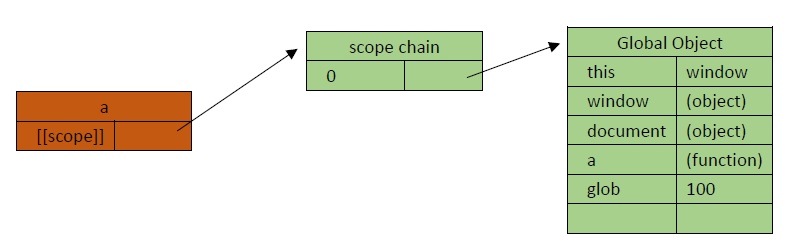

先不要细琢磨上面GO里放置的各个属性。上面a.[[scope]]还没有构成一个链，只有GO对象的存在，下面继续。

a函数被执行时，发生如下过程：

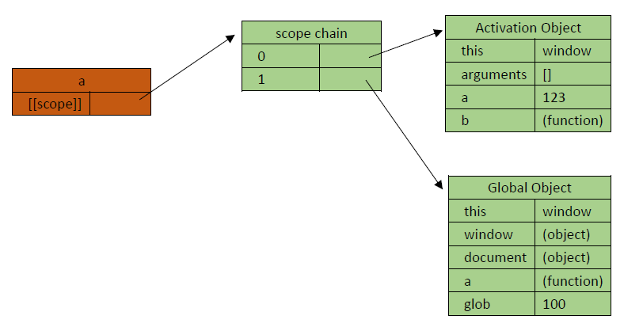

a函数执行前一刻所产生的AO对象放到了a函数作用域a.[[scope]]的顶端；现在a.[[scope]]上已构成一个链.

- 查找变量：从作用域链的顶端依次向下查找（再补充：在哪个函数里查找变量，就去哪个函数的作用域顶端去查找），最标准的说法。

  再继续研究刚刚的例子:

  ```js
  function a() {
  	function b() {
  		var b=234;
  	}
  }
  var glob = 100;
  a();
  ```

  b函数被创建时，发生如下过程：

  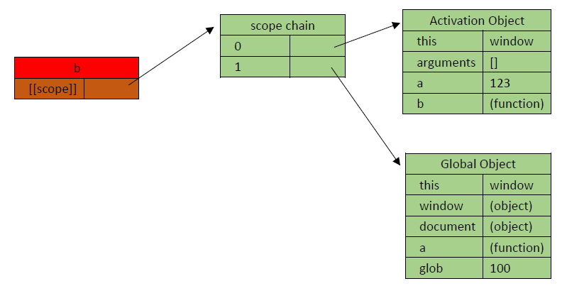

  也就是说b函数刚刚出生时所在的环境是a执行的结果，直接给b函数的出生创造好了环境。

  b函数被执行时，发生如下过程：

  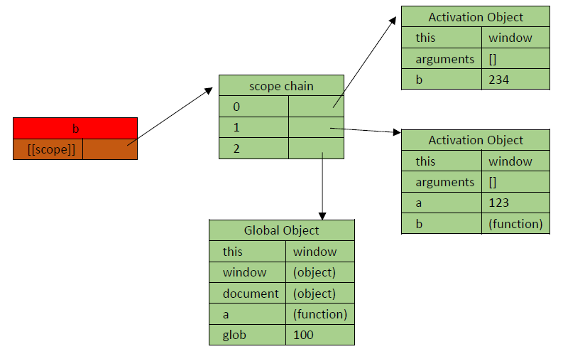

  b函数执行前一刻产生的AO对象放置在b.[[scope]]的最顶端。现在透彻地理解一下，在函数b中去访问变量时，是在b函数的作用域[[scope]]最顶端去查找变量。

  再深入剖析看看，检查自己是否理解清楚了：

  首先，a作用域中的顶端AO与b作用域的第二个AO是同一个AO的引用么？还是两个不同的AO？

  答案：是同一个AO的引用，下面代码来验证一下

  ```js
  1	function a() {
  2		function b() {
  3			var b=234;
  4			aa=0;
  5		}
  6		var aa=123;
  7		b( );
  8		console.log(aa);//输出0，代表变量aa在语句b()执行完之后，值被改变了。
  9	}
  10	var glob = 100;
  11	a();
  
  GO{
      glob:100,
      a:~~~~~
  }
  
      AO(a){
          aa:0,
           b:~~~~~~   
      }
           
      
  ```

  再来，在上面的例子中，第7行b函数执行完之后，概念上是执行期上下文被销毁，而实际函数a和函数b的作用域变化应该是什么样的呢？

  答案：

  - b函数执行完之后，自己的执行期上下文AO被干掉（销毁），即b.[[scope]]回到b被定义的状态。
  - 往下进行到第9行，a函数执行完后，b函数作用域b.[[scope]]直接被销毁；同时，a函数的执行期上下文AO被销毁，a.[[scope]]回到被定义的状态，a函数等待下一次被调用执行。

思考一下，下面函数执行的作用域链：

```js
function a() {
	function b(){
		function c() {
		
		}
		c();
	}
	b();
}
a();
```

具体过程如下

```
a 定义:  a.[[scope]]    --> 	0：GO

a 执行:  a.[[scope]]    --> 	0：AO(a)
		      				 1：GO
		      				 
b 定义:  b.[[scope]]    --> 	0：AO(a)
		      				 1：GO
注意b执行了才会产生c的定义哈！！
b 执行:  b.[[scope]]    --> 	0：AO(b)
		      				 1：AO(a)
		      				 2：GO
		      				 
c 定义:  c.[[scope]]    --> 	0：AO(b)
		     				 1：AO(a)
		     				 2：GO
		     				 
c 执行： c.[[scope]]    -->   0：AO(c)
		      				 1：AO(b)
		      				 2：AO(a)
		      				 3：GO
```

现在再来看这句话，函数里边能访问函数外边的变量，但函数外边不能访问呢函数里边的变量；从上边的过程来看，在b中访问c中的局部变量，是不可能的，因为b.[[scope]]中不存在函数c的执行期上下文AO(c)。

关于作用域链，练习一下：

```js
a=100;
function demo(e){
	function e() {	}
	arguments[0]=2;
	document.write(e+"<br>");//2
	if(a){
		var b=123;
		function c() {  
            //zhu都能做得出来哈 
        }
        //假设浏览器支持在if语句中声明函数
	}
	var c;
	a=10;
	var a;
	document.write(b+"<br>");//undefined
	f=123;
	document.write(c+"<br>");//function c()
	document.write(a+"<br>");//10
}
var a;
demo(1);
document.write(a+"<br>");//100
document.write(f+"<br>");  //123 

GO{
    a:100,
    demo:function demo(e){,
    f:123
}
    
    AO(demo){
        e:2,
        b:undefined,
        c:function c(),
        a:10
    }


2   undefined   functionc    10   100  123

```

现在来看一个例子：

```js
1 function a() {
2 	var aaa=123;
3 	function b() {
4 		var bbb=234;
5 		console.log(aaa);
6 	}
7 	return b;
8 }
9
10 var glob=100;
11 var demo=a();
12 demo();
```

函数a执行时，a.[[scope]]如下：

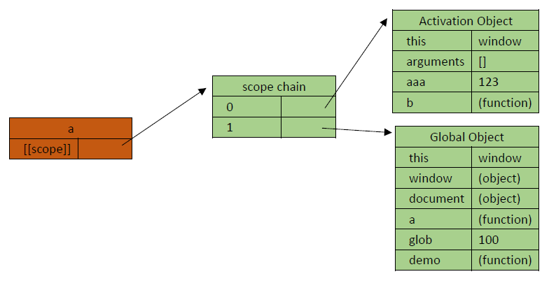

函数b被定义时，b.[[scope]]如下：

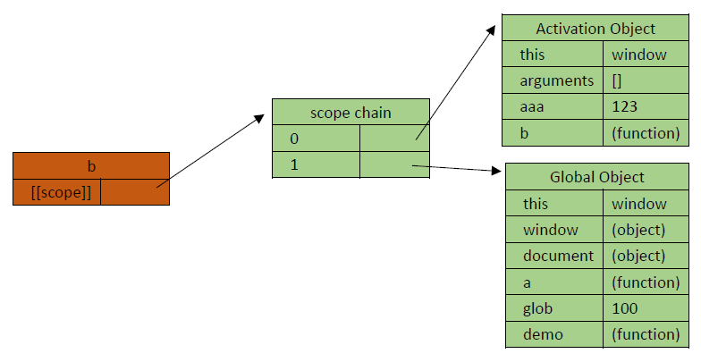

函数b出生时是直接继承a的作用域的，所以：

整体的情况是

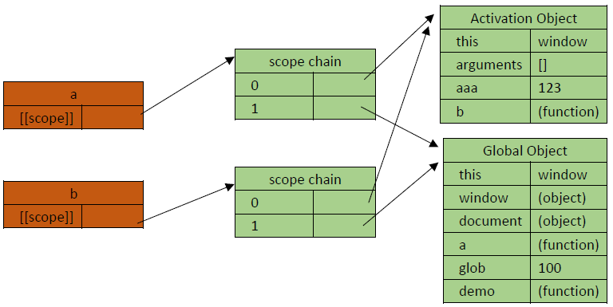


a函数被执行完毕之后，a函数的执行期上下文肯定是要被销毁(销毁=拆线)的，所以应该是下面的状况：

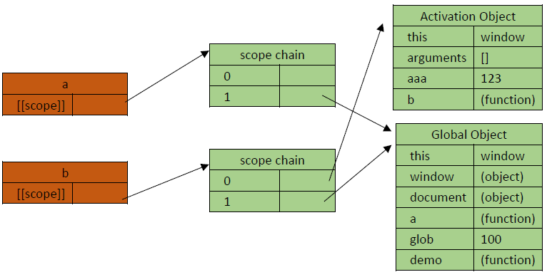

那么b.[[scope]]会不会被销毁呢？

答案：b.[[scope]]不会被销毁。注意到上面例子中一个神奇的事情，在上例代码中的第7行，b函数被返回了。所以，在代码第11行，函数a被执行完毕后被返回的b函数最终存于变量demo中，b.[[scope]]不会被销毁。

上面这种情况就是闭包，总结一下，但凡是内部的函数被保存到了外部，那一定会形成闭包。


#### 9.4 函数闭包

官方对闭包的解释是：一个拥有许多变量和绑定了这些变量的环境的<u>表达式</u>（通常是一个函数），因而这些变量也是该表达式的一部分。

```
面试题：闭包是什么？
答：闭包是可访问上一层函数作用域里变量的函数，即便上一层函数已经关闭。

```

练习一，一个小例子：

```js
function a() {
	var num=100;
	function b() {
		num++;
		console.log(num);
	}
	return b;
}
var demo=a();
demo();
demo();
```

练习二，再来玩玩儿闭包：

```js
function fun(n, o) {
		console.log(o);//undefined   0  0   
		return {
				fun: function (m) {
						return fun(m, n);
				}
		};
}

var a = fun(0);//打印什么？


a.fun(1);
a.fun(2);
a.fun(3);

var b = fun(0).fun(1).fun(2).fun(3); 


var c = fun(0).fun(1); 
c.fun(2);  
c.fun(3); 

```

最后轻松一下，再来个小练习：

```js
function Person(name,age,sex){
	var a=0;
	this.name=name;
	this.sex=sex;
	function sss(){
		a++;
		document.write(a);
	}
	this.say=sss;
}


var oPerson = new Person();
oPerson.say();//1  2
oPerson.say();//2  3
var oPerson1= new Person();
oPerson1.say();//1 2
```


##### 9.4.1 闭包的特点

1. 作为一个函数变量的一个引用，当函数返回时，其处于激活状态。
2. 一个闭包就是当一个函数返回时，一个没有释放资源的栈区。

简单的说，Javascript允许使用内部函数---即函数定义和函数表达式位于另一个函数的函数体内。而且，这些内部函数可以访问它们所在的外部函数中声明的所有局部变量、参数和声明的其他内部函数。当其中一个这样的内部函数在包含它们的外部函数之外被调用时，就会形成闭包。

优点：可以访问局部变量。

缺点：局部变量一直占用内存，内存占用严重，还容易造成内存泄漏（内存被占用，剩余的内存变少，程序加载、处理速度变慢）。


##### 9.4.2 闭包的几种写法

第一种：写在原型对象的方法上

```js
//第1种写法  
          function Person() {
          }

          Person.prototype.type="人类";
          Person.prototype.getType=function () {
              return this.type;
          }
          
          var person = new Person();
          console.log(person.getType());//"人类"
```

第二种：内部函数语句访问外部函数的变量，将内部函数写在外部函数的return中

```js
var Circle = function() {  
   var obj = new Object();  
   obj.PI = 3.14159;  
     
   obj.area = function( r ) {  
       return this.PI * r * r;  
       //this访问了外部函数的变量obj
   }  
   return obj;  
}  
  
var c = new Circle();  
alert( c.area( 1.0 ) );  
```

第三种：通过表达式写在对象的方法上

```js
var Circle = new Object();  
Circle.PI = 3.14159;  
Circle.Area = function( r ) {  
       return this.PI * r * r;  
}  
  
alert( Circle.Area( 1.0 ) );  
```

第四种：通过属性创建写在对象的方法上

```js
var Circle={  
   "PI":3.14159,  
   "area":function(r){  
          return this.PI * r * r;  
        }  
};  
alert( Circle.area(1.0) );  
```

第五种：通过全局变量赋值(类似于第二种写法的原理)

```js
var demo;
function test(){
    var aaa=100;
    function b(){
        console.log(aaa)
    }
    return b;
    //demo=b；
}
demo=test()
test();
demo();
```


##### 9.4.3 闭包的用途

**实现公有变量**

eg：函数累加器

```js
function add() {
    var counter = 0;
    return counter += 1;
}
 
add();//1
add();//1
add();//1
// 本意是想输出 3, 但事与愿违，输出的都是 1 
```

你可以使用全局变量，函数设置计数器递增：

```js
var counter = 0;
 
function add() {
   return counter += 1;
}
 
add();
add();
add();
 
// 计数器现在为 3
```

但问题来了，页面上的任何脚本都能改变计数器，即便没有调用 add() 函数。

这时我们需要闭包。

```js
var add = (function () {
    var counter = 0;
    return function () {return counter += 1;}
})();
 
add();//1
add();//2
add();//3
 
// 计数器为 3
```

**可以做缓存**	

eg：eater

```js
function eater() {
	var food="";
	var obj={
		eat : function(){
			console.log("i am eating"+food);
			food="";
		},
		push : function(myfood){
			food=myfood;
		}
	}
	return obj;
}
var eater1 = eater();//
eater1.push("banana")
eater1.eat();//打印i am eating banana

eater2=eater();
eater2.push("apple");

eater1.eat();//i am eating 

eater.eat();
```

暂时不必要理解”缓存“代表的是什么，先把这种闭包调用过程理解了就行（多个方法都可以在外部对同一个局部变量进行操作），以后讲到闭包高级应用的时候会再提出来的。

**可以实现封装，属性私有化**

eg:Person();

```js
var person = function(){    
    //变量作用域为函数内部，外部无法访问    
    var name = "default";       
       
    return {    
       getName : function(){    
           return name;    
       },    
       setName : function(newName){    
           name = newName;    
       }    
    }    
}();    
     
console.log(person.name); //undefined
console.log(person.getName()); //"default" 
person.setName("abruzzi");
console.log(person.getName());  //"abruzzi"
   
得到结果如下：  
   
undefined  
default  
abruzzi
```

**模块化开发，防止污染全局变量**

```
var a=(function(j){
	
	return function{console.log(j)}
    //模块内的函数变量不会被外部函数所污染，且执行完立即被销毁，不会浪费空间
    
}(i))
```

**实现类和继承**

```js
function Person(){    
    var name = "default";       
       
    return {    
       getName : function(){    
           return name;    
       },    
       setName : function(newName){    
           name = newName;    
       }
    }    
 };   

    var p = new Person();
    p.setName("Tom");
    alert(p.getName());//Tom

    var Jack = function(){};
    //修改Jack这个构造函数的属性prototype的引用，让其构造对象可以继承自Person
    Jack.prototype = new Person();
    //添加私有方法
    Jack.prototype.Say = function(){
        alert("Hello,my name is"+name);
    };
    var j = new Jack();
    j.setName("Jack");
    j.Say();
    alert(j.getName());
```

练习任务一：封装一个框架，用于修改<u>指定元素</u>的<u>css</u>

练习任务二：基于闭包的轮播图


##### 9.4.4 闭包的避免

看一下下main函数的执行结果：

```js
1 function test() {
2 	var arr=[];
3 	for(var i=0;i<10;i++){
4 		arr[i]=function(){
5 			document.write(i+"    ");
6 			//上面的语句中并不存在赋值，只有在该函数被调用时，上面语句才会去寻找变量i的值
7 		}
8 	}
9 	return arr;
10 }
11 var myArr = test();
12 for(var j=0;j<10;j++){
13 	myArr[j]();
14 }
```

上面函数将在界面上打印出10个10，数组myArr中保存的时test()执行后返回的数组arr，该数组存的是10个函数。

从第12行开始一个for循环，将数组myArr中的每一个函数都取出来调用一遍。

为了可以打印出0~9来，首先考虑内部函数自调用：

```js
3 for(var i=0;i<10;i++){
4 		arr[i]=function(){
5 			document.write(i+"    ");
6 			//上面的语句中并不存在赋值，只有在该函数被调用时，上面语句才会去寻找变量i的值
7 		}()
8 	}
```

但这是立即执行，执行一遍就没有了。要想达到随时可以调用函数打印出0~9来，要怎么做？看看下面的代码：

```js
for(var i=0;i<10;i++){
	(function(j){
    	arr[j]=function(){
 			document.write(j+"    ");
 		}
	}(i))
}
```

- 看得懂么？看不懂的话，往下看。
  - 循环执行10次，就有10个立即执行函数被执行；每个立即执行函数执行后其引用都会被销毁，所以10次循环对应的是10个立即函数。
  - 每个立即执行函数执行时，该立即执行函数中的形参j 都被实参i 所赋值。
  - 在10个立即执行函数执行后，数组arr中保存了10个函数 function(){ document.write(j+"    ");}。
  - 这10个函数对应的j 是10个立即执行函数的形参j，所以，数组arr中保存的10个函数中j 的值分别对应的是0~9。

这样才能随心所欲的打印出循环里的值0~9。

看一道阿里巴巴笔试题，练习一下：

```html
<ul>
	<li>a</li>
	<li>a</li>
	<li>a</li>
	<li>a</li>
</ul>
<!-- 使用原生js给每个li绑定一个点击事件，点击对应的li，输出其顺序 -->
```

下面这样写对么？

```js
var liCollection=document.querySelectorAll("li");
for(var i=0;i<liCollection.length;i++){
	liCollection[i].onclick=function(){
		console.log(i);
	}
}
```

不对的话，应该怎么改？

#### 9.5 函数-特殊的对象

##### 9.5.1 函数的属性

函数是js中特殊的对象，该对象有自带的属性：

- length：函数属性，函数形参的个数；

  ```js
  function fn (a, b, c) {}
  
  console.log(fn.length);		//3
  ```

  该属性的经典用法是用于验证参数：

  ```js
  function calleeLengthDemo(arg1, arg2) {
  	//调用callee，返回当前正在被执行的函数本身，所以arguments.callee.length代表形参
  	//arguments.length代表实参
      if (arguments.length==arguments.callee.length) {
            window.alert("验证形参和实参长度正确！");
          return;
        } else {
            alert("实参长度：" +arguments.length);
            alert("形参长度： " +arguments.callee.length);
        }
  }
  ```

- prototype：函数属性，指向一个对象的引用，称为原型对象；

  ```js
  console.log(Array.prototype);
  ```

##### 9.5.2 函数的方法

- call() 和apply()：实现方法劫持

每个函数都包含两个非继承而来的方法：call()方法和apply()方法。这两个方法的作用都是一样的。都是在特定的作用域中调用函数，想当于设置函数体内this对象的值，以扩充函数赖以运行的作用域。

```
作用，改变this指向
区别，传参形式不同

```

**call**

例1

```html
    <script>
        window.color = 'red';
        document.color = 'yellow';

        var s1 = {color: 'blue' };
        function changeColor(){
            console.log(this.color);
        }

        changeColor.call();   // red     
        changeColor.call(window);   //red
        changeColor.call(document); //yellow
        changeColor.call(this);    //red
        changeColor.call(s1);       //blue
    </script>
```

例2

```js
function sum(num1, num2){
    console.log(this);//this指向-window
    return num1 + num2;//20
}
function callSum(num1, num2){
    return sum.call(this, num1, num2);
}
console.log(callSum(10,10));  
```

**apply**

apply()方法接收两个参数：一个是在其中运行函数的作用域(或者可以说成是要调用函数的母对象，它是调用上下文，在函数体内通过this来获得对它的引用)，另一个是参数数组。其中，第二个参数可以是Array的实例，也可以是arguments对象.

```js
function sum(num1, num2){
    return num1 + num2;
}
//因为运行函数的作用域是全局作用域，所以this代表的是window对象
function callSum1(num1, num2){
    //arguments对象：函数对象内，自动创建的专门接收所有参数值得类数组对象arguments = []。
	//arguments[i]: 获得传入的下标为i的参数值
	//arguments.length: 获得传入的参数个数！
    return sum.apply(this, arguments);
}
function callSum2(num1, num2){
    return sum.apply(this, [num1, num2]);
}
console.log(callSum1(10,10));//20
console.log(callSum2(10,10));//20
```

面试问题：JavaScript的call和apply方法是做什么的，两者有什么区别？


练习一下，call和apply经典用法，实现继承：

```js
	function Person(name, age){
        this.name = name;
        this.age  = age;
		this.talk = function () {
			console.log(this.name + '的年龄是'+this.age+'岁');
        }
	}

	function itgirl (name, code, age) {
        Person.call(this, name, age);
        this.code = code;
        this.mycode = function () {  console.log('我在学习' + this.code);  }
	}

	var girl1 = new itgirl('一个女生', 'H5', 20);//
	girl1.talk();//
	girl1.mycode();
```

- toString()：返回自定义函数的完整代码。

```js
function fn (a, b, c) {'函数代码'}

var str = fn.toString();
console.log(str);
```


#### 9.6  高阶函数

高阶函数是指操作函数的函数，一般地，有以下两种情况
　　1、函数可以作为参数被传递
　　2、函数可以作为返回值输出

- 参数传递

来看个例子，理解一下：

```js
function addnum (a, b, fn) {
    return fn(a) + fn(b); 
}

var a = addnum(20, -30, Math.abs);//50
```

- 返回值输出


下面是使用Object.prototype.toString方法判断数据类型的三个isType函数：

```js
var isString = function( obj ){
  return Object.prototype.toString.call( obj ) === '[object String]';
};

var isArray = function( obj ){
  return Object.prototype.toString.call( obj ) === '[object Array]';
};

var isNumber = function( obj ){
  return Object.prototype.toString.call( obj ) === '[object Number]';
};
```

实际上，这些函数的大部分实现都是相同的，不同的只是Object.prototype.toString.call(obj)返回的字符串。为了避免多余的代码，可以把这些字符串作为参数提前传入isType函数。代码如下：

```js
var isType = function( type ){ 
  return function( obj ){
    return Object.prototype.toString.call( obj ) === '[object '+ type +']';
  }
};

var isString = isType( 'String' ); 
var isArray = isType( 'Array' ); 
var isNumber = isType( 'Number' );

console.log( isArray( [ 1, 2, 3 ] ) );    // 输出：true
```

复杂点的高阶函数；


```js
//检查一个值是否为偶数
function even (a) {
	return a%2 === 0;	//返回true或false
}
//对函数判断进行反转
function not (f) {
	return function () {
		var result = f.apply(this, arguments);
		console.log(!result);//这里会打印什么那？我很好奇
		return !result;
	}
}

var odd     = not(even);
console.log(odd);
/*odd变量所存储的函数如下：
function () {
	var result = even.apply(this, arguments);
	console.log(!result);//true true true false
	return !result;
}
*/
var arr     = [1,3,5,4];
var r1      = arr.every(odd);//false,every需要所有的返回值都是true才能返回true,遇到一个返回值是false 的时候，立即返回false,停止迭代。
var r2      = arr.some(odd);//true
console.log(r1);
console.log(r2);

```


## 10、正则表达式

正则表达式RegExp(Regular Expression)：匹配 特殊字符或有特殊搭配原则的字符 的最佳选择。

eg：匹配“XYXY”格式字符串。

【课前补充】

- 转义字符\，在反斜杠\后边放的紧挨着得字符被强制转化成文本

  ```
  eg:
  	\"-----实现在双引号里再放双引号
  	\r-----行结束符,即回车
  	\t-----制表符，键盘得tab键
  ```

- 多行字符串

  ```
  eg:	
  	\------还可以转义回车（换行）符号，实现js语法上的多行字符串
  ```

- 换行的转义字符

  ```
  eg：	
  	\n------实现换行
  ```


#### 10.1 语法规则

##### 10.1.1 创建方法

两种创建方式：

1、直接量

其本身是一个对象，表达的意义是一种规则。

（1）在两个斜杠中间写规则。

```js
var  reg=/abc/;
var  str="abcd";
reg.test(str)  ;	//true，检查在字符串str中有没有符合reg规则得字符
```

（2）在正则表达式得双反斜杠后边还可以加字母i、g、m，表达其属性。

```js
//i===》ignorcase，忽略大小写
//eg：
var  reg=/abce/i;
var  str="ABCEd";
reg.test(str)  ;
```

2、构造方法RegExp()

```js
//使用new操作符，new RegExp();
//eg：
var reg=new RegExp("abc");
var str="abcd";
reg.test(str);

//在new RegExp("abc")函数里边也可以添加属性i、g、m
//eg：
var reg=new RegExp("abc","im");
var str="abcd";
```

 使用new操作符，可以将已经存在的正则表达式用来给函数RegExp()传参，构造新的正则表达式。

```js
//reg与reg1值相同，但两个两个值相互独立,即reg!=reg1
//eg：
var reg=/abce/m;
var reg1=new RegExp(reg);
```

若去除new操作符，将已经存在的正则表达式用来给函数RegExp()传参，只是传递引用，不能构建新的正则表达式，极少的用法。

```js
//reg与reg1只是对同一个正则表达式的引用
//eg：
var reg=/abce/m;
var reg1=RegExp(reg);
reg.abc=3;
console.log(reg1.abc);//3
```

##### 10.1.2 三个属性i,g,m

正则表达式的属性（也称修饰符），可以在全局搜索中不区分大小写:

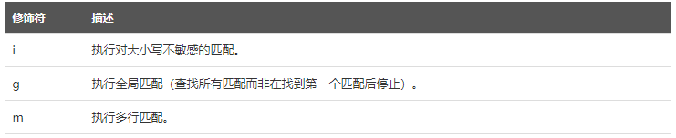

i ---》（ignoreCase ）执行匹配时忽略大小写
g---》（global）执行全局匹配（查找所有匹配而非在找到第一个匹配后停止）

```js
//使用字符串的match方法
//eg：
var reg=/ab/;
var str="ababababab";
str.match(reg);//["ab"]，只查找到第一个匹配值便返回
reg=/ab/g;
str.match(reg);//["ab","ab","ab","ab","ab"]，全局查找，把所有匹配值均返回
```

m---》（multiline）执行多行匹配

```js
//eg：
var reg=/a/g;
var str="abcdea";
str.match(reg);//["a","a"]
reg=/^a/g;//插入符^指的是以字母a为开头
str.match(reg);//["a"]
str="abcde\na";
str.match(reg);//["a"]，还没有多行匹配属性
reg=/^a/gm;
str.match(reg);//["a","a"]
```

#####10.1.3 方括号

方括号用于查找某个范围内的字符：

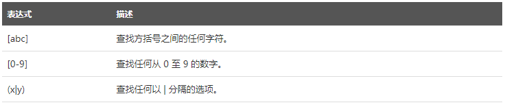

一个**中括号**代表一位，中括号里边的内容代表的是这一位可以取值的范围

```js
//eg1: 
	var  reg=/[1234567890][1234567890][1234567890]/g;
	var  str="12309u98723zpoixcuypiouqwer";
	str.match(reg);//["123","987"]
	
//eg2:
	var reg=/[ab][cd][d]/g;
	var str="abcd";
	str.match(reg);//["bcd"];

//eg3:
	var reg=/[0-9A-Za-z][cd][d]/g;//相当于var reg=/[0-9A-z][cd][d]/g
	var str="ab1cd";
	str.match(reg);//["1cd"];
```

插入符^放到[]里边表示"非"的意思

```js
//eg:
	var reg=/[^a][^b]/g;//插入符^放到[]里边表示"非"的意思
	var str="ab1cd";
	str.match(reg);//["b1","cd"];
```

在**括号**里可以加入"|"表示"或"的意思，"|"操作符两边放匹配规则

```js
//eg：
	var reg=/(abc|bcd)/g;
	var str="abc";
	str.match(reg);//["abc"];//该规则既能匹配出字符串"abc"
	str="bcd";
	str.match(reg);//["bcd"];//该规则又能匹配出字符串"bcd"
	reg=/(abc|bcd)[0-9]/g;  //匹配规则可以任意组合
	str="bcd2";
	str.match(reg);//["bcd2"]
```

##### 10.1.4 元字符

元字符是拥有特殊含义的字符，元字符也可以组合放进中括号里去使用，一个元字符代表一位(\d|\D)

| 元字符 | 描述                                     |
| ------ | ---------------------------------------- |
| \w     | 查找单词字符(字母+数字+下划线)           |
| \W     | 查找非单词字符                           |
| \d     | 查找数字                                 |
| \D     | 查找非数字字符                           |
| \s     | 查找空白字符                             |
| \S     | 查找非空白字符                           |
| \b     | 匹配单词边界                             |
| \B     | 匹配非单词边界                           |
| \t     | 查找制表符                               |
| \n     | 查找换行符                               |
| \f     | 查找换页符                               |
| \v     | 查找垂直制表符                           |
| \uXXXX | 查找以十六进制规定的Unicode字符          |
| .      | （点号）查找单个字符，除了换行和行结束符 |

"\w"---->[0-9A-z_]，(word)单词字符，字母字符

```js
//eg:
	var reg=/\wcd2/g;
	var str="bcd2";
	str.match(reg);//["bcd2"]

	//"\W"---->[^\w]，即\W是\w的补集
	reg=/\Wcd2/g;//匹配规则换成\W就不能匹配了，因为字符串里的字符均为\w所包括的字符
	str.match(reg);//null

	str="b*cd2";//这样"*"就能符合规则\W了
	str.match(reg);//["*cd2"]

//若要在正则表达式里匹配反斜杠\，直接写/\/是不行的，需要加上转义字符/\\/
```

"\d"---->[0-9]

```js
//eg:
	//"\D"---->[^\d]
	var reg=/\d\d\d/g;
	var str="123";
	str.match(reg);//["123"]
```

"\s"---->匹配空白字符
​		空白字符包括：空格符[ ]、制表符\t、回车符\r、换行符\n、垂直换行符\v、换页符\f

```js
 //附：
 	"\S"---->[^\s]
```

"\b"---->匹配单词边界（border）

```js
//eg:
	//"\B"---->非单词边界
	var reg=/\bcde/g;//单词边界后边是cde字符串
	var str="abc cde fgh";
	str.match(reg);//["cde"]

	str="abc cde fgh";
	reg=/\bcde\b/g;//该规则也能够匹配出来
	str.match(reg);//["cde"]
	
	reg=/\bcde\b/g;
	str="abc cdefgh";//这种字符串就不能匹配出来了
	str.match(reg);//null

	str="abc cdefgh";
	reg=/\bcde\B/g;//匹配规则换成\B就可以了
	str.match(reg);//["cde"]
```

  "\t"---->匹配制表符

```js
//eg：
	var reg=/\tc/g;
	var str="ab	cde";//c字母前有一个tab键
	str.match(reg);//null，无法匹配视觉效果上的一个tab

	str="ab\tcde";	
	str.match(reg);//["	c"]
	//即"\t"只能匹配字符"\t"，控制台对\t的打印以转义序列制表符"\t"的方式打印
	//所以最后结果是["	c"]
	

	//其他"\n"、"\f"、"\v"类似于"\t"的使用
	//"."---->[^/r/n]，匹配"非"行结束符和换行符
```

unicode编码，\uXXXXXX，一般为6位16进制码

不需要记住哪个字符对应是哪个Unicode编码，要用到的时候可借助“Unicode在线编码转换器”

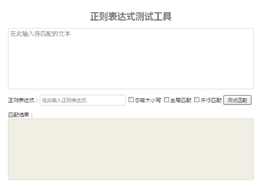

```js
//eg：
	var reg=/\u8eab\u4f53\u597d/g；
	var str="身体好";
	str.match(reg);//["身体好"]

	reg=/[\u4000-\u9000]/g;//也可使用区间去定义规则
	str="身体好";
	str.match(reg);//["身","体","好"]

	var reg=/[/u0000-/uffff]/g;//能够代表几乎一切字符
	reg=/[\s\S]/g;//这才能够代表匹配一切	
```

##### 10.1.5 量词

量词，代表数量的词（下面表达式的n代表的是一个匹配规则，n后边符号的符号定义量词规则）。

贪婪匹配。

| 量词   | 描述                                      |
| ------ | ----------------------------------------- |
| n+     | 匹配任何包含至少一个n的字符串             |
| n*     | 匹配任何包含零个或多个n的字符串           |
| n？    | 匹配任何包含零个或一个n的字符串           |
| n{X}   | 匹配包含X 个n 的序列的字符串              |
| n{X,Y} | 匹配任何包含X 个至Y 个n 的序列的字符串    |
| n{X,}  | 匹配包含至少X 个n 的序列的字符串          |
| n$     | 匹配任何结尾为n 的字符串                  |
| ^n     | 匹配任何开头为n 的字符串                  |
| S(?=n) | 匹配任何其后紧接指定字符串n 的字符串S     |
| S(?!n) | 匹配任何其后没有紧接指定字符串n 的字符串S |

n+	---->	{1,Infinity}个

n*	---->	{0,Infinity}个

n?    ---->(0,1)个

```js
//eg:	
	var reg=/\w+/g;//匹配\w类的字符出现一次或多次的字符串
	var str="abcvfskhfls";
	str.match(reg);//["abcvfskhfls"]，贪婪匹配原则
	
	reg=/\w*/g;//匹配\w类的字符出现零次或多次的字符串
	str="abc";
	str.match(reg);//["abc",""]
	//全局匹配到"abc"之后，逻辑上从那以后还有段距离
	//这段距离符合规则"出现零次或多次的字符串"，所以匹配出来一个空字符串
	//贪婪匹配原则
	
	var reg=/\d*/g;
	var str="abc";
	str.match(reg);//["","","",""]
	//该原则对字母a/b/c是无法匹配出来的，所以匹配出空字符串""
	//最后再在最后一个光标位匹配出一个空字符串来，所以一共4个空字符串
```

n?	---->0个或1个

```js
//eg：
	var reg=/\w?/g;
	var str="aaaaa";
	str.match(reg);//["a","a","a","a","a",""]，最后还会有一个空字符串""

//若要在正则表达式里匹配问号?，直接写/?/是不行的，需要加上转义字符，写成/\?/
```

^n	---->	匹配以n 为开头的字符串n
n$	---->	匹配以n 为结尾的字符串n

```js
//eg：
	var reg=/ed$/g;//以ed为结尾时匹配
	var str="abcded";
	str.match(reg);//["ed"]
	
	var reg=/^abc$/g;//以该abc开头，且以同一abc为结尾的字符串
	var str="abcabc";
	str.match(reg);//null

	var reg=/^abc$/g;//以该abc开头，且以同一abc为结尾的字符串
	var str="abc";
	str.match(reg);//["abc"]
```

?=n	----->n只参与条件限定，限定其后紧接指定字符串n 的字符串，但并不参与选择

?!n	----->n只参与条件限定，限定其后没有紧接指定字符串n 的字符串，但并不参与选择

```js
//正向预查  正向断言
	var str="aabaaaa";
	var reg=/aa(?=b)/g;//b只参与条件限定，并不参与选择
	str.match(reg);//["aa"],此时只有一个a 它的后面有紧跟字符b

	var str="aabaaaa";
	var reg=/aa(?!b)/g;
	str.match(reg);//[aa,aa],此时有4个a 它的后面没有紧跟字符b
```

太无聊了？来做点题吧~

练习一：写一个正则表达式，检验字符串首尾是否含有数字。

分析题目--字符串首有或尾部有数字

```js
//答：
	var reg=/^\d|\d$/g;
	var str="123abc";
	str.match(reg);//["1"]
```

练习二：写一个正则表达式，检验字符串首尾是否含都有数字。

```js
//答：
1dgadk3   1
	var reg=/(^\d[\s\S]*\d$|^\d$)/g;
//[\s\S]指开始与结束字符中间为任意字符，*指出现0到多次
	var str="123abc123";
	str.match(reg);//["123abc123"]
```


####10.2 正则对象方法

| 方法 | 描述                                                         |
| ---- | ------------------------------------------------------------ |
| exec | 寻找字符串中是否含有检测的字符。返回：将找到的字符按数组返回。(execute) |
| test | 检测字符串中是否含有检测的字符。返回：boolean。              |

reg.exec();	---->executive，执行匹配

```js
//eg:
	var reg=/ab/g;
	var str="abababab";
	reg.exec(str);//["ab"]，尽管具有global属性，仍然只返回一个"ab"
	
	//再继续
	reg.exec(str);//["ab"]
	reg.exec(str);//["ab"]
	reg.exec(str);//["ab"]
	reg.exec(str);//null
	reg.exec(str);//["ab"]
	reg.exec(str);//["ab"]
	//……
	//用console.log来试一遍
	console.log(reg.exec(str));//["ab",index:0,input:"abababab"]，类数组
	console.log(reg.exec(str));//["ab",index:2,input:"abababab"]
	//第二次匹配index变为2，是第二个"ab"字符串在原字符串中的起始位置
	console.log(reg.exec(str));//["ab",index:4,input:"abababab"]
	console.log(reg.exec(str));//["ab",index:6,input:"abababab"]
	console.log(reg.exec(str));//null
```


#### 10.3 正则实例属性

1、ignoreCase 是否设置了i

2、global 是否设置了g

3、multiline 是否设置了m

4、source 字面量形式对应的字符串

5、lastIndex 开始搜索一下个匹配项的字符位置，默认0

```js
var reg=/^\d[\s\S]*\d$/g;
reg.ignoreCase;//false，检测是否含有i 属性

reg.global;//true，检测是否含有g 属性

reg.multiline;//false，检测是否含有m 属性

reg.source;//"^\d[\s\S]*\d$"，匹配内容体
```

- lastIndex 与exec 方法相搭配使用，查找光标位置

```js
//eg：
	var reg=/ab/g;
	var str="abababab";
	console.log(reg.lastIndex);//0
	console.log(reg.exec(str));//["ab",index:0,input:"abababab"]
	console.log(reg.lastIndex);//2
	console.log(reg.exec(str));//["ab",index:2,input:"abababab"]
	console.log(reg.lastIndex);//4
	console.log(reg.exec(str));//["ab",index:4,input:"abababab"]
	console.log(reg.lastIndex);//6
	console.log(reg.exec(str));//["ab",index:6,input:"abababab"]
	console.log(reg.lastIndex);//8
	console.log(reg.exec(str));//null
	console.log(reg.lastIndex);//0
	console.log(reg.exec(str));//["ab",index:0,input:"abababab"]

	//reg.lastIndex是可手动修改的
	reg.lastIndex=0;//reg.lastIndex重置0
	console.log(reg.exec(str));
	//["ab",index:0,input:"abababab"]，与上面结果中的index相同

	//若匹配规则不含有global属性，那在允许exec()方法后lastIndex值始终为0
	var reg=/ab/;
	var str="abababab";
	console.log(reg.lastIndex);//0
	console.log(reg.exec(str));//["ab",index:0,input:"abababab"]
	console.log(reg.lastIndex);//0
	console.log(reg.exec(str));//["ab",index:0,input:"abababab"]
	
```

- **补充："\n" 反向引用，指的是要引用的第n个括号里的表达式值** 

```js
//eg1:
	var str="aaaa";
	var reg=/(a)\1/g;//括号"()"后边的"\1"为反向引用第一个括号的值
	reg=/(\w)\1\1\1/g;//3个"\1"代表后边还要引用第一个括号里的值3次

//eg2:
	reg=/(\w)\1\1\1/g;
	 str="aaaa";
	str.match(reg);//["aaaa"]
	
	reg=/(\w)\1\1\1/g;
	str="aaaabbbb";
	str.match(reg);//["aaaa","bbbb"]

	//要匹配"XXYY"格式的字符串
	reg=/(\w)\1(\w)\2/;//"\2"代表引用第二个括号里的值
	str="aabb";
	str.match(reg);//["aabb"]
	console.log(reg.exec(str));//["aabb","a","b",index:0,input:"aabb"]
	//上边结果中的"a","b"是类数组的数据位，即两个"\w"所匹配到的值
```


####10.4 支持正则表达式的String对象的方法

| 方法    | 描述                                             |
| ------- | ------------------------------------------------ |
| search  | 检索与正则表达式相匹配的值，返回匹配字符串的位置 |
| match   | 找到一个或多个正则表达式的匹配                   |
| replace | 替换与正则表达式匹配的字串                       |
| split   | 把字符串分割为字符串数组                         |

str.match(reg)	---->在规则中是否含有global 属性时的表现是不同的（与reg.exec(str)的微小区别）

```js
reg=/(\w)\1(\w)\2/;//无global属性,反向索引
str="aabbgghh";
str.match(reg);//["aabb","a","b",index:0,input:"aabb"]

reg=/(\w)\1(\w)\2/g;//具有global属性
str="aabb";
console.log(str.match(reg));//["aabb"]
```

str.search(reg)	---->匹配后返回的是所匹配字符串的位置，匹配不到时返回-1

```js
reg=/(\w)\1(\w)\2/g;
str="edbaabbbbee";
str.search(reg);
str.search(reg);//3，与lastIndex无关,只返回第一个符合匹配规则的索引位置

reg=/(\w)\1(\w)\2/g;
str="abc";
str.search(reg);//-1
```

str.split(reg)	---->按照正则表达式拆分字符串

```js
//eg:
	var str="dai1akhd2gkhs";
	var reg=/\d/g;
	console.log(str.split(reg));//["dai","akhd","gkhs"]，即将分隔符两侧的字符串进行拆分
	
	var str="dai1akhd2gkhs";
	var reg=/(\d)/g;//"()"代表记录反向引用,将匹配表达式也返回回来，很少这样用
	console.log(str.split(reg));//["dai","1","akhd","2","gkhs"]

```

str.replace(reg,str1)	---->字符串替换；**最实用的方法** 。

两个参数，参数1放正则表达式，参数2放欲替换成的字符串

```js
//坑：
	var str="aa";
	console.log(str.replace("a","b"))	//ba,只会替换匹配到的第一个

	var str="abcdedfa";
	var reg=/a/;
	str.replace(reg,"b");	//ba,跟上边一样没写"g"还是只替换一个

//精华：
	var str="abcdedfa";
	var reg=/a/g;
	str.replace(reg,"b");
	//总结：
	//若参数1为字符串（非正则表达式），那将不具有全局替换的能力，只能替换第一个匹配的位置
	//只有正则表达式的global属性才具有全局替换的能力
```

出个题玩玩儿，练习一：将但凡匹配"XXYY"格式的字符串均替换成"YYXX"

```js
//答:
	var reg=/(\w)\1(\w)\2/g;
	var str="aabb";
	str.replace(reg,"$2$2$1$1");//bbaa
	
	//$1代表匹配规则里第一个匹配表达式的值，$2代表匹配规则里第二个匹配表达式的值
	//若要替换成为"$"符号，直接写是不行的，因为它带有语法意义
	//在它前边再加一个$即可达到转义效果，实现用$符进行替换
```

再来挑战一下，练习二：将"XYXY"格式的字符串均替换成"YXYX"

```js
//答：
	var reg=/(\w)(\w)\1\2/g;
	var str="abab";
	str.replace(reg,"$2$1$2$1");//baba
```

str.replace(reg,str1)	---->str1的位置还可以放置函数，该函数由系统调用；故可自定义替换格式。

上面练习一也可以答题如下：

```js
//答:
	var reg=/(\w)\1(\w)\2/g;
	var str="aabb";
	console.log(str.replace(reg,function($,$1,$2){
    	//形参$代表该函数会接受匹配结果，如"aabb"
        //形参$1代表该函数会接收匹配规则里第一个子匹配表达式的匹配结果
        //形参$2代表该函数会接收匹配规则里第二个子匹配表达式的匹配结果
        return $2+$2+$1+$1;
}))
//上边函数在返回值时就可以对返回结果进行自定义，如：return $2+$2+$1+$1+"abc".
```

再来练习一次，练习三：将"the-first-name"替换成驼峰式写法"theFirstName"

```js
//答：
	var reg=/-(\w)/g;//能匹配到["-f", "-n"],加括号之后才能使用$1 进行引用
	str="the-first-name";
	console.log(str.replace(reg,"$1"))//thefirstname，还没能转换成大写


	console.log(str.replace(reg,function($,$1){
        //function的形参不能只写一个，因为实参是按照顺序传递的
		return $1.toUpperCase();
	}))
	//theFirstName
    //每匹配依次，function执行依次
```


#### 10.5 贪婪匹配与非贪婪匹配

- 贪婪匹配即照着**"量词"**规则中要求的更多个的情况去做匹配


```js
	var str="aaaaa";
	var reg=/a+/g;
	str.match(reg);//["aaaaa"]
```

- 非贪婪匹配，在**"量词"**规则后边多加一个问号"?"

```js
	var str="aaaaa";
	var reg=/a+?/g;
	str.match(reg);//["a","a","a","a","a"]

	var str="aaaaa";
	var reg=/a{1,3}?/g;
	str.match(reg);//["a","a","a","a","a"]，用量词1去做匹配的非贪婪匹配

	var str="aaaaa";
	var reg=/a??/g;//第一个问号代表0~1个，第二个问号代表能取0就不取1去做匹配
	str.match(reg);//["","","","","",""]
```

一定课外多做练习，多做题！！

补充点好玩儿的练习吧，练习一：

```js
//题：	
	var str="aaaaaabbbbbbbccccc";
	//将字符串转换成"abc",字符串去重
	
//答：
	var reg=/(\w)\1*/g;//其中\1*代表反向引用{0,Infinity}个
	console.log(str.replace(reg,"$1"));//"abc"
```

来个最有意思，最难的一个练习题，练习二：

```js
//题：
	var str="100000000000";
	//将数字转换成科学计数法表示，从后往前每隔三位添一个逗号

//答：
	//分析1：从后往前查，需要用到结束符，$
	//分析2：结果中，逗号后边的数都将是3的倍数，(\d{3})+
	//分析3：使用正向预查，?=
	//分析4：添逗号，即将空""替换成逗号，所以正向预查前边不写任何东西代表匹配空
	var reg=/(?=(\d{3})+$)/g;
	console.log(str.replace(reg,","));//",100,000,000,000"
	
	//所以要替换的""还要加限定，它后边跟的不能是单词边界\B
	var reg=/(?=(\B)(\d{3})+$)/g;
	console.log(str.replace(reg,","));//"100,000,000,000"
```

来点小练习理解（个人推荐直接量）、巩固一下：

1. 是否带有小数

   ```js
   var objRegExp= /^\d+\.\d+$/;
   
   ```

2. 校验是否中文名称组成

   ```js
   var reg=/^[\u4E00-\u9FA5]{2,4}$/;
   ```

3. 校验是否全由8位数字组成

   ```js
   var reg=/^[0-9]{8}$/;
   ```

4. 校验电话码格式

   ```js
   var reg= /^((0\d{2,3}-\d{7,8})|(1[35847]\d{9}))$/;
   ```

5. 校验邮件地址是否合法

   9391493618639@qq.com

   ```js
   var reg=/^([a-zA-Z0-9_-])+@([a-zA-Z0-9_-])+(\.[a-zA-Z0-9_-])+/;
   ```


## 11、WEB浏览器

js的兼容性与安全性问题。

BOM：browser object model  浏览器的对象模型
​           通过window 对象来控制BOM，在客户端JS 中，window 对象是全局对象，所有的表达式都在当前的环境中计算

window 对象下的属性和方法：
​           （1）
​           浏览器可以通过调用系统对话框，向用户显示信息。
​           系统提供了三个函数，可以完成系统对话框的操作。
​           【注】window 下的函数都可以省略window 直接去调用
​           // alert()：直接弹出警告框，参数是警告框上显示的内容
​           alert("警告信息自定义");
​           // confirm()：弹出一个带有确定和取消的警告框，参数是给用户的选择提示，返回值true 或false
​           var res= confirm("您确定删除此座位么？");
​           // prompt()：弹出一个带输入的提示框，参数1 是要在提示框上显示的内容，参数2 是输入框内默认的值，返回值即输入值或null
​           var res= prompt("请输入一个数",0);
​           （2）
​           window.open()
​           参数：要加载的URL/窗口的名称或者窗口的目标/一串具有特殊意义的字符串
​           // 【注】如果只有第一个参数，多次调用open 方法会打开多个新标签页面，加载url 
​           open("http://www.baidu.com")
​           // 【注】第二个参数，是给打开的新窗口起一个名字，多次调用open 方法也只会打开一个新标签页面
​           open("http://www.baidu.com","百度")
​           // 【注】第三个参数，定义弹出的新浏览器窗口的大小，宽高不小于100，偏移不能为负值（相对于显示器窗口）
​           open("http://www.baidu.com","百度",'width=400,height=400,top=200,left=200') 
​           // opener对象：打开当前窗口的父窗口的window 对象，window.opener.document.write("子窗口可对父窗口进行操作")，ie不支持
​           （3）
​           location对象
​           window.location===window.document.location
​           location对象可以看作是浏览器地址栏的输入框
​           【注】它提供了与当前窗口中加载的文档的相关信息（可获取可修改），还提供了一些导航功能
​           location的属性：hash,host,hostname,href,pathname,port,protocol,search，描述统一资源定位符 URL
​           hash 指锚点，指当页面发生点击，页内跳转，这时url 中会存在"#锚点值"，location.hash 即为锚点值
​           host  指主机名(域名/IP)+端口号，hostname  主机名，href  完整url，pathname  资源目录，port  端口，protocol  协议，search  url带问号? 后的搜索词
​           url==》protocol://host:prot/pathname?search#hash


​           location的方法：assign()/reload()/replace()
​           window.location.assign("url")---跳转到指定的URL，同location.href，可通过浏览器后退键返回之前页面
​           window.location.reload("url")---不传参为重载，传参true 时会忽略浏览器缓存进行重载
​           window.location.replace("url")---用新的URL 替换当前页面，不能通过返回键返回之前页面
​           

​           （4）
​           history 是window 对象的属性，它保存这个用户上网的记录，代表的是浏览器地址栏左侧的三个按钮"刷新/前进/后退"
​           history 对象的属性：length---当前窗口加载过的页面个数
​           history 对象的方法：back()---返回上一条记录/forward()---前进到下一条记录
​    	                                       go()---参数为0则重载当前页面，参数为正数则前进对应数量的记录，参数为负数则后退对应数量的记录


####11.1 客户端JavaScript

呈现静态信息的页面叫做文档：

–	**window** 是web浏览器的一个窗口或窗体，是JavaScript特性和API的主要接入点；

–	**window** 对象是全局对象，处于作用域链的最顶层；

–	用户的体验不应完全依赖于JS，但JS能显著的提升用户体验；


#####11.1.1 Window对象-定时器

定时器是指在指定的时间单一或循环执行一个动作。

- setTimeout()：在指定的毫秒数之后`单一执行`一个函数，三个参数：

  参数1：要执行的函数名，不带小括号； 

  参数2：要等待的毫秒数，多少毫秒之后执行； 

  参数3：可忽略，是指给参数1这个函数传递的参数；

  ```js
  function st (argument) {
  	console.log('a' + argument);
  }
  //三个参数
  setTimeout(st, 2000, '打印我到控制台');
  ```

  只执行一次，只调用一次指定的函数，就一次。

- 如果要想取消这个定时器也是可以的，使用clearTimeout()；

  ```js
  function st (argument) {
      console.log('a' + argument);
  }
  //开启一个定时器，并把返回值存储下来
  var stid = setTimeout(st, 2000, '打印我到控制台');
  //清除这个定时器
  clearTimeout(stid);
  ```

- setInterval()：在指定的毫秒间隔里`重复执行`一个函数，三个参数：

  参数1：要执行的函数名，不带小括号； 

  参数2：执行的间隔毫秒数； 

  参数3：可忽略，是指给参数1这个函数传递的参数；

  ```js
  function st (argument) {
      console.log(new Date().toString() + '：' + argument);
  }
  //开启一个定时器
  setInterval(st, 2000, '打印我到控制台');
  ```

  每隔2s执行依次，往复循环执行。

- 一样的，setInterval()设置的定时器任务也是可以清除的：

  ```js
  var n = 0;
  function st (argument) {
      n++;
      console.log(n, new Date().toString() + '：' + argument);
      //10次后清除定时器
      if(n >= 10){
          clearInterval(stid);
      }
  }
  //开启一个定时器，并把返回值存储下来
  var stid = setInterval(st, 2000, '打印我到控制台');
  ```

#####11.1.2 浏览器定位和导航

window的location属性引用的是Location对象；

- href属性是一个字符串，表示当前页面的完整URL地址；

  ```js
  //实现页面跳转
  window.location.href = 'http://www.jd.com';
  ```

- reload()：重新加载当前页面；

  ```js
  //也就是传说中的刷新当前页面
  window.location.reload();
  ```

- window.location的更多属性：protocol、host、hostname、pathname、search；

  ```js
  console.log(window.location);
  ```

#####11.1.3 浏览器navigatior

window的navigator属性返回的是浏览器厂商及版本信息；

1. appName:浏览器全称; 
   IE浏览器是“Microsoft Internet Explorer”；
   其它大多浏览器返回的是“Netscape”，主要是为了代码兼容；
2. appVersion:包含浏览器厂商和版本信息的字符串; 
   字符串开头的数字表示他是第4代或第5代兼容浏览器； 
   没有标准格式，不用来判断浏览器；
3. userAgent:通常包含appVersion里面的所有信息，还有其他相关信息; 
   没有标准格式
4. platform:运行浏览器的操作系统;

```js
console.log(window.navigator);
```

#####11.1.4 Window对象-对话框

window有三个方法向用户提供简单的对话框：

1. alert():向用户显示一条信息，并等待用户关闭窗口;
2. confirm():显示一个弹窗，要求用户单击确定或者取消，返回true或者false;
3. prompt():显示一个弹窗，等待用户输入字符串，并返回输入的字符串;
4. 这三个方法会产生阻塞，也就是在用户做出反应之前，代码不会继续往下执行；

```
alert(window.navigator);
```


#### 11.2 条件注释

虽然不规范，但在解决IE兼容性问题上非常有用：

```js
//摘抄的JD首页的代码
<!--[if lte IE 6]>
    <script src="//misc.360buyimg.com/mtd/pc/index/home/ie6tip.min.js"></script>
<![endif]-->
```


#### 11.3 安全性问题

- JS的解释器在浏览器里，当代码加载完成后， JS就可以干任何事情；

  – 可以干任何事情，这样就会存在安全隐患；

  – 浏览器厂商在提供强大的客户端API的时候，也要考虑安全问题；

  – 安全问题类似获取隐私数据、修改删除数据、诈骗、刷流量等；


- 为了安全问题，有些事情JavaScript是不能做的

  – 没有权限操作文件或目录；

  – 不能直接打开新窗口，必须有对应的触发事件，比如鼠标点一下；

  – 可以关闭自己打开的窗口，但是关闭其他窗口必须经过用户同意；

   


