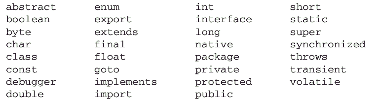
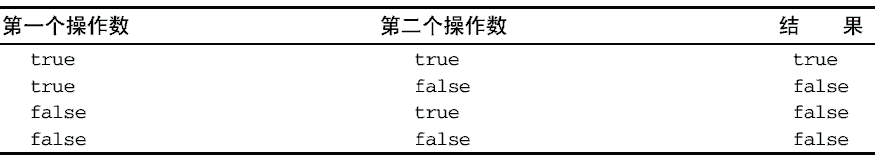
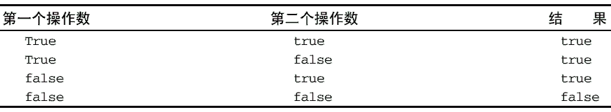
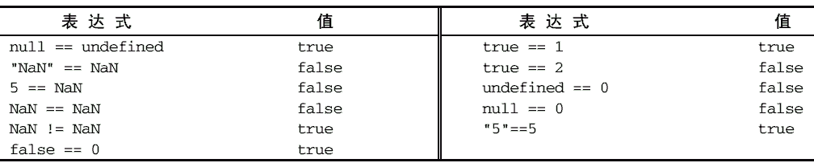
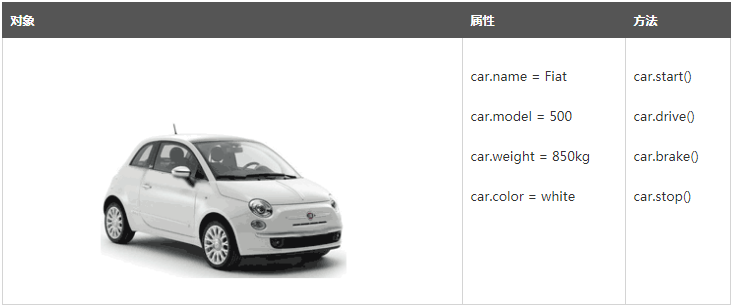
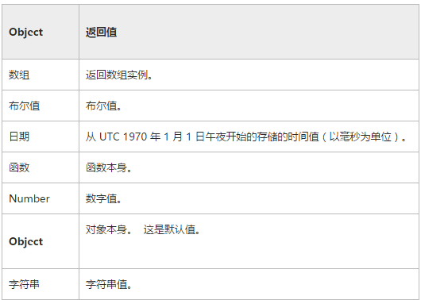

## 2、JavaScript 基础语法

####2.1 语法规范

	ECMAScript 的语法大量借鉴了 C 及其他类 C 语言（如 Java 和 Perl）的语法。因此，熟悉这些语言的开发人员在接受 ECMAScript 更加宽松的语法时，一定会有一种轻松自在的感觉。

**1. 区分大小写** 

• JavaScript是严格区分大小写的;

	–JavaScript区分大小写，包括关键字、变量、函数名、所有标识符;
	
	–querySelector的S是大写，你写成小写就会报错;
	
	–alert()全部是小写，你写一个大写字母就会提示你该函数不存在;
	
	–myname、myName、mynamE、MyName他们真不是一个东西;

• 大小写问题是新手常犯的一个错误，需要注意。

**2. 空格** 

•JavaScript会忽略标识符前后的空格;

	–空格是为了让代码有整齐一致的缩进，形成统一的编码风格，让代码更具可读性;
	
	–你可以 document . querySelector('选择器')这样;
	
	–你还可以document. querySelector ('选择器')这样;
	
	–但是你不可以document.query Selector('选择器')这样;
	
	–所以，你要搞清楚JavaScript是忽略标识符前后的空格;
	
	–在标识里面加空格，是把一个标识符分割成了两个或多个标识符;

•一般加空格是为了代码排版，不要乱加空格。

**3. 注释** 

•JavaScript支持两种注释方式;

	–单行注释：//这里是注释内容 ;

```
// 单行注释
```

	–块级注释以一个斜杠和一个星号（/\*）开头，以一个星号和一个斜杠（*/）结尾，如下所示：

```
/*
* 这是一个多行
* （块级）注释
*/
```

虽然上面注释中的第二和第三行都以一个星号开头，但这不是必需的。之所以添加那两个星号，纯粹是为了提高注释的可读性（这种格式在企业级应用中用得比较多）。

•注释部分不会执行，合理的注释能显著提高代码的可读性;

•可以通过浏览器源文件看到注释内容，所以什么该注释什么不该注释要注意;

**4.语句** 

ECMAScript 中的语句以一个分号结尾;如果省略分号，则由解析器确定语句的结尾，如下例所示：

```
var sum = a + b // 即使没有分号也是有效的语句——不推荐
var diff = a - b; // 有效的语句——推荐
```

虽然语句结尾的分号不是必需的，换行也可以表示一个语句结束，但我们建议任何时候都不要省略它。因为加上这个分号可以避免很多错误（例如不完整的输入），开发人员也可以放心地通过删除多余的空格来压缩 ECMAScript 代码 （代码行结尾处没有分号会导致压缩错误）。另外，加上分号也会在某些情况下增进代码的性能，因为这样解析器就不必再花时间推测应该在哪里插入分号了。

可以使用 C 风格的语法把多条语句组合到一个代码块中，即代码块以左花括号（{）开头，以右花括号（}）结尾：

```
if (test) {
 test = false;
 alert(test);
}
```

虽然条件控制语句（如 if 语句）只在执行多条语句的情况下才要求使用代码块，但最佳实践是始终在控制语句中使用代码块——即使代码块中只有一条语句，例如：

```
if (test) 
 alert(test); // 有效但容易出错，不要使用
if (test) { // 推荐使用
 alert(test);
}
```

在控制语句中使用代码块可以让编码意图更加清晰，而且也能降低修改代码时出错的几率。

**5. 直接量** 

•JavaScript中直接使用的数据值叫做直接量;

	–12306;//数值
	
	–'我要学习JavaScript';//字符串类型
	
	–true;//布尔类型
	
	–null;//null类型
	
	–[1,2,3,4,5];//数组

**6. 标识符** 

所谓标识符，就是指变量、函数、属性、参数的名字，或者用做某些循环语句中的跳转位置的标记。标识符可以是按照下列格式规则组合起来的一或多个字符：

- 第一个字符必须是一个字母、下划线（_）或一个美元符号（$）,即第一个字符不可以是数字;
- 其他字符可以是字母、下划线、美元符号或数字。

```
//也就是说，起名字的时候有字母、下划线、$、数字
//变量
var Identifier = 123;
//属性
(new Object).Identifier = 'test';
//函数及参数
function IdentifierName(Identifier1){};
//跳转标记
Identifier:
for(var i = 0; i < 5; i++){
    if(i == 3){
        break Identifier;
    }
}
```

按照惯例， ECMAScript 标识符采用驼峰大小写格式，也就是第一个字母小写，剩下的每个单词的首字母大写，例如：

```
firstSecond
myCar
doSomethingImportant
```

虽然没有谁强制要求必须采用这种格式，但为了与 ECMAScript 内置的函数和对象命名格式保持一致，可以将其当作一种最佳实践。

- 数字不允许作为首字符出现，以便可以轻易区分开变量和数字，如：12345就是个数字，不用考虑是个变量的情况;


- 合法的标识符：myname、_age、$classname、abc、hqyj_h5;


- 不合法的标识符：5myname;


- 也可以使用非英语来定义标识符：var π = 3.14;α;


- 标识符最好见名知意;

```
不能把关键字、保留字、 true、 false 和 null 用作标识符。
```


####2.2 关键字和保留字

ECMA-262 描述了一组具有特定用途的关键字，这些关键字可用于表示控制语句的开始或结束，或者用于执行特定操作等。按照规则，关键字也是语言保留的，不能用作标识符。以下就是 ECMAScript的全部关键字（带*号上标的是第 5 版新增的关键字）：


ECMA-262 还描述了另外一组不能用作标识符的保留字。尽管保留字在这门语言中还没有任何特定的用途，但它们有可能在将来被用作关键字。以下是 ECMA-262 第 3 版定义的全部保留字：



第 5 版把在非严格模式下运行时的保留字缩减为下列这些：

|       |        |         |       |
| ----- | ------ | ------- | ----- |
| class | enum   | extends | super |
| const | export | import  |       |

在严格模式下，第 5 版还对以下保留字施加了限制：

|            |           |        |
| ---------- | --------- | ------ |
| implements | package   | public |
| interface  | private   | static |
| let        | protected | yield  |

注意， let 和 yield 是第 5 版新增的保留字;其他保留字都是第 3 版定义的。为了最大程度地保证兼容性，建议读者将第 3 版定义的保留字外加 let 和 yield 作为编程时的参考。

在实现 ECMAScript 3 的 JavaScript 引擎中使用关键字作标识符，会导致“ Identifier Expected”错误。而使用保留字作标识符可能会也可能不会导致相同的错误，具体取决于特定的引擎。

第 5 版对使用关键字和保留字的规则进行了少许修改。关键字和保留字虽然仍然不能作为标识符使用，但现在可以用作对象的属性名。一般来说，最好都不要使用关键字和保留字作为标识符和属性名，以便与将来的 ECMAScript 版本兼容。

除了上面列出的保留字和关键字， ECMA-262 第 5 版对 eval 和 arguments 还施加了限制。在严格模式下（strict模式），这两个名字也不能作为标识符或属性名，否则会抛出错误。


####2.3 变量

在日常生活中，有些东西是固定不变的，有些东西则会发生变化。例如，人的姓名和生日是固定不变的，但心情和年龄却会随着时间变化而变化。人们把那些会发生变化的东西称为变量。

变量的概念基本上和初中代数的方程变量是一致的，只是在计算机程序中，变量不仅可以是数字，还可以是任意数据类型。

当程序需要将值保存起来以备将来使用时，便将其赋值给一个变量。变量(variable)是一个用于保存值的占位符，可以通过变量名称来获得对值的引用。

变量在JavaScript中就是用一个变量名表示，变量名是大小写英文、数字、$和_的组合，且不能用数字开头。变量名也不能是JavaScript的关键字，如if、while等。申明一个变量用var语句，比如：

```
var a; // 申明了变量a，此时a的值为undefined
var $b = 1; // 申明了变量$b，同时给$b赋值，此时$b的值为1
var s_007 = '007'; // s_007是一个字符串
var Answer = true; // Answer是一个布尔值true
var t = null; // t的值是null 
```


####2.4 var声明

初次给变量赋值时，有var 和无var 的**区别：** 

```
var abc = 'Hello, world';
```


## 3、JavaScript 数据类型

计算机顾名思义就是可以做数学计算的机器，因此，计算机程序理所当然地可以处理各种数值。但是，计算机能处理的远不止数值，还可以处理文本、图形、音频、视频、网页等各种各样的数据，不同的数据，需要定义不同的数据类型。

- 一些基本概念
  1. 在编程语言中，能够表示并操作的值(value)的类型，称为数据类型(type);
  2. 变量(variable)是一个值的符号名称，可以通过变量引用值;
  3. 可以把一个值赋值给一个变量， 这样程序在任何需要使用该值的地方，就可以直接引用该变量。


- JavaScript的数据类型分类：
  1. 原始类型：数字、字符串、布尔值、null(空)、undefined(未定义);存储于栈内存。
  2. 引用类型（也称对象类型）：原始类型之外的类型，如数组、对象、函数等;存储于堆内存。


本章主要介绍typeof 操作符和基本数据类型undefined、null、boolean、string、number和object。


####3.1 typeof 操作符

鉴于 ECMAScript 是松散类型的，因此需要有一种手段来检测给定变量的数据类型——typeof 就是负责提供这方面信息的操作符。对一个值使用 typeof 操作符可能返回下列某个字符串：

- "undefined"——如果这个值未定义;
- "boolean"——如果这个值是布尔值;
- "string"——如果这个值是字符串;
- "number"——如果这个值是数值;
- "object"——如果这个值是对象或 null;
- "function"——如果这个值是函数。

下面是几个使用 typeof 操作符的例子：

```
<!DOCTYPE html>
<html>
 	<head>
 		<title>typeof Example</title>
 		<script type="text/javascript">
 			var message = "some string";
 			alert(typeof message); //"string"
 			alert(typeof(message)); 
 			alert(typeof 95); //"number"
 		</script>
 	</head>
 	
 	<body>
 	</body>
</html> 
```

例子说明， typeof操作符的操作数可以是变量（message），也可以是数值字面量。注意，typeof是一个操作符而不是函数，因此例子中typeof之后的圆括号尽管可以使用，但不是必需的。

有些时候， typeof操作符会返回一些令人迷惑但技术上却正确的值。比如，调用 typeof null会返回"object"，因为特殊值 null被认为是一个空的对象引用。 Safari 5 及之前版本、 Chrome 7 及之前版本在对正则表达式调用 typeof操作符时会返回"function"，而其他浏览器在这种情况下会返回"object"。

```
从技术角度讲，函数在 ECMAScript 中是对象，不是一种数据类型。然而，函数也确实有一些特殊的属性，因此通过 typeof 操作符来区分函数和其他对象是有必要的。
```

注：面试题--typeof 返回值

```js
//返回值类型
console.log(typeof typeof 95);			  //string
```


####3.2 Undefined类型

Undefined 类型只有一个值，即特殊的 undefined。

在使用 var 声明变量但未对其加以初始化时，这个变量的值就是 undefined，例如：

```
var message;
alert(message == undefined); //true
```

这个例子只声明了变量 message，但未对其进行初始化。比较这个变量与 undefined 字面量，结果表明它们是相等的。


####3.3 Null类型

null类型是第二个只有一个值的数据类型，这个特殊的值是 null。从逻辑角度来看， null 值表示一个空对象指针，而这也正是使用 typeof 操作符检测 null 值时会返回"object"的原因，如下面的例子所示：

```
var car = null;
alert(typeof car)
```

如果定义的变量准备在将来用于保存对象，那么最好将该变量初始化为 null 而不是其他值。这样一来，只要直接检查 null 值就可以知道相应的变量是否已经保存了一个对象的引用，如下面的例子所示：

```
if (car != null){

 // 对 car 对象执行某些操作

}
```

实际上， undefined 值是派生自 null 值的，因此 ECMA-262 规定对它们的相等性测试要返回 true：

```
alert(null == undefined); //true，仅做判断不做字符串连接时
```

这里，位于 null 和 undefined 之间的相等操作符（==）总是返回 true

尽管 null 和 undefined 有这样的关系，但它们的用途完全不同。如前所述，无论在什么情况下都没有必要把一个变量的值显式地设置为 undefined，可是同样的规则对 null 却不适用。换句话说，只要意在保存对象的变量还没有真正保存对象，就应该明确地让该变量保存 null 值。这样做不仅可以体现 null 作为空对象指针的惯例，而且也有助于进一步区分 null 和 undefined。


#####注--**null和undefined**区别

**区别：** 

•null

	– 用来描述空值;
	
	– typeof null：返回的是字符串object，也就是说可以把null看成一个特殊的对象;
	
	– 通常来讲我们把null看成他自有类型的唯一成员;

•undefined

	– undefined表明变量没有初始化;
	
	– 如果函数没有返回值，则返回undefined;
	
	– typeof undefined：返回的是字符串undefined;
	
	– ==认为NULL和undefined是相等的;===则返回false;


####3.4 Boolean类型

Boolean 类型是 ECMAScript 中使用得最多的一种类型，该类型只有两个字面值： true 和 false。以下是为变量赋Boolean 类型值的例子：

```
var found = true;

var lost = false;
```

需要注意的是，Boolean 类型的字面值 true 和 false 是区分大小写的。也就是说，True 和 False（以及其他的混合大小写形式）都不是 Boolean 值，只是标识符。

虽然 Boolean 类型的字面值只有两个，但 ECMAScript 中所有类型的值都有与这两个 Boolean 值等价的值。要将一个值转换为其对应的 Boolean 值，可以调用转型函数 Boolean()，如下例所示：

```
var message = "Hello world!";
var messageAsBoolean = Boolean(message);
```

在这个例子中，字符串 message 被转换成了一个 Boolean 值， 该值被保存在 messageAsBoolean变量中。可以对任何数据类型的值调用 Boolean()函数，而且总会返回一个 Boolean 值。至于返回的这个值是 true 还是 false，取决于要转换值的数据类型及其实际值。下表给出了各种数据类型及其对应的转换规则。

| 数据类型      | 转换为true的值      | 转换为false的值             |
| --------- | -------------- | ---------------------- |
| Boolean   | true           | false                  |
| String    | 任何非空字符串        | ""（空字符串）               |
| Number    | 任何非零数字值（包括无穷大） | ±0和NaN（参见后面章节有关NaN的内容） |
| Object    | 任何对象           | null                   |
| Undefined | \              | undefined              |

这些转换规则对理解流控制语句（如 if 语句）自动执行相应的 Boolean 转换非常重要，请看下面的代码：

```
var message = "Hello world!";

if (message){

 alert("Value is true");

}
```

运行这个示例，字符串 message 被自动转换成了对应的 Boolean 值（true）,故会显示一个警告框。由于存在这种自动执行的 Boolean 转换，因此确切地知道在流控制语句中使用的是什么变量至关重要。错误地使用一个对象而不是一个 Boolean 值，就有可能彻底改变应用程序的流程。


#### 3.5 Number类型

Number 类型应该是 ECMAScript 中最令人关注的数据类型了，这种类型用来表示整数和浮点数值（浮点数值在某些语言中也被称为双精度数值）。为支持各种数值类型， ECMA-262 定义了不同的数值字面量格式。

**1. 整数数值** 

最基本的数值字面量格式是十进制整数，十进制整数可以像下面这样直接在代码中输入：

```
var intNum = 55; // 整数
```

**2. 浮点数值** 

所谓浮点数值，就是该数值中必须包含一个小数点，并且小数点后面必须至少有一位数字。虽然小数点前面可以没有整数，但我们不推荐这种写法。以下是浮点数值的几个例子：

```
var floatNum1 = 1.1;
var floatNum2 = 0.1;
var floatNum3 = .1; // 有效，但不推荐
```

由于保存浮点数值需要的内存空间是保存整数值的两倍，因此 ECMAScript 会不失时机地将浮点数值转换为整数值。显然，如果小数点后面没有跟任何数字，那么这个数值就可以作为整数值来保存。同样地，如果浮点数值本身表示的就是一个整数（如 1.0） ，那么该值也会被转换为整数，如下面的例子所示：

```js
var floatNum1 = 1.; // 小数点后面没有数字——解析为 1
var floatNum2 = 10.0; // 整数——解析为 10
```

**3. 数值范围**

由于内存的限制， ECMAScript 并不能保存世界上所有的数值。 ECMAScript 能够表示的最小数值（绝对值）保存在 Number.MIN_VALUE 中——在大多数浏览器中，这个值是 5e-324;能够表示的最大数值（绝对值）保存在Number.MAX_VALUE 中——在大多数浏览器中，这个值是 1.7976931348623157e+308。

如果某次计算的结果得到了一个超出 JavaScript 数值范围的值，那么这个数值将被自动转换成特殊的 Infinity 值。具体来说，如果这个数值是负数，则会被转换成-Infinity（负无穷），如果这个数值是正数，则会被转换成 Infinity（正无穷）。

如上所述，如果某次计算返回了正或负的 Infinity 值，那么该值将无法继续参与下一次的计算，因为 Infinity 不是能够参与计算的数值。要想确定一个数值是不是有穷的（换句话说，是不是位于最小和最大的数值之间），可以使用 isFinite()函数。这个函数在参数位于最小与最大数值之间时会返回 true，如下面的例子所示：

```js
var result = Number.MAX_VALUE + Number.MAX_VALUE;
alert(isFinite(result)); //false
alert(isFinite(1/0));//false,1/0值为Infinity
```

**4.NAN** 

NaN，即非数值（Not a Number）是一个特殊的数值，这个数值用于表示一个本来要返回数值的操作数未返回数值的情况（这样就不会抛出错误了）。例如，在其他编程语言中，任何数值除以 0 都会导致错误，从而停止代码执行。但在 ECMAScript 中，任何数值除以 0 会返回 NaN①，因此不会影响其他代码的执行。

```
①实际上只有 0 除以 0 才会返回 NaN，正数除以 0 返回 Infinity，负数除以 0 返回-Infinity。

typeof 笔试题补充--特殊记忆
console.log(typeof 1/0)					 //NaN,typeof操作符的优先级高于除法
console.log(typeof typeof 5/0)			 //NaN
console.log(typeof(7/0))	    		//number
console.log(typeof(typeof 9/0))			//number
console.log(typeof typeof(typeof 4/0))	//string
```

NaN 本身有两个非同寻常的特点。首先，任何涉及 NaN 的操作（例如 NaN/10）都会返回 NaN，这个特点在多步计算中有可能导致问题。其次， NaN 与任何值都不相等，包括 NaN 本身。例如，下面的代码会返回 false：

```
alert(NaN == NaN); //false
```

针对 NaN 的这两个特点， ECMAScript 定义了 isNaN()函数。这个函数接受一个参数，该参数可以是任何类型，而函数会帮我们确定这个参数是否“不是数值”。 isNaN()在接收到一个值之后，会尝试将这个值转换为数值。某些不是数值的值会直接转换为数值，例如字符串"10"或 Boolean 值。而任何不能被转换为数值的值都会导致这个函数返回 true。请看下面的例子：

```js
alert(isNaN(NaN)); 		//true
alert(isNaN(10)); 		//false（ 10 是一个数值）
//alert(isNaN("10")); 	//false（可以被转换成数值 10）
alert(isNaN("blue")); 	//true（不能转换成数值）
//alert(isNaN("100abc"));	//true(不能转换成数值)
//alert(isNaN(true)); 	//false（可以被转换成数值 1）

```

PS：尽管有点儿不可思议，但 isNaN()确实也适用于对象。在基于对象调用 isNaN()函数时，会首先调用对象的 valueOf()方法，然后确定该方法返回的值是否可以转换为数值。如果不能，则基于这个返回值再调用 toString()方法，再测试返回值。

**5. 转换成数字类型** 

 +(加)、-(减)、*(乘)、/(除)，会把类型转换成数字。

另有 3 个函数可以把非数值转换为数值： Number()、 parseInt()和 parseFloat()。第一个函数，即转型函数 Number()可以用于任何数据类型，而另两个函数则专门用于把字符串转换成数值。这 3 个函数对于同样的输入会有返回不同的结果。

**Number()函数**的转换规则如下。

- 如果是数字值，只是简单的传入和返回。
- 如果是 Boolean 值， true 和 false 将分别被转换为 1 和 0。
- 如果是 null 值，返回 0。
- 如果是 undefined，返回 NaN。
- 如果是字符串，遵循下列规则：
  - 如果字符串中只包含数字（包括前面带正号或负号的情况），则将其转换为十进制数值，即"1"会变成 1， "123"会变成 123，而"011"会变成 11（注意：前导的零被忽略了）;
  - 如果字符串中包含有效的浮点格式，如"1.1"，则将其转换为对应的浮点数值（同样，也会忽略前导零）;
  - 如果字符串中包含有效的十六进制格式，例如"0xf"，则将其转换为相同大小的十进制整数值;
  - 如果字符串是空的（不包含任何字符），则将其转换为 0;
  - 如果字符串中包含除上述格式之外的字符，则将其转换为 NaN。
- 如果是对象，则调用对象的 valueOf()方法，然后依照前面的规则转换返回的值。如果转换的结果是 NaN，则调用对象的 toString()方法，然后再次依照前面的规则转换返回的字符串值。

根据这么多的规则使用 Number()把各种数据类型转换为数值确实有点复杂。下面还是给出几个具体的例子吧。

```
var num1 = Number("Hello world!"); //NaN
var num2 = Number(""); //0
var num3 = Number("000011"); //11
var num4 = Number("100abc"); //NaN
var num5 = Number(true); //1
var num6 = Number([]);  //0,Number(["100"])值为100
var num7 = Number([100,100])  //NaN
```

由于 Number()函数在转换字符串时比较复杂而且不够合理，因此在处理整数的时候更常用的是**parseInt()** 函数。 parseInt()函数在转换字符串时，更多的是看其是否符合数值模式。

它会忽略字符串前面的空格，直至找到第一个非空格字符。

- 如果第一个字符不是数字字符或者负号， parseInt()就会返回 NaN;也就是说，用 parseInt()转换空字符串会返回 NaN（Number()对空字符返回 0） 。

- 如果第一个字符是数字字符， parseInt()会继续解析第二个字符，直到解析完所有后续字符或者遇到了一个非数字字符。例如， "1234blue"会被转换为 1234，因为"blue"会被完全忽略。
- 类似地， "22.5"会被转换为 22，因为小数点并不是有效的数字字符。

如果字符串中的第一个字符是数字字符， parseInt() 也能够识别出各种整数格式（即前面讨论的十进制、八进制和十六进制数）。也就是说，如果字符串以"0x"开头且后跟数字字符，就会将其当作一个十六进制整数;如果字符串以"0"开头且后跟数字字符，则会将其当作一个八进制数来解析。

为了更好地理解 parseInt()函数的转换规则，下面给出一些例子：

```
var num1 = parseInt("1234blue"); // 1234
var num2 = parseInt(""); // NaN，与parseInt与Number的处理结果不一样
var num3 = parseInt("0xA"); // 10（十六进制数转换成十进制数）
var num4 = parseInt(22.5); // 22
var num5 = parseInt("070"); // 56（八进制数转换成十进制数-es3），70(es5)
var num6 = parseInt("70"); // 70（十进制数）
var num7 = parseInt("0xfh"); // 15（十六进制数转换成十进制数）

```

在使用 parseInt()解析像八进制字面量的字符串时， ECMAScript 3 和 5 存在分歧。例如：

```
//ECMAScript 3 认为是 56（八进制）， ECMAScript 5 认为是 70（十进制）
var num = parseInt("070");
```

为了消除在使用 parseInt()函数时可能导致的上述困惑，可以为这个函数提供第二个参数：转换时使用的基数（即多少进制，可选值2/8/10/16）。如果知道要解析的值是十六进制格式的字符串，那么指定基数 16 作为第二个参数，可以保证得到正确的结果，例如：

```
var num = parseInt("0xAF", 16); //175
var num1=parseInt("123",16)

```

实际上，如果指定了 16 作为第二个参数，字符串可以不带前面的"0x"，如下所示：

```
var num1 = parseInt("AF", 16); //175
var num2 = parseInt("AF"); //NaN

```

不指定基数意味着让 parseInt()决定如何解析输入的字符串，因此为了避免错误的解析，我们建议无论在什么情况下都明确指定基数。第二个参数不传或为假值时，默认按10进制处理


看一个小题：

```
请问以下表达式的结果是什么？
parseInt(3,8)
parseInt(3,2)
parseInt(3,0)

A：3，3，3
B：3，3，NaN
C：3，NaN，NaN
D：other
```

与 parseInt()函数类似， **parseFloat()** 也是从第一个字符（位置 0）开始解析每个字符。而且也是一直解析到字符串末尾，或者解析到遇见一个无效的浮点数字字符为止（第二个小数点或其他字符）。也就是说，字符串中的第一个小数点是有效的，而第二个小数点就是无效的了，因此它后面的字符串将被忽略。举例来说，

```
"22.34.5"将会被转换为 22.34。

```

除了第一个小数点有效之外， parseFloat()与 parseInt()的第二个区别在于它始终都会忽略前导的零。

 parseFloat()可以识别前面讨论过的所有浮点数值格式，也包括十进制整数格式。但十六进制格式的字符串则始终会被转换成 0。由于 parseFloat()只解析十进制值，因此它没有用第二个参数指定基数的用法。最后还要注意一点：如果字符串包含的是一个可解析为整数的数（没有小数点，或者小数点后都是零） ， parseFloat()会返回整数。以下是使用 parseFloat()转换数值的几个典型示例。

```
var num1 = parseFloat("1234blue"); //1234 （整数）
var num2 = parseFloat("0xA"); //0
var num3 = parseFloat("22.5"); //22.5
var num4 = parseFloat("22.34.5"); //22.34
var num5 = parseFloat("0908.5"); //908.5
var num6 = parseFloat("3.125e7"); //31250000

```


####3.6 String类型

字符串可以由双引号（"）或单引号（'）表示，因此下面两种字符串的写法都是有效的：

```js
var firstName = "Nicholas";
var lastName = 'Zakas';
```

ECMAScript 中的这两种语法形式没有什么区别。用双引号表示的字符串和用单引号表示的字符串完全相同。不过，以双引号开头的字符串也必须以双引号结尾，而以单引号开头的字符串必须以单引号结尾。例如，下面这种字符串表示法会导致语法错误：

```js
var firstName = 'Nicholas"; // 语法错误（左右引号必须匹配）

```

**1. 字符字面量字符串** 

String 数据类型包含一些特殊的字符字面量，也叫转义序列，用于表示非打印字符，或者具有其他用途的字符。这些字符字面量如下表所示：

| 字 面 量 | 含 义 |
| -------- | ----- |
| \n       | 换行  |
| \t       | 制表  |
| \b       | 空格  |
| \r       | 回车  |

这些字符字面量可以出现在字符串中的任意位置，而且也将被作为一个字符来解析，如下面的例子所示：

```
var text = "This is the letter sigma: \u03a3.";

```

这个例子中的变量 text 有 28 个字符，其中 6 个字符长的转义序列表示 1 个字符。任何字符串的长度都可以通过访问其 length 属性取得，例如：

```
alert(text.length); // 输出 28

```

这个属性返回的字符数包括 16 位字符的数目。如果字符串中包含双字节字符，那么 length 属性可能不会精确地返回字符串中的字符数目。

**2. 字符串的特点** 

ECMAScript 中的字符串是不可变的，也就是说，字符串一旦创建，它们的值就不能改变。要改变某个变量保存的字符串，首先要销毁原来的字符串，然后再用另一个包含新值的字符串填充该变量，例如：

```
var lang = "Java";
lang = lang + "Script";
//加号:+，只要有一个是字符串，则全部作为字符串
```

以上示例中的变量 lang 开始时包含字符串"Java"。而第二行代码把 lang 的值重新定义为"Java"与"Script"的组合，即"JavaScript"。

实现这个操作的过程如下：首先创建一个能容纳 10 个字符的新字符串，然后在这个字符串中填充"Java"和"Script"，最后一步是销毁原来的字符串"Java"和字符串"Script"，因为这两个字符串已经没用了。这个过程是在后台发生的，而这也是在某些旧版本的浏览器（例如版本低于 1.0 的 Firefox、 IE6 等）中拼接字符串时速度很慢的原因所在。但这些浏览器后来的版本已经解决了这个低效率问题。

**3. 转换为字符串** 

要把一个值转换为一个字符串有两种方式。第一种是使用几乎每个值变量都有的 toString()方法。这个方法唯一要做的就是返回相应值的字符串表现。来看下面的例子：

```js
var age = 11;
var ageAsString = age.toString(); // 字符串"11"
var found = true;
var foundAsString = found.toString(); // 字符串"true"
```

数值、布尔值、对象和字符串值变量都有 toString()方法。但 null 和 undefined 值没有这个方法。

多数情况下，调用 toString()方法不必传递参数。但是，在调用数值的 toString()方法时，可以传递一个参数：输出数值的基数。默认情况下， toString()方法以十进制格式返回数值的字符串表示。而通过传递基数， toString()可以输出以二进制、八进制、十六进制，乃至其他任意有效进制格式表示的字符串值。下面给出几个例子：

```js
alert(num.toString(8));
alert(num.toString(16));
```

在不知道要转换的值是不是 null 或 undefined 的情况下，还可以使用转型函数 String()，这个函数能够将任何类型的值转换为字符串。 String()函数遵循下列转换规则：

- 如果值有 toString()方法，则调用该方法（没有参数）并返回相应的结果;
- 如果值是 null，则返回"null";
- 如果值是 undefined，则返回"undefined"。

下面再看几个例子：

```
var value1 = 10;
var value2 = true;
var value3 = null;
var value4;
alert(String(value1)); // "10"
alert(String(value2)); // "true"
alert(String(value3)); // "null"
alert(String(value4)); // "undefined"
```

**es6 语法转换--多行字符串**

由于多行字符串用\n写起来比较费事，所以最新的ES6标准新增了一种多行字符串的表示方法，用反引号 *`* ... *`* 表示：

```
console.log(`多行
字符串
测试`);
```

**es6 语法转换--模板字符串** 

要把多个字符串连接起来，可以用+号连接：

```js
var name = '小明'; var age = 20;
var message = '你好, ' + name + ', 你今年' + age + '岁了!';
alert(message);
```

如果有很多变量需要连接，用+号就比较麻烦。ES6新增了一种模板字符串，表示方法和上面的多行字符串一样，但是它会自动替换字符串中的变量：

```js
var name = '小明'; var age = 20;
var message = `你好, ${name}, 你今年${age}岁了!`;
alert(message);
```

**4.length**

字符串变量获取字符串长度：str.length;

**5.indexOf** 

字符串的索引从0开始，第一个字符的位置是0，第二个是1，以此类推。str[2]表示字符串str的第三个字符。

indexOf() 方法可返回某个指定的字符串值在字符串中首次出现的位置，语法：

```
stringObject.indexOf(searchvalue,fromindex)
```

| 参数          | 描述                                       |
| ----------- | ---------------------------------------- |
| searchvalue | 必需。规定需检索的字符串值。                           |
| fromindex   | 可选的整数参数。规定在字符串中开始检索的位置。它的合法取值是 0 到 stringObject.length - 1。如省略该参数，则将从字符串的首字符开始检索。 |

如果要检索的字符串值没有出现，则该方法返回 -1。

**6. substring** 

substring() 方法用于提取字符串中介于两个指定下标之间的字符，语法：

```
stringObject.substring(start,stop)
```

| 参数    | 描述                                       |
| ----- | ---------------------------------------- |
| start | 必需。一个非负的整数，规定要提取的子串的第一个字符在 stringObject 中的位置。 |
| stop  | 可选。一个非负的整数，比要提取的子串的最后一个字符在 stringObject 中的位置多 1。如果省略该参数，那么返回的子串会一直到字符串的结尾。 |

返回一个新的字符串（原字符串不变），该字符串值包含 stringObject 的一个子字符串，其内容是从 start 处到 stop-1 处的所有字符，其长度为 stop减 start。

如果参数 start 与 stop 相等，那么该方法返回的就是一个空串（即长度为 0 的字符串）。如果 start 比 stop 大，那么该方法在提取子串之前会先交换这两个参数。

stringObject.substring() 不接受负的参数。**stringObject.slice(start,end)**接受负数（从字符串尾部-1开始算起，start与end的位置不能自动交换，字符串只能从左往右进行截取）。

函数从尾部索引时是从-1开始，倒数第二个位置是-2，以此类推。

**stringObject.substr(start,length)***也接受负数，指定的是截取的开始位置和长度。ECMAscript 没有对该方法进行标准化，因此反对使用它。在 IE 4 中，参数 start 的值无效，IE 4默认start值为0，在后续IE版本中该bug已被修复。

**7. trim** 

从字符串中移除前导空格、尾随空格和行终止符，语法：

```js
stringObj.trim();
```

移除的字符包括空格、制表符、换页符、回车符和换行符。

下面的示例演示 **trim** 方法的用法：

```js
var message = "    abc def     \r\n  ";

document.write("[" + message.trim() + "]");
document.write("<br/>");
document.write("length: " + message.trim().length);

// 对应输出：
//  [abc def]
//  length: 7
```

**8. charAt** 

charAt() 方法可返回指定位置的字符。

第一个字符位置为 0, 第二个字符位置为 1,以此类推.

语法：

```js
string.charAt(index)
```

返回字符串中的最后一个字符：

```js
var str = "HELLO WORLD";
var n = str.charAt(str.length-1);
```


#### 3.7 Object类型

ECMAScript 中的对象其实就是一组数据和功能的集合。对象可以通过执行 new 操作符后跟要创建的对象类型的名称来创建。而创建 Object 类型的实例并为其添加属性和（或）方法，就可以创建自定义对象，如下所示：

```
var o = new Object();
//为实例添加属性并赋值
o.name = "张三";
o.age = 24;
```

也可使用大括号定义对象：

```
var person = { 
		name:'yourname', 
		say:function(){ 
			console.log('我要讲两句了');
		 }
 } 

```

• 通过点(.)访问对象的属性：person.name;

• 通过点(.)访问对象的方法：person.say();

####3.8 原始与引用类型

- 不可变的原始值

  – 任何方法都无法更改一个原始类型的值:数字、字符串、布尔值、null、undefined;

  – 对字符串类型的修改操作，只会返回一个新的字符串，原始字符串不会被修改;

  – 原始值在做比较时，只要值相等，他们就是相等的。

- 可变的对象引用：数组、对象、函数等

  – 对象（引用）类型的值是可以修改的，看代码：

```js
  var obj = {name:'yourname',age:20};
      obj.age = 30;
      console.log(obj.age);

```

注：可变不可变，指的是栈数据里存储的值的变化。原始变量名也在栈地址里，原始值存在栈数据里;引用变量名在栈地址里，引用值存在堆数据里，而栈数据里再存储堆地址。

- 包含相同属性及相同值的两个对象类型的值是不相等的：

  – 我们通常将对象称为引用类型(reference type);

  – 依照术语叫法，对象值都是引用，对象的比较均是引用比较;

  – 所以，当且仅当他们引用同一个基对象时，才相等; 

```js
  var a = [1,2,3]; 
  var b = a;		//变量b也引用这个数组 
  b[2] = 9;			//通过变量b来修改引用的数组，变量a也会被修改   console.log(a === b); 
  console.log(a);	//这个时候控制台会打印出来：[1,2,9]

```

	– 将对象或者数组赋值给一个变量时，是对值的引用，本身并没有复制一份;
	
	– 如果想复制一个副本出来，则需要显式的复制对象的每个属性或者数组的每个元素;

- 如果我们想比较两个对象或者数组的值是否相等，则需要比较他们的属性或元素;数组可以循环比较每一个元素;


#### 3.9 变量作用域

变量的作用域(scope) 是程序源代码中定义这个变量的区域。

作用域分为全局作用域和函数作用域(又叫局部作用域)两种。

全局作用域是最外围的一个执行环境，在web浏览器中，全局执行环境被认为是window对象。所有全局变量和函数都是作为window对象的属性和方法创建的。全局变量拥有全局作用域，在javascript代码中的任何地方都是有定义的。全局作用域直到应用程序退出例如关闭网页或浏览器时才会被销毁。

– JS中声明的全局变量是全局对象的属性;

– 函数体内不使用var声明而直接赋值的变量当做全局变量;

```js
var a = 8 ; 
window.alert(this.a);			
//JS中声明的全局变量是全局对象的属性，用关键词this来引用全局对象

function testGlobal() {
  	globalVariable = "test";	//函数体内不使用var声明而直接赋值的变量当做全局变量
}
testGlobal();
alert(globalVariable);

/*	JS解释器启动时，它将创建一个新的全局对象;在代码最顶级，可以用关键词this来引用全局对象，
* 也可以用window自身属性来引用。常见全局对象： 
*
*	1. 全局属性：如undefined、Infinity、NaN等; 
*	2. 全局函数：如parseInt()、eval()、isNaN()、toFixed()等; 
*	3. 构造函数：如Array()、String()、Date()等;
*	4. 全局对象：如Math，补充：Math.ceil(x)与Math.floor(x)，向上向下取整等; 
*	我们在写程序时最好把这些全局对象当做保留字，避免出现意外错误。
*/

```

在函数内(var声明)的变量只在函数体内有定义。它们是局部变量，作用域是局部性的。函数参数也是局部变量，它们只在函数体内有定义。函数作用域中的所有代码执行完毕后，该作用域被销毁，保存在其中的所有变量和函数定义也随之销毁。

```js
function test(){
    var message  = 'hi';
}
test();
alert(message);//错误

```

在函数体内，局部变量的优先级高于同名的全局变量，如果在函数内声明的一个局部变量或者函数参数中带有的变量和全局变量重名，那么全局变量就被局部变量遮盖。

```js
var scope = 'global';
function checkscope(){
    var scope = 'local';
    return scope;
};
checkscope();

```

再引申测试一下，小练习：

```js
var a=123;

function test() {
	var b=123;
	function demo() {
		var c=234;
		document.write(b);//123
		document.write(a);//123
	}
	demo();

	document.write(c);//报错
}

test();
//函数里边的能访问外边的，优先访问自己函数里边的
//函数外边的不能访问函数里边的
```


## 4、表达式


#### 4.1 算术表达式

大声说出来你知道的算术运算符：加减乘除取余，+-*/%;

1. +：数字相加 或 字符串连接;

   加法操作的行为表现：

   一、如果其中一个操作数是对象，则JavaScript会自动把他转成原始类型的值;

   二、如果其中一个操作数是字符串的话，则另一个也会转成字符串，然后你懂的;

   三、如果两个操作数都是数字，则进行加法运算;

   可怜巴巴的样子，还是给你弄几个例子吧：

   ```js
   console.log(1 + 5);					
   console.log('1' + 5);				
   console.log(new Date() + '--ok');	
   console.log(12 + NaN);				
   console.log(true + true);			
   console.log(201 + null);			
   console.log(203 + undefined);		
   console.log(3 + 5 + '猜猜看');		 
   //加法运算的结果要么是数字要么是字符串
   ```

2. 其他的算术运算符还用讲吗？

减乘除取余----运算结果全都是number类型


## 5、操作符

#### 5.1 一元操作符

只能操作一个值的操作符叫做一元操作符。一元操作符是 ECMAScript 中最简单的操作符。

**1. 递增和递减操作符**

递增和递减操作符直接借鉴自 C，而且各有两个版本：前置型和后置型。顾名思义，前置型应该位于要操作的变量之前，而后置型则应该位于要操作的变量之后。

因此，在使用前置递增操作符给一个数值加 1 时，要把两个加号（++）放在这个数值变量前面，如下所示：

```
var age = 29;
++age;
```

在这个例子中，前置递增操作符把 age 的值变成了 30（为 29 加上了 1）。实际上，执行这个前置递增操作与执行以下操作的效果相同：

```
var age = 29;
age = age + 1;
```

执行前置递减操作的方法也类似，结果会从一个数值中减去 1。使用前置递减操作符时，要把两个减号（--）放在相应变量的前面，如下所示：

```
var age = 29;
--age;
```

这样， age 变量的值就减少为 28（从 29 中减去了 1）。

执行前置递增和递减操作时，变量的值都是在语句被求值以前改变的。（在计算机科学领域，这种情况通常被称作副效应。）请看下面这个例子。

```
var age = 29;
var anotherAge = --age + 2;
alert(age); // 输出 28
alert(anotherAge); // 输出 30
```

这个例子中变量 anotherAge 的初始值等于变量 age 的值前置递减之后加 2。由于先执行了减法操作， age 的值变成了 28，所以再加上 2 的结果就是 30。

由于前置递增和递减操作与执行语句的优先级相等，因此整个语句会从左至右被求值。再看一个例子：

```js
var num1 = 2;
var num2 = 20;
var num3 = --num1 + num2; // 等于 21
var num4 = num1 + num2; // 等于 21
```

在这里， num3 之所以等于 21 是因为 num1 先减去了 1 才与 num2 相加。而变量 num4 也等于 21 是因为相应的加法操作使用了 num1 减去 1 之后的值。


后置型递增和递减操作符的语法不变（仍然分别是++和--），只不过要放在变量的后面而不是前面。

后置递增和递减与前置递增和递减有一个非常重要的区别，即递增和递减操作是在包含它们的语句被求值之后才执行的。这个区别在某些情况下不是什么问题，例如：

```
var age = 29;
age++;
```

把递增操作符放在变量后面并不会改变语句的结果，因为递增是这条语句的唯一操作。

但是，当语句中还包含其他操作时，上述区别就会非常明显了。请看下面的例子：

```
var num1 = 2;
var num2 = 20;
var num3 = num1-- + num2; // 等于 22
var num4 = num1 + num2; // 等于 21
```

这里仅仅将前置递减改成了后置递减，就立即可以看到差别。在前面使用前置递减的例子中， num3和 num4 最后都等于 21。而在这个例子中， num3 等于 22， num4 等于 21。差别的根源在于，这里在计算 num3 时使用了 num1 的原始值（2）完成了加法计算，而 num4 则使用了递减后的值（1）。

小练习：

```js
var a = 2;
var b = 3;
var c = (++a) + (b++) + b + (a++) - a;
//c的值为多少？为什么？
```

所有这 4 个操作符对任何值都适用，也就是它们不仅适用于整数型变量，还可以用于字符串、布尔值、浮点数值和对象类型的变量。在应用于不同的值时，递增和递减操作符遵循下列规则。

- 在应用于一个包含有效数字字符的字符串时，先将其转换为数字值，再执行加减 1 的操作。字符串变量变成数值变量。
- 在应用于一个不包含有效数字字符的字符串时，将变量的值设置为 NaN。字符串变量变成数值变量。
- 在应用于布尔值 false 时，先将其转换为 0 再执行加减 1 的操作。布尔值变量变成数值变量。
- 在应用于布尔值 true 时，先将其转换为 1 再执行加减 1 的操作。布尔值变量变成数值变量。
- 在应用于浮点数值时，执行加减 1 的操作。
- 在应用于对象时，先调用对象的 valueOf()方法（后面章节将详细讨论）以取得一个可供操作的值。然后对该值应用前述规则。如果结果是 NaN，则在调用 toString()方法后再应用前述规则。对象变量变成数值变量。

以下示例展示了上面的一些规则：

```js
var s1 = "2";
var s2 = "z";
var b = false;
var f = 1.1;
var o = {
valueOf: function() {
 return -1;
}
};
s1++; 
s2++; 
b++; 
f--; 
o--; 
```

**2.一元加和减操作符** 

一元加操作符以一个加号（+）表示，放在数值前面，对数值不会产生任何影响，如下面的例子所示：

```
var num = 25;
num = +num; // 仍然是 25
```

不过，在对非数值应用一元加操作符时，该操作符会像 Number()转型函数一样对这个值执行转换。

换句话说，布尔值 false 和 true 将被转换为 0 和 1，字符串值会被按照一组特殊的规则进行解析，而对象是先调用它们的 valueOf()和（或） toString()方法，再转换得到的值。下面的例子展示了对不同数据类型应用一元加操作符的结果：Number()

```
var s1 = "01";
var s2 = "1.1";
var s3 = "z";
var b = false;
var f = 1.1;
var o = {
valueOf: function() {
 return -1;
}
};
s1 = +s1; 
s2 = +s2; 
s3 = +s3; 
b = +b; 
f = +f; 
o = +o; 
```

一元减操作符主要用于表示负数，例如将 1 转换成-1。下面的例子演示了这个简单的转换过程：

```
var num = 25;
num = -num; 

```

在将一元减操作符应用于数值时，该值会变成负数（如上面的例子所示）。而当应用于非数值时，一元减操作符遵循与一元加操作符相同的规则，最后再将得到的数值转换为负数，如下面的例子所示：

```js
var s1 = "01";
var s2 = "1.1";
var s3 = "z";
var b = false;
var f = 1.1;
var o = {
valueOf: function() {
 return -1;
}
};
//s1=+s1---》Number(s1)

s1 = -s1; 
s2 = -s2; 
s3 = -s3; 
b = -b; 
f = -f; 
o = -o; 
```

一元加和减操作符主要用于基本的算术运算，也可以像前面示例所展示的一样用于转换数据类型。

#### 5.3 逻辑操作符

在一门编程语言中，逻辑操作符的重要性堪比相等操作符。如果没有测试两个值关系的能力，那么诸如 if...else 和循环之类的语句就不会有用武之地了。


**1. 逻辑非** 

逻辑非操作符由一个叹号（！）表示，可以应用于 ECMAScript 中的任何值。无论这个值是什么数据类型，这个操作符都会返回一个布尔值。逻辑非操作符首先会将它的操作数转换为一个布尔值，然后再对其求反。也就是说，逻辑非操作符遵循下列规则：

- 如果操作数是一个非空(null)对象，返回 false;
- 如果操作数是一个空字符串，返回 true;
- 如果操作数是一个非空字符串，返回 false;
- 如果操作数是数值 0，返回 true;
- 如果操作数是任意非 0 数值（包括 Infinity），返回 false;
- 如果操作数是 null，返回 true;
- 如果操作数是 NaN，返回 true;
- 如果操作数是 undefined，返回 true。

下面几个例子展示了应用上述规则的结果：

```js
alert(!false); 
alert(!"blue"); 
alert(!0); 
alert(!NaN); 
alert(!""); 
alert(!12345); 
```

同时使用两个逻辑非操作符，也可以用于将一个值转换为与其对应的布尔值，，如下面的例子所示：

```js
alert(!!"blue"); 
alert(!!0); 
alert(!!NaN); 
alert(!!""); 
alert(!!12345); 
```

**2. 逻辑与** 

逻辑与操作符由两个和号（&&）表示，有两个操作数，如下面的例子所示：

```js
var result = true && false;
```

逻辑与的真值表如下：



逻辑与操作符由两个和号（&&）表示，有两个操作数，如下面的例子所示：

```js
var result = true && false;
```

逻辑与操作可以应用于任何类型的操作数，而不仅仅是布尔值。在有一个操作数不是布尔值的情况下，逻辑与操作就不一定返回布尔值;此时，它遵循下列规则：

- 如果第一个操作数是对象，则返回第二个操作数;
- 如果第二个操作数是对象，则只有在第一个操作数的求值结果为 true 的情况下才会返回该对象;
- 如果两个操作数都是对象（或非0数），则返回第二个操作数;
- 如果有一个操作数是 null，则返回 null;
- 如果有一个操作数是 NaN，则返回 NaN;
- 如果有一个操作数是 undefined，则返回 undefined;
- 如果有一个操作数是 0 ，则返回0;

逻辑与操作属于短路操作，即如果第一个操作数能够决定结果，那么就不会再对第二个操作数求值。
对于逻辑与操作而言，如果第一个操作数是 false，则无论第二个操作数是什么值，结果都不再可能是true 了。

来看下面的例子：

```js
var found = true;
var result = (found && someUndefinedVariable); 
alert(result); 
```

在上面的代码中，当执行逻辑与操作时会发生错误，因为变量 someUndefinedVariable 没有声明。由于变量 found 的值是 true，所以逻辑与操作符会继续对变量 someUndefinedVariable 求值。但 someUndefinedVariable 尚未定义，因此就会导致错误。这说明不能在逻辑与操作中使用未定义的值。如果像下面这个例中一样，将 found 的值设置为 false，就不会发生错误了：

```js
var found = false;
var result = (found && someUndefinedVariable); 
alert(result); 
```

在这个例子中，警告框会显示出来。无论变量 someUndefinedVariable 有没有定义，也永远不会对它求值，因为第一个操作数的值是 false。而这也就意味着逻辑与操作的结果必定是 false，根本用不着再对&&右侧的操作数求值了。在使用逻辑与操作符时要始终铭记它是一个短路操作符。

**3. 逻辑或** 

逻辑或操作符由两个竖线符号（||）表示，有两个操作数，如下面的例子所示：

```
var result = true || false;
```

逻辑或的真值表如下：



与逻辑与操作相似，如果有一个操作数不是布尔值，逻辑或也不一定返回布尔值;此时，它遵循下列规则：

- 如果第一个操作数是对象，则返回第一个操作数;
- 如果第一个操作数的求值结果为 false，则返回第二个操作数;
- 如果两个操作数都是对象（或非0数），则返回第一个操作数;
- 如果两个操作数都是 null，则返回 null;
- 如果两个操作数都是 NaN，则返回 NaN;
- 如果两个操作数都是 undefined，则返回 undefined。

与逻辑与操作符相似，逻辑或操作符也是短路操作符。也就是说，如果第一个操作数的求值结果为true，就不会对第二个操作数求值了。下面看一个例子：

```js
var found = true;
var result = (found || someUndefinedVariable); 
alert(result); 
```

这个例子跟前面的例子一样，变量 someUndefinedVariable 也没有定义。但是，由于变量 found的值是 true，而变量 someUndefinedVariable 永远不会被求值，因此结果就会输出"true"。如果像下面这个例子一样，把 found 的值改为 false，就会导致错误：

```js
var found = false;
var result = (found || someUndefinedVariable); 
alert(result); 
```

小练习：

```js
var c = (a = 3) || (b = 4);
console.log(a);//值为多少？
console.log(b);//值为多少？
console.log(c);//值为多少？
```

小技巧：我们可以利用逻辑或的这一行为来避免为变量赋 null 或 undefined 值。例如：

```js
var myObject = preferredObject || backupObject;

```

在这个例子中，变量 myObject 将被赋予等号后面两个值中的一个。变量 preferredObject 中包含优先赋给变量 myObject 的值，变量 backupObject 负责在 preferredObject 中不包含有效值的情况下提供后备值。如果 preferredObject 的值不是 null，那么它的值将被赋给 myObject;如果是 null，则将 backupObject 的值赋给 myObject。


#### 5.4 乘性操作符

ECMAScript 定义了 3 个乘性操作符：乘法、除法和求模。这些操作符与 Java、 C 或者 Perl 中的相应操作符用途类似，只不过在操作数为非数值的情况下会执行自动的类型转换。如果参与乘性计算的某个操作数不是数值，后台会先使用 Number()转型函数将其转换为数值。也就是说，空字符串将被当作0，布尔值 true 将被当作 1。

**1. 乘法** 

乘法操作符由一个星号（*）表示，用于计算两个数值的乘积。其语法类似于 C，如下面的例子

所示：

```js
var result = 34 * 56;

```

在处理特殊值的情况下，乘法操作符遵循下列特殊的规则：

- 如果操作数都是数值，执行常规的乘法计算，即两个正数或两个负数相乘的结果还是正数，而如果只有一个操作数有符号，那么结果就是负数。如果乘积超过了 ECMAScript 数值的表示范围，则返回 Infinity 或-Infinity;
- 如果有一个操作数是 NaN，则结果是 NaN;
- 如果是 Infinity 与 0 相乘，则结果是 NaN;// Infinity*0=NaN
- 如果是 Infinity 与非 0 数值相乘，则结果是 Infinity 或-Infinity，取决于有符号操作数的符号; 
- 如果是 Infinity 与 Infinity 相乘，则结果是 Infinity; 
- 如果有一个操作数不是数值，则在后台调用 Number()将其转换为数值，然后再应用上面的规则。

**2. 除法** 

除法操作符由一个斜线符号（/）表示，执行第二个操作数除第一个操作数的计算，如下面的例子所示：

```js
var result = 66 / 11;

```

与乘法操作符类似，除法操作符对特殊的值也有特殊的处理规则。这些规则如下：

- 如果操作数都是数值，执行常规的除法计算，即两个正数或两个负数相除的结果还是正数，而如果只有一个操作数有符号，那么结果就是负数。如果商超过了 ECMAScript 数值的表示范围，则返回 Infinity 或-Infinity;

- 如果有一个操作数是 NaN，则结果是 NaN;

- 如果是 Infinity 被 Infinity 除，则结果是 NaN;   // Infinity / Infinity = NaN

- 如果是零被零除，则结果是 NaN;                       

- 如果是非零数被零除，则结果是 Infinity 或-Infinity，取决于有符号操作数的符号; 

- 如果是 Infinity被任何数值除,则结果是Infinity 或-Infinity，取决于有符号操作数的符号;

  // Infinity/0=Infinity

- 如果有一个操作数不是数值，则在后台调用 Number()将其转换为数值，然后再应用上面的规则。

**3. 求模** 

求模（余数）操作符由一个百分号（%）表示，用法如下：

```js
var result = 26 % 5; // 等于 1

```

与另外两个乘性操作符类似，求模操作符会遵循下列特殊规则来处理特殊的值：

- 如果操作数都是数值，执行常规的除法计算，返回除得的余数;
- 如果被除数是无穷大值Infinity 而除数是有限大的数值，则结果是 NaN;// Infinity%？=NaN
- 如果被除数是有限大的数值而除数是零，则结果是 NaN;//5%0=NaN
- 如果是 Infinity 被 Infinity 除，则结果是 NaN;   // Infinity % Infinity = NaN
- 如果被除数是有限大的数值而除数是无穷大的数值，则结果是被除数; // 5%Infinity = 5
- 如果被除数是零，则结果是零;//0%？=0
- 如果有一个操作数不是数值，则在后台调用 Number()将其转换为数值，然后再应用上面的规则


#### 5.5 加性操作符

与乘性操作符类似，加性操作符也会在后台转换不同的数据类型。然而，对于加性操作符而言，相应的转换规则还稍微有点复杂。

**1. 加法** 

加法操作符（+）的用法如下所示：

```js
var result = 1 + 2;

```

如果两个操作符都是数值，执行常规的加法计算，然后根据下列规则返回结果：

- 如果有一个操作数是 NaN，则结果是 NaN;
- 如果是 Infinity 加 Infinity，则结果是 Infinity;
- 如果是-Infinity 加-Infinity，则结果是-Infinity;
- 如果是 Infinity 加-Infinity，则结果是 NaN;// Infinity +（- Infinity ）=NaN
- 如果是+0 加+0，则结果是+0;
- 如果是-0 加-0，则结果是-0;
- 如果是+0 加-0，则结果是+0。//+0-0=+0

不过，如果有一个操作数是字符串，那么就要应用如下规则：

- 如果两个操作数都是字符串，则将第二个操作数与第一个操作数拼接起来;
- 如果只有一个操作数是字符串，则将另一个操作数转换为字符串，然后再将两个字符串拼接起来;如果有一个操作数是对象、数值或布尔值，则调用它们的 toString()方法取得相应的字符串值，然后再应用前面关于字符串的规则。对于 undefined 和 null，则分别调用 String()函数并取得字符串"undefined"和"null"。

下面来举几个例子：

```js
var result1 = 5 + 5; 
alert(result1); 
var result2 = 5 + "5"; 
alert(result2); 
```

**2. 减法** 

减法操作符（-）是另一个极为常用的操作符，其用法如下所示：

```
var result = 2 - 1;

```

与加法操作符类似， ECMAScript 中的减法操作符在处理各种数据类型转换时，同样需要遵循一些

特殊规则，如下所示：

- 如果两个操作符都是数值，则执行常规的算术减法操作并返回结果;
- 如果有一个操作数是 NaN，则结果是 NaN;
- 如果是 Infinity 减 Infinity，则结果是 NaN;//infinity-infinity=NaN
- 如果是-Infinity 减-Infinity，则结果是 NaN;
- 如果是 Infinity 减-Infinity，则结果是 Infinity;
- 如果是-Infinity 减 Infinity，则结果是-Infinity;
- 如果是+0 减+0，则结果是+0;
- 如果是+0 减-0，则结果是-0;//+0-（-0）=（-0）
- 如果是-0 减-0，则结果是+0;
- 如果有一个操作数是字符串、布尔值、 null 或 undefined，则先在后台调用 Number()函数将其转换为数值，然后再根据前面的规则执行减法计算。如果转换的结果是 NaN，则减法的结果就是 NaN;
- 如果有一个操作数是对象，则调用对象的 valueOf()方法以取得表示该对象的数值。如果得到的值是 NaN，则减法的结果就是 NaN。如果对象没有 valueOf()方法，则调用其 toString()方法并将得到的字符串转换为数值。

下面几个例子展示了上面的规则：

```js
var result1 = 5 - true; //4
var result2 = NaN - 1; //NaN
var result3 = 5 - 3; //2
var result4 = 5 - ""; //5
var result5 = 5 - "2"; //3
var result6 = 5 - null; //5
```


####5.6 关系操作符

关系运算符用于检测两个值之间的关系，总是返回一个布尔值true或false。

#####5.6.1 比较运算符

小于（<） 、大于（>） 、小于等于（<=）和大于等于（>=）这几个关系操作符用于对两个值进行比较，比较的规则与我们在数学课上所学的一样。这几个操作符都返回一个布尔值，如下面的例子所示：

```js
var result1 = 5 > 3; //true
var result2 = 5 < 3; //false
```

与 ECMAScript 中的其他操作符一样，当关系操作符的操作数使用了非数值时，也要进行数据转换或完成某些奇怪的操作。以下就是相应的规则。

- 如果两个操作数都是数值，则执行数值比较。
- 如果两个操作数都是字符串，则比较两个字符串对应的字符编码值。
- 如果一个操作数是数值，则将另一个操作数转换为一个数值，然后执行数值比较。
- 如果一个操作数是对象，则调用这个对象的 valueOf()方法，用得到的结果按照前面的规则执行比较。如果对象没有 valueOf()方法，则调用 toString()方法，并用得到的结果根据前面的规则执行比较。
- 如果一个操作数是布尔值，则先将其转换为数值，然后再执行比较。

在使用关系操作符比较两个字符串时，会执行一种奇怪的操作。很多人都会认为，在比较字符串值时，小于的意思是“在字母表中的位置靠前”，而大于则意味着“在字母表中的位置靠后”，但实际上完全不是那么回事。在比较字符串时，实际比较的是两个字符串中对应位置的每个字符的字符编码值。经过这么一番比较之后，再返回一个布尔值。由于大写字母的字符编码全部小于小写字母的字符编码，因此我们就会看到如下所示的奇怪现象：

```js
var result = "Brick" < "alphabet"; //true

```

在这个例子中，字符串"Brick"被认为小于字符串"alphabet"。原因是字母 B 的字符编码为 66，而字母 a 的字符编码是 97。如果要真正按字母表顺序比较字符串，就必须把两个操作数转换为相同的大小写形式（全部大写或全部小写），然后再执行比较，如下所示：

```js
var result = "Brick".toLowerCase() < "alphabet".toLowerCase(); //false
```

任何操作数与 NaN 进行关系比较，结果都是 false。

```js
var result = "a" < 3; // false，因为"a"被转换成了 NaN
```


#####5.6.2 相等运算符

确定两个变量是否相等，ECMAScript 提供两组操作符： 相等和不相等——先转换成相似类型再比较， 全等和不全等——仅比较而不转换。

**1. 相等和不相等** 

ECMAScript 中的相等操作符由两个等于号（==）表示，如果两个操作数相等，则返回 true。而不相等操作符由叹号后跟等于号（!=）表示，如果两个操作数不相等，则返回 true。这两个操作符都会先转换操作数（通常称为强制转型），然后再比较它们的相等性。

在转换不同的数据类型时，相等和不相等操作符遵循下列基本规则：

- 如果有一个操作数是布尔值，则在比较相等性之前先将其转换为数值——false 转换为 0，而true 转换为 1;
- 如果一个操作数是字符串，另一个操作数是数值，在比较相等性之前先将字符串转换为数值;
- 如果一个操作数是对象，另一个操作数不是，则调用对象的 valueOf()方法，用得到的基本类型值按照前面的规则进行比较;

这两个操作符在进行比较时则要遵循下列规则。

- null 和 undefined 是相等的。
- 要比较相等性之前，不能将 null 和 undefined 转换成其他任何值（null == 0为false）。
- 如果有一个操作数是 NaN，则相等操作符返回 false，而不相等操作符返回 true。重要提示：即使两个操作数都是 NaN，相等操作符也返回 false;因为按照规则， NaN 不等于 NaN。NaN!=r任何-->
- 如果两个操作数都是对象，则比较它们是不是同一个对象。如果两个操作数都指向同一个对象，则相等操作符返回 true;否则，返回 false。

下表列出了一些特殊情况及比较结果：




**2.全等和不全等** 

除了在比较之前不转换操作数之外，全等和不全等操作符与相等和不相等操作符没有什么区别。全等操作符由 3 个等于号（===）表示，它只在两个操作数未经转换就相等的情况下返回 true，如下面的例子所示：

```js
var result1 = ("55" == 55); //true，因为转换后相等
var result2 = ("55" === 55); //false，因为不同的数据类型不相等
```

不全等操作符由一个叹号后跟两个等于号（!==）表示，它在两个操作数未经转换就不相等的情况下返回 true。例如：

```js
var result1 = ("55" != 55); //false，因为转换后相等
var result2 = ("55" !== 55); //true，因为不同的数据类型不相等
```

记住： null == undefined 会返回 true，因为它们是类似的值;但 null === undefined 会返回 false，因为它们是不同类型的值。

> 由于相等和不相等操作符存在类型转换问题，而为了保持代码中数据类型的完整性，推荐使用全等和不全等操作符。


#####5.6.3 in运算符 

in运算符：检查右侧对象里面是否拥有左侧属性名，如果有返回true;反之，返回false。

实例代码一看就什么都懂了 ：

```js
var a = {x:1, y:2, z:''};
console.log(a);
console.log('x' in a);//true
console.log('z1' in a);//false
console.log('toString' in a);// true
console.log('isPrototypeOf' in a);// true
```

#### 5.8 条件操作符(三目运算)

条件操作符应该算是 ECMAScript 中最灵活的一种操作符了，而且它遵循与 Java 中的条件操作符相同的语法形式，如下面的例子所示：

```js
variable = boolean_expression ? true_value : false_value;
```

本质上，这行代码的含义就是基于对 boolean_expression 求值的结果，决定给变量 variable赋什么值。如果求值结果为 true，则给变量 variable 赋 true_value 值;如果求值结果为 false，则给变量 variable 赋 false_value 值。再看一个例子：

```js
var max = (num1 > num2) ? num1 : num2;

var myVar=("abc")?1:true;
```

在这个例子中， max 中将会保存一个最大的值。这个表达式的意思是：如果 num1 大于 num2（关系表达式返回 true），则将 num1 的值赋给 max;如果 num1 小于或等于 num2 （关系表达式返回 false），则将 num2 的值赋给 max。


#### 5.9 赋值操作符

简单的赋值操作符由等于号（=）表示，其作用就是把右侧的值赋给左侧的变量，如下面的例子所示：

```js
var num = 10;

```

如果在等于号（=）前面再添加乘性操作符、加性操作符或位操作符，就可以完成复合赋值操作。

这种复合赋值操作相当于是对下面常规表达式的简写形式：

```js
var num = 10;
num = num + 10;

```

其中的第二行代码可以用一个复合赋值来代替：

```js
var num = 10;
num += 10;//num=num+10

```

每个主要算术操作符（以及个别的其他操作符）都有对应的复合赋值操作符。这些操作符如下所示：

- 乘/赋值（*=）;
- 除/赋值（/=）;
- 模/赋值（%=）;
- 加/赋值（+=）;
- 减/赋值（-=）;

设计这些操作符的主要目的就是简化赋值操作。使用它们不会带来任何性能的提升。

#### 5.10 逗号操作符

使用逗号操作符可以在一条语句中执行多个操作，如下面的例子所示：

```js
var num1=1, num2=2, num3=3;

```

逗号操作符多用于声明多个变量;但除此之外，逗号操作符还可以用于赋值。在用于赋值时，<u>逗号操作符总会返回表达式中的最后一项</u>，如下面的例子所示：

```js
var num = (5, 1, 4, 8, 0); // num 的值为 0

```

由于 0 是表达式中的最后一项，因此 num 的值就是 0。虽然逗号的这种使用方式并不常见，但这个例子可以帮我们理解逗号的这种行为。


## 6、语句

#### 6.1 if语句

条件语句用于基于不同的条件来执行不同的动作。

通常在写代码时，总是需要为不同的决定来执行不同的动作。我们可以在代码中使用条件语句来完成该任务。

在 JavaScript 中，我们可使用以下条件语句：

- **if 语句** - 只有当指定条件为 true 时，使用该语句来执行代码
- **if...else 语句** - 当条件为 true 时执行代码，当条件为 false 时执行其他代码
- **if...else if....else 语句**- 使用该语句来选择多个代码块之一来执行
- **switch 语句** - 使用该语句来选择多个代码块之一来执行

**1. if 语句** 

只有当指定条件为 true 时，该语句才会执行代码。

语法如下：

```js
if (condition)
{
	*当条件为 true 时执行的代码*
}
```

请使用小写的 if 。使用大写字母（IF）会生成 JavaScript 错误！

```html
<!DOCTYPE html>
<html>
<head>
<meta charset="utf-8">
<title>if语句</title>
</head>
<body>
  
	<p>如果时间早于 20:00，会获得问候 "Good day"。</p>
	<button onclick="myFunction()">点击这里</button>
	<p id="demo"></p>
  
	<script>
		function myFunction(){
			var x="";
			var time=new Date().getHours();		//获取小时
            //getFullYear()、getMonth()+1、getDate()、getDay()、getHours()、getMinutes()、getSeconds()、getTime()
			if (time<20){
				x="Good day";
    		}
		document.getElementById("demo").innerHTML=x;
		}
	</script>

</body>
</html>
```

在这个语法中，没有 ..else..。告诉浏览器只有在指定条件为 true 时才执行代码。

**2. if...else 语句**

使用 if....else 语句在条件为 true 时执行代码，在条件为 false 时执行其他代码。

语法如下：

```js
if (condition)
{
    当条件为 true 时执行的代码
}
else
{
    当条件不为 true 时执行的代码
}
```

```html
<!DOCTYPE html>
<html>
<head>
<meta charset="utf-8">
<title>if...else</title>
</head>
<body>

<p>点击这个按钮，获得基于时间的问候。</p>
<button onclick="myFunction()">点击这里</button>
<p id="demo"></p>
<script>
function myFunction(){
	var x="";
	var time=new Date().getHours();
	if (time<20){
	 	x="Good day";
     }
	else{
 		x="Good evening";
 	}
	document.getElementById("demo").innerHTML=x;
}
</script>

</body>
</html>
```

**3.if...else if....else 语句** 

使用 if....else if...else 语句来选择多个代码块之一来执行。

语法如下：

```js
if (condition1)
{
    当条件 1 为 true 时执行的代码
}
else if (condition2)
{
    当条件 2 为 true 时执行的代码
}
else
{
  当条件 1 和 条件 2 都不为 true 时执行的代码
}
```

```html
<html>
<head>
<meta charset="utf-8">
<title></title>
</head>
<body>

<script type="text/javascript">
var d = new Date();
var time = d.getHours();
if (time<12)
{
	document.write("<b>早上好</b>");
}
else if (time>=12 && time<18)
{
	document.write("<b>今天好</b>");
}
else
{
	document.write("<b>晚上好!</b>");
}
</script>
<p>
这个例子演示了 if..else if...else 语句。
</p>

</body>
</html>
```


#### 6.2 switch语句

switch 语句用于基于不同的条件来执行不同的动作。

使用 switch 语句来选择要执行的多个代码块之一。

语法如下：

```js
switch(n) {
  	case 1: 执行代码块 1
    break; 
  	case 2: 执行代码块 2
    break; 
  	default: 与 case 1 和 case 2 不同时执行的代码 
}
```

工作原理：首先设置表达式 *n*（通常是一个变量）。随后表达式的值会与结构中的每个 case 的值做比较。如果存在匹配，则与该 case 关联的代码块会被执行。请使用 **break **来阻止代码自动地向下一个 case 运行。

```html
<!DOCTYPE html>
<html>
<head>
<meta charset="utf-8">
<title>switch语法</title>
</head>
<body>

<p>点击下面的按钮来显示今天是周几：</p>
<button onclick="myFunction()">点击这里</button>
<p id="demo"></p>
<script>
function myFunction(){
	var x;
	var d=new Date().getDay();
	switch (d){
  		case 0:x="今天是星期日";
    	break;
 		case 1:x="今天是星期一";
        break;
  		case 2:x="今天是星期二";
        break;
        case 3:x="今天是星期三";
   	 	break;
  		case 4:x="今天是星期四";
    	break;
  		case 5:x="今天是星期五";
        break;
  		case 6:x="今天是星期六";
    	break;
 	}
	document.getElementById("demo").innerHTML=x;
}
</script>

</body>
</html>
```

**default 关键词**

使用 default 关键词来规定匹配不存在时做的事情：

```html
<html>
<head>
<meta charset="utf-8">
<title>switch的default</title>
</head>
<body>

<p>点击下面的按钮，会显示出基于今日日期的消息：</p>
<button onclick="myFunction()">点击这里</button>
<p id="demo"></p>
<script>
function myFunction()
{
	var x;
	var d=new Date().getDay();
	switch (d)
    {
  		case 6:x="今天是星期六";
    	break;
  		case 0:x="今天是星期日";
    	break;
  		default:
    	x="期待周末";
  	}
	document.getElementById("demo").innerHTML=x;
}
</script>

</body>
```


#### 6.3 for语句

循环可以将代码块执行指定的次数。

如果希望一遍又一遍地运行相同的代码，并且每次的值都不同，那么使用循环是很方便的。

我们可以这样输出数组的值：

```html
<!DOCTYPE html>
<html>
<head>
<meta charset="utf-8">
<title>for循环</title>
</head>		
<body>

<script>
cars=["BMW","Volvo","Saab","Ford"];
for (var i=0;i<cars.length;i++){
	document.write(cars[i] + "<br>");
}
</script>

</body>
</html>
```

**不同类型的循环** 

JavaScript 支持不同类型的循环：

- **for** - 循环代码块一定的次数
- **for/in** - 循环遍历对象的属性
- **while** - 当指定的条件为 true 时循环指定的代码块
- **do/while** - 同样当指定的条件为 true 时循环指定的代码块

**for循环** 

for 循环是在希望创建循环时常会用到的工具。

语法如下：

```js
for (语句 1; 语句 2; 语句 3)
{
    被执行的代码块
}

for (语句 1; 语句 2;)
{
    被执行的代码块;
    语句 3;
}
```

- 语句 1 （代码块）循环开始前执行 starts.


- 语句 2 定义运行循环（代码块）的条件


- 语句 3 在每次循环（代码块）已被执行之后执行

```html
<!DOCTYPE html>
<html>
<head>
<meta charset="utf-8">
<title>循环语法</title>
</head>
<body>

<p>点击按钮循环代码5次。</p>
<button onclick="myFunction()">点击这里</button>
<p id="demo"></p>
<script>
function myFunction(){
	var x="";
	for (var i=0;i<5;i++){
		x=x + "该数字为 " + i + "<br>";
	}
	document.getElementById("demo").innerHTML=x;
}
</script>

</body>
</html>
```

- 语句 1

  通常我们会使用语句 1 初始化循环中所用的变量 (var i=0)。

  语句 1 是可选的，也就是说不使用语句 1 也可以。

  您可以在语句 1 中初始化任意（或者多个）值：

  ```html
  <!DOCTYPE html>
  <html>
  <head>
  <meta charset="utf-8">
  <title>for循环-语句1可选</title>
  </head>
  <body>

  <script>
  cars=["BMW","Volvo","Saab","Ford"];
  var i=2,len=cars.length;
  for (; i<len; i++){
  	document.write(cars[i] + "<br>");
  }
  </script>

  </body>
  </html>
  ```


- 语句 2 

  通常语句 2 用于评估初始变量的条件。

  语句 2 同样是可选的。

  如果语句 2 返回 true，则循环再次开始，如果返回 false，则循环将结束。

  ```
  如果省略了语句 2，那么必须在循环内提供 break。否则循环就无法停下来。这样有可能令浏览器崩溃。
  ```


- 语句 3 在每次循环（代码块）已被执行之后执行。

  通常语句 3 会增加初始变量的值。

  语句 3 也是可选的。

  语句 3 有多种用法。增量可以是负数 (i--)，或者更大 (i=i+15)。

  语句 3 也可以省略（比如当循环内部有相应的代码时）：

  ```html
  <!DOCTYPE html>
  <html>
  <head>
  <meta charset="utf-8">
  <title>for循环-语句3可选</title>
  </head>
  <body>

  <script>
  cars=["BMW","Volvo","Saab","Ford"];
  var i=0,len=cars.length;
  for (; i<len; ){
  	document.write(cars[i] + "<br>");
  	i++;
  }
  </script>

  </body>
  </html>
  ```

- 被执行的代码块


  被执行的代码块可以是用大括号将多条语句括起来的复合语句;

  也可以是空语句，举例如下：

  ```js
  var h = new Array(5);
  console.log(h.length);
  for (var i = 0; i < h.length; h[i++]=i);
  console.log(h);//[0,1,2,3,4]
  ```

  小练习：

  ```
  1、循环个数组var size=[1,2,3,4,5,6,7]，输出数组的每个元素到页面上;
  2、写个乘法口诀表;
  3、百钱百鸡
     公鸡5文钱一只，
     母鸡3文钱一只，
     小鸡1文钱三只，
     用100文钱买100只鸡， 
     问，公鸡，母鸡，小鸡各几只？
  ```

  写代码才是关键，再出个题，练习一下：

```js
写一个方法，求一个字符串的字节长度。（提示：字符串有一个方法charCodeAt();一个中文占两个字节，一个英文占一个字节）。

定义和用法
charCodeAt()方法可以返回指定位置的字符的Unicode编码。这个返回值是0~65535之间的证书。（当返回值是<=255时为英文字符，当返回值是>255时为中文）
语法
stringObject.charCodeAt(index)

eg:
<script type="javascript/text">
	var str="Hello world!!"
	document.write(str.charCodeAt(1));//输出101，字母e对应的Unicode编码为101
</script>
```


#### 6.4 while语句

while 循环会在指定条件为真时循环执行代码块。

语法如下：

```js
while (条件)
{
    需要执行的代码
}

var i=0
for(;i<len;){
    //需要执行的代码
    i++;
}
```

下例中的循环将继续运行，只要变量 i 小于 5：

```html
<!DOCTYPE html>
<html>
<head>
<meta charset="utf-8">
<title></title>
</head>
<body>

<p>点击下面的按钮，只要 i 小于 5 就一直循环代码块。</p>
<button onclick="myFunction()">点击这里</button>
<p id="demo"></p>
<script>
function myFunction(){
	var x="",i=0;
	while (i<5){
		x=x + "该数字为 " + i + "<br>";
		i++;
	}
	document.getElementById("demo").innerHTML=x;
}
</script>

</body>
</html>
```

小练习：

```
假设某人有100,000现金。
每经过一次路口需要进行一次交费。交费规则为：
当他现金大于50,000时每次需要交5%;
如果现金小于等于50,000时每次交5,000。
请写一程序计算此人可以经过多少次这个路口。
```


#### 6.5 for...in语句

JavaScript for/in 语句循环遍历对象的属性：

```html
<!DOCTYPE html>
<html>
<head>
<meta charset="utf-8">
<title></title>
</head>
<body>
	
<p>点击下面的按钮，循环遍历对象 "person" 的属性及其值值。</p>
<button onclick="myFunction()">点击这里</button>
<p id="demo"></p>
<script>
function myFunction(){
	var x;
	var txt="";
	var person=
        {
         fname:"Bill",
         lname:"Gates",
         age:56
        }; 
	for (x in person){
		txt=txt + x+ "："+person[x]+"<br>";
	}
	document.getElementById("demo").innerHTML=txt;
  
  	var arr = [1,2,3,4,5];
    //arr[0]=1
    for(var i in arr){
         console.log(i);
         console.log(arr[i]);
    }
}
</script>
	
</body>
</html>
```

看看下面的代码会发生什么：

```js
var personobj = {
                        name: '你叫什么？',
                        sex: '男',
                        weight: '160'
                 };
var arr = new Array();//[]
var i = 0;
for(arr[i++] in personobj);//3次, arr[0]="name" arr[1]="sex"
console.log(arr);
```


####6.7 break和continue语句

break 语句用于跳出循环。

continue 用于跳过循环中的一个迭代，继续执行下一个迭代（如果有的话）。

**break** 语句举例如下：

```html
<!DOCTYPE html>
<html>
<head>
<meta charset="utf-8">
<title></title>
</head>
<body>

<p>点击按钮，测试带有 break 语句的循环。</p>
<button onclick="myFunction()">点击这里</button>
<p id="demo"></p>
<script>
function myFunction(){
	var x="",i=0;
	for (i=0;i<10;i++){
		if (i==3){
    			break;
			}
    	x=x + "该数字为 " + i + "<br>";//只打印3行
    }
	document.getElementById("demo").innerHTML=x;
}
</script>

</body>
</html>
```

**continue** 语句举例如下：

```html
<!DOCTYPE html>
<html>
<head>
<meta charset="utf-8">
<title></title>
</head>
<body>

<p>点击下面的按钮来执行循环，该循环会跳过 i=3 的步进。</p>
<button onclick="myFunction()">点击这里</button>
<p id="demo"></p>
<script>
function myFunction(){
	var x="",i=0;
	for (i=0;i<10;i++){
  		if (i==3){
    		continue;
    	}
		x=x + "该数字为 " + i + "<br>";//9行
  	}
	document.getElementById("demo").innerHTML=x;
}
</script>

</body>
</html>
```


#### 6.9 return语句

return指定函数调用后的返回值。

所以，return只能在函数体内出现;return后面的代码不会再执行;所以如果要对一个函数断点调试时...你懂的...

断点设置在return之后，对于函数调试无意义。

## 7、对象

JavaScript 对象是拥有属性和方法的数据。

**真实生活中的对象、属性和方法** 

真实生活中，一辆汽车是一个对象。

对象有它的属性，如重量和颜色等，方法有启动停止等:



所有汽车都有这些属性，但是每款车的属性都不尽相同。

所有汽车都拥有这些方法，但是它们被执行的时间都不尽相同。

**JavaScript的对象** 

在 JavaScript中，几乎所有的事物都是对象。在 JavaScript 中，对象是非常重要的，当你理解了对象，就可以了解 JavaScript 。

已经学习了 JavaScript 变量的赋值。

```
var car = "Fiat";
```

对象也是一个变量，但对象可以包含多个值（多个变量）。

```
var car = {
	type:"Fiat", 
	model:500, 
	color:"white"
};
```

在以上实例中，3 个值 ("Fiat", 500, "white") 赋予变量 car，3 个变量 (type, model, color) 赋予变量 car。


#### 7.1 对象基础 

##### 7.1.1 对象创建

**1. 对象字面量**

```js
var person1 = {
    name: "bai",
    age : 29,
    job: "Software Engineer",
    sayName: function(){
        alert(this.name);
    }
};
```

对象字面量可以用来创建单个对象，但如果要创建多个对象，会产生大量的重复代码。

**2. 工厂模式**

为了解决上述问题，人们开始使用工厂模式。该模式抽象了创建具体对象的过程，用函数来封装以特定接口创建对象的细节

```js
function createPerson(name,age,job){
    var o = new Object();
    o.name = name;
    o.age = age;
    o.job = job;
    o.sayname = function(){
        alert(this.name);
    }
    return o;
}
var person1 = createPerson('bai',29,'software Engineer');
var person2 = createPerson('hu',25,'software Engineer');
```

**3. 构造函数模式** 

可以通过创建自定义的构造函数，来定义自定义对象类型的属性和方法。创建自定义的构造函数意味着可以将它的实例标识为一种特定的类型，而这正是构造函数模式胜过工厂模式的地方。该模式没有显式地创建对象，直接将属性和方法赋给了this对象，且没有return语句

```js
function Person(name,age,job){
    this.name = name;
    this.age = age;
    this.jog = job;
    this.sayName = function(){
        alert(this.name);
    };
}
var person1 = new Person("bai",29,"software Engineer");
var person2 = new Person("hu",25,"software Engineer");
//具有相同作用的sayName()方法在person1和person2这两个实例中却占用了不同的内存空间
console.log(person1.sayName === person2.sayName);//false

```

使用构造函数的主要问题是每个方法都要在每个实例上重新创建一遍。

**4. new创建** 

new后面跟一个函数表示创建对象;

```js
var obj1 = new Object();
console.log(obj1);
var obj2 = new Date();
console.log(obj2);
var obj3 = new Array();
console.log(obj3);
```

这里的函数是构造函数(constructor)。

##### 7.1.2 对象方法

**1. valueOf()**

valueOf()方法返回当前对象原始值

```js
var o = new Object();//o={}
o.valueOf() === o // true

console.log(new Date().valueOf())//得到XX ms（毫秒）
```

object 引用是任何内部 JavaScript 对象，将通过不同的方式为每个内部 JavaScript 对象定义 valueOf 方法。



**2. toString()**

toString()方法返回当前对象对应的字符串形式

```js
var o1 = new Object();//{}
o1.toString() // "[object Object]"

var o2 = {a:1};
o2.toString() // "[object Object]"

//函数调用该方法返回的是函数本身的代码
function hq (argument) {
    // body... 
}
console.log(hq.toString());

var a = [1,2,3];
console.log(a.toString());//"1,2,3"

console.log(new Date().toString())//日期字符串
```

 toString 方法是一个所有内置的 JavaScript 对象的成员。  它的行为取决于对象的类型：

| Object | 行为                                       |
| ------ | ---------------------------------------- |
| 数组     | 将Array的元素转换为字符串，结果字符串被连接起来，用逗号分隔         |
| 布尔值    | 如果布尔值为true，则返回"true",否则返回"false"         |
| 日期     | 返回日期的文本表示形式                              |
| 错误     | 返回一个包含相关错误信息的字符串                         |
| 函数     | 返回如下格式的字符串，其中functionName是函数的名称                                                    function functionName() { [native code] } |
| Number | 返回数字的文字表示形式                              |
| 字符串    | 返回String对象的值                             |
| 默认{}   | 返回"object Object"                        |

附注：valueOf偏向于运算，toString偏向于显示。

1、 在进行强转字符串类型时将优先调用toString方法，强转为数字时优先调用valueOf。

2、 在有运算操作符的情况下，valueOf的优先级高于toString。

##### 7.1.3 对象属性

- 属性的查询和设置

  还记得点(.)和中括号([])吗？


- 删除属性

  使用delete运算符可以删除对象属性

  ```js
  var o = {
      a : 1
  };
  console.log(o.a);
  console.log('a' in o);//true
  console.log(delete o.a);//true
  console.log(o.a);//undefined
  console.log('a' in o);//false

  ```

  附注：只能删除自有属性，不能删除继承属性;

  	    delete删除成功或删除不存在的属性或没有副作用时，返回true。

  ```js
  var x = 1;
  delete this.x; //false
  function my(){}
  delete this.my;//false

  this.a = 100;
  delete a; //true
  ```


- 检测属性

  (a) in：检查一个属性是否属于某个对象，包括继承来的属性;

  ```js
  var person = {name:'yourname', age:10};
  Object.defineProperty(person, "sex", {
  			value: "male",
  			enumerable: false	
  });
  console.log('name' in person);     
  console.log('sex' in person);      
  console.log('toString' in person); 
  ```

  (b) hasOwnProperty()：检查一个属性是否属于某个对象自有属性，不包括继承来的属性;

  ```js
  var person = {name:'yourname', age:10};
  Object.defineProperty(person, "sex", {
  			value: "male",
  			enumerable: false			//不可枚举
  });
  console.log(person.hasOwnProperty('name'));     //true
  console.log(person.hasOwnProperty('sex'));      //true
  console.log(person.hasOwnProperty('toString')); //false
  ```

  (c) propertyIsEnumerable()是hasOwnProperty()的增强版：

  检查一个属性是否属于某个对象自有属性，不包括继承来的属性，且该属性可枚举，;

  ```js
  var person = {name:'yourname', age:10};
  Object.defineProperty(person, "sex", {
  			value: "male",
  			enumerable: false	//不可枚举
  });
  console.log(person.propertyIsEnumerable('name'));     //true
  console.log(person.propertyIsEnumerable('sex'));      //false
  console.log(person.propertyIsEnumerable('toString')); //false
  ```

- 枚举属性

  for/in循环遍历对象中所有可枚举属性！！把属性名称赋值给循环变量;

  ```js
  var person = {name:'yourname', age:10};
  person.__proto__.LastName = "deng";//让person 继承属性LastName
  Object.defineProperty(person, "sex", {
  			value: "male",
  			enumerable: false	//不可枚举
  });
  for(var prop in person){
    console.log(prop+'='+person[prop]+'  ;');
  }
  ```

  for/in配合使用hasOwnProperty()可得到对象中可枚举的自有属性:propertyIsEnumerable()

  ```js
  var person = {name:'yourname', age:10};
  person.__proto__.LastName = "deng";//让person继承一个LastName属性
  Object.defineProperty(person, "sex", {
  			value: "male",
  			enumerable: false	//不可枚举
  });
  for(var prop in person){
    if(person.hasOwnProperty(prop)){
      console.log(prop+'='+person[prop]+'  ;');
    }
  }
  ```

- 存取器属性getter和setter

  属性值可以由一个或两个方法替代，这两个方法就是getter和setter

  (a) 由getter和setter定义的属性，称为“存取器属性”;

  (b) 一般的只有一个值的属性称为“数据属性”;

  定义一个简单的有存取器属性的对象：不看例子你根本不知道在说什么

  ```js
  var myObj = {
      a: 2,
      get b(){
          return 3;
      }   
  };

  console.log(myObj.a);//2，属性a称为数据属性
  console.log(myObj.b);//3，属性b称为存取器属性，属性名称与函数名相同

  ```

  与存取器属性同名的函数定义没有使用function关键字，而是使用get或set，也没有使用冒号将属性名和函数体分开，但函数体的结束和下一个方法之间有逗号隔开。

  (c) 查询存取器属性的值，用getter;拥有getter则该属性可读;

  故上面的例子中属性b是可读不可写的：

  ```js
  myObj.b = 5;
  console.log(myObj.b); //3,属性打印仍然为3
  ```

  (d) 设置存取器属性的值，用setter;拥有setter则该属性可写;

  故上面的例子要可写，应改写为：

  ```js
  var myObj = {
  	a: 2,
  	get b() {
  		if(this._b_ == undefined) return 3;
  		else return this._b_;
  	},
  	set b(val) {
  		this._b_ = val;
  	}
  };
  ```

  再来看一个应用例子，小练习：

  ```js
  var myobj = {
      //数据属性
      myname:'yourname',
      birthday:'1983-05-17',
      get myage(){
          return (new Date().getFullYear()) - new Date(this.birthday).getFullYear();
      },
      set myage(value){
          this.birthday = value;
      }
  };
  myobj.myage = '1998-08-22';
  console.log(myobj.myage);
  ```


#####7.1.4 序列化对象

序列化对象是指将对象的状态转成字符串，也可以将字符串还原为对象;

(a) 转成字符串：JSON.stringify();

(b) 还原为对象：JSON.parse();

代码泯恩仇：

```js
var hqyj = {name:'华清远见',add:'科华北路99',tel:['0900', 8304, '0910']};
var str = JSON.stringify(hqyj);
console.log(str);
console.log(typeof str);
var obj1 = JSON.parse(str);
console.log(obj1);
```


#### 7.2 this机制

this是JavaScript语言中定义的众多关键字之一，它的特殊在于它自动定义于每一个函数域内。

this可以做什么

```js
function identify() {
     return this.name.toUpperCase();
 }
 function sayHello() {
     var greeting = "Hello, I'm " + identify.call( this );
     console.log( greeting );
}
 var person1= {
     name: "Kyle"
 };
 var person2= {
     name: "Reader"
 };
 identify.call( person1); 
 identify.call( person2); 
 sayHello.call( person1); 
 sayHello.call( person2); 

```

定义了两个函数，分别为identify和sayHello。并且在不同的对象环境下执行了它们，达到了复用的效果，而不用为了在不同的对象环境下执行而必须针对不同的对象环境写对应的函数了。

上述代码通过对象参数的传递也可以实现。但随着代码的增加，函数嵌套、各级调用等变得越来越复杂，那么传递一个对象的引用将变得越来越不明智，它会把你的代码弄得非常乱，甚至你自己都无法理解清楚。而this机制提供了一个更加优雅而灵便的方案，传递一个隐式的对象引用让代码变得更加简洁和复用。

##### 7.2.1 this的误解

很多编程语言中都有this的机制，惯性思维把其它语言里对它的理解带到了JavaScript中。同时，由于this这个单词的理解导致了我们产生了对它各种各样的误解。

**1. this引用function自身--误解**

在函数里引用函数可以达到递归和给函数属性赋值的效果。而这在很多应用场景下显得非常有用。所以，很多人都误以为this就是指引function本身。

```js
 function fn(num) {
     console.log( "fn: " + num );
     // count用于记录fn的被调用次数
    this.count++;			
 }
 fn.count = 0;
 
 var i;
 for (i=0; i<10; i++) {
     if (i > 5) {
         fn( i );
     }
 }

 console.log(count);//NaN   4   
 console.log( fn.count ); //0
```

上面我们想要记录fn被调用的次数，可是明显fn被调用了四次但fn.count仍然为0。咋回事捏？

这里简单解释下，fn里第4行的自增实际上是隐式的在创建一个全局变量count，并没有调用到fn.count。由于全局变量count初始值为undefined，所以每一次自增其实依然不是一个数字，在全局环境下打印count（window.count）输出的应该是NaN(如第14行)。而第6行定义的函数变量count依然没变，还是0。

注：函数变量不等于函数属性。

> 【this，一个特殊的对象】
> 1、全局作用域里的this： this-->window
>
> 2、函数里的this，全局下直接调用函数： this-->window
>
> 3、函数里的this，new 操作调用函数：this-->实例对象
>
> 4、函数里的this，函数写在对象的属性值里，通过对象属性调用函数：this-->该对象
>
> ​     //总而言之，谁调用的函数，函数里的this 就指向谁！！
>
> 5、函数里的this，使用call/apply 调用函数并传参，可以改变函数运行时this 的指向：this-->指定对象

**2. this引用的是function的词法作用域--误解**

```js
 function fn1() {
     var a = 2;
     this.fn2();
 }
 function fn2() {
     console.log( this.a );
 }
 fn1(); //打印输出什么？undefined
```

上面的例子并没有输出期望的数值2(以为this引用的是fn1的词法作用域)，从而可以看到this并没有引用函数的词法作用域。

this跟函数在哪里定义没有半毛钱关系，函数在哪里调用才决定了this到底引用的是啥。也就是说this跟函数的定义没关系，跟函数的执行有大大的关系。所以，记住，“函数在哪里调用才决定了this到底引用的是啥”。

## 8、数组

JavaScript 中的数组是一种特殊的对象，用来表示偏移量的索引是该对象的属性，索引只能是整数。然而，这些数字索引在内部被转换为字符串类型，这是因为 JavaScript 对象中 的属性名必须是字符串。数组在JavaScript中只是一种特殊的对象，所以效率上不如其他语言中的数组高。

JavaScript 中的数组，严格来说应该称作对象，是特殊的 JavaScript 对象，在内部被归类为数组。由于 Array 在 JavaScript 中被当作对象，因此它有许多属性和方法可以在编程时使用。

//Array .prototype.__proto__===Object.prototype

####8.1 数组基础

#####8.1.1 创建数组

创建数组的基本方式有两种。

(1) 第一种是使用Array构造函数：

```javascript
var colors1 = new Array();		//定义空数组
var colors2 = new Array(20);	//定义长度为20的数组
```

(2) 第二种方式是使用数组字面量表示法：

```javascript
var colors = ['red','blue','green'];
var names = [];
```

推荐使用 [] 操作符，和使用Array的构造函数相比，编写代码的速度更快，效率更高。

##### 8.1.2 读写数组

写--使用 [] 操作符将数据赋给数组：

```js
var nums = []; 
nums[0] = 1;	//通过[]操作符赋值

for (var i = 0; i < 100; ++i) {  
    nums[i] = i+1;		
}
```

读--使用 [] 操作符读取数组中的元素：

```js
var arr6 = new Array({x:1, y:2}, h+5, h+9);
console.log(arr6[0]);

```

length属性反映的是当前数组中元素的个数，使用它，可以确保循环遍历了数组中的所有元素。


##### 8.1.3 数组元素

- 元素的添加：

  (a) 使用 [] 操作符;

  (b) arr.push(val)，在数组末尾添加元素;

  (c) arr.unshift(val)，在数组开头添加元素

  ```js
  var arr = ['h', 'q', 'y', 'j'];
  arr[4] = 'five'; 			
  arr.push('one');			
  arr.push('two_1', 'two_2');
  arr.unshift('first');		
  arr.unshift('first_1', 'first_2');	
  //区别：[]执行完毕，返回所添加的元素值;push(val)/unshift(val)执行完毕后返回数组长度
  ```


- 元素的删除

  (a) delete arr[i]操作

  (b) arr.pop() 删除数组最后一个元素

  (c) arr.shift() 删除第一个元素

  ```js
  var arr = ['h', 'q', 'y', 'j'];
  delete arr[2]; 	
  arr.pop();	
  arr.shift();	
  delete arr[0];
  //区别：
  //delete执行完毕返回true或false，只删除元素值不会改变数组长度;
  //pop()/shift()执行完毕返回删除的数组元素，改变数组长度
  ```


- 遍历数组元素

  for循环对数组元素进行遍历：

  ```js
  var numbers = [1,2,3,5,8,13,21]; 
  var sum = 0;
  for (var i = 0; i < numbers.length; ++i) {  
      sum += numbers[i];	//通过[]操作符读取
  }
  console.log(sum); 
  ```

#####8.1.4 数组复制

将一个数组赋给另外一个数组，有两种方式，分别为浅复制和深复制。

- 浅复制

  ```js
  var nums = []; 
  for (var i = 0; i < 100; ++i) {    
      nums[i] = i+1;
  } 
  
  var samenums = nums;
  nums[0] = 400;
  console.log(samenums==nums)//true
  console.log(samenums[0]); 
  ```

  这种行为被称为浅复制，新数组依然指向原来的数组。


- 深复制

  ```js
  var nums = []; 
  for (var i = 0; i < 100; ++i) {  
     nums[i] = i+1; 
  } 
  
  var length =nums.length;	//数组长度
  for(var i=0;i<length;i++){
      samenums[i]=nums[i]
  }
  console.log(samenums==nums)//false
  nums[0] = 55;
  console.log(samenums[0]);
  ```

  

#### 8.2 数组方法

JavaScript 提供了一组用来访问数组元素的函数，叫做存取函数

##### 8.2.1 查找/转换/拼接/截取

该小节也可称之为”存取函数“。

**1. 查找元素** 

(1) indexOf(val)

indexOf(val) 函数是最常用的存取函数之一，用来查找传进来的参数在目标数组中是否存在。如果目标数组包含该参数，就返回该元素在数组中的索引;如果不包含，就返回 -1。

```js
var names = ["David", "Cynthia", "Raymond", "Clayton", "Jennifer"]; 

var position = names.indexOf('Cynthia');
```

如果数组中包含多个相同的元素，indexOf()函数总是返回第一个与参数相同的元素的索引

**2. 数组与字符串转换** 

(1) 有两个方法可以<u>将数组转化为字符串</u>：join()和toString()。

这两个方法都返回一个包含数组所有元素的字符串，各元素之间用逗号分隔开。

```js
var names = ["David", "Cynthia", "Raymond", "Clayton", "Mike", "Jennifer"]; 

var namestr = names.join('-'); 
console.log(namestr);//David-Cynthia-Raymond-Clayton-Mike-Jennifer 

namestr = names.toString(); 
console.log(namestr);//David,Cynthia,Raymond,Clayton,Mike,Jennifer
```

(2) 调用字符串对象的split('分隔符') 方法也可以生成数组。

该方法通过一些常见的分隔符，比如分隔单词的空格，将一个字符串分成几部分，并将每部分作为一个元素保存于一个新建的数组中。

```js
var sentence = "the quick brown fox jumped over the lazy dog"; 
var words = sentence.split(" "); 		//传参空格，通过空格将字符串分离成数组[]
for (var i = 0; i < words.length; ++i) {   
     console.log("word " + i + ": " + words[i]);
}
```

##### 8.2.2 增删函数

该小节也可称之为“可变函数”。

JavaScript 拥有一组可变函数，使用它们，可以不必引用数组中的某个元素，就能改变数组内容。

- 数组元素的增删：

  – push()：在数组的结尾添加一个或多个元素，返回新数组的长度;

  – pop()：移除数组最后一个元素，返回移除的元素;

  – unshift()：在数组的开头添加一个或多个元素，返回新数组的长度;

  – shift()：删除数组第一个元素，并返回删除的元素;

  –这四个函数都是在原始数组上进行修改;


- splice() 从数组**中间添加、替换** 和删除元素，splice(startindex,length,val1,val2,val3……)

  (1) 添加：arr1.splice(startIndex，0，arr2)，注第二个参数为0：往前边前边添加

  ```js
  var nums = [1,2,3,7,8,9]; 
  var newElements = [4,5,6];
  nums.splice(3,0,newElements); 
  console.log(nums); // 1,2,3,[4,5,6],7,8,9
  console.log(nums.toString());//1,2,3,4,5,6,7,8,9

  ```

  (2)arr1.splice(startIndex，length，arr2)，注第二个参数为被替换的数组长度

  ```js
  var numbers = [0,1,2,3,4,5,6,7,8,9];
  numbers.splice(2,3,2,3,4);//

  //数组不变！原理：从索引2开始删除了3个元素，但也从索引2开始添加了元素2、3、4
  ```

  (3) 使用 splice(startIndex,length) 方法从数组中删除元素

  ```js
  var nums = [1,2,3,100,200,300,400,4,5];
  nums.splice(3,4); 
  console.log(nums); // 1,2,3,4,5
  ```


#####8.2.4 迭代器方法

这些方法的参数都是函数，可以对数组中的每一个元素运用该函数，原数组不变。

**1、不生成新数组** 的迭代器方法

(1) forEach() ：对数组中的每一项运行给定函数，没有返回值，它和使用for循环的结果相同

```js
function square(num) {
    console.log(num * num);
}
var nums = [1,2,3,4,5,6,7,8,9,10];
nums.forEach(square);			//forEach

var data=[1,2,3];
data.forEach(function(item,index,array){
    console.log(item*item);
    console.log(array.concat(array));
})
//item 指代元素值，index 指代元素索引，array 指代数组本身，形参位置固定
```


