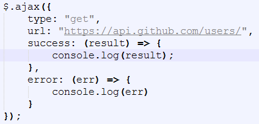

# ES6简介与发展历史

### 1、简介

ES6， 全称 ECMAScript 6.0 ，是 JavaScript 的下一个版本标准，2015.06 发版。

ES6 主要是为了解决 ES5 的先天不足，比如 JavaScript 里并没有类的概念，但是目前浏览器的 JavaScript 是 ES5 版本，大多数高版本的浏览器也支持 ES6，不过只实现了 ES6 的部分特性和功能。

目前各大浏览器基本上都支持 ES6 的新特性，其中 Chrome 和 Firefox 浏览器对 ES6 新特性最友好，IE7~11 基本不支持 ES6。

　　1、IE浏览器内核：Trident内核，也是俗称的IE内核； 
　　2、Chrome浏览器内核：统称为Chromium内核或Chrome内核，以前是Webkit内核，现在是Blink内核； 
　　3、Firefox浏览器内核：Gecko内核，俗称Firefox内核； 
　　4、Safari浏览器内核：Webkit内核； 
　　5、Opera浏览器内核：最初是自己的Presto内核，后来是Webkit，现在是Blink内核；

以下是各大浏览器支持情况及开始时间:


Node.js 是运行在服务端的 JavaScript，它对 ES6 的支持度更高。

在Node.js环境中运行ES6：

~~~shell
$ node
> let name="rose"
undefined
> console.log(name)
runoob
undefined
>
~~~


### 2、ECMAScript 背景

JavaScript 是大家所了解的语言名称，但是这个语言名称是商标（ Oracle 公司注册的商标）。因此，JavaScript 的正式名称是 ECMAScript 。1996年11月，JavaScript 的创造者网景公司将 JS 提交给国际化标准组织 ECMA（European computer manufactures association，欧洲计算机制造联合会），希望这种语言能够成为国际标准，随后 ECMA 发布了规定浏览器脚本语言的标准，即 ECMAScript。这也有利于这门语言的开放和中立。


### 3、ECMAScript 历史

ES6 是 ECMAScript 标准十余年来变动最大的一个版本，为其添加了许多新的语法特性。

- 1997 年 ECMAScript 1.0 诞生。
- 1998 年 6 月 ECMAScript 2.0 诞生，包含一些小的更改，用于同步独立的 ISO 国际标准。
- 1999 年 12 月 ECMAScript 3.0诞生，它是一个巨大的成功，在业界得到了广泛的支持，它奠定了 JS 的基本语法，被其后版本完全继承。直到今天，我们一开始学习 JS ，其实就是在学 3.0 版的语法。
- 2000 年的 ECMAScript 4.0 是当下 ES6 的前身，但由于这个版本太过激烈，对 ES 3 做了彻底升级，所以暂时被"和谐"了。
- 2009 年 12 月，ECMAScript 5.0 版正式发布。ECMA 专家组预计 ECMAScript 的第五个版本会在 2013 年中期到 2018 年作为主流的开发标准。2011年6月，ES 5.1 版发布，并且成为 ISO 国际标准。
- 2013 年，ES6 草案冻结，不再添加新的功能，新的功能将被放到 ES7 中；2015年6月， ES6 正式通过，成为国际标准。


# 声明与表达式

### 1、let与const

ES6新增加了两个重要的 JavaScript 关键字: **let** 和 **const**。

- **let** 声明的变量只在 let 命令所在的代码块内有效（块级作用域、局部作用），ES6 推荐在函数中使用 let 定义变量，而非 var。

- **const** 声明一个只读的常量，一旦声明，常量的值就不能改变。

##### （1）let命令

- **基本用法**：

~~~js
//{}括起来的代码块
{
  let a = 0;
  console.log(a);   // 0
}
console.log(a);   // 报错 ReferenceError: a is not defined
~~~


- **代码块内有效**：

~~~js
{
	let a = 0;
	var b = 1;
    
}
console.log(b); // 1
console.log(a); // ReferenceError: a is not defined
~~~


- **不能重复声明**

~~~js
var a = 1;
var a = 2;
console.log(a);  // 2

let b = 3;
let b = 4;
console.log(b);  // Identifier 'a' has already been declared
~~~

for循环计数器很适合用let

~~~js
for (var i = 0; i < 10; i++) {
  setTimeout(function(){
    console.log(i);
  })
}
// 输出十个 10

for (let j = 0; j < 10; j++) {
  setTimeout(function(){
    console.log(j);
  })
}
// 输出 0~9
~~~

变量 i 是用 var 声明的，在全局范围内有效，所以全局中只有一个变量 i, 每次循环时，setTimeout 定时器里面的 i 指的是全局变量 i ，而循环里的十个 setTimeout 是在循环结束后才执行，所以此时的 i 都是 10。

变量 j 是用 let 声明的，当前的 j 只在本轮循环中有效，每次循环的 j 其实都是一个新的变量，所以 setTimeout 定时器里面的 j 其实是不同的变量，即最后输出0~9。（若每次循环的变量 j 都是重新声明的，如何知道前一个循环的值？这是因为 JavaScript 引擎内部会记住前一个循环的值）。


- **不存在变量提升**

~~~js
console.log(a);  //undefined
var a = "banana";

console.log(b);  //ReferenceError: b is not defined
let b = "apple";
~~~

变量 a 用 var 声明存在变量提升，所以当脚本开始运行的时候，a 已经存在了，但是还没有赋值，所以会输出 undefined。

变量 b 用 let 声明不存在变量提升，在声明变量 b 之前，b 不存在，所以会报错。


##### （2）const命令

const 声明一个只读变量，声明之后不允许改变。意味着，一旦声明必须初始化，否则会报错。

- **基本用法**：

~~~js
const PI = "3.1415926";
console.log(PI);  // 3.1415926

const MY_AGE;  // SyntaxError: Missing initializer in const declaration    
~~~

- **暂时性死区**：

~~~js
var PI = "a";
if(true){
  console.log(PI);  // ReferenceError: PI is not defined
  const PI = "3.1415926";
}
~~~

ES6 明确规定，代码块内如果存在 let 或者 const，代码块会对这些命令声明的变量从块的开始就形成一个封闭作用域。代码块内，在声明变量 PI 之前使用它会报错。


##### （3）注意要点

- let 和const 关键词声明的变量不具备变量提升（hoisting）特性
- let 和 const 声明只在最靠近的一个块中（花括号内）有效
- 当使用常量 const 声明时，请使用大写变量，如：CAPITAL_CASING
- const 在声明时必须被赋值
- const 如何做到变量在声明初始化之后不允许改变的？其实 const 其实保证的不是变量的值不变，而是保证变量指向的内存地址所保存的数据不允许改动。此时，你可能已经想到，简单类型和复合类型保存值的方式是不同的。是的，对于简单类型（数值 number、字符串 string 、布尔值 boolean）,值就保存在变量指向的那个内存地址，因此 const 声明的简单类型变量等同于常量。而复杂类型（对象 object，数组 array，函数 function），变量指向的内存地址其实是保存了一个指向实际数据的指针，所以 const 只能保证指针是固定的，至于指针指向的数据结构变不变就无法控制了，所以使用 const 声明复杂类型对象时要慎重。

~~~js
{
  const ARR = [5,6];
  ARR.push(7);
  console.log(ARR); // [5,6,7]
  ARR = 10; // TypeError
}
~~~


### 2、解构赋值

##### （1）概述

- 解构赋值是对赋值运算符的扩展。

- 是一种针对**数组或者对象**进行模式匹配，然后对其中的变量进行赋值。

- 在代码书写上简洁且易读，语义更加清晰明了；也方便了复杂对象中数据字段获取。


##### （2）解构模型

在解构中，有下面两部分参与：

- **解构的源**，解构赋值表达式的**右边**部分。

- **解构的目标**，解构赋值表达式的**左边**部分。


##### （3）数组模型的结构（Array）

- 基本

~~~js
let [a, b, c] = [1, 2, 3];
console.log(a, b, c); //1 2 3
~~~

- 可嵌套

~~~js
let [a, [[b], c]] = [1, [[2], 3]];
console.log(a, b, c); //1 2 3
~~~

- 可忽略

~~~js
let [a, , b] = [1, 2, 3];
console.log(a, b); //1 3
~~~

- 不完全解构

~~~js
let [a = 1, b] = []; // a = 1, b = undefined
~~~

- 剩余运算符

~~~js
let [a, ...b] = [1, 2, 3];
console.log(a, b); //a = 1, b = [2,3]
~~~

- 字符串

在数组的解构中，解构的目标若为可遍历对象，皆可进行解构赋值。可遍历对象即实现 Iterator 接口的数据。

~~~js
let [a, b, c, d, e] = 'hello';
console.log(a, b, c, d, e); //h e l l o
~~~

- 解构默认值

~~~js
let [a = 2] = [undefined]; // a = 2
~~~

当解构模式有匹配结果，且匹配结果是 undefined 时，会触发默认值作为返回结果。

~~~js
let [a = 3, b = a] = [];     // a = 3, b = 3
let [a = 3, b = a] = [1];    // a = 1, b = 1
let [a = 3, b = a] = [1, 2]; // a = 1, b = 2
~~~

​	1. a 与 b 匹配结果为 undefined ，触发默认值：**a = 3; b = a =3**

​	2. a 正常解构赋值，匹配结果：a = 1，b 匹配结果 undefined ，触发默认值：**b = a =1**

​	3. a 与 b 正常解构赋值，匹配结果：**a = 1，b = 2**


##### （4）对象模型的结构（Object）

- 基本

~~~js
let { foo, bar } = { foo: 'aaa', bar: 'bbb' };
// foo = 'aaa'
// bar = 'bbb'
 
let { baz : foo } = { baz : 'ddd' };
// foo = 'ddd'
~~~

- 可嵌套可忽略

~~~js
let obj = {p: ['hello', {y: 'world'}] };
let {p: [x, { y }] } = obj;
// x = 'hello'
// y = 'world'
let obj = {p: ['hello', {y: 'world'}] };
let {p: [x, {  }] } = obj;
// x = 'hello'
~~~

- 不完全解构

~~~js
let obj = {p: [{y: 'world'}] };
let {p: [{ y }, x ] } = obj;
// x = undefined
// y = 'world'
~~~

- 剩余运算符

~~~js
let {a, b, ...rest} = {a: 10, b: 20, c: 30, d: 40};
// a = 10
// b = 20
// rest = {c: 30, d: 40}
~~~

- 解构默认值

~~~js
let {a = 10, b = 5} = {a: 3};
// a = 3; b = 5;
let {a: aa = 10, b: bb = 5} = {a: 3};
// aa = 3; bb = 5;
~~~


# 内置对象

### 1、Map与Set

##### （1）Map

Map 对象保存键值对。任何值(对象或者原始值) 都可以作为一个键或一个值。

- **Map和Object的区别**：

~~~
- 一个 Object 的键只能是字符串或者 Symbols，但一个 Map 的键可以是任意值。
- Map 中的键值是有序的（FIFO 原则），而添加到对象中的键则不是。
- Map 的键值对个数可以从 size 属性获取，而 Object 的键值对个数只能手动计算。
- Object 都有自己的原型，原型链上的键名有可能和你自己在对象上的设置的键名产生冲突。
~~~

- **Map中的key**

  - **key是字符串**

  ~~~js
  var myMap = new Map();
  var keyString = "a string"; 
   
  myMap.set(keyString, "和键'a string'关联的值");
   
  myMap.get(keyString);    // "和键'a string'关联的值"
  myMap.get("a string");   // "和键'a string'关联的值"
                           // 因为 keyString === 'a string'
  ~~~

  - **key是对象**

  ~~~js
  var myMap = new Map();
  var keyObj = {}, 
   
  myMap.set(keyObj, "和键 keyObj 关联的值");
  
  myMap.get(keyObj); // "和键 keyObj 关联的值"
  myMap.get({}); // undefined, 因为 keyObj !== {}
  ~~~

  - **key是函数**

  ~~~js
  var myMap = new Map();
  var keyFunc = function () {}, // 函数
   
  myMap.set(keyObj, "和键 keyObj 关联的值");
   
  myMap.get(keyFunc); // "和键 keyFunc 关联的值"
  myMap.get(function() {}) // undefined, 因为 keyFunc !== function () {}
  ~~~

  - **key是NaN**

  ~~~js
  var myMap = new Map();
  myMap.set(NaN, "not a number");
   
  myMap.get(NaN); // "not a number"
   
  var otherNaN = Number("foo");
  myMap.get(otherNaN); // "not a number"
  ~~~


Map特点：有序、键值对（键可以是任意类型）、键名不能重复（如果重复，那么覆盖）


- **Map的迭代**：对Map进行遍历

  - **for...of**

  ~~~js
  var myMap = new Map();
  myMap.set(0, "zero");
  myMap.set(1, "one");
   
  // 将会显示两个 log。 一个是 "0 = zero" 另一个是 "1 = one"
  //for...of遍历Map对象，取出每个键值对的键key和值value
  for (var [key, value] of myMap) {
    console.log(key + " = " + value);
  }
  
  /* 这个 entries 方法返回一个新的 Iterator 对象，它按插入顺序包含了 Map 对象中每个元素的 [key, value] 数组。 */
  for (var [key, value] of myMap.entries()) {
    console.log(key + " = " + value);
  }
   
  /* 这个 keys 方法返回一个新的 Iterator 对象， 它按插入顺序包含了 Map 对象中每个元素的键。 */
  for (var key of myMap.keys()) {
    console.log(key);
  }
  
  /* 这个 values 方法返回一个新的 Iterator 对象，它按插入顺序包含了 Map 对象中每个元素的值。 */
  for (var value of myMap.values()) {
    console.log(value);
  }
  ~~~

  - **forEach()**

  ~~~js
  var myMap = new Map();
  myMap.set(0, "zero");
  myMap.set(1, "one");
   
  // 将会显示两个 logs。 一个是 "0 = zero" 另一个是 "1 = one"
  myMap.forEach(function(value, key) {
    console.log(key + " = " + value);
  }, myMap)
  ~~~

- **Map对象的操作**

  - **Map 与 Array的转换**

  ~~~js
  var kvArray = [["key1", "value1"], ["key2", "value2"]]; //二维数组
   
  // Map 构造函数可以将一个 二维 键值对数组转换成一个 Map 对象
  var myMap = new Map(kvArray); 
  console.log(myMap); //Map(2) {"key1" => "value1", "key2" => "value2"}
   
  // 使用 Array.from 函数可以将一个 Map 对象转换成一个二维键值对数组
  var outArray = Array.from(myMap);
  console.log(outArray); //[["key1", "value1"], ["key2", "value2"]]
  ~~~

  - **Map的克隆**

  ~~~js
  var myMap1 = new Map([["key1", "value1"], ["key2", "value2"]]);
  var myMap2 = new Map(myMap1);
   
  console.log(myMap1 === myMap2); 
  // 打印 false。 Map 对象构造函数生成实例，迭代出新的对象。
  ~~~

  - **Map的合并**

  ~~~js
  var first = new Map([[1, 'one'], [2, 'two'], [3, 'three']]);
  var second = new Map([[1, 'uno'], [2, 'dos']]);
   
  // 合并两个 Map 对象时，如果有重复的键值，则后面的会覆盖前面的，对应值即 uno，dos， three
  var merged = new Map([...first, ...second]);
  ~~~


##### （2）Set

Set 对象允许你存储任何类型的唯一值，无论是原始值或者是对象引用。

- **Set中的特殊值**

  Set 对象存储的值总是唯一的，所以需要判断两个值是否恒等。有几个特殊值需要特殊对待：

  ~~~js
  +0 与 -0 在存储判断唯一性的时候是恒等的，所以不重复；
  undefined 与 undefined 是恒等的，所以不重复；
  NaN 与 NaN 是不恒等的，但是在 Set 中只能存一个，不重复。
  ~~~

  ~~~js
  let mySet = new Set();
   
  mySet.add(1); // Set(1) {1}
  mySet.add(5); // Set(2) {1, 5}
  mySet.add(5); // Set(2) {1, 5} 这里体现了值的唯一性
  mySet.add("some text"); 
  // Set(3) {1, 5, "some text"} 这里体现了类型的多样性
  var o = {a: 1, b: 2}; 
  mySet.add(o);
  mySet.add({a: 1, b: 2}); 
  // Set(5) {1, 5, "some text", {…}, {…}} 
  // 这里体现了对象之间引用不同不恒等，即使值相同，Set 也能存储
  ~~~


- **类型转换**

  - **Array**

  ~~~js
  // Array 转 Set
  var mySet = new Set(["value1", "value2", "value3"]);
  // 用...操作符，将 Set 转 Array
  var myArray = [...mySet];
  ~~~

  - **String**

  ~~~js
  // String 转 Set
  var mySet = new Set('hello');  
  console.log(mySet);// Set(4) {"h", "e", "l", "o"}
  // 注：Set 中 toString 方法是不能将 Set 转换成 String
  ~~~


- **Set对象作用**

  - **数组去重**

  ~~~js
  var mySet = new Set([1, 2, 3, 4, 4]);
  [...mySet]; // [1, 2, 3, 4]
  ~~~

  - **并集**

  ~~~js
  var a = new Set([1, 2, 3]);
  var b = new Set([4, 3, 2]);
  var union = new Set([...a, ...b]); // {1, 2, 3, 4}
  ~~~

  - **交集**

  ~~~js
  var a = new Set([1, 2, 3]);
  var b = new Set([4, 3, 2]);
  var intersect = new Set([...a].filter(x => b.has(x))); // {2, 3}
  ~~~

  - **差集**

  ~~~js
  var a = new Set([1, 2, 3]);
  var b = new Set([4, 3, 2]);
  var difference = new Set([...a].filter(x => !b.has(x))); // {1}
  ~~~


### 2、字符串

##### （1）子串的识别

ES6 之前判断字符串是否包含子串，用 indexOf 方法，ES6 新增了子串的识别方法

- **includes()**：返回布尔值，判断是否找到参数字符串。
- **startsWith()**：返回布尔值，判断参数字符串是否在原字符串的头部。
- **endsWith()**：返回布尔值，判断参数字符串是否在原字符串的尾部。

以上三个方法都可以接受两个参数，需要搜索的字符串，和可选的搜索起始位置索引

~~~js
let string = "apple,banana,orange";
string.includes("banana");     // true
string.startsWith("apple");    // true
string.endsWith("apple");      // false
string.startsWith("banana",6)  // true
~~~

注意：

- 这三个方法只返回布尔值，如果需要知道子串的位置，还是得用 indexOf 和 lastIndexOf 。
- 这三个方法如果传入了正则表达式而不是字符串，会抛出错误。而 indexOf 和 lastIndexOf 这两个方法，它们会将正则表达式转换为字符串并搜索它。


##### （2）字符串重复

**repeat()**：返回新的字符串，表示将字符串重复指定次数返回。

~~~js
console.log("Hello,".repeat(2));  // "Hello,Hello,"
~~~

如果参数是小数，向下取整

~~~js
console.log("Hello,".repeat(3.2));  // "Hello,Hello,Hello,"
~~~

如果参数是 0 至 -1 之间的小数，会进行取整运算，0 至 -1 之间的小数取整得到 -0 ，等同于 repeat 零次

~~~js
console.log("Hello,".repeat(-0.5));  // "" 
~~~

如果参数是 NaN，等同于 repeat 零次

~~~js
console.log("Hello,".repeat(NaN));  // "" 
~~~

如果参数是负数或者 Infinity ，会报错:

~~~js
console.log("Hello,".repeat(-1));  
// RangeError: Invalid count value

console.log("Hello,".repeat(Infinity));  
// RangeError: Invalid count value
~~~

如果传入的参数是字符串，则会先将字符串转化为数字

~~~js
console.log("Hello,".repeat("hh")); // ""
console.log("Hello,".repeat("2"));  // "Hello,Hello,"
~~~


##### （3）字符串补全

- **padStart**：返回新的字符串，表示用参数字符串从头部补全原字符串。
- **padEnd**：返回新的字符串，表示用参数字符串从尾部补全原字符串。

以上两个方法接受两个参数，第一个参数是指定生成的字符串的最小长度，第二个参数是用来补全的字符串。如果没有指定第二个参数，默认用空格填充。

~~~js
console.log("h".padStart(5,"o"));  // "ooooh"
console.log("h".padEnd(5,"o"));    // "hoooo"
console.log("h".padStart(5));      // "    h"
~~~

如果指定的长度小于或等于原字符串的长度，则返回原字符串:

~~~js
console.log("hello".padStart(5,"A"));  // "hello"
~~~

如果原字符串加上补全字符串长度大于指定长度，则截去超出位数的补全字符串:

~~~js
console.log("hello".padEnd(10,",world!"));  // "hello,worl"
~~~

常用于补全位数：

~~~js
console.log("123".padStart(10,"0"));  // "0000000123"
~~~


##### （4）模板字符串

模板字符串相当于加强版的字符串，用反引号 **`**,除了作为普通字符串，还可以用来定义多行字符串，还可以在字符串中加入变量和表达式。

~~~js
//普通字符串
let string = `Hello'\n'world`;
console.log(string); 

//多行字符串
let string1 =  `Hey,
can you stop angry now?`;
console.log(string1);

//变量名写在 ${} 中，${} 中可以放入 JavaScript 表达式。
let name = "Mike";
let age = 27;
let info = `My Name is ${name},I am ${age+1} years old next year.`
console.log(info);

//字符串中调用函数
function f(){
  return "have fun!";
}
let string2= `Game start,${f()}`;
console.log(string2);  // Game start,have fun!
~~~

注意：模板字符串中的换行和空格都是会被保留的。


##### （5）标签模板

标签模板，是一个函数的调用，其中调用的参数是模板字符串。

~~~js
alert`Hello world!`;
// 等价于
alert('Hello world!');
~~~

应用：过滤 HTML 字符串，防止用户输入恶意内容。

~~~js
function f(stringArr,...values){
 	let result = "";
    for (let i = 0; i < stringArr.length; i++) {
        values[i] = stringArr[i];
        if (values[i]) {
        result += String(values[i]).replace(/&/g, "&amp;")
                        .replace(/</g, "&lt;")
                        .replace(/>/g, "&gt;");
        }
     }
     return result;
}
var name = f('<Amy&MIke>');
element.innerHTML = `<p>Hi, ${name}.I would like send you some message.</p>`;
~~~


### 3、数值

##### （1）数值的表示

- 二进制表示法新写法: 前缀 0b 或 0B 。

~~~js
console.log(0b11 === 3); // true
console.log(0B11 === 3); // true
~~~

- 八进制表示法新写法: 前缀 0o 或 0O 。

~~~js
console.log(0o11 === 9); // true
console.log(0O11 === 9); // true
~~~


##### （2）方法

- **Number.isFinite()**：用于检查一个数值是否为有限的（ finite ），即不是 Infinity

```js
console.log( Number.isFinite(1));   // true
console.log( Number.isFinite(0.1)); // true
 
// NaN 不是有限的
console.log( Number.isFinite(NaN)); // false
 
console.log( Number.isFinite(Infinity));  // false
console.log( Number.isFinite(-Infinity)); // false
 
// Number.isFinate 没有隐式的 Number() 类型转换，所有非数值都返回 false
console.log( Number.isFinite('foo')); // false
console.log( Number.isFinite('15'));  // false
console.log( Number.isFinite(true));  // false
Number.isNaN()
用于检查一个值是否为 NaN 。
console.log(Number.isNaN(NaN));      // true
console.log(Number.isNaN('true'/0)); // true
 
// 在全局的 isNaN() 中，以下皆返回 true，因为在判断前会将非数值向数值转换
// 而 Number.isNaN() 不存在隐式的 Number() 类型转换，非 NaN 全部返回 false
Number.isNaN("NaN");      // false
Number.isNaN(undefined);  // false
Number.isNaN({});         // false
Number.isNaN("true");     // false
```


- **Number.parseInt()**：**从全局移植到 Number 对象的方法**，逐步减少全局方法，用于全局变量的模块化。方法的行为没有发生改变。

~~~js
// 不指定进制时默认为 10 进制
Number.parseInt('12.34'); // 12
Number.parseInt(12.34);   // 12
 
// 指定进制
Number.parseInt('0011',2); // 3
 
// 与全局的 parseInt() 函数是同一个函数
Number.parseInt === parseInt; // true
Number.parseFloat()
用于把一个字符串解析成浮点数。
Number.parseFloat('123.45')    // 123.45
Number.parseFloat('123.45abc') // 123.45
 
// 无法被解析成浮点数，则返回 NaN
Number.parseFloat('abc') // NaN
 
// 与全局的 parseFloat() 方法是同一个方法
Number.parseFloat === parseFloat // true
Number.isInteger()
用于判断给定的参数是否为整数。
Number.isInteger(value)
Number.isInteger(0); // true
// JavaScript 内部，整数和浮点数采用的是同样的储存方法,因此 1 与 1.0 被视为相同的值
Number.isInteger(1);   // true
Number.isInteger(1.0); // true
 
Number.isInteger(1.1);     // false
Number.isInteger(Math.PI); // false
 
// NaN 和正负 Infinity 不是整数
Number.isInteger(NaN);       // false
Number.isInteger(Infinity);  // false
Number.isInteger(-Infinity); // false
 
Number.isInteger("10");  // false
Number.isInteger(true);  // false
Number.isInteger(false); // false
Number.isInteger([1]);   // false
 
// 数值的精度超过 53 个二进制位时，由于第 54 位及后面的位被丢弃，会产生误判
Number.isInteger(1.0000000000000001) // true
 
// 一个数值的绝对值小于 Number.MIN_VALUE（5E-324），即小于 JavaScript 能够分辨
// 的最小值，会被自动转为 0，也会产生误判
Number.isInteger(5E-324); // false
Number.isInteger(5E-325); // true
Number.isSafeInteger()
用于判断数值是否在安全范围内。
Number.isSafeInteger(Number.MIN_SAFE_INTEGER - 1); // false
Number.isSafeInteger(Number.MAX_SAFE_INTEGER + 1); // false
~~~


##### （3）Math对象的扩展

ES6 在 Math 对象上新增了 17 个数学相关的静态方法，这些方法只能在 Math 中调用。

- **Math.cbrt()**：用于计算一个数的立方根。

~~~js
Math.cbrt(1);  // 1
Math.cbrt(0);  // 0
Math.cbrt(-1); // -1
// 会对非数值进行转换
Math.cbrt('1'); // 1
 
// 非数值且无法转换为数值时返回 NaN
Math.cbrt('hhh'); // NaN
~~~

- **Math.imul()**：两个数以 32 位带符号整数形式相乘的结果，返回的也是一个 32 位的带符号整数。

~~~js
// 大多数情况下，结果与 a * b 相同 
Math.imul(1, 2);   // 2
~~~

- **Math.hypot()**：用于计算所有参数的平方和的平方根。勾股定理

~~~js
Math.hypot(3, 4); // 5
~~~


### 4、对象

##### （1）对象字面量

- 属性的简洁表示法：ES6允许对象的属性直接写变量，这时候属性名是变量名，属性值是变量值。

~~~js
const age = 12;
const name = "Amy";
const person = {age, name};
console.log(person); //{age: 12, name: "Amy"}
~~~

- 方法也可以简写：

~~~js
const person = {
  sayHi(){
    console.log("Hi");
  }
}
person.sayHi();  //"Hi"
~~~

- 属性名表达式：ES6允许用表达式作为属性名，但是一定要将表达式放在方括号内。

~~~js
const obj = {
 ["he"+"llo"](){
   return "Hi";
  }
}
obj.hello();  //"Hi"
~~~

注意点：属性的简洁表示法和属性名表达式不能同时使用，否则会报错。

~~~js
const hello = "Hello";
const obj = {
 [hello]
};
console.log(obj);  //SyntaxError: Unexpected token }
 
const hello = "Hello";
const obj = {
 [hello+"2"]:"world"
};
console.log(obj); //{Hello2: "world"}
~~~


##### （2）对象的扩展运算符

拓展运算符（...）用于取出参数对象所有可遍历属性然后拷贝到当前对象。

- 基本用法

~~~js
let person = {name: "Amy", age: 15};
let someone = { ...person };
console.log(someone);  //{name: "Amy", age: 15}
~~~

- 可用于合并两个对象

~~~js
let age = {age: 15};
let name = {name: "Amy"};
let person = {...age, ...name};
console.log(person);  //{age: 15, name: "Amy"}
~~~

注意：自定义的属性和拓展运算符对象里面属性的相同的时候

1. **自定义的属性在拓展运算符后面，则拓展运算符对象内部同名的属性将被覆盖掉。**

~~~js
let person = {name: "Amy", age: 15};
let someone = { ...person, name: "Mike", age: 17};
console.log(someone);  //{name: "Mike", age: 17}
~~~

2. 自定义的属性在拓展运算度前面，则变成设置新对象默认属性值。

~~~js
let person = {name: "Amy", age: 15};
let someone = {name: "Mike", age: 17, ...person};
console.log(someone);  //{name: "Amy", age: 15}
~~~

3. 拓展运算符后面是空对象，没有任何效果也不会报错。

~~~js
let a = {...{}, a: 1, b: 2};
console.log(a);  //{a: 1, b: 2}
~~~

4. 拓展运算符后面是null或者undefined，没有效果也不会报错。

~~~js
let b = {...null, ...undefined, a: 1, b: 2};
console.log(b);  //{a: 1, b: 2}
~~~


##### （3）对象的新方法

**Object.is(value1, value2)**：用来比较两个值是否严格相等，与（===）基本类似。

~~~js
Object.is("q","q");      // true
Object.is(1,1);          // true
Object.is([1],[1]);      // false
Object.is({q:1},{q:1});  // false
~~~

与===的区别

~~~js
//一是+0不等于-0
Object.is(+0,-0);  //false
+0 === -0  //true

//二是NaN等于本身
Object.is(NaN,NaN); //true
NaN === NaN  //false
~~~


### 5、数组

##### （1）数组创建

- **Array.of()**：将参数中所有值作为元素形成数组。

~~~js
console.log(Array.of(1, 2, 3, 4)); // [1, 2, 3, 4]
 
// 参数值可为不同类型
console.log(Array.of(1, '2', true)); // [1, '2', true]
 
// 参数为空时返回空数组
console.log(Array.of()); // []
~~~


- **Array.from()**：将类数组对象或可迭代对象转化为数组。

  ~~~js
  // 参数为数组,返回与原数组一样的数组
  console.log(Array.from([1, 2])); // [1, 2]
   
  // 参数含空位
  console.log(Array.from([1, , 3])); // [1, undefined, 3]
  ~~~

  参数说明：**Array.from(arrayLike[, mapFn[, thisArg]])**

  - **arrayLike**：想要转换的类数组对象或可迭代对象。

  ~~~js
  console.log(Array.from([1, 2, 3])); // [1, 2, 3]
  ~~~

  - **mapFn**：可选，map 函数，用于对每个元素进行处理，放入数组的是处理后的元素。

  ~~~js
  console.log(Array.from([1, 2, 3], (n) => n * 2)); // [2, 4, 6]
  ~~~

  - **thisArg**：可选，用于指定 map 函数执行时的 this 对象。

  ~~~js
  let map = {
      do: function(n) {
          return n * 2;
      }
  }
  let arrayLike = [1, 2, 3];
  console.log(Array.from(arrayLike, function (n){
      return this.do(n);
  }, map)); // [2, 4, 6]
  ~~~

- **类数组对象**：一个类数组对象必须含有 length 属性，且元素属性名必须是数值或者可转换为数值的字符。

~~~js
let arr = Array.from({
  0: '1',
  1: '2',
  2: 3,
  length: 3
});
console.log(); // ['1', '2', 3]
 
// 没有 length 属性,则返回空数组
let array = Array.from({
  0: '1',
  1: '2',
  2: 3,
});
console.log(array); // []
 
// 元素属性名不为数值且无法转换为数值，返回长度为 length 元素值为 undefined 的数组  
let array1 = Array.from({
  a: 1,
  b: 2,
  length: 2
});
console.log(array1); // [undefined, undefined]
~~~


- **转换可迭代对象**：

  - **转换map**

  ~~~js
  let map = new Map();
  map.set('key0', 'value0');
  map.set('key1', 'value1');
  console.log(Array.from(map)); // [['key0', 'value0'],['key1','value1']]
  ~~~

  - **转换set**

  ~~~js
  let arr = [1, 2, 3];
  let set = new Set(arr);
  console.log(Array.from(set)); // [1, 2, 3]
  ~~~

  - **转换字符串**

  ~~~js
  let str = 'abc';
  console.log(Array.from(str)); // ["a", "b", "c"]
  ~~~


##### （2）扩展的方法

- 查找：
  - **find()**：查找数组中符合条件的元素,若有多个符合条件的元素，则返回第一个元素。

  ~~~js
  let arr = Array.of(1, 2, 3, 4);
  console.log(arr.find(item => item > 2)); // 3
   
  // 数组空位处理为 undefined
  console.log([, 1].find(n => true)); // undefined
  ~~~

  - **findIndex()**：查找数组中符合条件的元素索引，若有多个符合条件的元素，则返回第一个元素索引。

  ~~~js
  let arr = Array.of(1, 2, 1, 3);
  // 参数1：回调函数
  // 参数2(可选)：指定回调函数中的 this 值
  console.log(arr.findIndex(item => item = 1)); // 0
   
  // 数组空位处理为 undefined
  console.log([, 1].findIndex(n => true)); //0
  ~~~

- 填充：

  - **fill()**：将一定范围索引的数组元素内容填充为单个指定的值。

  ~~~js
  let arr = Array.of(1, 2, 3, 4);
  // 参数1：用来填充的值
  // 参数2：被填充的起始索引
  // 参数3(可选)：被填充的结束索引，默认为数组末尾
  console.log(arr.fill(0,1,2)); // [1, 0, 3, 4]
  ~~~

- 遍历：

  - **entrys()**：遍历键值对。

  ~~~js
  for(let [key, value] of ['a', 'b'].entries()){
      console.log(key, value);
  }
  // 0 "a"
  // 1 "b"
   
  // 不使用 for... of 循环
  let entries = ['a', 'b'].entries();
  console.log(entries.next().value); // [0, "a"]
  console.log(entries.next().value); // [1, "b"]
   
  // 数组含空位
  console.log([...[,'a'].entries()]); // [[0, undefined], [1, "a"]]
  ~~~

  - **keys()**：遍历键名。

  ~~~js
  for(let key of ['a', 'b'].keys()){
      console.log(key);
  }
  // 0
  // 1
   
  // 数组含空位
  console.log([...[,'a'].keys()]); // [0, 1]
  ~~~

  - **values()**：遍历键值

  ~~~js
  for(let value of ['a', 'b'].values()){
      console.log(value);
  }
  // "a"
  // "b"
   
  // 数组含空位
  console.log([...[,'a'].values()]); // [undefined, "a"]
  ~~~

- 包含：

  - **includes()**：数组是否包含指定值。注意：与 Set 和 Map 的 has 方法区分；Set 的 has 方法用于查找值；Map 的 has 方法用于查找键名。

  ~~~js
  // 参数1：包含的指定值
  [1, 2, 3].includes(1);    // true
   
  // 参数2：可选，搜索的起始索引，默认为0
  [1, 2, 3].includes(1, 2); // false
   
  // NaN 的包含判断
  [1, NaN, 3].includes(NaN); // true
  ~~~

- 嵌套数组转一维数组：

  - **flat()**

  ~~~js
  console.log([1 ,[2, 3]].flat()); // [1, 2, 3]
   
  // 指定转换的嵌套层数
  console.log([1, [2, [3, [4, 5]]]].flat(2)); // [1, 2, 3, [4, 5]]
   
  // 不管潜逃多少层
  console.log([1, [2, [3, [4, 5]]]].flat(Infinity)); // [1, 2, 3, 4, 5]
   
  // 自动跳过空位
  console.log([1, [2, , 3]].flat());<p> // [1, 2, 3]
  ~~~


##### （3）扩展运算符（...）

- 复制数组：

~~~js
let arr = [1, 2],
    arr1 = [...arr];
console.log(arr1); // [1, 2]
 
// 数组含空位
let arr2 = [1, , 3],
    arr3 = [...arr2];
console.log(arr3); [1, undefined, 3]
~~~

- 合并数组：

~~~js
console.log([...[1, 2],...[3, 4]]); // [1, 2, 3, 4]
~~~


# 运算符与语句

### 1、箭头函数

##### （1）箭头函数定义

箭头函数提供了一种更加简洁的函数书写方式。基本语法是：

~~~js
参数 => 函数体
(参数) => {函数体}
~~~

基本语法：

~~~js
//普通函数
var f = function(a){
 return a;
}
f(1);  //1

//箭头函数
var f = a => a
f(10); //10
~~~

当箭头函数没有参数或者有多个参数，要用 **()** 括起来。

~~~js
var f = (a,b) => a+b;
f(6,2);  //8
~~~

当箭头函数函数体有多行语句，用 **{}** 包裹起来，表示代码块，当只有一行语句，并且需要返回结果时，可以省略 **{}** , 结果会自动返回。

~~~js
var f = (a,b) => {
 let result = a+b;
 return result;
}
f(6,2);  // 8
~~~

当箭头函数要返回对象的时候，为了区分于代码块，要用 **()** 将对象包裹起来

~~~js
var f = (id,name) => ({id: id, name: name});
f(6,2);  // {id: 6, name: 2}
~~~

注意点：没有 this、super、arguments 和 new.target 绑定。

~~~js
var a = () => {
    // 箭头函数里面没有 this 对象，
  	// 此时的 this 是外层的 this 对象，即 Window 
	console.log(this);
}
a(11);

var b = () => {
	console.log(arguments);
}
b(111);	// ReferenceError: arguments is not defined
~~~

对象中使用箭头函数，this表示全局Window对象

~~~js
var obj = {
	name: "xx",
	show: function() {
		console.log(this); //this表示当前对象
	},
	say: () => {
		console.log(this); //this表示全局window对象
	}
}
~~~

箭头函数体中的 this 对象，是定义函数时的对象，而不是使用函数时的对象。

~~~js
function a() {
	setTimeout(function() {
		console.log(this); //this始终指向全局Window对象
	}, 100)
}
a.call({num: 200});
					
function b() {
	setTimeout(() => {
		console.log(this); //this绑定的是b函数中的this对象
	}, 100);
}
b.call({num: 300});
~~~

注意：箭头函数不可以作为构造函数，也就是不能使用 new 命令，否则会报错

~~~js
function Person() {
	console.log(this);
}
new Person(); //Person {}
			
var People = ()=>{
	console.log(this);
}
new People(); //TypeError: People is not a constructor
~~~

箭头函数在参数中使用

~~~js
var arr= [1,2,3];
arr = arr.map((a)=>a*a);
console.log(arr);
~~~

箭头函数可以与解构一起使用

~~~js
//变量为目标，返回值为源
let cal = (a, b) => {
    return {
        add: a+b,
        sub: a-b,
        mul: a*b,
        div: a/b
    };
}
let {add, sub, mul, div} = cal(10, 5);

//形参为目标，实参为源
var show = ({one, two}) => {
	console.log(one + "---" + two);
}
show({one: "hello", two: "你好"});
~~~

解决箭头函数中没有arguments 绑定的问题？


##### （2）适合使用的场景

ES6 之前，JavaScript 的 this 对象一直很令人头大，回调函数，经常看到 var self = this 这样的代码，为了将外部 this 传递到回调函数中，那么有了箭头函数，就不需要这样做了，直接使用 this 就行。

所以，当我们需要维护一个 this 上下文的时候，就可以使用箭头函数。


##### （3）总结

- 要有个箭头
- 箭头的前面是小括号，放形参，只有一个形参的时候可以省略小括号；
- 箭头的后面是函数体；
- 如果函数体只有一个语句，没有{}，此时的返回值不需要return；
- 箭头函数里面的this总是指向window；
- 对象里面的方法，尽可能不要使用箭头函数；
- 箭头函数里面没有arguments，可以使用…reset，接收过来就是数组类型，接收的是形参之外的所有的实参；

~~~js
var show = (a, b, ...reset) => {
	console.log(a + b);
	console.log(reset);
}
show(1, 2, 3, 4, 5);
~~~


### 2、class类

##### （1）概述

- 在ES6中，class (类)作为对象的模板被引入，可以**通过 *class* 关键字定义类**。

- class 的本质是 function。

- 它可以看作一个语法糖，让对象原型的写法更加清晰、更像面向对象编程的语法。
- 类不可重复声明
- 类定义不会被提升，这意味着必须在访问前对类进行定义，否则就会报错


##### （2）类定义

~~~js
// 命名类
class Example {
    constructor(a) {
        this.a = a;
    }
}

// 匿名类
let Example = class {
    constructor(a) {
        this.a = a;
    }
}

~~~


##### （3）类的主体

- **属性**：ES6的类中不能直接定义变量，变量被定义在constructor中。

~~~js
class People {		
	//a = 10; //SyntaxError: Unexpected token =
	constructor() {
		this.a = 100; //定义变量
	}
} 
let p = new People();
console.log(p.a);
~~~

- **方法**

  - **constructor** 方法是类的默认方法，创建类的对象时被调用。也被称为类的构造方法（构造函数、构造器）。一个类中**有且仅有一个**构造方法。

  ~~~js
  class People {
  	constructor() {
  		console.log("我是构造方法，使用new创建对象时调用");
  	}
  } 
  new People(); //将执行constructor方法
  ~~~

  - **原型方法**：不需要使用function关键字，通过“**对象.原型方法**”调用。

  ~~~js
  class People {
  	say(world) {
  		console.log(`say ${world}`);
  	}
      add(a, b) {
          console.log(a + b);
      }
  }
  let p = new People();
  p.say("hello"); //say hello
  p.add(1, 2); //3
  ~~~

  - **静态方法**：使用**static**修饰，调用时不需要创建对象，直接通过“**类名.静态方法**”调用

  ~~~js
  class People {
  	static sum(a, b) {
  		console.log(a + b);
  	}
  }
  People.sum(1, 2);
  ~~~


##### （4）类的继承

- 解决代码的复用
- 使用**extends**关键字实现继承
- 子类可以继承父类中所有的方法和属性
- 子类只能继承一个父类（**单继承**），一个父类可以有多个子类
- 子类的构造方法中必须有**super()**来指定调用父类的构造方法，并且位于子类构造方法中的**第一行**
- 子类中如果有与父类相同的方法和属性，将会优先使用子类的（覆盖）

~~~js
class People {
    //父类构造方法
	constructor() {
        this.a = 100; //父类中定义的变量
		console.log("People constructor");
	}
    //原型方法
	eat() {
		console.log("eat...")
	}
    //静态方法
    static play() {
		console.log("play...")
	}
}
			
class Student extends People {
    //子类构造方法
	constructor() {
		super(); //调用父类构造器，必须存在，且位于子类构造器第一行的位置
        this.b = 200; //子类定义的变量
		console.log("Student constructor");
	}
	study() {
		console.log("study...");
	}
}
			
let stu = new Student();
console.log(stu.a， stu.b);
stu.eat();
stu.study();
Student.play();
~~~

**内部类**：属于外部类的成员，必须通过“**外部类.内部类**”访问

~~~js
// 外部类
class Outer {
	constructor() {
         console.log("outer");
    }
}
// 内部类
Outer.Inner = class {
    constructor() {
         console.log("Inner");
    }
}     
new Outer.Inner();
~~~


### 3、模块

##### （1）概述

- ES6 引入了模块化，其设计思想是在编译时就能确定模块的依赖关系，以及输入和输出的变量。

- ES6 的模块化分为**导出（export）** 与**导入（import）**两个模块。


##### （2）特点

- ES6 的模块自动开启严格模式，不管你有没有在模块头部加上 **use strict;**。

- 模块中可以导入和导出各种类型的变量，如函数，对象，字符串，数字，布尔值，类等。

- 每个模块都有自己的上下文，每一个模块内声明的变量都是局部变量，不会污染全局作用域。

- 每一个模块只加载一次（是单例的）， 若再去加载同目录下同文件，直接从内存中读取。


##### （3）export导出

- 与**default**关联使用，并且一个js模块中**只能有一个export default**语句

~~~js
//导出字符串
export default "abc";

//导出数字
export default 123;

//导出布尔值
export default true;

//导出数组
export default [1,2,3];

//导出对象
var obj = {
	name: '张三',
	age: 20
}
export default obj;

//导出函数
var func = function() {
	console.log("func函数");
	return 100;
}
export default func;


//导出类
class People {
	constructor() {
		this.a = 100;
	}
	say() {
		console.log("say...");
	}
}
export default People;
~~~


##### （4）import导入

- 与**from**关联使用，此时script标签的**type必须设置为module**

- **单例模式**：多次重复执行同一句 import 语句，那么**只会执行一次**，而不会执行多次。import 同一模块，声明不同接口引用，会声明对应变量，但只执行一次 import 

~~~js
<script type="module">
	import People from './js/myModule.js';
	let p = new People();
	p.say();
</script>
~~~


# 异步编程

### 1、promise对象

##### （1）概述

- promise是异步编程的一种解决方案。从语法上说，Promise 是一个对象，从它可以获取异步操作的消息。

- Promise 异步操作有三种状态：pending（进行中）、fulfilled（已成功）和 rejected（已失败）。除了异步操作的结果，任何其他操作都无法改变这个状态。

- Promise 对象只有：从 pending 变为 fulfilled 和从 pending 变为 rejected 的状态改变。只要处于 fulfilled 和 rejected ，状态就不会再变了即 resolved（已定型）。
- Promise是一个构造函数，其原型上有then、catch方法，对象上有reject、resolve方法。


##### （2）promise使用

通过**new**关键字创建Promise对象

~~~js
var p = new Promise(function(resolve, reject){
    //做一些异步操作
    setTimeout(function(){
        console.log('执行完成');
        resolve('随便什么数据');
    }, 2000);
});
~~~

参数说明：

- **resolve**：异步操作执行成功后的回调函数

- **reject**：异步操作执行失败后的回调函数

resolve是将Promise的状态置为fullfiled，reject是将Promise的状态置为rejected。

上面的代码中，直接通过new创建了Promise对象，并没有调用它，但是传进去的函数已经执行了。因此我们用Promise的时候一般是**包含在一个函数中**，在需要的时候去运行这个函数。

~~~js
function runAsync(){
    var p = new Promise(function(resolve, reject){
        //做一些异步操作
        setTimeout(function(){
            console.log('执行完成');
            resolve('随便什么数据');
        }, 2000);
    });
    return p;            
}
runAsync()
~~~


这时，你可能会有两个疑问：

1. 包装一个函数有什么用？
2. resolve('随便什么数据');这是做什么用的？


在我们包装好的函数最后，通过return返回了一个Promise对象。也就是说调用这个包装函数可以得到Promise的对象，接下来就可以使用Promise对象上的**then**与**catch**方法了。

~~~js
runAsync().then(function(data){
    console.log(data);
    //后面可以用传过来的数据做些其他操作
    //......
});
~~~

在runAsync()的返回上直接调用**then**方法，then接收一个参数，是函数，函数的参数data将会拿到我们在runAsync中调用resolve时传的的参数。

此时then里面的函数就是**回调函数**，能够在runAsync这个异步任务执行完成之后被执行。这就是Promise的作用了，简单来讲，就是能把原来的回调写法分离出来，在异步操作执行完后，用链式调用的方式执行回调函数。


自己封装回调函数

~~~js
function runAsync(callback){
    setTimeout(function(){
        console.log('执行完成');
        callback('随便什么数据');
    }, 2000);
}

runAsync(function(data){
    console.log(data);
});
~~~

效果与之前的是一样的。但如果有多层回调怎么办？如果callback也是一个异步操作，而且执行完后也需要有相应的回调函数，该怎么办呢？总不能再定义一个callback2，然后给callback传进去吧。而Promise的优势在于，可以在then方法中继续写Promise对象并返回，然后继续调用then来进行回调操作。


##### （3）链式操作用法

从表面上看，Promise只是能够简化层层回调的写法，而实质上，Promise的精髓是“状态”，用维护状态、传递状态的方式来使得回调函数能够及时调用，它比传递callback函数要简单、灵活的多。所以使用Promise的正确场景是这样的：

~~~js
runAsync1()
.then(function(data){
    console.log(data);
    return runAsync2();
})
.then(function(data){
    console.log(data);
    return runAsync3();
})
.then(function(data){
    console.log(data);
});
~~~

这样能够按顺序，每隔两秒输出每个异步回调中的内容，在runAsync2中传给resolve的数据，能在接下来的then方法中拿到。运行结果如下：


runAsync1、runAsync2、runAsync3三个函数定义：

~~~js
function runAsync1(){
    var p = new Promise(function(resolve, reject){
        //做一些异步操作
        setTimeout(function(){
            console.log('异步任务1执行完成');
            resolve('随便什么数据1');
        }, 1000);
    });
    return p;            
}
function runAsync2(){
    var p = new Promise(function(resolve, reject){
        //做一些异步操作
        setTimeout(function(){
            console.log('异步任务2执行完成');
            resolve('随便什么数据2');
        }, 2000);
    });
    return p;            
}
function runAsync3(){
    var p = new Promise(function(resolve, reject){
        //做一些异步操作
        setTimeout(function(){
            console.log('异步任务3执行完成');
            resolve('随便什么数据3');
        }, 2000);
    });
    return p;            
}
~~~

在then方法中，你也可以直接return数据而不是Promise对象，在后面的then中就可以接收到数据了。

~~~js
runAsync1()
.then(function(data){
    console.log(data);
    return runAsync2();
})
.then(function(data){
    console.log(data);
    return '直接返回数据';  //这里直接返回数据
})
.then(function(data){
    console.log(data);
});
~~~

执行结果如下：


##### （4）reject的用法

事实上，我们前面的例子都是只有“执行成功”的回调，还没有“失败”的情况，reject的作用就是把Promise的状态置为rejected，这样我们在then中就能捕捉到，然后执行“失败”情况的回调。

~~~js
function getNumber(){
    var p = new Promise(function(resolve, reject){
        //做一些异步操作
        setTimeout(function(){
            var num = Math.ceil(Math.random()*10); //生成1-10的随机数
            if(num<=5){
                resolve(num); //执行成功
            }
            else{
                reject('数字太大了'); //执行失败
            }
        }, 2000);
    });
    return p;            
}

getNumber()
.then(
    function(data){
        console.log('resolved');
        console.log(data);
    }, 
    function(error, data){
        console.log('rejected');
        console.log(error);
    }
);
~~~

getNumber函数用来异步获取一个数字，2秒后执行完成，如果数字小于等于5，我们认为是“成功”了，调用resolve修改Promise的状态。否则我们认为是“失败”了，调用reject并传递一个参数，作为失败的原因。

运行getNumber并且在then中传了两个参数，**then方法可以接受两个参数，第一个对应resolve的回调，第二个对应reject的回调**。所以我们能够分别拿到他们传过来的数据。多次运行这段代码，你会随机得到下面两种结果：

 


##### （5）catch的用法

我们知道Promise对象除了then方法，还有一个catch方法，它是做什么用的呢？其实它和then的第二个参数一样，用来指定reject的回调，用法是这样：

~~~js
getNumber()
.then(function(data){
    console.log('resolved');
    console.log(data);
})
.catch(function(reason){
    console.log('rejected');
    console.log(reason);
});
~~~

效果和写在then的第二个参数里面一样。不过它还有另外一个作用：在执行resolve的回调（也就是上面then中的第一个参数）时，如果抛出异常了（代码出错了），那么并不会报错卡死js，而是会进到这个catch方法中。

~~~js
getNumber()
.then(function(data){
    console.log('resolved');
    console.log(data);
    console.log(somedata); //此处的somedata未定义
})
.catch(function(reason){
    console.log('rejected');
    console.log(reason);
});
~~~

在resolve的回调中，我们使用了console.log(somedata);而somedata这个变量是没有被定义的。如果我们不用Promise，代码运行到这里就直接在控制台报错了，不往下运行了。但是在这里，会得到这样的结果：


也就是说进到catch方法里面去了，而且把错误原因传到了reason参数中。即便是有错误的代码也不会报错了，这与我们的try/catch语句有相同的功能。


执行ajax请求的结构代码：




 


### 2、async函数

##### （1）async

async 是 ES7 才有的与异步操作有关的关键字，和Promise有很大的关联。

- **语法**：

  ~~~js
  async function name(param) { statements }
  ~~~

  参数说明：

  - **name**: 函数名称。
  - **param**: 要传递给函数的参数的名称。
  - **statements**: 函数体语句。

- **返回值**

  async 函数返回一个 Promise 对象，可以使用 then 方法添加回调函数。

  ~~~js
  async function helloAsync(){
      return "helloAsync";
    }
    
  console.log(helloAsync())  // Promise {<resolved>: "helloAsync"}
   
  helloAsync().then(data => {
     console.log(data);         // helloAsync
  })
  ~~~


##### （2）await

async 函数中可能会有 await 表达式，async 函数执行时，如果遇到 await 就会先暂停执行 ，等到触发的异步操作完成后，恢复 async 函数的执行并返回解析值。

await 操作符用于**等待一个 Promise 对象**, 它只能在异步函数 async function 内部使用。如果在 async function 函数体外使用 await ，你只会得到一个语法错误。

- **语法**：

  ~~~js
  [return_value] = await expression;
  ~~~

  参数说明：

  - **expression**: 一个 Promise 对象或者任何要等待的值。

- **返回值**

返回 Promise 对象的处理结果。如果等待的不是 Promise 对象，则返回该值本身。

如果一个 Promise 被传递给一个 await 操作符，await 将等待 Promise 正常处理完成并返回其处理结果。

正常情况下，await 命令后面是一个 Promise 对象，它也可以跟其他值，如字符串，布尔值，数值以及普通函数。

await针对所跟不同表达式的处理方式：

- Promise 对象：await 会暂停执行，等待 Promise 对象 resolve，然后恢复 async 函数的执行并返回解析值。
- 非 Promise 对象：直接返回对应的值。

**示例1**： await后面是一个Promise对象：

~~~js
function testAwait() {
    return new Promise((resolve, reject)=>{
    	setTimeout(()=>{
        	console.log("返回一个promise对象");
            resolve("返回数据")
        }, 2000)
    });
}
async function helloAsync() {
	var a = await testAwait();
    console.log(a);
    console.log("helloAsync");
}

helloAsync();
//执行结果：
//返回一个promise对象
//demo.html:25 返回数据
//demo.html:26 helloAsync
~~~

**示例2**：await后面是一个普通函数：

~~~js
function testAwait() {
	console.log("testAwait");
}
async function helloAsync() {
	await testAwait();
    console.log("helloAsync");
}
helloAsync();

//执行结果：
//testAwait
//demo.html:25 helloAsync
~~~

